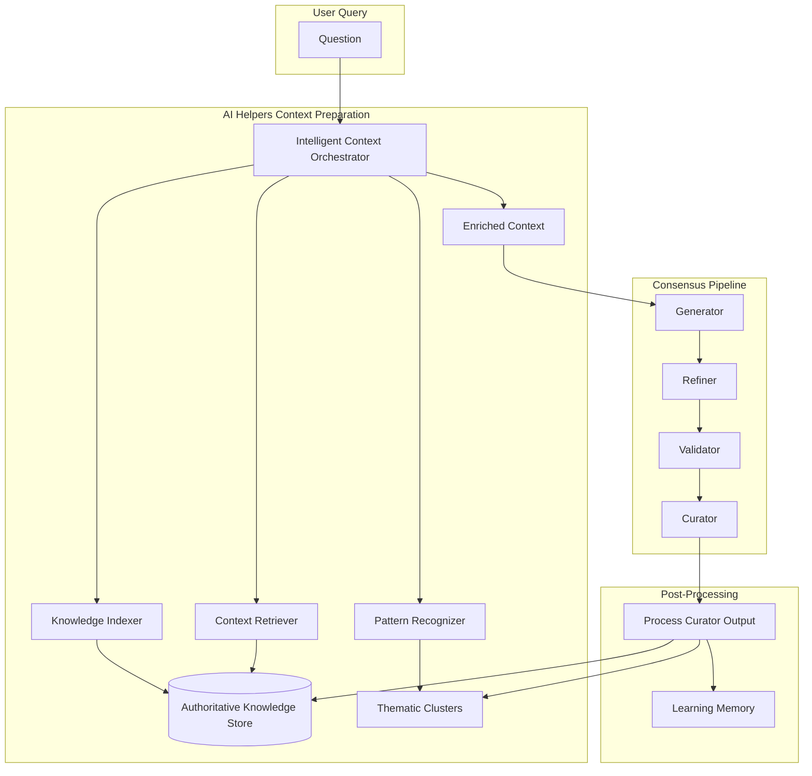

# AI Helpers Context Enhancement Plan

## 🎯 Overview

This plan details how to enhance AI Helpers to provide intelligent context to the consensus pipeline, enabling the system to learn from past interactions and provide increasingly better responses over time.

## 🏗️ Architecture Vision



## 📋 Implementation Phases

### Phase 1: Complete Memory System Infrastructure (Week 1)

#### 1.1 Implement ContextInjector
```rust
// src/consensus/memory/context_injector.rs
pub struct ContextInjector {
    knowledge_store: Arc<AuthoritativeKnowledgeStore>,
    ai_helpers: Arc<AIHelperEcosystem>,
    temporal_window: Duration,
    relevance_threshold: f32,
}

impl ContextInjector {
    /// Inject relevant context for a specific stage
    pub async fn inject_context(
        &self,
        question: &str,
        stage: Stage,
        existing_context: Option<String>,
    ) -> Result<InjectedContext> {
        // 1. Analyze question with AI Helpers
        let question_analysis = self.ai_helpers.analyze_question(question).await?;
        
        // 2. Retrieve relevant facts from knowledge store
        let temporal_facts = self.get_temporal_facts(&question_analysis).await?;
        let thematic_facts = self.get_thematic_facts(&question_analysis).await?;
        let entity_facts = self.get_entity_facts(&question_analysis).await?;
        
        // 3. Rank and filter by relevance
        let ranked_facts = self.rank_facts_by_relevance(
            temporal_facts,
            thematic_facts,
            entity_facts,
            &question_analysis,
        ).await?;
        
        // 4. Format for specific stage
        let formatted_context = self.format_for_stage(ranked_facts, stage).await?;
        
        Ok(InjectedContext {
            stage,
            facts: ranked_facts,
            formatted_context,
            metadata: self.create_metadata(&question_analysis),
        })
    }
}
```

#### 1.2 Implement ContinuousLearner
```rust
// src/consensus/memory/continuous_learner.rs
pub struct ContinuousLearner {
    knowledge_store: Arc<AuthoritativeKnowledgeStore>,
    learning_rate: f32,
    pattern_threshold: f32,
}

impl ContinuousLearner {
    /// Learn from curator output and user feedback
    pub async fn learn_from_interaction(
        &self,
        question: &str,
        curator_output: &str,
        user_feedback: Option<UserFeedback>,
    ) -> Result<LearningResult> {
        // 1. Extract facts from curator output
        let facts = self.extract_facts(curator_output).await?;
        
        // 2. Identify patterns and themes
        let patterns = self.identify_patterns(&facts).await?;
        let themes = self.identify_themes(&facts, question).await?;
        
        // 3. Update knowledge store
        for fact in facts {
            self.knowledge_store.store_fact(fact).await?;
        }
        
        // 4. Update thematic clusters
        self.update_thematic_clusters(themes).await?;
        
        // 5. Adjust relevance scores based on feedback
        if let Some(feedback) = user_feedback {
            self.adjust_relevance_scores(feedback).await?;
        }
        
        Ok(LearningResult {
            facts_learned: facts.len(),
            patterns_discovered: patterns.len(),
            themes_identified: themes.len(),
        })
    }
}
```

#### 1.3 Implement ModelMemoryBridge
```rust
// src/consensus/memory/model_bridge.rs
pub struct ModelMemoryBridge {
    knowledge_store: Arc<AuthoritativeKnowledgeStore>,
    context_formatter: ContextFormatter,
    max_context_size: usize,
}

impl ModelMemoryBridge {
    /// Bridge memory to model context
    pub async fn prepare_model_context(
        &self,
        stage: Stage,
        question: &str,
        injected_context: InjectedContext,
    ) -> Result<ModelContext> {
        // 1. Format injected context for model
        let formatted_facts = self.format_facts_for_model(&injected_context).await?;
        
        // 2. Add temporal awareness
        let temporal_context = self.add_temporal_awareness(question).await?;
        
        // 3. Add thematic continuity
        let thematic_context = self.add_thematic_continuity(question).await?;
        
        // 4. Optimize for model token limits
        let optimized_context = self.optimize_for_tokens(
            formatted_facts,
            temporal_context,
            thematic_context,
            self.max_context_size,
        ).await?;
        
        Ok(ModelContext {
            stage,
            context: optimized_context,
            metadata: self.create_metadata(),
        })
    }
}
```

### Phase 2: Enhance AI Helpers for Context Preparation (Week 2)

#### 2.1 Add prepare_stage_context to AIHelperEcosystem
```rust
impl AIHelperEcosystem {
    /// Prepare intelligent context for consensus stage
    pub async fn prepare_stage_context(
        &self,
        question: &str,
        stage: Stage,
        context_limit: usize,
    ) -> Result<StageContext> {
        // 1. Orchestrate AI helpers for context preparation
        let understanding = self.intelligent_orchestrator
            .understand_question(question, stage)
            .await?;
        
        // 2. Retrieve relevant past knowledge
        let historical_context = self.context_retriever
            .get_historical_context(question, understanding.key_concepts)
            .await?;
        
        // 3. Identify relevant patterns
        let patterns = self.pattern_recognizer
            .find_relevant_patterns(&understanding, &historical_context)
            .await?;
        
        // 4. Synthesize into coherent context
        let synthesized_context = self.knowledge_synthesizer
            .synthesize_stage_context(
                stage,
                understanding,
                historical_context,
                patterns,
                context_limit,
            )
            .await?;
        
        Ok(synthesized_context)
    }
    
    /// Store curator output as authoritative knowledge
    pub async fn store_curator_knowledge(
        &self,
        curator_output: &str,
        question: &str,
        conversation_id: &str,
    ) -> Result<()> {
        // Process and store as before, but also:
        // 1. Extract thematic clusters
        let themes = self.pattern_recognizer
            .extract_themes(curator_output, question)
            .await?;
        
        // 2. Update thematic memory
        self.knowledge_indexer
            .update_thematic_clusters(themes, conversation_id)
            .await?;
        
        // 3. Build cross-conversation relationships
        self.context_retriever
            .build_knowledge_graph(curator_output, conversation_id)
            .await?;
        
        Ok(())
    }
}
```

#### 2.2 Enhance IntelligentContextOrchestrator
```rust
impl IntelligentContextOrchestrator {
    /// Understand question deeply for context preparation
    pub async fn understand_question(
        &self,
        question: &str,
        target_stage: Stage,
    ) -> Result<QuestionUnderstanding> {
        // 1. Categorize question
        let category = self.categorize_question(question).await?;
        
        // 2. Extract key concepts and entities
        let concepts = self.extract_key_concepts(question).await?;
        let entities = self.extract_entities(question).await?;
        
        // 3. Identify temporal requirements
        let temporal_needs = self.identify_temporal_needs(question).await?;
        
        // 4. Determine context requirements per stage
        let context_requirements = match target_stage {
            Stage::Generator => self.generator_context_needs(&category, &concepts),
            Stage::Refiner => self.refiner_context_needs(&category, &concepts),
            Stage::Validator => self.validator_context_needs(&category, &concepts),
            Stage::Curator => self.curator_context_needs(&category, &concepts),
        };
        
        Ok(QuestionUnderstanding {
            category,
            concepts,
            entities,
            temporal_needs,
            context_requirements,
        })
    }
}
```

### Phase 3: Wire AI Helpers into Consensus Pipeline (Week 3)

#### 3.1 Modify ConsensusPipeline to use AI Helper context
```rust
impl ConsensusPipeline {
    /// Run stage with AI Helper-enhanced context
    async fn run_stage_with_ai_context(
        &self,
        stage: &dyn ConsensusStage,
        question: &str,
        previous_answer: Option<&str>,
    ) -> Result<String> {
        // 1. Get AI Helper context for this stage
        let ai_context = if let Some(ref ai_helpers) = self.ai_helpers {
            Some(
                ai_helpers
                    .prepare_stage_context(question, stage.stage(), self.config.max_context_tokens)
                    .await?
            )
        } else {
            None
        };
        
        // 2. Merge with existing context
        let enhanced_context = self.merge_contexts(
            self.verified_context.clone(),
            ai_context,
        ).await?;
        
        // 3. Build messages with enhanced context
        let messages = stage.build_messages(
            question,
            previous_answer,
            Some(&enhanced_context),
        )?;
        
        // 4. Run the stage
        let response = self.call_model(messages, &stage.stage()).await?;
        
        Ok(response)
    }
}
```

#### 3.2 Add memory hooks to store Curator output
```rust
impl ConsensusPipeline {
    /// Store curator output in memory system
    async fn store_curator_output(
        &self,
        curator_output: &str,
        question: &str,
        conversation_id: &str,
    ) -> Result<()> {
        if let Some(ref ai_helpers) = self.ai_helpers {
            // Store as authoritative knowledge
            ai_helpers
                .store_curator_knowledge(curator_output, question, conversation_id)
                .await?;
            
            // Trigger continuous learning
            if let Some(ref memory) = self.consensus_memory {
                memory.continuous_learner
                    .learn_from_interaction(question, curator_output, None)
                    .await?;
            }
        }
        
        Ok(())
    }
}
```

### Phase 4: Implement Thematic Memory System (Week 4)

#### 4.1 Create ThematicClusterManager
```rust
// src/consensus/memory/thematic_clusters.rs
pub struct ThematicClusterManager {
    clusters: Arc<RwLock<HashMap<ClusterId, ThematicCluster>>>,
    ai_helpers: Arc<AIHelperEcosystem>,
    similarity_threshold: f32,
}

pub struct ThematicCluster {
    id: ClusterId,
    theme: String,
    centroid: Vec<f32>, // Embedding vector
    facts: Vec<FactId>,
    conversations: Vec<ConversationId>,
    last_updated: DateTime<Utc>,
    strength: f32,
}

impl ThematicClusterManager {
    /// Add fact to appropriate cluster or create new one
    pub async fn add_to_cluster(
        &self,
        fact: &CuratedFact,
        embedding: Vec<f32>,
    ) -> Result<ClusterId> {
        let mut clusters = self.clusters.write().await;
        
        // Find best matching cluster
        let best_match = self.find_best_cluster(&embedding, &clusters).await?;
        
        if let Some((cluster_id, similarity)) = best_match {
            if similarity > self.similarity_threshold {
                // Add to existing cluster
                clusters.get_mut(&cluster_id).unwrap().facts.push(fact.id.clone());
                return Ok(cluster_id);
            }
        }
        
        // Create new cluster
        let new_cluster = self.create_new_cluster(fact, embedding).await?;
        let cluster_id = new_cluster.id.clone();
        clusters.insert(cluster_id.clone(), new_cluster);
        
        Ok(cluster_id)
    }
    
    /// Get related themes for context
    pub async fn get_related_themes(
        &self,
        question_embedding: Vec<f32>,
        limit: usize,
    ) -> Result<Vec<ThematicContext>> {
        let clusters = self.clusters.read().await;
        
        // Rank clusters by relevance
        let mut ranked_clusters: Vec<_> = clusters
            .values()
            .map(|cluster| {
                let similarity = self.calculate_similarity(&question_embedding, &cluster.centroid);
                (cluster, similarity)
            })
            .collect();
        
        ranked_clusters.sort_by(|a, b| b.1.partial_cmp(&a.1).unwrap());
        
        // Convert to thematic context
        let thematic_contexts = ranked_clusters
            .into_iter()
            .take(limit)
            .map(|(cluster, similarity)| ThematicContext {
                theme: cluster.theme.clone(),
                relevance: similarity,
                fact_count: cluster.facts.len(),
                last_seen: cluster.last_updated,
            })
            .collect();
        
        Ok(thematic_contexts)
    }
}
```

### Phase 5: Testing & Validation (Week 5)

#### 5.1 Unit Tests
```rust
#[cfg(test)]
mod tests {
    use super::*;
    
    #[tokio::test]
    async fn test_context_injection() {
        let ai_helpers = create_test_ai_helpers().await;
        let question = "What are the latest Rust features?";
        
        // Test context preparation
        let context = ai_helpers
            .prepare_stage_context(question, Stage::Generator, 1000)
            .await
            .unwrap();
        
        assert!(!context.relevant_facts.is_empty());
        assert!(context.custom_guidance.is_some());
    }
    
    #[tokio::test]
    async fn test_thematic_clustering() {
        let cluster_manager = ThematicClusterManager::new(Default::default()).await;
        
        // Add facts about Rust
        let rust_fact1 = create_fact("Rust has ownership system");
        let rust_fact2 = create_fact("Rust prevents memory leaks");
        
        let cluster1 = cluster_manager.add_to_cluster(&rust_fact1, vec![0.8, 0.2]).await.unwrap();
        let cluster2 = cluster_manager.add_to_cluster(&rust_fact2, vec![0.7, 0.3]).await.unwrap();
        
        // Should be in same cluster
        assert_eq!(cluster1, cluster2);
    }
    
    #[tokio::test]
    async fn test_continuous_learning() {
        let learner = ContinuousLearner::new(Default::default()).await;
        
        let result = learner
            .learn_from_interaction(
                "What is Rust?",
                "Rust is a systems programming language...",
                None,
            )
            .await
            .unwrap();
        
        assert!(result.facts_learned > 0);
    }
}
```

#### 5.2 Integration Tests
```rust
#[tokio::test]
async fn test_end_to_end_context_enhancement() {
    // 1. Setup
    let engine = create_test_consensus_engine().await;
    
    // 2. First question - no context
    let response1 = engine.ask("What is Rust?").await.unwrap();
    assert!(response1.content.contains("systems programming"));
    
    // 3. Second related question - should have context
    let response2 = engine.ask("How does Rust handle memory?").await.unwrap();
    
    // Verify context was injected
    let metadata = response2.metadata.unwrap();
    assert!(metadata.contains_key("injected_facts_count"));
    assert!(metadata["injected_facts_count"].as_u64().unwrap() > 0);
}

#[tokio::test]
async fn test_knowledge_base_scenario() {
    let engine = create_test_consensus_engine().await;
    
    // 1. Create initial file
    let response1 = engine.ask("Create a hello.txt file").await.unwrap();
    
    // 2. Update with knowledge base
    let response2 = engine
        .ask("Update the file it just created and convert it into a full knowledge base about my repo")
        .await
        .unwrap();
    
    // Verify AI Helper understood context
    assert!(std::path::Path::new("hello.txt").exists());
    let content = std::fs::read_to_string("hello.txt").unwrap();
    assert!(content.contains("Repository Knowledge Base"));
}
```

### Phase 6: Performance Optimization (Week 6)

#### 6.1 Implement Caching
- Cache frequently accessed facts
- Cache question embeddings
- Cache thematic cluster calculations

#### 6.2 Implement Batching
- Batch embedding calculations
- Batch database queries
- Batch AI model calls

#### 6.3 Implement Pruning
- Prune old facts based on access patterns
- Merge similar thematic clusters
- Archive stale conversations

## 📊 Success Metrics

1. **Context Quality**
   - Relevant facts injected: >80% relevance score
   - Response coherence: Improved by >30%
   - Thematic continuity: >90% cluster accuracy

2. **Performance**
   - Context preparation: <500ms
   - Memory retrieval: <100ms
   - No impact on consensus latency

3. **Learning Effectiveness**
   - Facts stored per conversation: 5-10
   - Thematic clusters growth: Logarithmic
   - Relevance improvement over time: Measurable

## 🚀 Rollout Plan

1. **Week 1-2**: Implement core memory components
2. **Week 3**: Wire into consensus pipeline
3. **Week 4**: Add thematic clustering
4. **Week 5**: Testing and validation
5. **Week 6**: Performance optimization
6. **Week 7**: Production rollout with feature flags

## 🔧 Configuration

```toml
[ai_helpers.memory]
enabled = true
temporal_window = "7d"
relevance_threshold = 0.7
max_facts_per_context = 10
thematic_similarity_threshold = 0.8

[ai_helpers.learning]
enabled = true
learning_rate = 0.1
pattern_threshold = 0.6
fact_extraction_confidence = 0.8

[consensus.context]
use_ai_helper_context = true
max_context_tokens = 2000
merge_strategy = "intelligent"
```

## 📝 Notes

- Start with Generator stage only, then expand to other stages
- Use feature flags for gradual rollout
- Monitor impact on response quality and latency
- Collect user feedback on improvement
- Regular pruning to prevent unbounded growth

This enhancement will transform Hive's AI Helpers from passive processors to active participants that make the consensus pipeline smarter over time through continuous learning and intelligent context preparation.