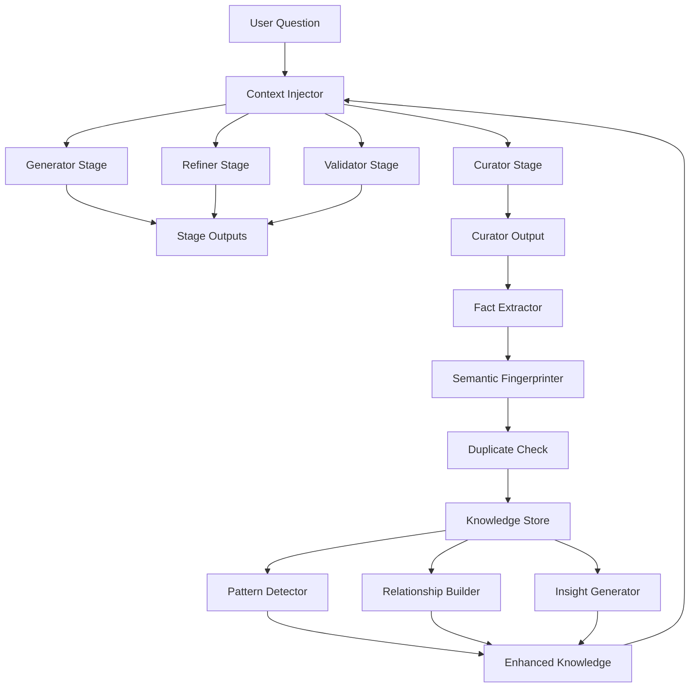

# Consensus Memory Enhancement Plan
*Building Persistent, Cumulative Intelligence for 400+ AI Models*

## 🎯 Vision

Transform Hive's memory system into a persistent knowledge accumulator where every AI model in the consensus pipeline has instant access to the sum total of all insights, facts, and understanding gained through usage. Unlike traditional conversational AI with context windows, our system ensures each AI stage starts with complete awareness of all previous knowledge.

## 🧠 Core Architecture

### 1. Authoritative Knowledge Store (Curator Output)
The Curator stage produces the final, validated knowledge that becomes our source of truth:

```rust
// src/consensus/memory/authoritative_store.rs
pub struct AuthoritativeKnowledgeStore {
    /// Stores curator-validated facts indexed by semantic fingerprint
    facts: Arc<RwLock<HashMap<SemanticFingerprint, CuratedFact>>>,
    
    /// Temporal index for time-based retrieval
    temporal_index: Arc<RwLock<BTreeMap<DateTime<Utc>, Vec<FactId>>>>,
    
    /// Topic-based clustering for efficient retrieval
    topic_clusters: Arc<RwLock<HashMap<TopicId, Vec<FactId>>>>,
    
    /// Relationship graph between facts
    fact_graph: Arc<RwLock<FactGraph>>,
    
    /// Embedding engine for semantic similarity
    embeddings: Arc<EmbeddingEngine>,
}

#[derive(Debug, Clone, Serialize, Deserialize)]
pub struct CuratedFact {
    pub id: FactId,
    pub content: String,
    pub semantic_fingerprint: SemanticFingerprint,
    pub curator_confidence: f64,
    pub source_question: String,
    pub consensus_stages: Vec<StageContribution>,
    pub created_at: DateTime<Utc>,
    pub last_accessed: DateTime<Utc>,
    pub access_count: u64,
    pub related_facts: Vec<FactId>,
    pub topics: Vec<TopicId>,
    pub entities: Vec<Entity>,
    pub metadata: FactMetadata,
}
```

### 2. Semantic Fingerprinting System
Every piece of knowledge gets a unique semantic fingerprint for deduplication and relationship mapping:

```rust
// src/consensus/memory/semantic_fingerprint.rs
pub struct SemanticFingerprinter {
    embedder: Arc<EmbeddingEngine>,
    hasher: SemanticHasher,
}

impl SemanticFingerprinter {
    /// Generate a unique fingerprint for any piece of knowledge
    pub async fn fingerprint(&self, content: &str) -> Result<SemanticFingerprint> {
        // 1. Generate embedding
        let embedding = self.embedder.encode(content).await?;
        
        // 2. Extract key concepts
        let concepts = self.extract_concepts(content)?;
        
        // 3. Create semantic hash
        let hash = self.hasher.hash(&embedding, &concepts)?;
        
        Ok(SemanticFingerprint {
            hash,
            embedding,
            concepts,
            content_type: self.classify_content(content),
        })
    }
}
```

### 3. Instant Context Injection for All Models
Every AI model in the consensus pipeline gets relevant context injected before processing:

```rust
// src/consensus/memory/context_injector.rs
pub struct ContextInjector {
    knowledge_store: Arc<AuthoritativeKnowledgeStore>,
    relevance_engine: Arc<RelevanceEngine>,
    compression_engine: Arc<CompressionEngine>,
}

impl ContextInjector {
    /// Prepare context for any AI model based on the current question
    pub async fn prepare_context(
        &self,
        question: &str,
        stage: Stage,
        model_context_limit: usize,
    ) -> Result<InjectedContext> {
        // 1. Find semantically similar facts
        let similar_facts = self.knowledge_store
            .find_similar(question, 100)
            .await?;
            
        // 2. Find temporally relevant facts
        let recent_facts = self.knowledge_store
            .get_recent_facts(Duration::days(30))
            .await?;
            
        // 3. Find facts about mentioned entities
        let entities = self.extract_entities(question)?;
        let entity_facts = self.knowledge_store
            .get_facts_about_entities(&entities)
            .await?;
            
        // 4. Rank by relevance
        let ranked_facts = self.relevance_engine
            .rank_facts(question, stage, similar_facts, recent_facts, entity_facts)
            .await?;
            
        // 5. Compress to fit model context
        let compressed_context = self.compression_engine
            .compress_facts(ranked_facts, model_context_limit)
            .await?;
            
        Ok(InjectedContext {
            facts: compressed_context,
            summary: self.generate_summary(&compressed_context)?,
            confidence: self.calculate_confidence(&compressed_context),
        })
    }
}
```

### 4. Continuous Learning System
Every interaction enhances the knowledge base:

```rust
// src/consensus/memory/continuous_learner.rs
pub struct ContinuousLearner {
    knowledge_store: Arc<AuthoritativeKnowledgeStore>,
    pattern_detector: Arc<PatternDetector>,
    relationship_builder: Arc<RelationshipBuilder>,
    insight_generator: Arc<InsightGenerator>,
}

impl ContinuousLearner {
    /// Process new curator output and update knowledge base
    pub async fn learn_from_curator(&self, curator_output: &CuratorOutput) -> Result<LearningResult> {
        // 1. Extract facts from curator output
        let new_facts = self.extract_facts(curator_output)?;
        
        // 2. Check for duplicates or updates
        let processed_facts = self.process_facts(new_facts).await?;
        
        // 3. Detect patterns across facts
        let patterns = self.pattern_detector
            .detect_patterns(&processed_facts)
            .await?;
            
        // 4. Build relationships
        let relationships = self.relationship_builder
            .build_relationships(&processed_facts)
            .await?;
            
        // 5. Generate meta-insights
        let insights = self.insight_generator
            .generate_insights(&processed_facts, &patterns, &relationships)
            .await?;
            
        // 6. Store everything
        self.knowledge_store.store_learning_batch(
            processed_facts,
            patterns,
            relationships,
            insights
        ).await?;
        
        Ok(LearningResult {
            facts_added: processed_facts.len(),
            patterns_detected: patterns.len(),
            relationships_built: relationships.len(),
            insights_generated: insights.len(),
        })
    }
}
```

### 5. Multi-Model Memory Bridge
Ensures all 400+ models have access to the same knowledge:

```rust
// src/consensus/memory/model_bridge.rs
pub struct ModelMemoryBridge {
    knowledge_store: Arc<AuthoritativeKnowledgeStore>,
    model_registry: Arc<ModelRegistry>,
    context_cache: Arc<ContextCache>,
}

impl ModelMemoryBridge {
    /// Get context for any model in the pipeline
    pub async fn get_model_context(
        &self,
        model_id: &str,
        question: &str,
        stage: Stage,
    ) -> Result<ModelContext> {
        // 1. Get model specifications
        let model_spec = self.model_registry.get_model(model_id)?;
        
        // 2. Check cache
        if let Some(cached) = self.context_cache.get(model_id, question).await {
            return Ok(cached);
        }
        
        // 3. Prepare context based on model limits
        let context = self.prepare_model_specific_context(
            question,
            stage,
            model_spec.context_window,
            model_spec.preferences,
        ).await?;
        
        // 4. Cache for other stages
        self.context_cache.store(model_id, question, &context).await?;
        
        Ok(context)
    }
}
```

## 📊 Implementation Phases

### Phase 1: Enhanced Storage Pipeline (Week 1)
- [ ] Implement CuratorOutputProcessor to extract facts
- [ ] Create SemanticFingerprinter for deduplication
- [ ] Build AuthoritativeKnowledgeStore with SQLite backend
- [ ] Add fact storage to consensus pipeline

### Phase 2: Retrieval System (Week 2)
- [ ] Implement similarity search with embeddings
- [ ] Create temporal and topic-based indices
- [ ] Build RelevanceEngine for fact ranking
- [ ] Implement CompressionEngine for context fitting

### Phase 3: Context Injection (Week 3)
- [ ] Create ContextInjector for all stages
- [ ] Modify pipeline to inject context before each stage
- [ ] Add context caching for performance
- [ ] Implement stage-specific context strategies

### Phase 4: Continuous Learning (Week 4)
- [ ] Build PatternDetector for cross-fact patterns
- [ ] Create RelationshipBuilder for fact connections
- [ ] Implement InsightGenerator for meta-knowledge
- [ ] Add feedback loops for improvement

### Phase 5: Model Bridge & API (Week 5)
- [ ] Create ModelRegistry for 400+ models
- [ ] Build ModelMemoryBridge for universal access
- [ ] Add REST API for external model access
- [ ] Implement WebSocket for real-time updates

## 🔄 Memory Flow Example



## 💾 Database Schema Enhancements

```sql
-- Authoritative facts table
CREATE TABLE consensus_facts (
    id TEXT PRIMARY KEY,
    semantic_fingerprint TEXT UNIQUE NOT NULL,
    content TEXT NOT NULL,
    embedding BLOB NOT NULL,  -- Serialized vector
    curator_confidence REAL NOT NULL,
    source_question TEXT NOT NULL,
    source_conversation_id TEXT,
    created_at TIMESTAMP NOT NULL,
    last_accessed TIMESTAMP NOT NULL,
    access_count INTEGER DEFAULT 1,
    metadata JSON NOT NULL
);

-- Fact relationships
CREATE TABLE fact_relationships (
    fact_id_1 TEXT NOT NULL,
    fact_id_2 TEXT NOT NULL,
    relationship_type TEXT NOT NULL,
    confidence REAL NOT NULL,
    discovered_at TIMESTAMP NOT NULL,
    PRIMARY KEY (fact_id_1, fact_id_2, relationship_type)
);

-- Topics and clustering
CREATE TABLE fact_topics (
    fact_id TEXT NOT NULL,
    topic_id TEXT NOT NULL,
    relevance_score REAL NOT NULL,
    PRIMARY KEY (fact_id, topic_id)
);

-- Pattern library
CREATE TABLE discovered_patterns (
    id TEXT PRIMARY KEY,
    pattern_type TEXT NOT NULL,
    pattern_data JSON NOT NULL,
    example_facts JSON NOT NULL,
    confidence REAL NOT NULL,
    discovered_at TIMESTAMP NOT NULL,
    last_matched TIMESTAMP
);

-- Model context cache
CREATE TABLE model_context_cache (
    model_id TEXT NOT NULL,
    question_hash TEXT NOT NULL,
    context JSON NOT NULL,
    created_at TIMESTAMP NOT NULL,
    expires_at TIMESTAMP NOT NULL,
    PRIMARY KEY (model_id, question_hash)
);
```

## 🚀 Benefits

1. **Instant Awareness**: Every AI model starts with complete knowledge context
2. **No Context Window Limitations**: Knowledge persists beyond conversation boundaries
3. **Continuous Improvement**: Every interaction makes the system smarter
4. **Deduplication**: Semantic fingerprinting prevents redundant storage
5. **Relationship Discovery**: Automatically finds connections between facts
6. **Pattern Recognition**: Identifies recurring themes and insights
7. **Model Agnostic**: Works with any AI model in the pipeline
8. **Scalable**: Designed to handle millions of facts efficiently

## 📈 Success Metrics

- **Retrieval Speed**: < 100ms for relevant context preparation
- **Relevance Score**: > 90% of injected facts are useful
- **Deduplication Rate**: < 5% duplicate facts stored
- **Pattern Discovery**: > 1000 patterns identified per month
- **Model Coverage**: 100% of models have memory access
- **Knowledge Growth**: Linear growth in unique facts
- **Query Performance**: Sub-second response with full context

## 🔑 Key Innovation

Unlike traditional AI systems that forget between conversations, Hive's consensus memory creates a **persistent knowledge layer** that grows smarter with every interaction. Each of the 400+ models becomes an expert with access to the collective intelligence gained from all previous interactions.

This transforms Hive from a Q&A system into a **learning intelligence platform** that accumulates domain expertise over time.