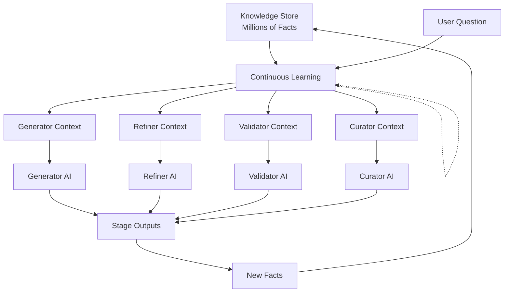

# Knowledge Broker Architecture Analysis
*Using a Dedicated AI Model as Intelligent Memory Intermediary*

## 🧠 Concept Overview

Instead of static retrieval and context injection, use a dedicated AI model (like DeepSeek or similar reasoning model) as an intelligent intermediary that:
- Maintains deep familiarity with the entire knowledge base
- Dynamically interprets what each consensus stage needs
- Translates knowledge into optimal formats for each model
- Acts as a living, learning interface to accumulated wisdom

## 🎯 Architectural Design



## ✅ Pros: Why This Could Be Revolutionary

### 1. **Dynamic Contextual Intelligence**
```rust
// Instead of static retrieval:
let facts = similarity_search(question, limit=10);

// You get intelligent interpretation:
let context = broker_ai.interpret(
    "The user is asking about {question}. 
     Based on our knowledge base of {total_facts} facts,
     provide the most relevant context for the Generator stage
     which uses {model} and prefers {style}."
);
```

### 2. **Model-Specific Translation**
The broker can learn each model's preferences and quirks:
- Claude prefers structured, detailed context
- GPT-4 works better with examples
- Gemini likes conversational context
- Local models need concise summaries

### 3. **Semantic Synthesis**
Instead of returning raw facts, the broker can:
- Combine related facts into coherent narratives
- Resolve contradictions between facts
- Highlight patterns and relationships
- Provide meta-insights about the knowledge

### 4. **Adaptive Learning**
The broker becomes an expert in:
- Your specific knowledge domain
- Each model's performance characteristics
- Optimal context preparation strategies
- Knowledge gap identification

### 5. **Cost Efficiency**
- Use free/cheap models (DeepSeek, Qwen) for brokering
- Reserve expensive models (GPT-4, Claude) for consensus stages
- Reduce token usage by providing precisely what's needed

### 6. **Natural Language Interface**
```python
# Each stage can simply ask for what it needs:
generator_context = broker.ask(
    "What do we know about implementing authentication in Rust?"
)

validator_context = broker.ask(
    "Are there any contradictions in our knowledge about this topic?"
)
```

### 7. **Knowledge Base Expertise**
The broker develops deep familiarity with your specific knowledge:
- Knows which facts are most reliable
- Understands the evolution of knowledge over time
- Can identify knowledge gaps
- Provides confidence scores

## ❌ Cons: Challenges to Address

### 1. **Single Point of Failure**
**Risk**: If broker fails, entire system fails
**Mitigation**: 
- Implement fallback to direct retrieval
- Use multiple broker instances
- Cache broker responses

### 2. **Added Latency**
**Risk**: Extra AI call for each stage (4x per query)
**Mitigation**:
- Parallel broker calls for all stages
- Aggressive caching of common patterns
- Use fast models (DeepSeek is quite fast)

### 3. **Potential Hallucination**
**Risk**: Broker might invent facts not in knowledge base
**Mitigation**:
```rust
struct BrokerResponse {
    context: String,
    fact_ids: Vec<String>, // Always reference source facts
    confidence: f64,
    synthesis_type: SynthesisType,
}
```

### 4. **Context Window Limits**
**Risk**: Broker itself has context limits
**Mitigation**:
- Implement sliding window over knowledge base
- Use retrieval-augmented generation (RAG)
- Hierarchical knowledge organization

### 5. **Consistency Concerns**
**Risk**: Same question might get different contexts
**Mitigation**:
- Temperature = 0 for broker calls
- Structured prompting
- Response validation

## 🏗️ Implementation Architecture

```rust
// src/consensus/memory/knowledge_broker.rs
pub struct KnowledgeBroker {
    /// The broker model (DeepSeek, Qwen, etc.)
    broker_model: Arc<BrokerModel>,
    
    /// Knowledge store reference
    knowledge_store: Arc<AuthoritativeKnowledgeStore>,
    
    /// Conversation context
    conversation_context: Arc<RwLock<ConversationContext>>,
    
    /// Performance optimizer
    optimizer: Arc<BrokerOptimizer>,
    
    /// Response cache
    cache: Arc<BrokerCache>,
}

impl KnowledgeBroker {
    /// Get context for a specific stage
    pub async fn get_stage_context(
        &self,
        question: &str,
        stage: Stage,
        model_id: &str,
    ) -> Result<BrokerResponse> {
        // Check cache first
        if let Some(cached) = self.cache.get(question, stage, model_id).await? {
            return Ok(cached);
        }
        
        // Prepare broker prompt
        let prompt = self.build_broker_prompt(question, stage, model_id).await?;
        
        // Call broker model
        let response = self.broker_model.generate(prompt).await?;
        
        // Validate response references real facts
        let validated = self.validate_response(response).await?;
        
        // Cache for future use
        self.cache.store(question, stage, model_id, &validated).await?;
        
        Ok(validated)
    }
    
    /// Build optimized prompt for broker
    async fn build_broker_prompt(
        &self,
        question: &str,
        stage: Stage,
        model_id: &str,
    ) -> Result<String> {
        let knowledge_summary = self.knowledge_store.get_summary().await?;
        let model_profile = self.optimizer.get_model_profile(model_id).await?;
        let stage_requirements = self.get_stage_requirements(stage);
        
        Ok(format!(
            "You are a knowledge broker with access to {} facts about {}.
            
            User Question: {}
            
            Requesting Context For: {} stage using {} model
            
            Stage Requirements:
            {}
            
            Model Preferences:
            {}
            
            Provide the most relevant context from our knowledge base.
            Reference specific fact IDs where applicable.
            Synthesize related facts into coherent insights.
            
            Knowledge Base Summary:
            {}",
            knowledge_summary.total_facts,
            knowledge_summary.primary_domain,
            question,
            stage,
            model_id,
            stage_requirements,
            model_profile,
            knowledge_summary.recent_insights
        ))
    }
}
```

## 🔄 Hybrid Approach: Best of Both Worlds

```rust
pub enum ContextStrategy {
    /// Direct retrieval for simple queries
    Direct,
    
    /// Broker-mediated for complex queries
    Broker,
    
    /// Hybrid: Direct + Broker enhancement
    Hybrid,
}

impl ContextInjector {
    pub async fn get_context(&self, question: &str, stage: Stage) -> Result<Context> {
        let strategy = self.determine_strategy(question).await?;
        
        match strategy {
            ContextStrategy::Direct => {
                // Fast path for simple queries
                self.direct_retrieval(question, stage).await
            }
            ContextStrategy::Broker => {
                // Full broker mediation
                self.broker.get_stage_context(question, stage).await
            }
            ContextStrategy::Hybrid => {
                // Get direct results first
                let direct = self.direct_retrieval(question, stage).await?;
                
                // Enhance with broker insights
                self.broker.enhance_context(direct, question, stage).await
            }
        }
    }
}
```

## 📊 Performance Optimization

### 1. **Broker Specialization**
Train/fine-tune the broker specifically on:
- Your knowledge base structure
- Common query patterns
- Model preferences
- Domain expertise

### 2. **Caching Strategy**
```rust
struct BrokerCache {
    /// Exact match cache
    exact_cache: HashMap<CacheKey, BrokerResponse>,
    
    /// Semantic similarity cache
    semantic_cache: SemanticCache,
    
    /// Pattern-based cache
    pattern_cache: PatternCache,
}
```

### 3. **Parallel Processing**
```rust
// Request context for all stages in parallel
let (gen_ctx, ref_ctx, val_ctx, cur_ctx) = tokio::join!(
    broker.get_stage_context(question, Stage::Generator, gen_model),
    broker.get_stage_context(question, Stage::Refiner, ref_model),
    broker.get_stage_context(question, Stage::Validator, val_model),
    broker.get_stage_context(question, Stage::Curator, cur_model),
);
```

## 🎯 Recommendation

**Implement a Hybrid Progressive Approach:**

1. **Phase 1**: Start with direct retrieval as baseline
2. **Phase 2**: Add broker for complex queries only
3. **Phase 3**: A/B test broker vs direct performance
4. **Phase 4**: Optimize based on metrics
5. **Phase 5**: Consider fine-tuning broker model

**Key Success Factors:**
- Use a fast, capable model (DeepSeek-V3 is excellent)
- Implement robust caching
- Always validate broker responses against real facts
- Monitor latency carefully
- Start simple, enhance gradually

## 💡 Innovative Extensions

### 1. **Multi-Broker Ensemble**
Use multiple broker models and aggregate their responses:
```rust
let brokers = vec![deepseek_broker, qwen_broker, mistral_broker];
let consensus_context = aggregate_broker_responses(brokers, question).await?;
```

### 2. **Broker Specialization by Domain**
Different brokers for different types of knowledge:
- Technical broker for code-related facts
- Conceptual broker for explanations
- Historical broker for temporal facts

### 3. **Active Learning**
The broker can identify knowledge gaps and suggest what to learn next:
```rust
let knowledge_gaps = broker.identify_gaps(question).await?;
let learning_suggestions = broker.suggest_explorations(knowledge_gaps).await?;
```

## 🚀 Conclusion

The Knowledge Broker architecture is a **powerful innovation** that could significantly enhance Hive's intelligence. The key is to implement it incrementally, with careful monitoring and fallback mechanisms. Start with a hybrid approach and let metrics guide the evolution.

**Recommended Starting Point:**
1. Implement basic broker with DeepSeek for complex queries only
2. Measure latency and quality improvements
3. Gradually expand broker responsibilities based on success
4. Consider fine-tuning once patterns emerge

This could transform Hive from a system that *retrieves* knowledge into one that truly *understands* and *synthesizes* it.