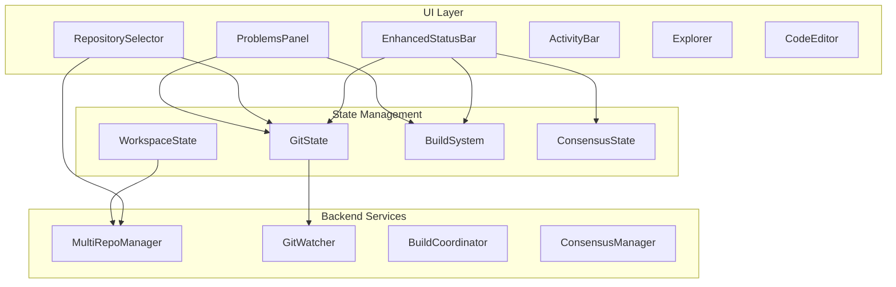

# Phase 2 Integration Roadmap

## Integration Analyst Report
**Date**: 2025-07-30
**Purpose**: Map component connections and create wiring plan for VS Code Desktop UI

## Executive Summary
This document provides a comprehensive integration roadmap for connecting the VS Code-style desktop components. The analysis covers connection points, data flow patterns, missing pieces, and implementation priorities.

## 1. Component Integration Architecture

### 1.1 Core Integration Points



## 2. Component Connection Mappings

### 2.1 EnhancedStatusBar ↔ GitState

**Current State**:
- StatusBar has placeholder items for git branch and sync status
- GitState exists in `src/desktop/git/status.rs` with file status tracking
- No active connection between them

**Required Wiring**:
```rust
// In main app component
let git_state = use_signal(|| GitState::new());
let status_bar_state = use_signal(|| StatusBarState::default());

// Create effect to sync git state to status bar
use_effect(move || {
    let git_state = git_state.read();
    let mut status_bar = status_bar_state.write();
    
    // Update git branch
    if let Some(branch) = &git_state.current_branch {
        status_bar.update_item("git-branch", branch.name.clone());
    }
    
    // Update sync status
    let sync_text = git_state.sync_status.format();
    status_bar.update_item("git-sync", sync_text);
});
```

**Missing Pieces**:
- Git watcher integration for real-time updates
- Background sync status polling
- Click handlers for git operations

### 2.2 RepositorySelector ↔ Workspace

**Current State**:
- RepositorySelector component exists with dropdown UI
- MultiRepoManager manages multiple repositories
- No workspace state abstraction

**Required Wiring**:
```rust
// Create workspace state
#[derive(Clone, Debug)]
pub struct WorkspaceState {
    pub root_path: PathBuf,
    pub repositories: Vec<RepositoryInfo>,
    pub active_repository: Option<PathBuf>,
    pub workspace_settings: WorkspaceSettings,
}

// Wire repository selector to workspace
let workspace_state = use_signal(|| WorkspaceState::new());
let repo_selector_state = use_signal(|| RepositorySelectorState::default());

// On repository change
let on_repository_change = move |repo_path: PathBuf| {
    // Update workspace state
    workspace_state.write().active_repository = Some(repo_path.clone());
    
    // Update git state
    git_state.write().set_repository(repo_path.clone());
    
    // Update file explorer root
    explorer_state.write().root_path = repo_path;
    
    // Clear and refresh problems panel
    problems_state.write().clear_source(&ProblemSource::Git);
};
```

**Missing Pieces**:
- WorkspaceState struct and implementation
- Workspace settings persistence
- Repository auto-discovery on startup
- Cross-repository navigation

### 2.3 ProblemsPanel ↔ Build System

**Current State**:
- ProblemsPanel has comprehensive problem tracking
- No build system integration exists
- Problem sources are defined but not connected

**Required Wiring**:
```rust
// Create build coordinator
pub struct BuildCoordinator {
    build_tasks: HashMap<PathBuf, BuildTask>,
    output_parser: OutputParser,
    problem_reporter: ProblemReporter,
}

// Wire build output to problems panel
let build_coordinator = use_signal(|| BuildCoordinator::new());

// On build output
spawn({
    let problems_state = problems_state.clone();
    async move {
        let mut output_stream = build_coordinator.read().output_stream();
        
        while let Some(output) = output_stream.next().await {
            match output {
                BuildOutput::CompilerError(error) => {
                    let problem = ProblemItem::new(
                        ProblemSeverity::Error,
                        ProblemSource::Rust,
                        error.message,
                    )
                    .with_location(error.file, error.line, error.column)
                    .with_code(error.code);
                    
                    problems_state.write().add_problem(problem);
                }
                BuildOutput::Warning(warning) => {
                    // Similar for warnings
                }
            }
        }
    }
});
```

**Missing Pieces**:
- BuildCoordinator implementation
- Build task management
- Output parsing for different languages
- Problem aggregation and deduplication
- Auto-fix integration

## 3. Critical Missing Components

### 3.1 WorkspaceState
**Purpose**: Central state management for multi-repository workspace

**Required Implementation**:
```rust
// src/desktop/workspace/mod.rs
pub struct WorkspaceState {
    pub root_path: PathBuf,
    pub repositories: Vec<RepositoryInfo>,
    pub active_repository: Option<PathBuf>,
    pub open_files: HashMap<PathBuf, FileState>,
    pub workspace_settings: WorkspaceSettings,
    pub recent_workspaces: Vec<PathBuf>,
}

impl WorkspaceState {
    pub fn scan_for_repositories(&mut self) -> Result<()>
    pub fn switch_repository(&mut self, path: PathBuf) -> Result<()>
    pub fn add_recent_workspace(&mut self, path: PathBuf)
    pub fn save_state(&self) -> Result<()>
    pub fn restore_state() -> Result<Self>
}
```

### 3.2 BuildSystem
**Purpose**: Coordinate build tasks and error reporting

**Required Implementation**:
```rust
// src/desktop/build/mod.rs
pub struct BuildSystem {
    pub coordinator: BuildCoordinator,
    pub task_queue: TaskQueue,
    pub output_channels: HashMap<String, OutputChannel>,
    pub problem_matcher: ProblemMatcher,
}

pub struct BuildTask {
    pub id: String,
    pub name: String,
    pub command: String,
    pub working_directory: PathBuf,
    pub problem_matchers: Vec<String>,
    pub status: BuildStatus,
}
```

### 3.3 Event Bus
**Purpose**: Decouple components and enable reactive updates

**Required Implementation**:
```rust
// src/desktop/events/bus.rs
pub struct EventBus {
    subscribers: HashMap<EventType, Vec<EventHandler>>,
}

pub enum EventType {
    GitStatusChanged,
    BuildStarted,
    BuildCompleted,
    FileChanged,
    RepositoryChanged,
    ProblemsUpdated,
}

impl EventBus {
    pub fn subscribe(&mut self, event: EventType, handler: EventHandler)
    pub fn publish(&self, event: Event)
    pub fn publish_async(&self, event: Event)
}
```

## 4. Integration Priority Order

### Phase 1: Core State Management (Week 1)
1. **WorkspaceState Implementation**
   - Create workspace module
   - Implement state persistence
   - Add repository management

2. **Event Bus Setup**
   - Create event system
   - Wire core components
   - Add async event handling

### Phase 2: Git Integration (Week 2)
3. **GitState ↔ StatusBar**
   - Connect git state to status bar
   - Add file watcher integration
   - Implement click handlers

4. **MultiRepoManager ↔ RepositorySelector**
   - Wire repository switching
   - Add workspace scanning
   - Implement state synchronization

### Phase 3: Build Integration (Week 3)
5. **BuildSystem Implementation**
   - Create build coordinator
   - Add output parsing
   - Implement task management

6. **BuildSystem ↔ ProblemsPanel**
   - Wire problem reporting
   - Add error parsing
   - Implement quick fixes

### Phase 4: Advanced Features (Week 4)
7. **Cross-Component Communication**
   - File change notifications
   - Build trigger integration
   - Status aggregation

8. **Performance Optimization**
   - Debounce updates
   - Lazy loading
   - Background processing

## 5. Implementation Guidelines

### 5.1 State Management Pattern
```rust
// Use Dioxus signals for reactive state
let state = use_signal(|| ComponentState::default());

// Use effects for state synchronization
use_effect(move || {
    // React to state changes
});

// Use coroutines for async operations
let _handle = use_coroutine(|mut rx: UnboundedReceiver<Message>| async move {
    while let Some(msg) = rx.next().await {
        // Handle async messages
    }
});
```

### 5.2 Error Handling
```rust
// All integration points should handle errors gracefully
match operation {
    Ok(result) => update_state(result),
    Err(e) => {
        log::error!("Operation failed: {}", e);
        show_error_notification(e);
    }
}
```

### 5.3 Performance Considerations
- Use `tokio::spawn` for background tasks
- Debounce rapid updates (file changes, typing)
- Batch problem updates
- Cache computed values

## 6. Testing Strategy

### 6.1 Integration Tests
```rust
#[tokio::test]
async fn test_git_status_bar_integration() {
    let git_state = GitState::new();
    let status_bar = StatusBarState::default();
    
    // Simulate git change
    git_state.update_branch("feature/test");
    
    // Verify status bar update
    assert_eq!(status_bar.get_item("git-branch").text, "feature/test");
}
```

### 6.2 Mock Services
- Create mock git repository for testing
- Mock build output streams
- Simulate file system events

## 7. Migration Path

### From Current State
1. Add WorkspaceState without breaking existing code
2. Gradually wire components through event bus
3. Deprecate direct component coupling
4. Remove legacy state management

### Backward Compatibility
- Maintain existing component APIs
- Add feature flags for new integration
- Provide migration utilities

## 8. Next Steps

1. **Review and Approve** this integration roadmap
2. **Create WorkspaceState** module structure
3. **Implement Event Bus** foundation
4. **Begin Phase 1** implementation
5. **Set up integration tests**

## Appendix: Component Interfaces

### A. StatusBar Integration Interface
```rust
pub trait StatusBarIntegration {
    fn update_git_status(&mut self, branch: &str, sync: &SyncStatus);
    fn update_build_status(&mut self, status: BuildStatus);
    fn update_problems_count(&mut self, errors: u32, warnings: u32);
}
```

### B. Repository Integration Interface
```rust
pub trait RepositoryIntegration {
    fn on_repository_change(&mut self, path: PathBuf) -> Result<()>;
    fn get_current_repository(&self) -> Option<&RepositoryInfo>;
    fn scan_workspace(&mut self) -> Result<Vec<RepositoryInfo>>;
}
```

### C. Problems Integration Interface
```rust
pub trait ProblemsIntegration {
    fn report_problem(&mut self, problem: ProblemItem);
    fn clear_problems(&mut self, source: ProblemSource);
    fn get_problems_for_file(&self, path: &PathBuf) -> Vec<&ProblemItem>;
}
```

---

**Document Status**: Complete ✅
**Next Review**: After Phase 1 implementation
**Contact**: Integration Team Lead