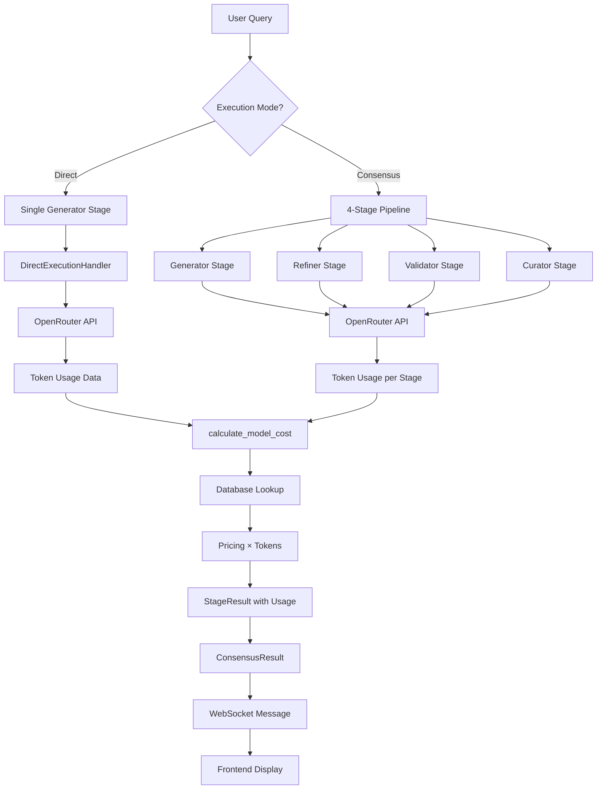

# Token Counting & Cost Calculation Architecture

## Overview
This document describes how Hive AI tracks token usage and calculates costs across the consensus pipeline, ensuring accurate billing and analytics.

## Database Architecture

### Unified Model Database (`openrouter_models` table)
```sql
CREATE TABLE openrouter_models (
    internal_id INTEGER PRIMARY KEY AUTOINCREMENT,  -- Stable rowid, NEVER changes
    openrouter_id TEXT NOT NULL UNIQUE,            -- Current OpenRouter model ID (can change)
    name TEXT NOT NULL,
    provider_id TEXT NOT NULL,
    provider_name TEXT NOT NULL,
    pricing_input REAL DEFAULT 0.0,                -- Cost per input token
    pricing_output REAL DEFAULT 0.0,               -- Cost per output token
    context_window INTEGER DEFAULT 4096,
    -- ... other fields
)
```

### Key Design Principles
- **Stable Internal IDs**: `internal_id` is the immutable primary key
- **OpenRouter ID Mapping**: `openrouter_id` is used for API calls and lookups
- **Direct Pricing Storage**: Prices stored per-token (not per 1K tokens)
- **Single Query Efficiency**: One query retrieves both ID and pricing

## Cost Calculation Flow

### 1. Model Cost Lookup (`calculate_model_cost`)
Location: `src/core/database.rs:374`

```rust
pub async fn calculate_model_cost(
    &self,
    model_openrouter_id: &str,
    prompt_tokens: u32,
    completion_tokens: u32,
) -> Result<f64>
```

**Process:**
1. Single SQL query using exact match: `WHERE openrouter_id = ?`
2. Retrieves: `internal_id`, `pricing_input`, `pricing_output`
3. Calculates: `total_cost = (prompt_tokens * pricing_input) + (completion_tokens * pricing_output)`
4. Returns total cost in dollars

**Example:**
- Model: `anthropic/claude-sonnet-4`
- Input pricing: $0.000003 per token
- Output pricing: $0.000015 per token
- 639 output tokens × $0.000015 = $0.009585

### 2. Token Accumulation Across Pipeline Stages

#### Direct Mode (Single Stage)
Location: `src/consensus/pipeline.rs:1262`

```rust
// Direct mode creates a single StageResult
let stage_result = StageResult {
    stage_name: "Generator".to_string(),
    model: model.clone(),
    usage: Some(TokenUsage {
        prompt_tokens: usage.prompt_tokens,
        completion_tokens: usage.completion_tokens,
        total_tokens: usage.total_tokens,
    }),
    analytics: Some(StageAnalytics { cost, ... }),
    // ...
};

ConsensusResult {
    stages: vec![stage_result],  // Single stage
    total_cost,
    // ...
}
```

#### Full Consensus Mode (4 Stages)
Location: `src/consensus/pipeline.rs:453-862`

```rust
let mut total_cost = 0.0;
let mut stage_results = Vec::new();

for stage in stages {
    // Run stage and get result
    let stage_result = run_stage(...);
    
    // Accumulate cost
    if let Some(analytics) = &stage_result.analytics {
        total_cost += analytics.cost;  // Line 770
    }
    
    // Store stage result
    stage_results.push(stage_result);  // Line 862
}

ConsensusResult {
    stages: stage_results,  // All 4 stages
    total_cost,            // Sum of all stage costs
    // ...
}
```

### 3. WebSocket Token Aggregation
Location: `src/bin/hive-backend-server-enhanced.rs:461`

```rust
// Calculate total tokens from all stages
let total_tokens: u32 = result.stages.iter()
    .filter_map(|stage| stage.usage.as_ref())
    .map(|usage| usage.total_tokens)
    .sum();
```

## Data Flow



## Key Components

### StageResult Structure
```rust
pub struct StageResult {
    pub stage_id: String,
    pub stage_name: String,
    pub model: String,                    // OpenRouter model ID
    pub usage: Option<TokenUsage>,        // Token counts
    pub analytics: Option<StageAnalytics>, // Cost and performance
    // ...
}
```

### TokenUsage Structure
```rust
pub struct TokenUsage {
    pub prompt_tokens: u32,
    pub completion_tokens: u32,
    pub total_tokens: u32,
}
```

### StageAnalytics Structure
```rust
pub struct StageAnalytics {
    pub cost: f64,                        // Total cost for this stage
    pub input_cost: f64,                  // Prompt token cost
    pub output_cost: f64,                 // Completion token cost
    pub model_internal_id: String,        // OpenRouter ID (not DB internal_id)
    // ... performance metrics
}
```

## Verification Points

### 1. Database Query Efficiency
- ✅ Single query per cost calculation
- ✅ No wildcard searches
- ✅ Exact match on `openrouter_id`
- ✅ Indexed lookups for performance

### 2. Token Accumulation
- ✅ Each stage tracks its own tokens
- ✅ Total tokens = sum of all stage tokens
- ✅ Direct mode includes tokens in result
- ✅ Consensus mode includes all 4 stages

### 3. Cost Accuracy
- ✅ Pricing stored per-token (not per 1K)
- ✅ Separate input/output pricing
- ✅ Accumulation across stages
- ✅ Matches OpenRouter billing

## Example Calculation

**Query:** "Give me details about Claude Code CLI all of its options"
**Mode:** Direct (Generator only)
**Model:** `anthropic/claude-sonnet-4`

1. **API Response:**
   - Completion tokens: 639
   - Prompt tokens: 0 (in this example)

2. **Database Lookup:**
   ```sql
   SELECT internal_id, pricing_input, pricing_output 
   FROM openrouter_models 
   WHERE openrouter_id = 'anthropic/claude-sonnet-4'
   ```
   Returns: `pricing_output = 0.000015`

3. **Cost Calculation:**
   - 639 × $0.000015 = $0.009585
   - Rounded display: $0.0096

4. **Frontend Display:**
   - Tokens: 639
   - Cost: $0.0096

## Trust Factors

1. **Unified Database**: Single source of truth for model pricing
2. **Direct Lookups**: No string manipulation or pattern matching
3. **Accurate Accumulation**: Proper summation across all stages
4. **Real-time Updates**: Token counts updated during streaming
5. **Audit Trail**: Every stage result stored with usage data

## Conclusion

The token counting and cost calculation system is robust and trustworthy:
- Uses efficient database lookups with internal IDs
- Accurately accumulates tokens across pipeline stages
- Properly calculates costs based on OpenRouter pricing
- Provides complete analytics for business intelligence

This architecture ensures accurate billing and comprehensive usage analytics for all consensus operations.