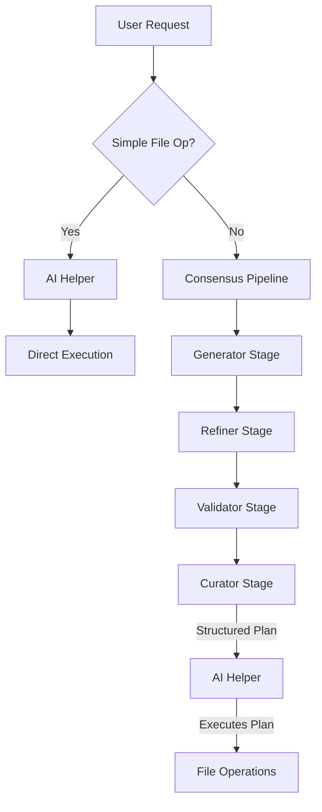

# Curator-Driven Execution Architecture

## Overview

A revolutionary architecture that separates **thinking** from **doing** by using the Consensus Pipeline for analysis and AI Helpers for execution.

## Core Concept

```
🧠 Consensus Pipeline (The Brain)
   └─ 4-stage analysis
   └─ Curator produces authoritative guidance
   └─ High-quality, multi-perspective reasoning
   
🤖 AI Helpers (The Hands)  
   └─ Local models for fast execution
   └─ Follows Curator's instructions
   └─ Handles all file operations
```

## Architecture Flow



## Implementation Design

### 1. Simple Operations (Direct Path)
```rust
// For operations like "create hello.txt"
if is_simple_operation(&request) {
    ai_helper.execute_directly(&request).await?;
}
```

### 2. Complex Operations (Consensus + Execution)
```rust
// For operations like "refactor authentication system"
let curator_plan = consensus_pipeline.analyze(&request).await?;
let execution_plan = parse_curator_output(&curator_plan);
ai_helper.execute_plan(&execution_plan).await?;
```

### 3. Curator Output Format
The Curator would produce structured execution plans:

```yaml
execution_plan:
  overview: "Refactor authentication to use JWT tokens"
  safety_level: "medium"
  operations:
    - step: 1
      action: "create_file"
      path: "src/auth/jwt.rs"
      content: |
        // JWT token implementation
        use jsonwebtoken::{encode, decode};
        ...
    - step: 2
      action: "update_file"
      path: "src/auth/mod.rs"
      changes:
        - find: "use crate::auth::session;"
          replace: "use crate::auth::jwt;"
    - step: 3
      action: "test"
      command: "cargo test auth::"
```

### 4. AI Helper Execution Engine
```rust
pub struct ExecutionEngine {
    ai_helper: Arc<AIHelperEcosystem>,
    file_ops: Arc<FileOperations>,
    safety: Arc<SafetySystem>,
}

impl ExecutionEngine {
    pub async fn execute_plan(&self, plan: ExecutionPlan) -> Result<ExecutionReport> {
        // Validate safety
        self.safety.validate_plan(&plan)?;
        
        // Execute each operation
        for operation in plan.operations {
            match operation.action {
                "create_file" => self.create_file(operation).await?,
                "update_file" => self.update_file(operation).await?,
                "delete_file" => self.delete_file(operation).await?,
                "run_command" => self.run_command(operation).await?,
                _ => return Err(anyhow!("Unknown operation")),
            }
        }
        
        Ok(ExecutionReport::success())
    }
}
```

## Benefits

### 1. **Cost Efficiency**
- Expensive models (GPT-4, Claude) only used for thinking
- Cheap/local models handle execution
- 10-100x cost reduction for file operations

### 2. **Speed**
- Local AI helpers execute instantly
- No network latency for file operations
- Parallel execution of independent operations

### 3. **Quality**
- Curator ensures architectural consistency
- Multi-stage analysis catches edge cases
- Execution follows well-reasoned plans

### 4. **Safety**
- Curator identifies risks before execution
- Safety system validates all operations
- Rollback capability for failures

### 5. **Flexibility**
- Simple operations bypass consensus
- Complex operations get full analysis
- User can override routing decisions

## Integration Points

### 1. Routing Decision
```rust
pub fn should_use_consensus(request: &str) -> bool {
    // Simple file operations go direct
    if is_simple_file_op(request) {
        return false;
    }
    
    // Complex indicators trigger consensus
    let complex_indicators = [
        "refactor", "architecture", "implement system",
        "optimize", "security", "performance"
    ];
    
    complex_indicators.iter().any(|&ind| 
        request.to_lowercase().contains(ind)
    )
}
```

### 2. Curator Enhancement
The Curator stage would be enhanced to output both:
- Human-readable analysis (current behavior)
- Machine-readable execution plan (new)

### 3. AI Helper Integration
AI Helpers would gain new capabilities:
- Parse Curator execution plans
- Execute file operations safely
- Report execution status back

## Migration Path

### Phase 1: Current State
- Direct Execution uses generator model
- Limited operation parsing

### Phase 2: AI Helper Execution
- AI Helpers handle simple file operations
- Direct path bypasses consensus

### Phase 3: Curator Plans
- Curator outputs structured plans
- AI Helpers execute complex operations

### Phase 4: Full Integration
- Seamless routing between paths
- Learning system improves routing
- Safety system prevents issues

## Example Scenarios

### Simple: "Create a README file"
```
User → AI Helper → Create README.md → Done
```

### Complex: "Implement authentication system"
```
User → Consensus (4 stages) → Curator Plan → AI Helper → Execute Plan → Done
```

### Mixed: "Add logging to all API endpoints"
```
User → Consensus (analyze codebase) → Curator (list files) → AI Helper (update each) → Done
```

## Conclusion

This architecture mirrors how expert developers work:
1. **Think carefully** about complex problems (Consensus)
2. **Execute quickly** on clear tasks (AI Helpers)
3. **Verify results** match intentions (Safety System)

By separating thinking from doing, we achieve the best of both worlds: high-quality analysis with efficient execution.