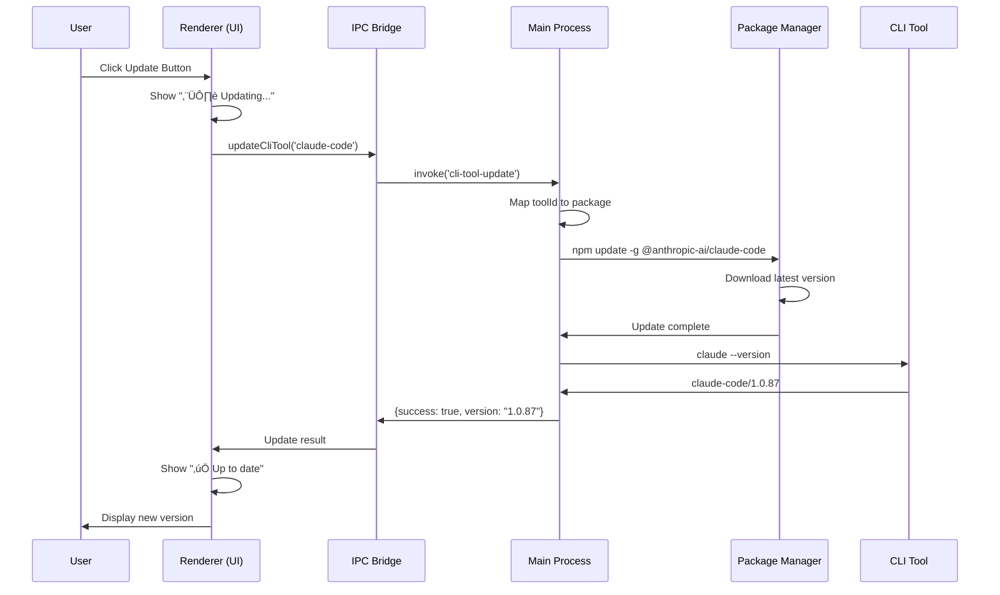

# 🏗️ Hive Consensus - Master Architecture Document

## Table of Contents
1. [System Overview](#system-overview)
2. [Core Components](#core-components)
3. [Process Architecture](#process-architecture)
4. [Data Architecture](#data-architecture)
5. [Communication Architecture](#communication-architecture)
6. [User Interface Architecture](#user-interface-architecture)
7. [Complete Memory-Context-Consensus Loop Architecture](#complete-memory-context-consensus-loop-architecture-v18190)
8. [Consensus Engine Architecture](#consensus-engine-architecture)
9. [Visual Progress System](#visual-progress-system)
10. [Memory Service Infrastructure](#memory-service-infrastructure)
11. [Git Integration Architecture](#git-integration-architecture)
12. [Security & Authentication](#security--authentication)
13. [Performance & Optimization](#performance--optimization)
14. [Development & Deployment](#development--deployment)
15. [CLI Tools Management](#cli-tools-management)
16. [AI Tools Launch Tracking & Database](#ai-tools-launch-tracking--database)
17. [Future Enhancements](#future-enhancements)
18. [Architecture Diagrams](#architecture-diagrams)

---

## System Overview

### Purpose
Hive Consensus is an advanced AI-powered development environment that combines:
- **4-Stage Consensus AI Processing** (Generator → Refiner → Validator → Curator)
- **Universal Memory Infrastructure** (Memory-as-a-Service for AI tools)
- **VS Code-like Development Environment** in Electron
- **Deep Git Integration** with visual source control
- **Real-time Collaboration** between human and AI
- **Visual Startup Experience** with neural network animation (v1.8.0)

### Technology Stack
```
Frontend:
├── Electron (Desktop App Framework)
├── TypeScript (Primary Language)
├── HTML/CSS (UI Rendering)
├── WebSockets (Real-time Communication)
└── Monaco Editor (Code Editing)

Backend:
├── Node.js (Runtime)
├── Express (API Server for Memory Service)
├── SQLite (Local Database)
├── Cloudflare D1 (Remote Sync)
└── OpenRouter API (AI Model Access)

Infrastructure:
├── ProcessManager (Child Process Management)
├── PortManager (Port Conflict Resolution)
├── IPC (Inter-Process Communication)
└── File System Watchers
```

---

## Core Components

### 1. Main Process (Electron Main)
**Location**: `src/index.ts`
**Responsibilities**:
- Application lifecycle management
- Window creation and management
- IPC handler registration
- Database initialization
- Process orchestration
- Menu system
- File system operations

**Key Features**:
- Manages SQLite database connection
- Handles all file I/O operations
- Spawns and manages child processes
- Provides secure bridge to renderer

### 2. Renderer Process (UI)
**Location**: `src/renderer.ts`
**Responsibilities**:
- User interface rendering
- Event handling
- State management
- API communication
- Real-time updates

**Key Components**:
```typescript
├── Chat Interface (Consensus interaction)
├── File Explorer (Project navigation)
├── Editor Tabs (Multi-file editing)
├── Git UI (Source control)
├── Memory Dashboard (UMI visualization)
├── Analytics View (Usage statistics)
└── Settings Modal (Configuration)
```

### 3. Memory Service (Child Process)
**Location**: `src/memory-service/`
**Port**: FULLY DYNAMIC - NO HARDCODED PORTS
**Responsibilities**:
- Memory-as-a-Service API
- External tool integration
- Query processing
- Learning contribution
- Statistics tracking

**Port Allocation**:
- Receives port from ProcessManager via environment variable
- NEVER has fallback ports
- Exits immediately if no port provided
- Clients discover port via IPC

---

## Process Architecture

### Zero-Fallback Port Management Philosophy

**CORE PRINCIPLES**:
1. **NO HARDCODED PORTS** - Every port is dynamically allocated
2. **NO FALLBACK PORTS** - Services fail fast if port not allocated
3. **NO SAMPLE/DEFAULT PORTS** - Not even in comments or documentation
4. **FAIL FAST** - Services exit immediately without proper port
5. **IPC DISCOVERY** - All port discovery happens via IPC channels
6. **CONFIGURATION-DRIVEN** - Port ranges from config/environment only
7. **SYSTEM-ADAPTIVE** - Discovers what's available, doesn't assume
8. **NO MAGIC NUMBERS** - Even examples use variables/config references

**WHY THIS MATTERS**:
- **Portability**: App works on any system without port conflicts
- **Scalability**: Can run multiple instances with different configs
- **Security**: No predictable ports for attackers to target
- **Reliability**: Adapts to system constraints automatically
- **Maintainability**: Port ranges changed without code modifications

### Process Hierarchy (Fully Dynamic)
```
Electron Main Process (Orchestrator)
├── ProcessManager (Control Tower)
│   ├── Process Lifecycle Management
│   ├── Port Allocation via PortManager
│   ├── Health Monitoring
│   └── Crash Recovery
├── PortManager (Intelligence Layer)
│   ├── Pre-scan Port Pools
│   ├── Dynamic Allocation
│   ├── Ephemeral Fallback
│   └── Port Release & Cleanup
├── Memory Service (Node.js Child Process)
│   ├── Express Server (Dynamic Port from Pool)
│   ├── WebSocket Server
│   └── IPC Channel to Main
├── WebSocket Backend Server (Rust Binary)
│   ├── Dynamic Port from Pool
│   ├── Consensus Engine with AI Helpers
│   └── Deferred Initialization Architecture
└── File Watchers
    └── Git Status Monitor
```

### ProcessManager & PortManager Integration

#### The Control Tower Pattern
ProcessManager acts as the central control tower for all child processes, while PortManager provides intelligent port allocation services. This separation of concerns ensures clean architecture and maximum flexibility.

```typescript
// ProcessManager - The Control Tower
class ProcessManager extends EventEmitter {
  private processes: Map<string, ProcessInfo> = new Map();
  private configs: Map<string, ProcessConfig> = new Map();
  
  async startProcess(name: string): Promise<boolean> {
    const config = this.configs.get(name);
    const info = this.processes.get(name);
    
    // Step 1: Port Allocation (if needed)
    if (config.port !== undefined) {
      // Delegate to PortManager - no port numbers!
      const port = await PortManager.allocatePortForService(name);
      info.port = port;
      
      // Pass to service via environment
      env.PORT = port.toString();
      env[`${name.toUpperCase().replace('-', '_')}_PORT`] = port.toString();
    }
    
    // Step 2: Process Spawning
    const childProcess = this.spawnProcess(config, env);
    
    // Step 3: Monitoring & Recovery
    this.monitorProcess(name, childProcess);
  }
}
```

#### Dynamic Service Discovery (NO FALLBACKS)
Services discover their ports and peer services dynamically through IPC:

```typescript
// Service discovers its own port from environment - NO FALLBACK
const port = parseInt(process.env.PORT || process.env.MEMORY_SERVICE_PORT || '0');
if (!port) {
  logger.error('No port provided! Exiting...');
  process.exit(1);  // FAIL FAST - NO FALLBACK
}

// Renderer discovers service ports via IPC - NO FALLBACK
try {
  const memoryPort = await window.api.invoke('memory-service-port');
  if (!memoryPort) throw new Error('Memory service not running');
  // Use port...
} catch (error) {
  // Show error to user - NO FALLBACK CONNECTION ATTEMPT
  showError('Memory Service not available');
}
```

### ProcessManager - Central Control Tower (v3.0.0 - Zero Fallback)
**Location**: `src/utils/ProcessManager.ts`
**Initialization**: Created as singleton at app start in `src/index.ts`

The ProcessManager serves as the single source of truth for all process and port management across the application. It acts as the "control tower" coordinating all services, ports, and inter-process communication.

#### Architecture Principles
- **SINGLE INSTANCE**: Only ONE ProcessManager instance exists, created at app initialization
- **CENTRALIZED PORT MANAGEMENT**: All port allocations go through ProcessManager's PortManager
- **NO DUPLICATE INSTANCES**: All components receive the shared ProcessManager instance
- **EVENT-DRIVEN COORDINATION**: Real-time status updates via EventEmitter pattern
- **ZERO PORT ASSUMPTIONS**: ProcessManager never assumes port availability
- **STRICT SEQUENCING**: Dependencies initialized before dependents
- **FAIL-FAST PHILOSOPHY**: No retries with fallback ports

#### ProcessManager-PortManager Coordination Protocol

```typescript
class ProcessManager {
  // ProcessManager delegates ALL port decisions to PortManager
  async startProcess(name: string): Promise<boolean> {
    const config = this.configs.get(name);
    
    // Step 1: Request port from PortManager (no numbers!)
    let port: number | undefined;
    if (config.requiresPort) {
      port = await PortManager.allocatePortForService(name);
      if (!port) {
        logger.error(`[ProcessManager] No port available for ${name}`);
        this.emit('process-failed', { name, reason: 'no-port' });
        return false;  // FAIL - Don't try fallbacks
      }
    }
    
    // Step 2: Start process with allocated port
    const env = {
      ...process.env,
      ...(port && {
        PORT: port.toString(),
        [`${name.toUpperCase().replace(/-/g, '_')}_PORT`]: port.toString()
      })
    };
    
    // Step 3: Spawn and monitor
    const child = spawn(config.command, config.args, { env });
    
    // Step 4: Track allocation
    this.processes.set(name, {
      pid: child.pid,
      port,
      status: 'starting',
      startTime: Date.now()
    });
    
    return true;
  }
  
  // When process dies, release port immediately
  private handleProcessExit(name: string) {
    const info = this.processes.get(name);
    if (info?.port) {
      PortManager.releasePort(name);  // Port returns to pool
    }
    this.processes.delete(name);
    this.emit('process-stopped', { name });
  }
}
```

#### Key Components

##### 1. ProcessManager Singleton
```typescript
// Created once at app start (src/index.ts:39)
const processManager = new ProcessManager();

// Passed to all components that need it:
- StartupOrchestrator receives it in constructor
- Terminal handlers receive it via registerTerminalHandlers(mainWindow, processManager)
- Memory Service uses it for port allocation
- WebSocket Backend uses it for lifecycle management
```

##### 2. PortManager Integration
**Location**: `src/utils/PortManager.ts`

PortManager is a static utility class used by ProcessManager to:
- Track ALL allocated ports globally in a Map
- Check port availability both physically and in allocation registry
- Prevent port conflicts between services
- Automatically find next available port when conflicts occur

```typescript
class PortManager {
  private static allocatedPorts: Map<string, number> = new Map();
  
  static async allocatePort(config: PortConfig): Promise<number> {
    // 1. Check if port is already allocated to ANY service
    const isPortAllocatedToAnother = Array.from(this.allocatedPorts.values()).includes(port);
    
    // 2. Check if port is physically available
    if (!isPortAllocatedToAnother && await this.isPortAvailable(port)) {
      // 3. Allocate and track the port
      this.allocatedPorts.set(serviceName, port);
      return port;
    }
    
    // 4. Find next available port (7100, 7101, 7102, etc.)
    // Continues until finding both unallocated AND available port
  }
}
```

##### 3. TTYD Terminal Management
**Location**: `src/services/TTYDManager.ts`

TTYDManager receives the shared ProcessManager instance and uses PortManager for port allocation:
- Each terminal gets a unique port (7100, 7101, 7102, etc.)
- Port conflicts are automatically resolved
- Failed terminals properly release their ports

```typescript
// Terminal handler registration with shared ProcessManager
registerTerminalHandlers(mainWindow: BrowserWindow, processManager: ProcessManager) {
  // Initialize TTYDManager with shared ProcessManager
  ttydManager = new TTYDManager(processManager);
}
```

#### Process Lifecycle Management

##### Service Registration (NO PORT NUMBERS)
```typescript
processManager.registerProcess('memory-service', {
  scriptPath: memoryServicePath,
  // NO PORT SPECIFIED - PortManager handles it
  env: { /* environment variables */ }
});
```

##### Service Startup Flow
1. StartupOrchestrator requests service start
2. ProcessManager allocates port via PortManager
3. Process spawned with allocated port
4. ProcessManager monitors port availability
5. Status events emitted to StartupOrchestrator
6. Visual progress updated in splash screen

### PortManager - Intelligent Dynamic Port Allocation (v3.0.0)
**Location**: `src/utils/PortManager.ts`

#### Core Design Principles
1. **NO HARDCODED PORTS ANYWHERE** - Not even in examples or comments
2. **PRE-SCAN OPTIMIZATION** - All ports scanned at startup, not on-demand
3. **POOL-BASED ALLOCATION** - Pre-validated pools for instant allocation
4. **ZERO FALLBACKS** - Services fail if no port available
5. **STRICT ISOLATION** - Services never know about other services' ports

#### Architecture Overview

```typescript
class PortManager {
  // Port ranges loaded from configuration - NEVER hardcoded
  private static readonly PORT_RANGES: PortRange[] = this.loadPortRanges();
  
  // Pre-scanned available ports organized by service pool
  private static availablePortPool: Map<string, AvailablePort[]> = new Map();
  private static allocatedPorts: Map<string, AllocatedPort> = new Map();
  private static scanComplete: boolean = false;
  
  // Load from environment or config file - NO HARDCODED VALUES
  private static loadPortRanges(): PortRange[] {
    // In production: Load from config file or environment
    // Ranges are DISCOVERED, not assumed
    return ConfigLoader.getPortRanges() || this.discoverAvailableRanges();
  }
  
  // Discover available ranges by scanning system
  private static async discoverAvailableRanges(): Promise<PortRange[]> {
    // Scan common ranges and find available blocks
    // Create pools based on what's actually available
    // NO ASSUMPTIONS about specific port numbers
  }
}
```

#### Configuration-Driven Port Management

```yaml
# config/ports.yaml - Externalized configuration
port_ranges:
  memory_service:
    scan_start: ${MEMORY_PORT_START}  # From environment
    scan_end: ${MEMORY_PORT_END}      # From environment
    pool_size: 20                     # How many to pre-scan
    
  backend_service:
    scan_start: ${BACKEND_PORT_START}
    scan_end: ${BACKEND_PORT_END}
    pool_size: 10
    
  terminals:
    scan_start: ${TERMINAL_PORT_START}
    scan_end: ${TERMINAL_PORT_END}
    pool_size: 50
```

#### Service-Agnostic Port Allocation

```typescript
// Services never know their port ranges
// They just request a port for their service type
class MemoryService {
  constructor() {
    // Service doesn't know or care about port ranges
    const port = process.env.PORT || process.env.MEMORY_SERVICE_PORT;
    if (!port) {
      logger.error('No port provided by ProcessManager!');
      process.exit(1);
    }
    // Service uses whatever port was allocated
    this.startServer(parseInt(port));
  }
}
```

#### Startup Pre-Scan Process (Dynamic Discovery)

```typescript
// Called ONCE at app startup BEFORE any service initialization
await PortManager.initialize();

// What happens:
1. Load port range configuration (or discover)
2. Parallel scan of discovered ranges (not hardcoded)
3. Each port checked with adaptive timeout
4. Available ports added to service pools
5. Scan completes quickly for any number of ports
6. Services get INSTANT allocation from pre-validated pools

// The scan adapts to the system:
- On developer machine: May find different ranges available
- In production: Uses environment-specific configuration
- In containers: Adapts to container port mappings
- NO HARDCODED ASSUMPTIONS
```

#### Service Port Allocation Flow

```typescript
// When ProcessManager starts a service:
const port = await PortManager.allocatePortForService('memory-service');

// What happens:
1. Check if scan is complete (should be)
2. Get pool for service type
3. Pop first available port from pool
4. Mark as allocated with timestamp
5. Return port INSTANTLY (no network check needed)
6. If no ports available: FAIL FAST - NO FALLBACK
```

#### Port Release & Cleanup

```typescript
// When service stops/crashes:
PortManager.releasePort('memory-service');

// What happens:
1. Find allocated port for service
2. Return to available pool
3. Clear allocation record
4. Port immediately available for reuse
```

#### Zero-Fallback Philosophy in Practice

```typescript
// ❌ WRONG - NEVER DO THIS:
const port = process.env.PORT || 3457;  // HARDCODED FALLBACK
const ws = new WebSocket('ws://localhost:3457');  // HARDCODED PORT
const backendUrl = 'http://localhost:8765';  // HARDCODED URL

// ✅ RIGHT - FAIL FAST WITH DYNAMIC DISCOVERY:
const port = parseInt(process.env.PORT || '0');
if (!port) {
  logger.error('[Service] No port provided! Cannot start.');
  process.exit(1);  // FAIL IMMEDIATELY - NO GUESSING
}

// ✅ RIGHT - IPC DISCOVERY:
const memoryPort = await window.api.invoke('memory-service-port');
if (!memoryPort) throw new Error('Memory service not available');
const ws = new WebSocket(`ws://localhost:${memoryPort}`);

// ✅ RIGHT - ENVIRONMENT CONFIGURATION:
const portRange = {
  start: parseInt(process.env.SERVICE_PORT_START || '0'),
  end: parseInt(process.env.SERVICE_PORT_END || '0')
};
if (!portRange.start || !portRange.end) {
  throw new Error('Port range configuration missing');
}
```

#### IPC Port Discovery Protocol

```typescript
// Renderer needs Memory Service port:
const port = await window.api.invoke('memory-service-port');

// Main process handler:
ipcMain.handle('memory-service-port', async () => {
  const info = processManager.getProcessStatus('memory-service');
  if (!info?.port) {
    throw new Error('Memory Service not running');  // NO FALLBACK
  }
  return info.port;
});

// Renderer handles failure:
try {
  const port = await window.api.invoke('memory-service-port');
  connectToService(port);
} catch (error) {
  showServiceUnavailable();  // NO FALLBACK CONNECTION
}
```

##### Port Conflict Resolution
When pool is exhausted:
1. Log critical error
2. Show user error dialog
3. Service fails to start
4. NO FALLBACK TO RANDOM PORTS
5. NO SCANNING FOR NEW PORTS
6. Admin must resolve port conflicts

### Startup Orchestrator System (v2.0.0 - Event-Driven Architecture)
**Location**: `src/startup/StartupOrchestrator.ts`

The StartupOrchestrator provides a sophisticated visual loading experience with real-time progress reporting from ProcessManager, ensuring all services are fully initialized before displaying the main application.

#### Core Philosophy: No Timeouts, Only Real Status
- **NO ARBITRARY TIMEOUTS**: System waits as long as needed for services to be ready
- **EVENT-DRIVEN PROGRESS**: ProcessManager reports actual status, not estimated times
- **CONTINUOUS MONITORING**: Real-time updates flow from services to visual display
- **GRACEFUL DEGRADATION**: Optional services can fail without blocking startup

#### Architectural Components

##### 1. StartupOrchestrator Class
**Location**: `src/startup/StartupOrchestrator.ts`

```typescript
class StartupOrchestrator {
  private splashWindow: BrowserWindow | null = null;
  private mainWindow: BrowserWindow | null = null;
  private startTime: number = Date.now();
  private initFunctions: {
    initDatabase: () => void;
    initializeProcessManager: () => void;
    registerMemoryServiceHandlers: () => void;
    registerGitHandlers: () => void;
    registerFileSystemHandlers: () => void;
    registerDialogHandlers: () => void;
    registerSimpleCliToolHandlers: () => void;
    processManager: ProcessManager;
  };
  
  // Service definitions with NO verify functions - ProcessManager handles everything
  private requiredServices: ServiceCheck[] = [
    { id: 'database', name: 'Database', init: async () => {...}, weight: 15, required: true },
    { id: 'processManager', name: 'Process Manager', init: async () => {...}, weight: 10, required: true },
    { id: 'ipcHandlers', name: 'IPC Handlers', init: async () => {...}, weight: 10, required: true },
    { id: 'memoryService', name: 'Memory Service', init: async () => {...}, weight: 20, required: false },
    { id: 'backendServer', name: 'Backend Server & Consensus Engine', init: async () => {...}, weight: 25, required: true },
    { id: 'cliTools', name: 'AI CLI Tools', init: async () => {...}, weight: 15, required: false }
  ];
}
```

##### 2. Visual Display Architecture

###### Splash Window Configuration
```typescript
splashWindow = new BrowserWindow({
  width: 600,
  height: 500,
  frame: false,           // No window chrome
  center: true,          // Center on screen
  resizable: false,      // Fixed size
  backgroundColor: '#0E1414',  // Match app theme
  alwaysOnTop: true,     // Stay above other windows
  skipTaskbar: true,     // Don't show in taskbar
  webPreferences: {
    nodeIntegration: false,
    contextIsolation: true,
    preload: path.join(__dirname, '..', '..', 'startup-preload.js')
  }
});
```

###### Visual Layout (Fixed Positioning)
```css
.startup-container {
  width: 600px;
  max-height: 500px;
  position: absolute;
  top: 50%;
  left: 50%;
  transform: translate(-50%, -50%);  /* Perfect centering */
  display: flex;
  flex-direction: column;
  align-items: center;
  justify-content: space-evenly;
  padding: 20px;
}

/* Prevents text from appearing off-screen */
.status-text {
  min-height: 20px;
  flex-shrink: 0;
  width: 100%;
  overflow: hidden;
  text-overflow: ellipsis;
  white-space: nowrap;
}
```

##### 3. ProcessManager Integration

###### Event-Driven Progress Reporting
```typescript
// ProcessManager emits detailed progress events
processManager.emit('process:progress', {
  name: 'websocket-backend',
  status: 'initializing' | 'database' | 'consensus' | 'models' | 'ai-helpers' | 'waiting' | 'ready',
  message: 'Human-readable status message',
  port: 8765,
  percent?: number  // Optional progress percentage
});

// StartupOrchestrator listens and updates display
const progressHandler = (data: any) => {
  if (data.name === 'websocket-backend') {
    switch (data.status) {
      case 'starting':
        this.updateSplash(70, 'Starting backend server...');
        break;
      case 'database':
        this.updateSplash(78, 'Connecting to database...');
        break;
      case 'consensus':
        this.updateSplash(80, 'Initializing consensus engine...');
        break;
      case 'models':
        this.updateSplash(85, 'Syncing AI models from OpenRouter...');
        break;
      case 'ai-helpers':
        this.updateSplash(88, 'Loading AI helpers...');
        break;
      case 'waiting':
        this.updateSplash(92, 'Waiting for services to be ready...');
        break;
      case 'ready':
        this.updateSplash(95, `Backend ready on port ${data.port}`);
        break;
    }
  }
};
```

###### No-Timeout Service Verification
```typescript
// OLD (removed): Timeout-based verification
// const verified = await this.waitForService(service.verify, timeout);

// NEW: ProcessManager handles all verification internally
await this.startBackendServer();  // Returns only when TRULY ready

// ProcessManager's infinite loop until ready
while (!portReady) {
  attempts++;
  portReady = await PortManager.waitForService(port, checkInterval);
  
  if (portReady) {
    this.emit('process:progress', { name, status: 'ready', message: `Service ready on port ${port}`, port });
    break;
  }
  
  // Report progress every 2.5 seconds
  if (attempts % 10 === 0) {
    const elapsed = attempts * checkInterval;
    this.emit('process:progress', {
      name,
      status: 'waiting',
      message: `Waiting for service to start... (${Math.round(elapsed/1000)}s)`,
      port
    });
  }
}
```

##### 4. Neural Network Animation System

###### Animation Architecture
```javascript
class StartupNeuralNetwork {
  constructor(canvas) {
    this.neurons = [];     // Array of neuron objects
    this.connections = []; // Array of connection objects
    this.pulses = [];     // Active signal pulses
  }
  
  initializeNetwork() {
    // Creates 4-layer network matching consensus engine stages
    // Generator → Refiner → Validator → Curator
    const layers = [
      { count: 4, y: 0.2 },   // Input layer
      { count: 6, y: 0.4 },   // Hidden layer 1
      { count: 6, y: 0.6 },   // Hidden layer 2
      { count: 3, y: 0.8 }    // Output layer
    ];
  }
  
  updateProgress(percent) {
    // Progressively illuminates neurons based on startup progress
    const activeNeurons = Math.floor((this.neurons.length * percent) / 100);
    this.neurons.forEach((neuron, i) => {
      neuron.brightness = i < activeNeurons ? 
        0.3 + (0.7 * (percent / 100)) : 0.1;
    });
  }
}
```

##### 5. Dynamic Port Allocation

###### Port Management - Production Zero-Fallback Pattern
```typescript
// StartupOrchestrator NEVER uses fallback ports
verify: async () => {
  // Get dynamic port from ProcessManager - NO FALLBACK
  const info = this.initFunctions.processManager.getProcessStatus('websocket-backend');
  if (!info?.port) {
    throw new Error('Backend service has no allocated port');
  }
  // Only proceed with properly allocated port
  return this.checkHealth(`http://localhost:${info.port}/health`);
}

// ProcessManager allocates from pre-scanned pools
const port = await PortManager.allocatePortForService(name);
if (!port) {
  throw new Error(`No ports available for service: ${name}`);
}
// NO FALLBACK PORTS - Service fails if pool exhausted
```

###### Port Detection Strategy (Fail-Fast Design)
```typescript
// New isPortListening method - connects to check if port is ready
private static async isPortListening(port: number): Promise<boolean> {
  return new Promise((resolve) => {
    const client = new net.Socket();
    const timeout = setTimeout(() => {
      client.destroy();
      resolve(false);
    }, 100);
    
    client.once('connect', () => {
      clearTimeout(timeout);
      client.destroy();
      resolve(true);  // Port is listening!
    });
    
    client.once('error', () => {
      clearTimeout(timeout);
      resolve(false);
    });
    
    client.connect(port, 'localhost');
  });
}
```

#### Service Initialization Flow

1. **Database Initialization** (15% weight)
   - Clean up orphaned processes via PidTracker
   - Initialize SQLite connection
   - No network calls, always fast
   - **CRITICAL**: No async database operations during initialization (see Critical Fixes section)

2. **Process Manager Setup** (10% weight)
   - Register service configurations
   - Initialize port management
   - Set up event emitters

3. **IPC Handler Registration** (10% weight)
   - Memory Service handlers
   - Git integration handlers
   - File system handlers
   - Dialog handlers
   - CLI tool handlers
   - WebSocket backend port handler

4. **Memory Service Launch** (20% weight - Optional)
   - Dynamic port allocation (3457-3560 range)
   - Express server initialization
   - WebSocket server setup
   - Can fail without blocking startup

5. **Backend Server Launch** (25% weight - Required)
   - Dynamic port allocation (8765-8865 range)
   - Database connection
   - Consensus engine initialization
   - Model syncing from OpenRouter
   - AI helper ecosystem setup
   - Python subprocess for ML models

6. **CLI Tools Detection** (15% weight - Optional)
   - Detect installed AI CLI tools
   - Version checking
   - Path resolution

#### Progress Reporting Chain

```
Backend Server Process → Console Output
                      ↓
         ProcessManager (monitors output)
                      ↓
         Emits 'process:progress' events
                      ↓
         StartupOrchestrator (listening)
                      ↓
         Updates splash window via IPC
                      ↓
         Visual feedback to user
```

#### Error Handling Philosophy

- **No Timeout Failures**: Services never fail due to arbitrary time limits
- **Required vs Optional**: Only required services can block startup
- **Graceful Degradation**: App launches even if optional services fail
- **User Feedback**: Clear error messages displayed on splash screen
- **Auto-Recovery**: ProcessManager handles service restarts automatically

#### Performance Characteristics

- **Typical Startup**: 3-5 seconds with all services
- **Slow Network**: May take 10-30 seconds for model syncing
- **No Upper Limit**: System waits indefinitely if needed
- **User Can Cancel**: Close splash window to abort startup

#### Files Structure
```
electron-poc/
├── startup.html                    # Splash screen HTML (fixed positioning)
├── startup-neural.js               # Neural network animation engine
├── startup-preload.js              # IPC bridge for progress updates
├── src/
│   └── startup/
│       └── StartupOrchestrator.ts # Main orchestration logic
└── src/utils/
    ├── ProcessManager.ts           # Event-driven process management
    └── PortManager.ts              # Dynamic port allocation
```

#### Key Improvements in v2.0.0

1. **Removed ALL Timeouts**: No `waitForService` with timeout parameters
2. **Event-Driven Updates**: Real-time progress from ProcessManager
3. **Fixed Visual Positioning**: Text always visible on screen
4. **Dynamic Port Discovery**: No hardcoded ports anywhere
5. **Continuous Monitoring**: ProcessManager reports until ready
6. **Better Error Recovery**: Services can restart without user intervention
7. **Professional UX**: Smooth, informative, never stuck

#### Terminal Panel Visual Fix (Resolved Issues)

##### The 9-Row Terminal Problem (SOLVED)
- **Issue**: TTYD terminals would get stuck at 9 rows when window minimized/maximized
- **Root Cause**: WebView reload attempts failed with ERR_FAILED, terminal size set server-side
- **Solution**: Removed all resize handlers and webview reloading, using fixed flexbox layout

##### CSS Architecture for Terminal Panels
```css
/* Fixed width panel - no manual dragging */
.isolated-terminal-panel {
  flex: 0 0 450px;  /* No grow, no shrink, fixed 450px */
  transition: flex 0.2s ease;
}

/* Auto-expand when center collapsed */
.isolated-terminal-panel.expanded {
  flex: 1 1 auto;  /* Take all available space */
}
```

This architecture ensures the startup experience is smooth, informative, and reliable - taking exactly as long as needed with continuous visual feedback.

### Enhanced ProcessManager System (2025 Production Architecture)
**Location**: `src/utils/ProcessManager.ts`

**Core Philosophy**: 
- **Parallel Everything**: All services start simultaneously (2025 best practice)
- **Zero Blocking**: No service waits for another to start
- **Dynamic Ports Only**: Never retry same port, always find next available
- **Critical Path Protection**: Consensus engine never blocked by other services

**Key Improvements**:

#### 1. Process Registration & Configuration
```typescript
interface ProcessConfig {
  name: string;                    // Unique process identifier
  scriptPath: string;              // Path to executable/script
  args?: string[];                 // Command line arguments
  env?: NodeJS.ProcessEnv;         // Environment variables
  port?: number;                   // Preferred port (not required)
  alternativePorts?: number[];     // Large range for dynamic allocation
  autoRestart?: boolean;           // Enable crash recovery
  maxRestarts?: number;            // Retry limit (default: 5)
  restartDelay?: number;           // Ms between restarts (default: 3000)
  healthCheckUrl?: string;         // HTTP endpoint for health monitoring
  healthCheckInterval?: number;    // Ms between health checks
  stdio?: StdioOptions;            // Critical for binary processes
  detached?: boolean;              // Run independently of parent
  priority?: 'critical' | 'high' | 'normal'; // Startup priority
}
```

#### 2. Dynamic Port Management System
```typescript
// PortManager ensures no port conflicts (src/utils/PortManager.ts)
class PortManager {
  // Finds next available port automatically
  static async allocatePort(config: PortConfig): Promise<number> {
    // Try preferred port first
    if (await isPortAvailable(preferredPort)) return preferredPort;
    
    // Scan up to 100 ports ahead
    for (let port = preferredPort + 1; port < preferredPort + 100; port++) {
      if (await isPortAvailable(port)) return port;
    }
  }
}

// Frontend discovers ports dynamically via IPC
const backendPort = await window.backendAPI.getBackendPort();
const wsUrl = `ws://127.0.0.1:${backendPort}/ws`;
```

#### 3. Stdio Configuration (Critical for AI Helpers)
```typescript
// For binary processes with Python subprocesses (AI Helpers)
stdio: 'inherit'  // REQUIRED - Allows subprocess communication

// For Node.js processes with IPC
stdio: 'pipe'     // Default for fork()

// NEVER use for processes with subprocesses:
stdio: ['ignore', 'pipe', 'pipe']  // Breaks AI Helper communication
```

#### 3. Parallel Startup Architecture
```typescript
async startAllProcesses(): Promise<void> {
  const startupPromises: Promise<ProcessResult>[] = [];
  
  // Start ALL processes simultaneously
  for (const [name, config] of this.processConfigs) {
    startupPromises.push(this.startProcessAsync(name, config));
  }
  
  // Wait for all to complete/fail
  const results = await Promise.allSettled(startupPromises);
  
  // Log results but don't block on failures
  results.forEach((result, index) => {
    if (result.status === 'rejected') {
      console.error(`Process ${index} failed:`, result.reason);
    }
  });
}
```

#### 4. Dynamic Port Allocation (No Retries)
```typescript
async allocatePort(config: PortConfig): Promise<number> {
  let currentPort = config.preferredPort || config.alternativePorts[0];
  const maxPort = currentPort + 100; // Scan up to 100 ports ahead
  
  // Never retry same port - always find next available
  while (currentPort < maxPort) {
    if (await this.isPortAvailable(currentPort)) {
      return currentPort;
    }
    currentPort++;
  }
  
  throw new Error(`No available ports in range ${config.preferredPort}-${maxPort}`);
}

// Port ranges for each service
const PORT_RANGES = {
  'memory-service': { 
    preferred: 3457, 
    range: [3457, 3560]  // 100+ alternatives
  },
  'websocket-backend': { 
    preferred: 8765, 
    range: [8765, 8865]  // 100+ alternatives
  },
  'analytics-service': {
    preferred: 4567,
    range: [4567, 4667]  // 100+ alternatives
  }
};
```

#### 5. Process Type Detection & Handling
```typescript
detectProcessType(scriptPath: string): ProcessType {
  const ext = path.extname(scriptPath);
  
  if (ext === '.ts') return 'typescript';
  if (ext === '.js') return 'javascript';
  if (ext === '.rs' || !ext) return 'binary';  // Rust binaries
  
  return 'unknown';
}

async spawnProcess(config: ProcessConfig): Promise<ChildProcess> {
  const type = this.detectProcessType(config.scriptPath);
  
  switch (type) {
    case 'binary':
      // Critical: Use 'inherit' for processes with subprocesses
      return spawn(config.scriptPath, config.args, {
        stdio: 'inherit',  // Allows AI Helper communication
        env: { ...process.env, ...config.env },
        detached: false
      });
      
    case 'typescript':
      // Use fork with ts-node for IPC support
      return fork(config.scriptPath, config.args, {
        execArgv: ['-r', 'ts-node/register'],
        env: config.env,
        silent: false
      });
      
    default:
      return fork(config.scriptPath, config.args, {
        env: config.env,
        silent: false
      });
  }
}
```

#### 6. IPC Ready Message Handling (Critical Fix)
```typescript
// FIXED: Race condition where message handler intercepted ready signal
// Solution: Create ready promise BEFORE setting up message handlers

let readyResolver: ((value: boolean) => void) | null = null;
let readyTimeout: NodeJS.Timeout | null = null;

// Create ready promise first
const readyPromise = (config.scriptPath.endsWith('.ts') || config.scriptPath.endsWith('.js')) 
  ? new Promise<boolean>((resolve) => {
      readyResolver = resolve;
      readyTimeout = setTimeout(() => {
        logger.info(`Timeout waiting for ${name} ready signal`);
        resolve(false);
      }, 15000);
    })
  : null;

// THEN set up message handlers
childProcess.on('message', (msg: any) => {
  // Handle ready message first if waiting for it
  if (readyResolver && msg.type === 'ready') {
    if (readyTimeout) clearTimeout(readyTimeout);
    readyResolver(true);
    readyResolver = null; // Prevent double resolution
  }
  // Then handle normally
  this.handleProcessMessage(name, msg);
});

// Wait for ready signal
if (readyPromise) {
  isReady = await readyPromise;
}
```

#### 7. Enhanced Status Reporting
```typescript
interface ProcessStatus {
  name: string;
  state: 'stopped' | 'starting' | 'running' | 'crashed' | 'unhealthy';
  pid?: number;
  port?: number;
  uptime?: number;
  restartCount: number;
  lastError?: string;
  memoryUsage?: number;
  cpuUsage?: number;
}

// Comprehensive status methods
getFullStatus(): {
  processes: ProcessStatus[];
  allocatedPorts: Map<string, number>;
  summary: {
    total: number;
    running: number;
    crashed: number;
    unhealthy: number;
  };
}

debugProcess(name: string): Promise<{
  logs: string[];
  environment: NodeJS.ProcessEnv;
  connections: number;
  threads: number;
}>

logStatus(): void {
  console.log('╭─────────────────────────────────────────╮');
  console.log('│         PROCESS MANAGER STATUS         │');
  console.log('├─────────────────────────────────────────┤');
  for (const [name, info] of this.processes) {
    console.log(`│ ${name.padEnd(20)} │ ${info.state.padEnd(10)} │`);
  }
  console.log('╰─────────────────────────────────────────╯');
}
```

#### 7. Startup Optimization Techniques
```typescript
// 1. Deferred Initialization (Backend)
// Backend binds to port immediately, initializes consensus later
async startBackend(): Promise<void> {
  // Start server immediately
  const server = await this.bindToPort(port);
  
  // Defer heavy initialization
  setTimeout(() => {
    this.initializeConsensusEngine();
  }, 1000);
}

// 2. Parallel Service Discovery
// Don't wait for services to be ready before starting others
async startServices(): Promise<void> {
  const services = ['memory', 'analytics', 'consensus'];
  
  // Start all at once
  await Promise.all(services.map(s => this.startService(s)));
  
  // Check readiness in background
  this.monitorReadiness(services);
}

// 3. Non-Blocking Health Checks
// Health checks run in background, don't block startup
scheduleHealthChecks(): void {
  setInterval(async () => {
    for (const [name, config] of this.processConfigs) {
      // Non-blocking check
      this.checkHealthAsync(name, config).catch(err => {
        console.warn(`Health check failed for ${name}:`, err);
      });
    }
  }, 30000);
}
```

#### 8. AI Helper Integration Requirements
```typescript
// Critical configuration for AI Helper subprocess communication
const CONSENSUS_CONFIG = {
  name: 'websocket-backend',
  scriptPath: '/path/to/hive-backend-server-enhanced',
  stdio: 'inherit',  // MUST be 'inherit' for Python subprocess
  env: {
    RUST_LOG: 'info',
    PORT: '8765',
    PYTHONUNBUFFERED: '1',  // Critical for Python output
    TRANSFORMERS_OFFLINE: '0',
    HF_HOME: '~/.hive/models'
  },
  priority: 'critical',
  initTimeout: 30000  // 30s timeout for AI Helper init
};
```

#### 9. Process Crash Recovery Protocol
```typescript
async handleProcessCrash(name: string): Promise<void> {
  const info = this.processes.get(name);
  if (!info) return;
  
  // Release port immediately (no blocking)
  if (info.port) {
    PortManager.releasePort(name);
    info.port = undefined;
  }
  
  // Check restart eligibility
  if (info.restartCount < info.maxRestarts) {
    info.restartCount++;
    
    // Find new port (never reuse crashed port)
    const newPort = await this.allocateNewPort(name);
    
    // Restart with new port
    await this.startProcess(name, { ...info.config, port: newPort });
  }
}
```

#### 10. Event System (Enhanced)
```typescript
// New events for better monitoring
processManager.on('port:allocated', (name, port) => {})
processManager.on('port:released', (name, port) => {})
processManager.on('startup:parallel', (services) => {})
processManager.on('consensus:initializing', () => {})
processManager.on('consensus:ready', () => {})
processManager.on('ai-helpers:timeout', () => {})
```

### Advanced PortManager System
**Location**: `src/utils/PortManager.ts`

**2025 Best Practices**:
- **No Retries**: If port in use, immediately try next
- **Large Ranges**: 100+ alternative ports per service
- **Smart Scanning**: Efficient port availability checking
- **No Process Killing**: Never kill existing processes
- **Parallel Allocation**: Allocate ports for all services at once

### Parallel Startup Timeline
```
T+0ms    : App Ready Event
T+1ms    : ProcessManager initialized
T+2ms    : Start all processes in parallel
           ├── Memory Service → Port scan 3457-3560
           ├── Backend Server → Port scan 8765-8865  
           └── Analytics (future) → Port scan 4567-4667
T+100ms  : Port allocations complete
T+150ms  : Processes spawned with allocated ports
T+500ms  : Backend bound to port, serving health endpoint
T+1000ms : Memory Service Express server ready
T+1500ms : Backend starts consensus initialization (deferred)
T+5000ms : Full system operational
```

### Critical Implementation Details

#### Binary Process Communication Fix
The most critical fix was changing stdio configuration for binary processes:
```typescript
// BROKEN - Prevents AI Helper Python subprocess communication
stdio: ['ignore', 'pipe', 'pipe']

// FIXED - Allows full subprocess communication
stdio: 'inherit'
```
This single change resolved the "AI Helpers required for mode detection" error by allowing the Rust backend's Python subprocesses to communicate properly.

#### Port Allocation Strategy
```typescript
// Old (Broken) - Retry same port with delays
async allocatePort(port: number): Promise<number> {
  for (let i = 0; i < 50; i++) {
    if (await isAvailable(port)) return port;
    await sleep(1000); // Wait and retry
  }
  throw new Error('Port unavailable after 50 attempts');
}

// New (Fixed) - Instant next port finding
async allocatePort(preferred: number): Promise<number> {
  let port = preferred;
  while (port < preferred + 100) {
    if (await isAvailable(port)) return port;
    port++; // Immediately try next
  }
  throw new Error('No ports available in range');
}
```

#### Consensus Engine Initialization
```rust
// Backend Server - Deferred initialization pattern
async fn main() {
  // 1. Bind to port immediately (fast)
  let server = bind_server(port).await;
  
  // 2. Start serving health endpoint
  tokio::spawn(health_endpoint());
  
  // 3. Defer consensus initialization
  tokio::spawn(async move {
    sleep(Duration::from_secs(1)).await;
    
    // Initialize with 30s timeout for AI Helpers
    match timeout(Duration::from_secs(30), 
                  ConsensusEngine::new()).await {
      Ok(Ok(engine)) => {
        *CONSENSUS_ENGINE.write().await = Some(engine);
        info!("Consensus ready");
      }
      Err(_) => warn!("AI Helper init timeout")
    }
  });
  
  // 4. Server starts immediately
  server.serve().await;
}
```

### Integration with Main Architecture

#### 1. Memory Service Integration
```typescript
processManager.registerProcess({
  name: 'memory-service',
  scriptPath: 'src/memory-service/index.ts',
  port: 3457,
  alternativePorts: [3458, 3459, 3460],
  autoRestart: true,
  healthCheckUrl: 'http://localhost:{port}/health',
  healthCheckInterval: 30000
});
```

#### 2. WebSocket Backend Integration
```typescript
processManager.registerProcess({
  name: 'websocket-backend',
  scriptPath: '/path/to/websocket-server',
  port: 8765,
  alternativePorts: [8766, 8767, 8768],
  autoRestart: true,
  healthCheckUrl: 'http://localhost:{port}/health',
  healthCheckInterval: 30000
});
```

#### 3. AI Helper Python Subprocess Architecture
```rust
// In src/ai_helpers/python_models.rs
pub struct PythonModelService {
  process: Arc<Mutex<Option<Child>>>,
  stdin: Arc<Mutex<Option<ChildStdin>>>,
  response_handlers: Arc<RwLock<HashMap<String, Sender<Response>>>>
}

impl PythonModelService {
  async fn start(&self) -> Result<()> {
    let mut cmd = Command::new("python3");
    cmd.arg("model_service.py")
       .stdin(Stdio::piped())
       .stdout(Stdio::piped())
       .stderr(Stdio::piped())
       .kill_on_drop(true)  // Critical: Clean subprocess termination
       .env("PYTHONUNBUFFERED", "1")  // Critical: Real-time output
       .env("TRANSFORMERS_OFFLINE", "0")
       .env("HF_HOME", model_cache_dir);
    
    let mut child = cmd.spawn()?;
    
    // Capture stderr for debugging
    let stderr = child.stderr.take().unwrap();
    tokio::spawn(async move {
      let reader = BufReader::new(stderr);
      let mut lines = reader.lines();
      while let Ok(Some(line)) = lines.next_line().await {
        tracing::warn!("Python stderr: {}", line);
      }
    });
    
    // Handle stdout responses
    let stdout = child.stdout.take().unwrap();
    tokio::spawn(async move {
      let reader = BufReader::new(stdout);
      let mut lines = reader.lines();
      while let Ok(Some(line)) = lines.next_line().await {
        if let Ok(response) = serde_json::from_str(&line) {
          // Route response to waiting handler
          self.route_response(response).await;
        }
      }
    });
  }
}
```

**Critical Requirements**:
- Parent process MUST use `stdio: 'inherit'` in ProcessManager
- Python subprocess MUST set `PYTHONUNBUFFERED=1`
- Use `kill_on_drop(true)` to prevent orphan processes
- Capture stderr separately for debugging
- Add timeout wrappers for initialization

#### 4. Benefits of Unified Process Management
- **Single Point of Control**: All processes managed through one system
- **Consistent Lifecycle**: Same startup/shutdown/restart logic for all
- **Unified Monitoring**: Single dashboard for all process health
- **Simplified Debugging**: Centralized logging and error handling
- **Production Ready**: Built-in recovery and health monitoring
- **User Experience**: Appears as single cohesive application
- **2025 Performance**: Parallel startup, dynamic ports, zero blocking

### Process Cleanup & Termination Architecture

#### Overview
A robust multi-layered cleanup system ensures no orphaned processes or port conflicts across development and production environments.

#### Components

**1. PidTracker System** (`src/utils/PidTracker.ts`)
- Tracks all spawned process PIDs to disk (`/tmp/hive-electron-poc.pids`)
- Cleans up orphaned processes from previous runs on startup
- Removes PID tracking when processes terminate normally
- Critical for development where apps may be force-killed

**2. Unified Cleanup Function** (`src/index.ts`)
```typescript
async function performCleanup(reason: string) {
  if (isCleaningUp) return;  // Prevent duplicate cleanup
  isCleaningUp = true;
  
  // Clean up all terminals first
  cleanupTerminals();
  
  // Stop memory service if running
  await processManager.stopProcess('memory-service');
  
  // Clean up all other processes
  await processManager.cleanup();
}
```

**3. Signal Handlers**
- `before-quit`: Normal app closure
- `SIGINT`: Ctrl+C termination
- `SIGTERM`: System shutdown
- `uncaughtException`: Crash recovery
- `unhandledRejection`: Promise error recovery

**4. Development Cleanup Script** (`scripts/cleanup-dev.sh`)
```bash
# Kills lingering processes and frees ports
./scripts/cleanup-dev.sh

# Automatically kills:
# - ttyd processes (terminal servers)
# - memory-service processes
# - backend-server processes
# - Processes using ports 7100-7110, 3457
```

#### Cleanup Flow

**Normal Shutdown**:
```
User Quits App
    ↓
app.on('before-quit')
    ↓
performCleanup('before-quit')
    ↓
├── cleanupTerminals()
├── stopProcess('memory-service')
├── processManager.cleanup()
└── PidTracker removes PIDs
    ↓
app.exit(0)
```

**Force Termination Recovery**:
```
App killed with `kill -9`
    ↓
PIDs remain in /tmp/hive-electron-poc.pids
    ↓
Next app start
    ↓
app.on('ready')
    ↓
PidTracker.cleanupOrphans()
    ↓
├── Read PID file
├── Check each PID if running
├── SIGTERM to running processes
├── SIGKILL if still running after 1s
└── Clear PID file
```

#### Port Management During Cleanup

**Port Release Flow**:
```typescript
// When process stops/crashes:
1. Process termination detected
2. PidTracker.removePid(pid)
3. PortManager.releasePort(name)
4. Port available for reallocation
```

**TTYD Terminal Cleanup**:
- Each terminal tracked with unique ID
- PID tracked via PidTracker
- Port released via PortManager
- Process killed on tab close or app quit

#### Common Issues & Solutions

**Issue**: Ports still in use after crash
**Solution**: Run `./scripts/cleanup-dev.sh` or wait for auto-cleanup on next start

**Issue**: Duplicate `before-quit` handlers
**Solution**: Single unified cleanup function prevents conflicts

**Issue**: Orphaned Python processes
**Solution**: `kill_on_drop(true)` in Rust + PidTracker ensures cleanup

---

## Python Runtime & AI Helpers Architecture

### Overview
The Electron app bundles a complete Python runtime with all ML dependencies to ensure AI Helpers work without requiring users to install Python or any packages. This is critical for production deployment and consensus routing decisions.

### Architecture Philosophy
- **Self-Contained**: Everything needed ships with the app
- **No System Dependencies**: Users don't need Python installed
- **Platform-Agnostic**: Same approach works across macOS/Windows/Linux
- **Production-Ready**: Works on clean systems out of the box
- **Lightweight**: 102MB bundle with essential packages only

### Production Bundle Structure
```
Hive Consensus.app/Contents/Resources/
└── app.asar.unpacked/
    └── .webpack/main/
        ├── binaries/
        │   └── hive-backend-server-enhanced  # Rust backend
        └── resources/python-runtime/
            ├── bundle.json                    # Bundle metadata
            ├── models/
            │   ├── model_service.py          # AI Helper service
            │   └── model_service_wrapper.py  # Graceful degradation
            └── python/
                └── bin/
                    └── python3                # Python 3.11.7 executable
```

### Python Bundling Script
The production Python bundler (`scripts/bundle-python-lite.js`) handles:
1. **Download**: Standalone Python from indygreg/python-build-standalone
2. **Extract**: Platform-specific Python runtime
3. **Install**: Essential packages (numpy, requests)
4. **Optimize**: Remove tests and unnecessary files
5. **Package**: Include in Electron build via webpack

### Implementation Details

#### 1. Production vs Development Path Resolution
```typescript
// Critical: Different paths for production vs development
if (app.isPackaged) {
  // Production: Bundled paths in app.asar.unpacked
  const resourcesPath = process.resourcesPath;
  consensusBackendPath = path.join(resourcesPath, 'app.asar.unpacked', '.webpack', 'main', 'binaries', 'hive-backend-server-enhanced');
  const pythonRuntimePath = path.join(resourcesPath, 'app.asar.unpacked', '.webpack', 'main', 'resources', 'python-runtime', 'python');
  bundledPythonPath = process.platform === 'win32'
    ? path.join(pythonRuntimePath, 'python.exe')
    : path.join(pythonRuntimePath, 'bin', 'python3');
  bundledModelScript = path.join(resourcesPath, 'app.asar.unpacked', '.webpack', 'main', 'resources', 'python-runtime', 'models', 'model_service.py');
} else {
  // Development: Dynamic paths that work for any developer
  const hiveProjectRoot = path.resolve(__dirname, '..', '..', '..');
  consensusBackendPath = path.join(hiveProjectRoot, 'target', 'debug', 'hive-backend-server-enhanced');
  
  // Python discovery with fallback chain
  const possiblePythonPaths = [
    path.join(hiveProjectRoot, 'venv', 'bin', 'python3'),
    path.join(hiveProjectRoot, '.venv', 'bin', 'python3'),
    '/usr/bin/python3',
    '/usr/local/bin/python3',
    'python3'
  ];
  bundledPythonPath = possiblePythonPaths.find(p => {
    try {
      require('child_process').execFileSync(p, ['--version']);
      return true;
    } catch {
      return false;
    }
  }) || 'python3';
  
  bundledModelScript = path.join(app.getAppPath(), 'resources', 'python-runtime', 'models', 'model_service.py');
}
```

#### 2. Rust Backend Python Detection
The Rust backend checks for bundled Python before falling back to system Python:
```rust
// In src/ai_helpers/python_models.rs
let python_path = if let Ok(bundled_python) = std::env::var("HIVE_BUNDLED_PYTHON") {
    // Production: Use bundled Python from Electron
    tracing::info!("Using bundled Python from Electron: {}", bundled_python);
    bundled_python
} else if let Ok(current_dir) = std::env::current_dir() {
    // Development: Check for venv
    let venv_python = current_dir.join("venv").join("bin").join("python3");
    if venv_python.exists() {
        venv_python.to_string_lossy().to_string()
    } else {
        "python3".to_string()
    }
} else {
    "python3".to_string()
};
```

#### 3. Python Subprocess Management
```rust
// Critical configuration for subprocess communication
let mut cmd = Command::new(&self.config.python_path);
cmd.arg(&self.config.service_script)
   .stdin(Stdio::piped())
   .stdout(Stdio::piped())
   .stderr(Stdio::piped())
   .kill_on_drop(true)              // Clean termination
   .env("PYTHONUNBUFFERED", "1")    // Real-time output
   .env("TRANSFORMERS_OFFLINE", "0")
   .env("HF_HOME", model_cache_dir);
```

### Package Dependencies
The bundled Python includes these critical packages:
- **numpy 2.3.1**: Numerical computing foundation
- **torch 2.7.1**: PyTorch for neural networks
- **transformers 4.53.2**: Hugging Face transformers
- **sentence-transformers 5.0.0**: Sentence embeddings

### Production Deployment Strategy

#### Current Implementation (Development)
- Uses Python venv with symlinks to system Python
- Requires Python 3.13 installed on the system
- Works for development and testing

#### Target Implementation (Production)
1. **Portable Python Distribution**
   - Use py2app (macOS), py2exe (Windows), or PyInstaller
   - Creates standalone Python without system dependencies
   - No symlinks, fully self-contained

2. **Alternative: Binary Compilation**
   - Use Nuitka or PyOxidizer to compile Python to native binary
   - Single executable file, no Python runtime needed
   - Best performance and smallest size

3. **Ultimate Goal: Pure Rust**
   - Rewrite Python AI Helpers in Rust
   - Use candle, tch, or ort for ML operations
   - Single binary, optimal performance

### Process Communication Flow
```
Electron Main Process
    ↓ (Environment Variables)
ProcessManager
    ↓ (spawn with stdio: 'inherit')
Rust Backend Process
    ↓ (HIVE_BUNDLED_PYTHON env var)
Python Subprocess (AI Helpers)
    ↓ (JSON over stdin/stdout)
Model Service (transformers, torch)
```

### Critical Requirements
1. **Stdio Inheritance**: Binary processes MUST use `stdio: 'inherit'` for Python subprocess communication
2. **Environment Variables**: Pass `PYTHONUNBUFFERED=1` for real-time output
3. **Path Resolution**: Use absolute paths for Python executable and scripts
4. **Error Handling**: 30-second timeout on AI Helper initialization
5. **Process Cleanup**: Use `kill_on_drop(true)` to prevent orphan processes

### Known Issues & Solutions

#### Issue: Python Not Found
**Symptom**: "Failed to spawn Python model service"
**Solution**: Ensure HIVE_BUNDLED_PYTHON points to valid Python executable

#### Issue: Module Import Errors
**Symptom**: "ModuleNotFoundError: No module named 'numpy'"
**Solution**: Verify all packages are installed in the bundled venv

#### Issue: Subprocess Communication Failure
**Symptom**: "AI Helpers required for mode detection"
**Solution**: Ensure ProcessManager uses `stdio: 'inherit'` for binary processes

### Testing the Bundled Python
```bash
# Verify Python executable
$HIVE_BUNDLED_PYTHON --version

# Test package imports
$HIVE_BUNDLED_PYTHON -c "import numpy, torch, transformers; print('All packages loaded')"

# Run model service directly
$HIVE_BUNDLED_PYTHON $HIVE_BUNDLED_MODEL_SCRIPT --model-cache-dir ~/.hive/models
```

---

## Data Architecture

### Unified Database (SQLite)
**Primary Location**: `~/.hive/hive-ai.db`  
**Type**: SQLite database containing all application data, settings, conversations, and metrics  
**Size**: ~9MB (grows with usage)  

> **IMPORTANT**: The unified database is ALWAYS at `~/.hive/hive-ai.db`. This is the single source of truth for all data.  
> Do NOT look in `~/Library/Application Support/` - that location may contain empty placeholder files only.

#### Unified Storage Directory Structure

All application data is centralized under the `~/.hive/` directory:

```
~/.hive/
├── hive-ai.db           # Main SQLite database (all data)
├── logs/                # Application logs
│   └── hive-*.log      # Timestamped log files
├── config/              # Configuration files
│   └── settings.json   # User preferences
└── cache/               # Temporary cache files
```

**Key Points**:
- **Single Location**: Everything is under `~/.hive/` for simplicity
- **Cross-Platform**: Same structure on macOS, Linux, and Windows
- **No Legacy Locations**: Ignore any references to Application Support directories
- **Database First**: The SQLite database is the primary data store

#### Core Tables

##### 1. Users Table
```sql
users (
  id TEXT PRIMARY KEY,
  email TEXT UNIQUE,
  license_key TEXT,
  tier TEXT DEFAULT 'FREE',
  created_at TEXT,
  updated_at TEXT
)
```

##### 2. Conversations Table
```sql
conversations (
  id TEXT PRIMARY KEY,
  user_id TEXT,
  title TEXT,
  model_used TEXT,
  timestamp TEXT,
  metadata TEXT,
  FOREIGN KEY (user_id) REFERENCES users(id)
)
```

##### 3. Messages Table
```sql
messages (
  id TEXT PRIMARY KEY,
  conversation_id TEXT NOT NULL,
  content TEXT NOT NULL,
  role TEXT NOT NULL,
  stage TEXT,
  model_used TEXT,
  timestamp TEXT,
  tokens_used INTEGER,
  cost REAL,
  FOREIGN KEY (conversation_id) REFERENCES conversations(id)
)
```

##### 4. Conversation Usage Table
```sql
conversation_usage (
  id INTEGER PRIMARY KEY AUTOINCREMENT,
  user_id TEXT NOT NULL,
  timestamp TEXT DEFAULT CURRENT_TIMESTAMP,
  FOREIGN KEY (user_id) REFERENCES users(id)
)
```

##### 5. Consensus Iterations Table (Iterative Consensus Tracking)
```sql
consensus_iterations (
  id INTEGER PRIMARY KEY AUTOINCREMENT,
  consensus_id TEXT NOT NULL,              -- Unique ID for each consensus conversation
  datetime TEXT DEFAULT CURRENT_TIMESTAMP,
  model_id TEXT NOT NULL,                  -- Specific model used (e.g., 'openai/gpt-4')
  stage_name TEXT NOT NULL,                -- Stage: generator, refiner, validator, consensus_check_*, curator
  tokens_used INTEGER DEFAULT 0,
  count INTEGER DEFAULT 1,                 -- Always 1, for aggregation queries
  flag INTEGER DEFAULT 0,                  -- 1 if model voted NO (cannot improve), 0 otherwise
  round_number INTEGER DEFAULT 1,          -- Which iteration round this occurred in
  INDEX idx_consensus_id (consensus_id),
  INDEX idx_stage_model (stage_name, model_id),
  INDEX idx_datetime (datetime)
)
```

**Consensus Iterations Tracking Details:**

**Purpose**: Track every model execution during iterative consensus for detailed analytics and billing.

**Key Concepts**:
- **One Question = One Consensus ID = One Conversation** (for billing)
- Multiple iterations (rounds) share the same consensus_id
- Each model run is logged as a separate row
- Flag indicates if model voted NO (consensus achieved)

**Stage Names**:
- `generator`, `refiner`, `validator` - Main pipeline stages
- `consensus_check_generator`, `consensus_check_refiner`, `consensus_check_validator` - Consensus voting
- `curator` - Final polish stage (only after consensus)

**Example Queries**:
```sql
-- Count conversations per day (for billing)
SELECT DATE(datetime) as day, COUNT(DISTINCT consensus_id) as conversations_count
FROM consensus_iterations
GROUP BY DATE(datetime);

-- Analyze iteration patterns for a specific conversation
SELECT round_number, stage_name, model_id, tokens_used, flag
FROM consensus_iterations
WHERE consensus_id = 'consensus_xyz'
ORDER BY round_number, 
  CASE stage_name 
    WHEN 'generator' THEN 1
    WHEN 'refiner' THEN 2
    WHEN 'validator' THEN 3
    WHEN 'consensus_check_generator' THEN 4
    WHEN 'consensus_check_refiner' THEN 5
    WHEN 'consensus_check_validator' THEN 6
    WHEN 'curator' THEN 7
  END;

-- Get consensus achievement statistics
SELECT 
  consensus_id,
  MAX(round_number) as rounds_needed,
  SUM(tokens_used) as total_tokens,
  SUM(CASE WHEN flag = 1 THEN 1 ELSE 0 END) as no_votes,
  MAX(CASE WHEN stage_name = 'curator' THEN 1 ELSE 0 END) as consensus_achieved
FROM consensus_iterations
GROUP BY consensus_id;

-- Model performance analysis
SELECT 
  model_id, 
  stage_name,
  COUNT(*) as usage_count,
  AVG(tokens_used) as avg_tokens,
  SUM(CASE WHEN flag = 1 THEN 1 ELSE 0 END) as times_voted_no
FROM consensus_iterations
WHERE stage_name LIKE 'consensus_check_%'
GROUP BY model_id, stage_name;
```

##### 6. Other Supporting Tables
```sql
conversation_usage (
  conversation_id TEXT NOT NULL UNIQUE,
  user_id TEXT,
  timestamp TEXT,
  message_count INTEGER DEFAULT 0,
  total_tokens INTEGER DEFAULT 0,
  total_cost REAL DEFAULT 0.0,
  FOREIGN KEY (conversation_id) REFERENCES conversations(id)
)
```

##### 5. Configuration Table
```sql
configurations (
  key TEXT PRIMARY KEY,
  value TEXT NOT NULL,
  encrypted BOOLEAN DEFAULT 0,
  user_id TEXT,
  created_at TEXT,
  updated_at TEXT
)
```

##### 8. Consensus Profiles Table (v1.8.207+)
```sql
consensus_profiles (
  id TEXT PRIMARY KEY,
  profile_name TEXT NOT NULL UNIQUE,
  generator_model TEXT NOT NULL,
  refiner_model TEXT NOT NULL,
  validator_model TEXT NOT NULL,
  curator_model TEXT NOT NULL,
  max_consensus_rounds INTEGER DEFAULT 3,  -- User-configurable round limit
  created_at TEXT DEFAULT CURRENT_TIMESTAMP,
  updated_at TEXT DEFAULT CURRENT_TIMESTAMP
)
```

### Data Flow
```
User Input → 
  Renderer Process → 
    IPC to Main → 
      Database Write → 
        D1 Sync (if online) → 
          Memory Service Update → 
            Dashboard Refresh
```

---

## Communication Architecture

### Core Design Principle
**Direct Control, Simplified Architecture**: The system uses direct function calls and simple IPC messages for clear, maintainable communication patterns.

### 1. IPC (Inter-Process Communication)

#### Main ↔ Renderer Communication
```typescript
// Renderer → Main (via preload.ts)
backendAPI.runQuickConsensus({ query, profile })  // Triggers consensus
electronAPI.saveConversation(data)                 // Saves to database
electronAPI.getUsageCount()                        // Gets statistics

// Main → Renderer (Direct UI Updates)
// NO LONGER USED: Complex event emitters
// NOW: Renderer controls its own UI state during API calls
```

#### DirectConsensusEngine Design
```typescript
// Located in: src/consensus/DirectConsensusEngine.ts
// Runs in: Main Process
// Purpose: Makes API calls to OpenRouter, returns results
// Does NOT: Control UI updates or progress bars (handled by renderer)

class DirectConsensusEngine {
  // Simple API call wrapper
  async runConsensus(request) {
    // 1. Call Generator API
    // 2. Call Refiner API  
    // 3. Call Validator API
    // 4. Call Curator API
    // 5. Return final result
  }
}
```

### 2. HTTP/REST APIs

#### Memory Service API (Port 3457)
```
GET  /health                 - Service health check
POST /api/v1/memory/register - Register new tool
POST /api/v1/memory/query    - Query memories
POST /api/v1/memory/contribute - Contribute learning
GET  /api/v1/memory/stats    - Get statistics
GET  /api/v1/memory/tools    - List connected tools
GET  /api/v1/memory/activity - Get activity stream
```

#### Cloudflare D1 Sync API
```
POST /api/validate-license    - License validation
POST /api/sync-conversation   - Sync conversation data
GET  /api/analytics           - Fetch usage analytics
```

### 3. WebSocket Connections
**Memory Dashboard ↔ Memory Service**:
- Real-time statistics updates
- Activity stream broadcasting
- Connected tools monitoring

---

## User Interface Architecture

### File Explorer Component
**Implementation**: `src/vscode-explorer-exact.ts`

#### Architecture
- **Tree Structure**: Recursive TreeNode interface with parent/child relationships
- **Virtual Rendering**: Only renders visible nodes for performance
- **Lazy Loading**: Directory contents loaded on demand
- **State Management**: Tracks expanded/collapsed nodes
- **Event System**: Drag & drop, click, double-click handlers

#### Features
- **File Operations**:
  - Create new files/folders
  - Rename via F2 key
  - Delete via Delete key
  - Move via drag & drop
- **Visual Features**:
  - VS Code exact styling
  - File type icons with colors
  - Indentation levels
  - Chevron indicators for folders
  - Selection highlighting
- **Git Integration**:
  - Status badges (M, A, D, U, R) with colors
  - Color-coded filenames based on status
  - Event-driven refresh (no polling)
  - In-place decoration updates
  - Integration with GitDecorationProvider

#### Performance Optimizations
- **No Polling**: Event-driven updates only (no intervals)
- **In-Place Updates**: Git decorations update without tree rebuild via `updateGitDecorationsInPlace()`
- **Scroll Preservation**: Maintains scroll position during renders using `requestAnimationFrame()`
- **Debounced Operations**: 500ms delay for Git refresh on typing
- **Lazy Loading**: Directory contents loaded on-demand
- **Cached Lookups**: Git status cached in Map structure
- **DOM Fragment Rendering**: Batched DOM updates for performance
- **Efficient Re-renders**: Only updates changed content areas, preserves tree expansion state

### Panel Collapse System (v1.8.324)
**Implementation**: `src/renderer.ts`, `src/index.css`

#### Overview
The application features collapsible panels to maximize screen real estate and provide a cleaner initial interface. Both major side panels start collapsed by default on app startup. A unique sidebar icon provides quick access to the revolutionary Consensus panel.

#### Panel Configuration

##### TTYD Terminal Panel (Left Side)
- **Location**: Left side of the application
- **Contents**: CLI tool tabs and System Log
- **Default State**: Collapsed on startup
- **Toggle Button**: 
  - Shows "+" when collapsed
  - Shows "−" when expanded
- **Element ID**: `isolated-terminal-panel`
- **Toggle Button ID**: `toggle-isolated-terminal`
- **Auto-Expand Behavior**: Automatically expands when any of the 6 AI CLI tools are launched
- **Implementation**:
  ```typescript
  // Set TTYD terminal collapsed by default on app start
  isolatedTerminalPanel.classList.add('collapsed');
  isolatedTerminalPanel.style.width = '';
  toggleIsolatedTerminal.textContent = '+';
  toggleIsolatedTerminal.title = 'Expand Terminal Panel';
  
  // Helper function for CLI tool launches
  function expandTTYDTerminal() {
      if (isolatedTerminalPanel.classList.contains('collapsed')) {
          isolatedTerminalPanel.classList.remove('collapsed');
          isolatedTerminalPanel.style.width = '';
          toggleIsolatedTerminal.textContent = '−';
          toggleIsolatedTerminal.title = 'Collapse Terminal Panel';
      }
  }
  ```

##### Consensus Panel (Right Side)
- **Location**: Right side of the application
- **Contents**: Consensus chat interface and Neural Consciousness visualization
- **Default State**: Collapsed on startup
- **Toggle Button**:
  - Shows "+" when collapsed
  - Shows "−" when expanded
- **Element ID**: `consensus-chat`
- **Toggle Button ID**: `toggle-consensus-panel`
- **Width States**:
  - Collapsed: 40px (just shows toggle button)
  - Expanded: 400px (full panel width)
- **Implementation**:
  ```typescript
  // Set consensus panel collapsed by default on app start
  consensusPanel.classList.add('collapsed');
  consensusPanel.style.width = '40px';
  toggleConsensusPanel.textContent = '+';
  toggleConsensusPanel.title = 'Expand Panel';
  ```

### Center Panel Visibility & State (v1.8.378)
Implementation: `src/renderer.ts`, `src/utils/panel-state.ts`, `src/utils/center-view.ts`, `src/index.css`

Problem addressed
- Users could not see the AI CLI Tools, Memory Service, or Settings panels when clicking their activity bar icons. The root causes were:
  - Bottom-fixed sidebar section overlapping the activity stack on smaller windows (icons were present but not reachable).
  - Inconsistent ad‑hoc show/hide paths across panels, making visibility dependent on prior DOM state.
  - Overlays (Welcome/Help/Analytics) not being consistently hidden, or the center area remaining collapsed.
  - Panels not yet created in the DOM at first invocation.

Design updates
- Activity Bar layout
  - Added `.activity-bar-scroll` (scrollable middle) to ensure icons are always reachable.
  - Kept `.sidebar-bottom-section` fixed and anchored; no overlap with scroll area.
  - CSS updated to avoid any bottom overlay hiding icons on small screens.

- Single source of truth for center panels
  - All center panel transitions now flow through `setCenterView()` which uses the pure state machine `nextStateOnToggle()` via an integration wrapper `applyCenterView()`.
  - Behavior:
    - Idempotent clicks: clicking the same icon re‑focuses the panel (does not toggle back to Welcome).
    - Exactly one visible center panel at a time.
    - Close actions and tab closes fall back to the last panel, or Welcome.

- Guaranteed panel creation on demand
  - For `settings`, `memory`, and `cli-tools`, the renderer will create the content panel on first use if it does not exist:
    - Settings → `#settings-panel` (with `#settings-container`)
    - Memory → `#memory-panel` (with `#memory-container`)
    - AI CLI Tools → `#cli-tools-panel` (with `#cli-tools-container`)

- Editor/overlays coordination
  - `ensureEditorAreaReady()` hides overlays (`#welcome-panel`, `#help-panel`, `#analytics-panel`), ensures `#editor-area` is visible, and expands `#center-area` if collapsed.
  - When showing center panels, we also hide the `.editors-container` to give the panel full height; when opening a file, we explicitly show `.editors-container` and hide these panels.

- Safety verification on click
  - After `setCenterView()` executes, a short follow-up check verifies the intended panel is visible; if not, it force‑shows it. This protects against rare sequencing issues.

Developer guidelines (to prevent regressions)
- Do not introduce bottom overlays that cover the activity bar; keep the middle scrollable and the bottom section anchored.
- Route all center panel visibility changes through `setCenterView()`; avoid one-off `style.display` toggles that bypass the state machine.
- If adding a new center panel, implement a `showXPanel()` that:
  1) calls `ensureEditorAreaReady()`;
  2) creates the panel on demand if missing;
  3) shows it, and hides others via `hideAllCenterPanels()`.
- Keep idempotent icon behavior (clicking the same icon re‑focuses the current panel).

Testing
- Unit tests (pure): `tests/panel-state.test.ts` cover the state machine behavior.
- Integration test (thin): `tests/center-view.test.ts` verifies idempotent focus, toggle‑off, and close(null) fallbacks.

Key CSS hooks
```
.activity-bar-unified { position: relative; }
.activity-bar-scroll  { overflow-y: auto; flex: 1; padding-bottom: 120px; }
.sidebar-bottom-section { position: absolute; bottom: 0; left: 0; right: 0; }
.content-panel { display: none; flex: 1; }
```

### Source Control Welcome Experience (v1.8.380)
Implementation: `src/vscode-scm-view.ts`, `src/renderer.ts`, `src/index.ts`

- When no folder is open or the current folder has no Git repository, clicking the Source Control icon presents two actions:
  - Open Folder — identical to Welcome → Open Folder (native dialog, unified handler).
  - Clone Repository — uses the same multi‑provider clone dialog as the Welcome page (URL/GitHub/GitLab tabs), with URL validation and post‑clone open.
- The Clone dialog drives `gitAPI.clone()` in the main process, then opens the cloned folder using the same `handleOpenFolder()` pipeline.

### SCM Root Behavior & Preference (v1.8.380)
Implementation: `src/index.ts`, `src/settings-modal.ts`, `src/renderer.ts`

- Auto‑detect nearest Git root (default):
  - Detects root via `rev-parse --show-toplevel`, falls back to walking parent directories for `.git`.
  - Initializes Git manager at the repo root for accurate S/M/U and ahead/behind in monorepos.
  - `git-status` IPC returns the active `repoPath` so the UI can show the root in the status bar tooltip.

- SCM Root Preference (Settings → Source Control):
  - “Prefer opened folder as Git root” (`git_prefer_opened_folder_root`).
  - When enabled, SCM binds to the currently opened folder instead of auto‑detecting the repo root.

- Status Bar SCM context menu:
  - Right‑click branch item to open a minimal menu with:
    - Switch SCM to Git Root (if different from opened folder)
    - Use Opened Folder as SCM Root
    - Reveal Git Root in Finder
  - Branch tooltip shows the active Git root path.


#### Consensus Toggle Icon (v1.8.324)
**Revolutionary Sidebar Feature**: A unique hexagon icon that represents our 4-stage consensus system

##### Icon Design
- **Shape**: Hexagon (representing Hive cell architecture)
- **Elements**: 
  - Outer hexagon border
  - 4 nodes positioned at cardinal points (representing 4 consensus stages)
  - Center node (representing convergence point)
- **Color Scheme**: Golden (#FFC107) to highlight this unique feature
- **Location**: Activity bar (left sidebar), positioned after Cline icon
- **Element ID**: `sidebar-consensus-toggle`

##### Visual Implementation
```html
<button class="activity-btn consensus-toggle" id="sidebar-consensus-toggle">
  <svg width="24" height="24" viewBox="0 0 24 24">
    <!-- Hexagon (Hive cell) -->
    <path d="M12 2L21.39 7v10L12 22 2.61 17V7z" stroke="currentColor" fill="none"/>
    <!-- 4 Stage nodes -->
    <circle cx="12" cy="7" r="1.8" fill="currentColor" opacity="0.7"/>
    <circle cx="7" cy="12" r="1.8" fill="currentColor" opacity="0.7"/>
    <circle cx="17" cy="12" r="1.8" fill="currentColor" opacity="0.7"/>
    <circle cx="12" cy="17" r="1.8" fill="currentColor" opacity="0.7"/>
    <!-- Center consensus point -->
    <circle cx="12" cy="12" r="2" fill="currentColor"/>
  </svg>
</button>
```

##### CSS Styling
```css
/* Special Revolutionary Styling */
.activity-btn.consensus-toggle {
  color: #FFC107; /* Golden color */
  transition: all 0.3s ease;
}

.activity-btn.consensus-toggle:hover {
  color: #FFD54F; /* Lighter gold on hover */
  background: rgba(255, 193, 7, 0.1);
  filter: drop-shadow(0 0 8px rgba(255, 193, 7, 0.4));
}

.activity-btn.consensus-toggle.active {
  color: #FFD54F;
  background: rgba(255, 193, 7, 0.15);
  border-color: #FFC107;
  filter: drop-shadow(0 0 12px rgba(255, 193, 7, 0.6));
  animation: golden-pulse 2s ease-in-out infinite;
}

@keyframes golden-pulse {
  0%, 100% { filter: drop-shadow(0 0 12px rgba(255, 193, 7, 0.6)); }
  50% { filter: drop-shadow(0 0 20px rgba(255, 193, 7, 0.8)); }
}
```

##### Functionality
- **Click Action**: Toggles the Consensus panel open/closed
- **State Synchronization**: Active state syncs with panel visibility
- **Visual Feedback**: Golden pulse animation when active
- **Tooltip**: "Consensus Panel (4-Stage System)"

#### User Experience Benefits
1. **Maximized Editor Space**: Both panels collapsed by default provides maximum space for the code editor
2. **Clean Initial Interface**: Less visual clutter on startup
3. **Smart Auto-Expansion**: TTYD terminal auto-expands when needed (CLI tool launch)
4. **Manual Control**: Users can toggle panels as needed via collapse/expand buttons
5. **Visual Feedback**: Clear +/− indicators show panel state
6. **Consistent Behavior**: Both panels follow the same interaction pattern
7. **Quick Access Icon**: Golden Consensus icon in sidebar provides instant access to our revolutionary 4-stage system
8. **Visual Distinction**: Unique hexagon design and golden glow makes the Consensus feature stand out as a core differentiator

#### Technical Implementation Details
- **CSS Classes**: Uses `.collapsed` class to manage panel states
- **Event Listeners**: Click handlers on toggle buttons for manual control
- **Global Functions**: `expandTTYDTerminal()` exposed globally for CLI tool integration
- **State Preservation**: Panel states are not persisted between sessions (always start collapsed)
- **Responsive Sizing**: Uses CSS flexbox for proper layout when panels expand/collapse

### File Menu System
**Implementation**: `src/index.ts` (main process)

#### Menu Structure (v1.8.289)
```typescript
File Menu
├── New File (Ctrl/Cmd+N)
├── Open File (Ctrl/Cmd+O)
├── Open Folder (Ctrl/Cmd+K Ctrl/Cmd+O)
├── ─────────────
├── Save (Ctrl/Cmd+S)
├── Save As (Ctrl/Cmd+Shift+S)
├── ─────────────
├── Auto Save [Toggle] ✓
├── ─────────────
├── Close Tab (Ctrl/Cmd+W)
├── Close All Tabs
├── Close Folder
└── Exit (Ctrl/Cmd+Q)

Help Menu (Simplified v1.8.289)
├── Show Welcome (Ctrl/Cmd+Shift+W)
├── ─────────────
├── Documentation (Ctrl/Cmd+/)
├── ─────────────
└── About
```

**Help Menu Changes**:
- Removed external help links
- Documentation now opens integrated help viewer
- Show Welcome provides access to welcome page
- About shows application version and info

#### Auto-Save Feature
- **Toggle Option**: Checkbox in File menu (checked state persists)
- **Default Delay**: 1000ms after last change
- **Implementation**: Debounced save on content changes via `autoSaveTimeout`
- **Visual Feedback**: Dirty indicator (orange dot #FFA500) on unsaved tabs
- **Persistence**: Saves editor state before closing
- **IPC Event**: `menu-toggle-auto-save` toggles the feature

#### IPC Communication
- Main process sends menu events via IPC
- Renderer listens via `electronAPI.onMenu*` handlers
- Bidirectional communication for dialogs
- Type-safe interfaces in `window.d.ts`

### Editor Tabs Component
**Implementation**: `src/editor-tabs.ts`

#### Architecture
- **Tab Management**: Array of tab objects with unique IDs
- **Monaco Integration**: One Monaco editor instance per tab
- **Model Management**: Separate text models for each file
- **State Tracking**: Dirty state, active tab, file paths

#### Features
- **Multi-file Editing**:
  - Unlimited open tabs
  - Tab switching with preserved state
  - Unsaved changes indicator (orange dot - #FFA500)
  - Close button per tab
- **Auto-Save System**:
  - Configurable delay (default 1000ms)
  - Debounced save on content changes
  - Toggle via File menu (checkbox state)
  - Visual feedback for save operations
  - Persists auto-save preference
- **Git Integration**:
  - Debounced refresh on content changes (500ms)
  - Immediate refresh after save operations
  - Updates Explorer decorations in-place
  - Triggers SCM view refresh on save
  - Orange dot indicator (#FFA500) for unsaved changes
  - Properly updates both window.scmView and window.fileExplorer
- **File Operations**:
  - Save (Ctrl/Cmd+S)
  - Save As (not yet implemented)
  - Close tab (X button or Ctrl/Cmd+W)
  - Close all tabs

#### Event Handling
- Content change detection via Monaco API
- File save triggers via keyboard shortcuts
- Menu command handlers
- Tab click/close events
- Drag & drop support (planned)

#### Production Layout v1.8.340 (Editor & Panels)

To guarantee the editor is always visible and sized correctly in production, the center area follows a strict DOM and CSS contract:

Structure (in `src/renderer.ts` and `src/editor-tabs.ts`):
- `#editor-area` (center content root)
- `.editor-tabs-wrapper` (tab bar; 35px fixed height)
- `.editor-tabs-bar` (scrollable tab strip inside wrapper)
- `.editors-container` (fills remaining height below tab bar)
- `.editor-container` (one per open tab; positioned to fill container)

Key CSS rules (in `src/index.css`):
- `#editor-area { display: flex; flex-direction: column; min-height: 0; position: relative; z-index: 2; }`
- `.editor-tabs-wrapper { height: 35px; }`
- `.editors-container { flex: 1 1 auto; min-height: 0; position: relative; height: calc(100% - 35px); }`
- `.editor-container { position: absolute; top:0; left:0; right:0; bottom:0; width:100%; height:100%; }`

Overlay management when opening files:
- Center overlays use `.panel-content` (Welcome, Help/Docs, Analytics, Memory, CLI tools).
- When opening a file (via Explorer or SCM), the renderer hides all `.panel-content`, ensures `#editor-area` is `display:block`, and expands `#center-area` if collapsed.
- Implementation: `openFileAndFocusEditor(filePath)` helper centralizes this logic; all file opens call it.

Why this design:
- Prevents the editor from being obscured by center overlays.
- Explicit height on `.editors-container` avoids zero-height flex regressions during future UI changes.
- Z-index on `#editor-area` keeps the editor above any stray elements.

SCM and Explorer integration:
- Explorer `onFileSelect` and SCM open actions route through `openFileAndFocusEditor()` to guarantee visibility and focus.
- Editor creation triggers a layout pass (`editor.layout()` on activation) to avoid black content issues.

### Component Hierarchy
```
App Root (renderer.ts)
├── Header Bar
│   ├── App Title
│   └── Window Controls
├── Activity Bar (Left Edge)
│   ├── Explorer
│   ├── Source Control
│   ├── Divider
│   ├── Analytics
│   ├── Memory
│   ├── CLI Tools
│   ├── Divider
│   ├── AI Quick Launch Icons (6 tools)
│   │   ├── Claude Code
│   │   ├── Gemini CLI
│   │   ├── Grok
│   │   ├── Qwen Code
│   │   ├── OpenAI Codex
│   │   └── Cline
│   ├── Divider
│   └── Settings (Fixed at bottom)
├── Sidebar Panel (320px width)
│   ├── File Explorer (scrollable)
│   ├── Source Control View (scrollable)
│   │   ├── Header (fixed)
│   │   ├── Commit Input (fixed)
│   │   ├── File Groups (scrollable)
│   │   │   ├── Staged Changes
│   │   │   ├── Changes
│   │   │   └── Untracked
│   │   ├── Git Graph (300px fixed)
│   │   └── Status Bar (fixed)
│   ├── Settings Panel
│   └── CLI Tools Panel
├── Main Content Area
│   ├── Editor Tabs
│   │   ├── Code Editor (Monaco)
│   │   ├── Git Diff View
│   │   └── Memory Dashboard
│   └── Terminal Section (Hidden - replaced by System Log in TTYD)
├── Isolated Terminal Panel (Resizable)
│   ├── System Log Tab
│   └── Terminal Tabs
├── Consensus Panel (Right Side, Resizable)
│   ├── Neural Consciousness
│   ├── Progress Bars
│   └── Chat Interface
├── Status Bar
│   ├── Git Branch (if repository open) + S/M/U + ↑/↓
│   ├── Hive User + Plan (center)
│   └── Usage Counter (used/remaining today)
└── Modals
    ├── Settings Modal
    └── Analytics Modal
```

### State Management
- **No framework** - Vanilla TypeScript with DOM manipulation
- **Event-driven** updates via IPC and WebSockets
- **Local storage** for UI preferences
- **Database** for persistent application state

### Panel System Architecture

#### Complete DOM Structure and Layout System

##### DOM Hierarchy
The application's DOM (Document Object Model) is a tree structure that defines the entire user interface. All panels, buttons, and interactive elements are nodes in this tree, created dynamically by JavaScript when the application starts.

```html
<body>
  <div class="hive-consensus-gui">
    <!-- Title Bar (Fixed Height: 30px) -->
    <div class="title-bar">
      <div class="title-bar-left"></div>
      <div class="title-bar-center">
         Hive Consensus
      </div>
      <div class="title-bar-right"></div>
    </div>
    
    <!-- Main Content Area (Flexbox Container) -->
    <div class="main-content">
      <!-- Left Sidebar (Fixed + Collapsible) -->
      <div class="sidebar" id="left-sidebar">
        <div class="activity-bar-unified">         <!-- 48px wide -->
          <button class="activity-btn">...</button> <!-- Explorer, Git, etc -->
          <div class="ai-cli-icons-section">       <!-- AI Tool Icons -->
          <div class="sidebar-bottom-section">     <!-- Settings at bottom -->
        </div>
        <div class="sidebar-panel">                <!-- 260px collapsible -->
          <div id="explorer-sidebar">...</div>
          <div id="git-sidebar">...</div>
        </div>
      </div>
      
      <!-- Center Area (Flexible Width) -->
      <div class="center-area" id="center-area">
        <div class="editor-area">...</div>
        <div id="analytics-panel">...</div>
        <div class="terminal-section" style="display:none">...</div>
      </div>
      
      <!-- TTYD Terminal Panel (Resizable: 200-1200px) -->
      <div class="isolated-terminal-panel" id="isolated-terminal-panel">
        <button class="panel-collapse-btn">−</button>
        <div class="resize-handle vertical-resize"></div>
        <div class="isolated-terminal-header">...</div>
        <div class="isolated-terminal-content">...</div>
      </div>
      
      <!-- Consensus Panel (Resizable: 300-800px) -->
      <div class="consensus-chat-panel" id="consensus-chat">
        <button class="panel-collapse-btn">−</button>
        <div class="resize-handle vertical-resize"></div>
        <div id="neural-consciousness-container">...</div>
        <div class="progress-section">...</div>
        <div class="chat-area">...</div>
      </div>
    </div>
    
    <!-- Status Bar (Fixed Height: 22px) -->
    <div class="status-bar">...</div>
  </div>
</body>
```

##### Panel Types and Specifications

**1. Fixed Panels**
- **Activity Bar**: 48px width, never resizes
- **Title Bar**: 30px height, spans full width
- **Status Bar**: 22px height, spans full width
  - Left: current Git branch (click toggles Source Control panel), ahead/behind (↑/↓), and file counts:
    - S (staged), M (modified), U (untracked). Counts update on Git operations.
  - Center: current Hive user (email), membership plan, and conversations used/remaining today
  - Right: reserved (no backend or IPC indicators)

#### Git UX — Unified Flows & Indicators (v1.8.367)

- Single source of truth for opening folders
  - All “Open Folder” paths (Welcome recent, File menu, SCM button) delegate to a unified handler which:
    - Sets the global `currentOpenedFolder`
    - Calls `git-set-folder` (IPC) to initialize the Git manager
    - Refreshes the status bar and initializes Explorer/SCM consistently
  - Welcome recent now opens Source Control automatically to make branch and counts visible immediately.

- Status Bar (left)
  - Branch name shown when a repository is open; clicking it toggles the Source Control panel.
  - Indicators:
    - `↑N` `↓M` for ahead/behind (hidden when 0 to reduce visual noise)
    - `S:x M:y U:z` for file counts, computed from Git porcelain v2 status
  - Counts update on open/close folder and on Git operations (SCM emits a `git-status-changed` event).

- Source Control header
  - Shows branch name and badges:
    - `↑N`/`↓M` (hidden when 0)
    - `S:x`, `M:y`, `U:z` — badges are interactive; clicking scrolls to the respective group.

Known UX notes
- Current behavior toggles SCM when the branch label is clicked (open/close). Recommended refinement: clicking always opens/focuses SCM and doesn’t close it if already visible.
- SCM header currently hides badges when zero. Consider always showing `S:0` and `U:0` to reduce ambiguity.
- Add VS Code–style icons and tooltips to S/M/U in status bar and SCM header to improve affordance (planned).

**2. Collapsible Panels**
- **Sidebar Panel**: 260px default width, can collapse to 0
  - Toggled by activity buttons
  - Contains Explorer, Git, Settings, CLI Tools views
  - Only one view visible at a time

- **TTYD Terminal Panel**: Can collapse to 40px (v1.7.5)
  - Toggle button shows + when collapsed, − when expanded
  - Maintains user-defined width when expanded
  - Auto-expands with `expand-to-fill` class when center collapses
  
- **Consensus Panel**: Can collapse to 40px
  - Toggle button shows + when collapsed, − when expanded
  - Maintains user-defined width when expanded
  
- **Center Area**: Can collapse to 40px (v1.7.5)
  - Toggle button shows + when collapsed, − when expanded
  - Adjacent panels auto-expand to fill space when collapsed

**3. Fixed-Size Flexbox Panels (v1.8.0 - No Manual Resizing)**
- **TTYD Terminal Panel**: 
  - Fixed width: 450px (flexbox: `flex: 0 0 450px`)
  - Expands automatically when center panel collapses (class: `expanded`)
  - No resize handles to prevent terminal size issues
  - Maintains terminal size stability
  
- **Consensus Panel**:
  - Initial width: 400px
  - Min width: 300px
  - Max width: 800px
  - Resize handle on left edge (still manually resizable)

**4. Flexible Panels**
- **Center Area**: Takes remaining space (when not collapsed)
  - Uses `flex: 1` to fill available space
  - Minimum width: 200px (reduced from 400px for flexibility)
  - Can be manually collapsed to 40px via toggle button
  - Contains editor tabs, analysis reports, and settings views

##### Resize Mechanism Implementation

**Drag Handle System**
Each resizable panel has a 4px wide vertical drag handle positioned on its left edge:

```javascript
// Resize handle setup (lines 3875-3920 in renderer.ts)
const isolatedTerminalResize = document.getElementById('isolated-terminal-resize');
let isResizing = false;
let startX = 0;
let startWidth = 0;

// Mouse down: Start resize
isolatedTerminalResize.addEventListener('mousedown', (e) => {
    isResizing = true;
    startX = e.clientX;
    startWidth = parseInt(window.getComputedStyle(panel).width, 10);
    document.body.style.cursor = 'ew-resize';
});

// Mouse move: Calculate new width
document.addEventListener('mousemove', (e) => {
    if (!isResizing) return;
    
    const deltaX = startX - e.clientX;  // Negative when dragging left
    const newWidth = startWidth + deltaX; // Increases when dragging left
    
    // Apply constraints
    const constrainedWidth = Math.min(Math.max(newWidth, MIN), MAX);
    
    // Check center area minimum
    if (centerAreaWouldBeTooSmall) return;
    
    panel.style.width = constrainedWidth + 'px';
});
```

**Resize Formula Explanation**
- `deltaX = startX - e.clientX`: Calculates mouse movement
  - Negative value when dragging left (expanding panel)
  - Positive value when dragging right (shrinking panel)
- `newWidth = startWidth + deltaX`: Updates panel width
  - Panel grows when dragging left
  - Panel shrinks when dragging right

**Center Area Protection**
The center area has a protected minimum width of 400px to ensure usability:

```javascript
// Calculate remaining space for center area
const windowWidth = window.innerWidth;
const sidebarWidth = document.getElementById('left-sidebar')?.offsetWidth || 0;
const terminalWidth = newWidth; // Proposed new width
const consensusWidth = document.getElementById('consensus-chat')?.offsetWidth || 0;
const remainingWidth = windowWidth - sidebarWidth - terminalWidth - consensusWidth;

// Only apply resize if center area maintains minimum
if (remainingWidth >= 400) {
    panel.style.width = newWidth + 'px';
}
```

##### Layout Strategy and CSS

**Flexbox Layout**
The main container uses flexbox for horizontal layout:

```css
.main-content {
    display: flex;
    flex-direction: row;
    height: calc(100vh - 52px); /* Full height minus title and status bars */
}

/* Fixed width panels */
.sidebar {
    flex-shrink: 0;
    width: 308px; /* 48px activity bar + 260px sidebar panel */
}

/* Flexible center area */
.center-area {
    flex: 1; /* Takes remaining space */
    min-width: 400px; /* Protected minimum */
    overflow: hidden;
}

/* Resizable panels - fixed width, no flex */
.isolated-terminal-panel,
.consensus-chat-panel {
    flex-shrink: 0;
    flex-grow: 0;
    position: relative;
}
```

**Z-Index Layering**
```css
.resize-handle { z-index: 10; }      /* Above content */
.panel-collapse-btn { z-index: 1000; } /* Above everything */
.activity-tooltip { z-index: 10000; }  /* Tooltips on top */
```

##### Panel Collapse/Expand Behavior

**Collapse States**
- **Collapsed Width**: 40px (shows only collapse button)
- **Expanded Width**: Returns to previous width before collapse
- **Animation**: No transition (instant for performance)

**Collapse Implementation**
```javascript
toggleButton.addEventListener('click', () => {
    const isCollapsed = panel.classList.contains('collapsed');
    if (isCollapsed) {
        panel.classList.remove('collapsed');
        panel.style.width = '400px'; // Or saved width
        toggleButton.textContent = '−';
    } else {
        panel.classList.add('collapsed');
        panel.style.width = '40px';
        toggleButton.textContent = '+';
    }
});
```

##### Responsive Behavior

**Window Resize Handling**
The layout automatically adjusts when the window is resized:
- Fixed panels maintain their sizes
- Resizable panels maintain their absolute widths
- Center area flexes to fill remaining space
- If center area would be < 400px, rightmost panels may be auto-collapsed

**Minimum Window Width**
Recommended minimum: 1400px for all panels visible
- Left sidebar: 308px
- Center area: 400px (minimum)
- TTYD panel: 400px (default)
- Consensus panel: 400px (default)
- Total: 1508px

##### Terminal Panel Sizing Solution (v1.8.0)

**Problem Solved**: The "9-row terminal" issue where ttyd terminals would become stuck at 9 rows high when:
- Window was minimized/maximized
- Center panel was collapsed/expanded  
- Panel was manually resized via dragging

**Root Cause**: 
- ttyd sets PTY (pseudo-terminal) size server-side
- Webview reloads triggered by resize events would fail with ERR_FAILED (-2)
- Terminal would see tiny container during transitions and lock to 9 rows

**Solution Architecture**:
1. **Removed all manual resize handlers** - No dragging that triggers reloads
2. **Fixed flexbox layout** - TTYD panel has fixed 450px width
3. **Automatic expansion** - CSS class `expanded` makes panel fill space when center collapses
4. **No webview reloading** - Prevents terminal reset to default size
5. **Pure CSS transitions** - All size changes handled by flexbox, not JavaScript

**Implementation Details**:
```css
/* Fixed width panel */
.isolated-terminal-panel {
  flex: 0 0 450px;  /* No grow, no shrink, fixed 450px */
  transition: flex 0.2s ease;
}

/* Auto-expand when center collapsed */
.isolated-terminal-panel.expanded {
  flex: 1 1 auto;  /* Take all available space */
}
```

##### Panel Visibility Management (v1.8.289)

##### Editor Visibility Regression & Fix (v1.8.340)
- Symptom: Files opened from Explorer/SCM created editors successfully but content remained invisible.
- Root cause: Editors container had computed height 0 due to overlay stacking and missing explicit height.
- Fixes applied:
  - Added explicit height to `.editors-container` (`calc(100% - 35px)` below tab bar).
  - Centralized overlay hiding + center expansion in a single helper during file opens.
  - Ensured `#editor-area` has higher stacking context (`z-index: 2`).
- Result: Files and SCM diffs open with visible editor content; Source Control commit list and Explorer interactions remain unaffected.

**Overview**
The application uses a sophisticated panel management system to handle multiple overlapping panels in the center area while maintaining proper visibility and toggle states.

**Panel Categories**:
1. **Side Panels**: Explorer, Git (left sidebar)
2. **Right Panels**: Terminal, Consensus (right side)
3. **Center Panels**: Editor tabs, Welcome, Documentation, Settings, Analytics, Memory, CLI Tools

**Visibility Rules (Centralized Controller)**:
- Exactly one center panel is visible at a time (Welcome, Help, Settings, Analytics, Memory, CLI Tools).
- Side panels (Explorer/Git) are independent of center panels.
- All show/hide logic is centralized to eliminate overlap bugs.

**Centralized Center Panel Controller (v1.9)**
We replaced ad-hoc `style.display` toggling with a single state controller and a pure state machine:

```typescript
type CenterView = 'welcome' | 'help' | 'settings' | 'memory' | 'cli-tools' | 'analytics';
let currentCenterView: CenterView | null = 'welcome';
let lastCenterView: CenterView | null = null;

function hideAllCenterPanels() {
  // Hides welcome, help, settings, memory, cli-tools, analytics and any .content-panel/.panel-content
}

function setCenterView(view: CenterView | null, opts?: { section?: string }) {
  // Toggle rule: clicking the active view closes it and restores last view; if none, falls back to Welcome.
  // Welcome is the base view; toggling Welcome off is a no-op.
  // Internally hides all center panels, then shows the requested one and updates button states.
}
```

Pure state machine: `src/utils/panel-state.ts` (`nextStateOnToggle`) with tests in `tests/panel-state.test.ts` ensures deterministic transitions and fewer regressions.

**Dedicated Handlers** (called by controller):
- `showWelcomePage()` — mounts Welcome and hides others via controller.
- `showHelpPanel(section)` — mounts Help and navigates to section.
- `showSettingsPanel()` — renders Settings once and shows panel.
- `showMemoryPanel()` — opens Memory Dashboard.
- `showCliToolsPanel()` — renders AI CLI Tools panel.
- `showAnalyticsPanel()` — mounts Analytics dashboard.

Buttons map to views via `data-view` → `setCenterView(...)`. Explorer/Git still use `toggleSidebarPanel(...)` and are independent.

##### Activity Bar Icons (v1.8.289)

**Icon Organization**:
```html
<div class="activity-bar-unified">
  <!-- Top Section: Core Tools -->
  <button data-view="explorer">File Explorer</button>
  <button data-view="git">Source Control</button>
  
  <!-- Middle Section: AI Tools -->
  <div class="sidebar-divider"></div>
  <div class="ai-cli-icons-section">
    <button data-view="memory">Memory Service</button>
    <button data-view="analytics">Analytics</button>
    <button data-view="cli-tools">CLI Tools</button>
  </div>
  
  <!-- Bottom Section: System -->
  <div class="sidebar-divider"></div>
  <button data-view="welcome">Welcome (Home icon)</button>
  <button data-view="documentation">Documentation</button>
  <button data-view="settings">Settings</button>
</div>
```

**Visual Hierarchy**:
- Dividers separate functional groups
- Bottom section uses `margin-top: auto` to stick to bottom
- Active states shown with background highlight
- Tooltips show keyboard shortcuts

##### Panel Interaction Flows

**1. TTYD Terminal Panel (v1.8.0 - No Manual Resize)**
- Fixed at 450px width by default
- Automatically expands when center panel collapses
- No drag handles or manual resizing
- Terminal size remains stable throughout

**2. Switching Sidebar Views**
- User clicks activity button (Explorer, Git, etc.)
- Previous view hidden (display: none)
- New view shown (display: block)
- Sidebar panel expands if collapsed
- Content initializes if first time

**3. Collapsing Panels**
- User clicks collapse button (−)
- Panel width animates to 40px
- Button changes to (+)
- Center area expands to fill space
- Panel content hidden but maintained in DOM

##### Performance Considerations

**DOM Optimization**
- Panels use `display: none` when hidden (removes from render tree)
- Content virtualization for large lists (file explorer, git changes)
- Resize operations use RAF (requestAnimationFrame) for smoothness
- Event delegation for dynamic content

**Memory Management**
- Hidden panels maintain state but release render resources
- Terminal instances destroyed when tabs closed
- Event listeners properly cleaned up on panel destroy

##### Accessibility Features

**Keyboard Navigation**
- Tab order follows visual layout
- Escape key closes modals and panels
- Arrow keys navigate within panels
- F6 cycles between major panels

**ARIA Attributes**
```html
<button aria-label="Explorer" role="button" aria-pressed="true">
<div role="region" aria-label="File Explorer">
<div role="tree" aria-label="Project files">
```

##### Browser Compatibility

**Supported Browsers** (via Electron Chromium)
- Chrome/Chromium 100+
- All modern CSS features available
- No polyfills needed

**CSS Features Used**
- Flexbox for layout
- CSS Grid for complex components
- CSS Variables for theming
- calc() for dynamic sizing
- position: sticky for headers

### UI Components

#### Welcome Page Component (v1.8.289)
**Implementation**: `src/components/welcome-page.ts`

##### Purpose
- Provides enterprise-grade welcome experience when app launches
- Shows getting started information and feature highlights
- Displays release notes and changelog information
- Offers quick access to documentation and key features

##### Architecture
- **Enterprise Design**: Professional typography and color scheme
- **Flat UI**: Minimal shadows, subtle borders, muted colors
- **Responsive Layout**: Grid-based feature cards
- **Copy-to-Clipboard**: Memory command for AI CLI tools integration

##### Visual Design Principles
```css
/* Enterprise Typography */
.welcome-title {
  font-size: 36px;      /* Reduced from 48px for professionalism */
  font-weight: 400;     /* Medium weight, not too bold */
  letter-spacing: -0.5px;
}

.welcome-subtitle {
  font-size: 14px;      /* Small, uppercase subtitle */
  text-transform: uppercase;
  letter-spacing: 1px;
  color: #8b8b8b;       /* Muted color */
}

/* Flat Design Elements */
.feature-card {
  background: #252526;  /* Solid background */
  border: 1px solid #3c3c3c;
  border-radius: 4px;   /* Subtle rounding */
  transition: border-color 0.15s;
}

.feature-icon {
  border: 1px solid #3c3c3c;  /* Outline style */
  color: #007acc;              /* Accent color for icons */
}
```

##### Integration Points
- Mounted dynamically when Help → Show Welcome is selected
- Toggle button in activity bar (home icon above settings)
- Hidden when other panels are activated
- Persistent across sessions

#### Help Viewer Component (v1.8.289)
**Implementation**: `src/components/help-viewer.ts`

##### Purpose
- Integrated documentation viewer within the application
- Replaces external browser-based help system
- Provides VS Code-style documentation experience
- Direct access to Getting Started, Memory Query, Database Access guides

##### Architecture
- **Section-Based Navigation**: Left sidebar with section list
- **Forced Scrollbars**: Always visible for better UX (`overflow-y: scroll`)
- **SVG Icons**: VS Code-style icons for each section
- **Dark Theme**: Consistent with application theme

##### Key Features
```typescript
// Copy-to-clipboard for memory command
<button class="copy-btn" onclick="navigator.clipboard.writeText('Read ~/.MEMORY.md')">
  Copy Command
</button>

// Section management
private sections: HelpSection[] = [
  { id: 'getting-started', title: 'Getting Started', icon: '...', content: '...' },
  { id: 'memory-query', title: 'Memory Query', icon: '...', content: '...' },
  // ...
]
```

### Welcome Page System (v1.9.x)
**Implementation**: `src/components/welcome-page.ts`

#### Design Philosophy
- **Utility over marketing** - Focus on productivity, not feature advertising
- **Respect user preferences** - Learn from GitHub Copilot and VS Code feedback
- **Enterprise professional** - Clean, efficient, focused on work

#### Three-Column Layout
```
┌─────────────────────────────────────────────────┐
│  HIVE CONSENSUS                     [Settings ⚙] │
├─────────────┬────────────────────────┬──────────┤
│   START     │              RECENT            │  LEARN   │
│             │                        │          │
│ New Project │ ~/auth-system/         │ Shortcuts│
│ Clone       │ ~/data-pipeline/       │ Workflows│
│ Open Folder │ ~/ml-project/          │ What's New
│             │ api-handler.ts         │          │
│             │ database.sql           │          │
│             │ config.yaml            │          │
│             │                        │          │
│             │ [Show all 25...]       │          │
└─────────────┴────────────────────────┴──────────┘
[✓] Show on startup   [Open Recent ▼]   [Show All…]   [Clear]
```

#### Key Features (Developer‑Focused)
1. **Primary actions**: New Project, Clone Repository, Open Folder, Getting Started
2. **Recents first**: Large Recent (70% width), 20 items inline, search + Show All modal
3. **Open Recent dropdown**: Quick top 10 with Clear and Remove
4. **DB‑backed**: Persistent preferences and recent folders in `~/.hive/hive-ai.db`
5. **What’s New badge**: Shown only on version change; cleared on open
6. Drag‑and‑drop: Removed for macOS UX simplicity (no dropzone)
7. **Continuity**: Restore last session (tabs + active tab) when available
8. **Shortcuts modal**: In‑app quick cheat sheet; link to full docs

#### Database Schema
```sql
-- Welcome preferences stored in ~/.hive-ai.db
CREATE TABLE IF NOT EXISTS welcome_settings (
  id INTEGER PRIMARY KEY,
  show_on_startup INTEGER DEFAULT 1,
  layout_mode TEXT DEFAULT 'balanced', -- 'minimal', 'balanced', 'full'
  recent_items_count INTEGER DEFAULT 15,
  last_shown TIMESTAMP,
  times_dismissed INTEGER DEFAULT 0,
  created_at TIMESTAMP DEFAULT CURRENT_TIMESTAMP,
  updated_at TIMESTAMP DEFAULT CURRENT_TIMESTAMP
);

-- Usage analytics for continuous improvement
CREATE TABLE IF NOT EXISTS welcome_analytics (
  id INTEGER PRIMARY KEY,
  action TEXT NOT NULL, -- 'click_recent', 'click_new', 'dismiss', etc
  timestamp TIMESTAMP DEFAULT CURRENT_TIMESTAMP
);
```

#### Smart Behavior Rules
1. **First launch**: Show full welcome with all three columns
2. **Has recent projects**: Expand Recent to 70% (side columns 15% each)
3. **After 10 uses**: Default to minimal view (Recent + quick actions)
4. **After update**: Show What’s New badge until opened once
5. **Dismissed 3+ times quickly**: Auto-disable with toast

#### Implementation Phases (v1.9)
1. **Phase 1 — Make core actions complete**
   - Open Recent dropdown with top 10 + Clear; Remove per item
   - Show All modal with search, Open, Remove, optional Pin
   - Shortcuts modal (inline) + link to full docs
   - What’s New badge logic using stored `welcome.lastSeenVersion`
2. **Phase 2 — High‑value flows**
   - Create from Template (Node/Python/Rust) with Git init
   - Clone dialog provider tabs (URL/GitHub/GitLab); progress toasts
   - Open Terminal Here for selected project
3. **Phase 3 — Continuity & onboarding**
   - Restore last session button (when session exists)
   - One‑time “Basics tour” prompt on first run
4. **Phase 4 — Layout & analytics**
   - Layout modes: minimal/balanced/full via `welcome.layoutMode`
   - `welcome_analytics` event logging: `click_recent`, `clone_success`, `clone_fail`, `open_shortcuts`, `open_recents_modal`, `clear_recents`, `restore_session`, etc.

### Layout Modes
- `minimal`: Focus on Recent (80%) + Start (20%), hide Learn.
- `balanced`: Recent (70%), Start (15%), Learn (15%).
- `full`: Recent (60%), Start (20%), Learn (20%).
Stored as `welcome.layoutMode` in settings. UI toggle cycles modes and persists immediately.

### Welcome v1.9 Feature Matrix
- Start actions: New Project (template scaffold + git init), Open Folder, Clone Repository (URL/GitHub tabs), Open Terminal.
- Recents: 20 inline; Open Recent ▾ (top 10 + remove); Show All modal (search, Open, Restore, Terminal, Remove); Clear.
- Learn: Keyboard Shortcuts (inline modal), AI Workflows, What’s New (version-aware badge; clears when opened).
- Drag-and-drop: Removed (no Start dropzone).
- Recents source of truth: merge structured `recent_folders` table with legacy `recent.folders` JSON key; de-duplicate by `folder_path`, prefer most recent `last_opened`, then sort desc and limit to 20.
- Layout toggle applies regardless of recents presence (persisted under `welcome.layoutMode`).
- Continuity: Restore Session button when the most recent folder has saved tabs.
- Layout selector: Minimal/Balanced/Full toggle in footer.
- Analytics: Welcome actions logged to `welcome_analytics` for UX telemetry (see DB section).

### Persisted Keys (Welcome)
- `welcome.showOnStartup` — '1'|'0'
- `welcome.layoutMode` — 'minimal'|'balanced'|'full'
- `welcome.lastSeenVersion` — string (compared to app version)
- `welcome.tourSeen` — '1' once the Basics Tour is dismissed/started

### Analytics Events (Welcome)
Stored in `welcome_analytics (id, action, timestamp)`
- `click_recent`, `open_recents_modal`, `clear_recents`, `restore_session`
- `open_shortcuts`, `open_workflows`, `open_whats_new`
- `layout_toggle_minimal|balanced|full`
- `clone_success`, `clone_fail`

### Layout Modes
- `minimal`: Focus on Recent (80%) + Start (20%), hide Learn.
- `balanced`: Recent (70%), Start (15%), Learn (15%).
- `full`: Recent (60%), Start (20%), Learn (20%).
Stored as `welcome.layoutMode` in settings. UI toggle cycles modes and persists immediately.

#### User Experience Lessons Applied
- ❌ **Avoid**: Persistent panels that won't dismiss (GitHub Copilot mistake)
- ❌ **Avoid**: Cramped Recent section (VS Code issue)
- ❌ **Avoid**: Forced walkthroughs or tutorials
- ✅ **Include**: Clear startup preference checkbox
- ✅ **Include**: Large, useful Recent projects list
- ✅ **Include**: Quick action buttons for common tasks

#### Technical Implementation
```typescript
interface WelcomeSettings {
  showOnStartup: boolean;
  layoutMode: 'minimal' | 'balanced' | 'full';
  recentCount: number;
}

// Store preference in database
const savePreference = async (show: boolean) => {
  await window.databaseAPI.execute(
    'INSERT OR REPLACE INTO settings (key, value) VALUES (?, ?)',
    ['welcome.showOnStartup', show ? '1' : '0']
  );
};

// Load on startup
const loadPreference = async () => {
  const result = await window.databaseAPI.query(
    'SELECT value FROM settings WHERE key = ?',
    ['welcome.showOnStartup']
  );
  return result[0]?.value !== '0';
};
```

Additional keys in `settings` table:
- `welcome.lastSeenVersion`: string (last app version that dismissed What’s New)
- `welcome.layoutMode`: 'minimal' | 'balanced' | 'full'

#### Isolated Terminal Panel (TTYD Implementation v1.8.0)
**Location**: `src/components/TTYDTerminalPanel.ts`
- Completely isolated component with zero impact on rest of app
- Tab management system (System Log + dynamic terminals)
- Console output capture for System Log
- Full ttyd integration with real terminal emulation
- **Fixed-width flexbox layout (no manual resizing)** to prevent terminal size issues
- Collapse/expand functionality with automatic space filling

#### File Explorer
**Location**: `src/file-explorer.ts`
- Tree view of project structure
- Git status indicators
- Context menus
- Drag & drop support
- File watching integration

#### Editor Tabs
**Location**: `src/editor-tabs.ts`
- Multi-file editing
- Monaco editor integration
- Syntax highlighting
- Git diff visualization
- Unsaved changes tracking

#### Git Integration
**Location**: `src/vscode-scm-view.ts`
- Stage/unstage files
- Commit interface
- Push/pull/sync operations
- Branch management
- Diff visualization

#### Memory Dashboard
**Location**: `src/components/memory-dashboard.ts`
- Real-time statistics
- Connected tools display
- Activity stream
- Integration guide
- Export/import functionality

---

## Memory Service Infrastructure

> **Note**: For the complete end-to-end Memory-Context-Consensus loop, see [Complete Memory-Context-Consensus Loop Architecture](#complete-memory-context-consensus-loop-architecture-v18190)

### Architecture Overview
```
External AI Tools (Claude Code, Gemini, etc.)
         ↓
    HTTP/REST API (Dynamic Port)
         ↓
Memory Service (Express + HTTP Server)
         ↓
    IPC Channel
         ↓
   Main Process
         ↓
   SQLite Database (messages, memory_context_logs tables)
```

### Critical Implementation Details

#### Express Server Configuration
The Memory Service uses Express for API routing but **MUST** attach the Express app to the HTTP server:
```typescript
// CRITICAL: Attach Express app to HTTP server
this.server = http.createServer(this.app);  // NOT just http.createServer()
this.wss = new WebSocketServer({ server: this.server });
```

#### Dynamic Port Allocation
- Service starts on preferred port 3457
- If unavailable, ProcessManager allocates next available port (3458-3557)
- Port is communicated to main process via IPC
- Frontend discovers port dynamically via IPC handlers

### Service Capabilities

#### 1. Memory Queries
- Pattern matching against conversation history
- Thematic clustering
- Confidence scoring
- Context-aware responses

#### 2. Learning Contributions
- Accept knowledge from external tools
- Categorize by type and domain
- Track success/failure patterns
- Build collective intelligence

#### 3. Tool Registration
- Token-based authentication
- Usage tracking per tool
- Rate limiting
- Activity monitoring

### Memory Service Dashboard (v1.8.239+)

#### Purpose & Design Philosophy
**Focus**: Memory-as-a-Service infrastructure health monitoring and connectivity status
**Not**: Developer productivity analytics (handled by Analytics Dashboard)

#### Dashboard Components

**Service Health Indicators:**
```typescript
{
  status: "Active",           // Service operational status
  port: 3000,                // Dynamic port allocation (varies per user)  
  database: "~/.hive/hive-ai.db", // Database location
  totalMemories: 797,        // Total messages in database
  queriesToday: 19,          // Actual queries from conversation_usage table
  contributionsToday: 0,     // Messages contributed today
  hitRate: 92,              // Query success rate percentage
  avgResponseTime: 45       // Milliseconds response time
}
```

**Connected Tools Integration (v1.8.239+):**
```typescript
// Uses working CLI Tools detector (same as AI CLI Tools section)
connectedTools: 6          // Accurate count from CLI Tools detector
toolsList: [
  { name: "Claude Code", version: "1.0.109", status: "Active" },
  { name: "Gemini CLI", version: "0.3.4", status: "Active" },
  { name: "Qwen Code", version: "0.0.10", status: "Active" },
  { name: "OpenAI Codex", version: "0.30.0", status: "Active" }, 
  { name: "Cline", version: "0.0.1", status: "Active" },
  { name: "Grok CLI", version: "1.0.1", status: "Active" }
]
```

**Performance Architecture (v1.8.239+):**
- **5-second updates**: Non-blocking renderer process intervals
- **30-second caching**: CLI Tools detector caches detection results  
- **WebSocket real-time**: Instant activity updates when available
- **Efficient integration**: Single source of truth with AI CLI Tools section
- **Performance overhead**: ~9ms every 5 seconds (0.18% CPU)

**Essential Actions (v1.8.362+):**

- Export/Import memory moved to Settings → Advanced (Backup & Restore).
- Memory Service panel focuses on live stats, connected tools, and activity.

**Live Activity Stream:**
- **Real-time monitoring**: WebSocket-based activity updates
- **API usage tracking**: Shows actual Memory Service usage patterns
- **Tool identification**: Displays which tools are accessing the service

**Removed Redundant Features (v1.8.239+):**
- ~~Configure Tools~~ (now automatic in AI CLI Tools section)
- ~~View Documentation~~ (not needed for service monitoring)
- ~~Quick Integration~~ (contradicts seamless automation)

### Memory Service Implementation Details

#### Process Architecture
- **Type**: Child process managed by ProcessManager
- **Entry Point**: `src/memory-service/index.ts`
- **Server**: `src/memory-service/server.ts`
- **Port**: Dynamic allocation (3457-3560 range) via PortManager
- **IPC Communication**: Fork with ts-node for TypeScript support
- **Zero hardcoded ports**: Fully integrated with ProcessManager/PortManager architecture

#### Database Access Pattern
```typescript
// Child process sends query via IPC
process.send({
  type: 'db-query',
  id: queryId,
  sql: 'SELECT COUNT(*) FROM messages',
  params: []
});

// Main process handles query
handleMemoryServiceDbQuery(msg) {
  db.all(msg.sql, msg.params, (err, rows) => {
    childProcess.send({
      type: 'db-result',
      id: msg.id,
      data: rows,
      error: err
    });
  });
}
```

#### Critical Files & Functions
1. **Main Process** (`src/index.ts`):
   - `initializeProcessManager()` - Line 862: Registers Memory Service
   - `handleMemoryServiceDbQuery()` - Line 2420: Database query handler
   - `startMemoryService()` - Line 2436: Start service via ProcessManager
   - IPC handlers - Line 948: `memory-service-start`, `memory-service-stop`

2. **ProcessManager** (`src/utils/ProcessManager.ts`):
   - Port allocation using PortManager
   - Health check monitoring
   - Auto-restart on crash (max 5 attempts)
   - IPC message routing

3. **PortManager** (`src/utils/PortManager.ts`):
   - `allocatePort()` - Ensures port availability
   - `killProcessOnPort()` - Cleans up stuck processes
   - `waitForService()` - Verifies service startup

#### Common Issues & Solutions

##### Issue: Memory Service Not Starting
**Symptoms**: 
- "Failed to start Memory Service" in console
- Memory Dashboard shows "Service Inactive"

**Troubleshooting**:
1. Check port availability:
   ```bash
   lsof -i :3457
   # Kill if occupied: kill -9 [PID]
   ```

2. Check for duplicate IPC handlers:
   - Search for duplicate `registerMemoryServiceHandlers` functions
   - Ensure only one registration in main process

3. Verify ProcessManager registration:
   - Check `initializeProcessManager()` is called in app.whenReady()
   - Verify process config has correct script path

##### Issue: Database Query Timeouts
**Symptoms**:
- "Database query timeout" errors
- Stats not updating in dashboard

**Root Causes**:
- IPC channel not established
- Main process database not initialized
- Message handler not registered

**Solution**:
- Ensure `handleMemoryServiceDbQuery` is defined before process starts
- Check database initialization completes before starting Memory Service

##### Issue: Statistics Not Updating
**Symptoms**:
- Dashboard shows 0 for all metrics
- "Failed to get today's count" in logs

**SQL Queries Used**:
```sql
-- Total memories
SELECT COUNT(*) as count FROM messages

-- Messages added today
SELECT COUNT(*) as count FROM messages 
WHERE date(timestamp) = date('now')

-- Actual queries today (not estimated)
SELECT COUNT(*) as usage_count 
FROM conversation_usage 
WHERE date(timestamp, 'localtime') = date('now', 'localtime')
```

**Note**: `queriesToday` shows ACTUAL consensus queries from `conversation_usage` table, not approximations.

#### Service Lifecycle

1. **Startup Sequence**:
   ```
   App Ready → initializeProcessManager() → Register Memory Service
   → User clicks Memory → IPC: memory-service-start 
   → ProcessManager.startProcess() → Fork child process with ts-node
   → Child sends 'ready' message → Port allocated → Service running
   ```

2. **Shutdown Sequence**:
   ```
   User closes Memory tab OR App quits
   → IPC: memory-service-stop → Send 'shutdown' message to child
   → Graceful shutdown (2s timeout) → SIGTERM if needed
   → Port released → Process terminated
   ```

3. **Auto-Restart Logic**:
   - Max 5 restart attempts
   - 3 second delay between restarts
   - Exponential backoff on repeated failures
   - Port reallocation on each restart

#### Health Monitoring
- Health check endpoint: `http://localhost:3457/health`
- Checked every 30 seconds by ProcessManager
- Returns: `{ status, port, database, uptime }`
- Auto-restart triggered on health check failures

---

## Git Integration Architecture

### Git Operations
**Location**: `src/git/`

#### Core Functions
```typescript
- getStatus()      // Working tree status with ahead/behind counts
- stage(files)     // Stage changes
- unstage(files)   // Unstage changes
- commit(message)  // Create commit with auto-refresh
- push()          // Smart push with strategy analysis
- pull()          // Pull from remote
- sync()          // Pull + Push
- getBranches()   // List branches
- switchBranch()  // Change branch with modal dialog
- getRepoStats()   // Repository and push size analysis
- analyzeStrategy() // Smart push strategy recommendations
```

#### Smart Push System (Enterprise-Grade)
**Location**: `src/git-push-*.ts`

##### Strategy Analysis Engine
```typescript
// Analyzes repository characteristics for optimal push strategy
class GitPushStrategyAnalyzer {
  static analyzeRepository(stats, gitStatus): RepositoryAnalysis {
    // Calculates ACTUAL push size (not repo size)
    // Uses git rev-list to measure only unpushed objects
    // Provides intelligent recommendations based on:
    - Push size (prioritized over repo size)
    - Commit count
    - Branch status (new/existing/diverged)
    - Large file detection
    - GitHub 2GB pack limits
  }
}
```

##### Available Push Strategies
1. **Standard Push** - Regular git push for normal repos
2. **Smart Chunked Push** - Batches commits (50→25→10→5→1) for large pushes
3. **Force Push** - Replace remote branch (non-main branches only)
4. **Fresh Branch** - Create new branch to avoid history issues
5. **Squash & Push** - Combine commits to reduce size
6. **Create Bundle** - Export as file for manual upload
7. **Clean History First** - BFG cleanup for oversized repos

##### Custom Command Support
- **Cross-branch pushing**: Push local branch to different remote branch
- **Force with lease**: Safer force push with protection
- **Dry run validation**: Test commands before execution
- **User-defined commands**: Full flexibility for enterprise workflows

### Smart Push Dialog Architecture
**Location**: `src/git-push-dialog.ts`

#### Dialog Structure
```typescript
class GitPushDialog {
  // Comprehensive push strategy selection
  // Real-time repository analysis
  // Interactive option configuration
}
```

#### Key Features
1. **Repository Analysis Display**:
   - Shows actual push size (not repo size)
   - Commit count to be pushed
   - Branch status (new/existing/diverged)
   - Large file warnings
   - Risk assessment

2. **Strategy Cards**:
   - Visual cards for each strategy
   - Recommended badge on optimal choice
   - Pros/cons for each approach
   - Estimated time to complete
   - Requirements and warnings

3. **Advanced Options Panel**:
   - Force with Lease (safer force push)
   - Include Tags
   - Set Upstream
   - Dry Run (test without pushing)
   - Commit Limit (for chunked push)
   - Custom Command (full flexibility)
   - Atomic Push
   - Sign Push (GPG)
   - Thin Pack

4. **Custom Command Support**:
   - Full command input field
   - Supports cross-branch pushing
   - Example: `git push origin local:main`
   - Dry run validation before execution
   - IPC handler properly processes custom commands

5. **UI/UX Design**:
   - Dark theme matching VS Code
   - Smooth animations
   - Clear visual hierarchy
   - Responsive layout
   - Keyboard shortcuts (Escape to close)

### IPC Handlers for Git Operations
**Location**: `src/index.ts`

#### Critical Handlers
```typescript
// Repository statistics with push size calculation
ipcMain.handle('git-repo-stats', async (event, repoPath) => {
  // Calculates actual push size using git rev-list
  // Provides both repo size and push size
  // Passes gitStatus for context
});

// Smart push execution
ipcMain.handle('git-push', async (event, options) => {
  // Handles all push strategies
  // Supports custom commands
  // Implements chunked push logic
  // Returns detailed progress
});

// Dry run validation
ipcMain.handle('git-push-dry-run', async (event, options) => {
  // Tests push without execution
  // Properly handles custom commands
  // Shows what would be pushed
});
```

#### Bug Fixes Applied
1. **Custom Command in Dry Run**: Fixed handler to respect customCommand option
2. **Push Size Calculation**: Added git rev-list for accurate push size
3. **Shell Parameter**: Changed from `shell: true` to `shell: '/bin/bash'`

### Repository Cleanup & BFG Integration

#### Large Repository Management
**Problem**: Repositories exceeding GitHub's 2GB pack limits
**Solution**: BFG Repo Cleaner integration for history cleanup

##### BFG Usage Examples
```bash
# Remove large files from history
bfg --strip-blobs-bigger-than 100M

# Remove specific directories (e.g., build artifacts)
bfg --delete-folders target

# Clean up after BFG
git reflog expire --expire=now --all
git gc --prune=now --aggressive
```

##### Real-World Case Study
- **Initial Size**: 11GB repository
- **Issue**: Rust target directories in history
- **Solution**: `bfg --delete-folders target`
- **Result**: Reduced to 5.9GB (46% reduction)
- **Preserved**: All commit messages and history

### Authentication System
**Location**: `src/git/authentication/`

#### Askpass Helper
- Intercepts Git credential requests
- Shows authentication dialog
- Securely passes credentials
- Supports username/password and tokens

### Visual Interface

#### File Explorer Git Integration
**Implementation**: `src/vscode-explorer-exact.ts`
- **Real-time Git Status Indicators**:
  - Modified (M) - Orange color (#e2c08d)
  - Added (A) - Green color (#73c991)
  - Deleted (D) - Red color (#f48771)
  - Untracked (U) - Green with different shade
  - Renamed (R) - Blue color (#4fc3f7)
- **Visual Feedback**:
  - Badge indicators next to filenames
  - Color-coded file labels
  - Data attributes for CSS styling
  - Tooltips with Git status details
- **Auto-refresh on Changes**:
  - Debounced refresh (500ms) on editor changes
  - Immediate refresh after save operations
  - Git watcher for external changes

#### Source Control Panel
**Implementation**: `src/vscode-scm-view.ts`

##### Layout Architecture
The Source Control panel uses a sophisticated flexbox layout to ensure all content remains visible and accessible:

```typescript
// Main container structure
<div class="scm-view" style="
  display: flex;
  flex-direction: column;
  height: calc(100vh - 22px);  // Accounts for bottom status bar
  overflow: hidden;
">
  <!-- Fixed sections at top -->
  <div class="scm-status-bar">    // Branch info & sync indicators
  <div class="scm-view-header">    // Toolbar with Git actions
  <div class="scm-input-container"> // Commit message input
  
  <!-- Scrollable content area -->
  <div style="flex: 1; overflow-y: auto;">
    <div class="scm-view-content">  // Resource groups
    <div id="git-graph-container">  // Commits section
  </div>
</div>
```

##### Key Design Features
1. **Branch Status Bar** (Fixed at top):
   - Displays current branch name with clickable branch switcher
   - Push/Pull indicators with click-to-action:
     - Blue badge (↑N) - commits ahead, click to push
     - Red badge (↓N) - commits behind, click to sync
   - Always visible (shows 0 when no commits)
   - Border-bottom for visual separation
   - `flex-shrink: 0` to prevent compression

2. **Resource Groups** (Independently scrollable):
   - Each section has `max-height: 200px` with `overflow-y: auto`
   - Three main groups:
     - **Staged Changes**: Files in index ready to commit
     - **Changes**: Modified tracked files (unstaged)
     - **Untracked**: New files not yet tracked by Git
   - Individual file actions (stage/unstage/discard)
   - Group actions (stage all, unstage all, discard all)
   - Proper handling of `working_dir` property from simple-git
   - Fallback support for `working` property
   - TypeScript interface updated to include `working_dir?: string`

3. **Commits Section** (Bottom scrollable):
   - Git Graph container with commit history
   - `max-height: 200px` with independent scrolling
   - Shows recent commits with messages and timestamps
   - 5px padding-bottom to ensure last item visibility

##### Scrolling Behavior
- **Main container**: Uses flexbox with `flex: 1` for scrollable area
- **Individual sections**: Each has its own scrollbar when content exceeds 200px
- **Parent container**: `#git-content` has `padding: 0` to eliminate gaps (fixed in CSS)
- **Overflow management**: Prevents content from extending below app's bottom bar
- **Height calculation**: `calc(100vh - 22px)` accounts for bottom status bar

##### Action Buttons
- **File-level actions**:
  - Stage/unstage individual files
  - Discard changes per file
  - Delete untracked files (trash icon)
  - Open diff view on click
- **Group-level actions**:
  - Stage all (only stages tracked files, excludes untracked)
  - Unstage all for staged section
  - Discard all changes in group
- **Global Git operations**:
  - Commit (Ctrl+Enter in message box)
  - Push (toolbar button or click ahead indicator)
  - Pull (toolbar button)
  - Sync (pull then push)
  - **Smart Push Button** - Launches intelligent push dialog
  - **Refresh Button** - Removed to reduce UI clutter (v1.8.2)
    - Click ahead (↑) → Launch Smart Push
    - Click behind (↓) → Fetch then Smart Push
    - Real-time updates after operations
- **Panel Refresh System** (Production-Grade):
  - `recreatePanel()` method for complete DOM refresh
  - Auto-triggered after commits and pushes
  - Preserves Git Graph view reference
  - DOM safety checks with auto-recovery
  - No polling - fully event-driven
- **UI Layout**:
  - Scrollable content area with flexbox layout
  - Fixed height sections (header, commit input, status bar)
  - Content area uses `flex: 1 1 auto` with `overflow-y: auto`
  - Git graph section reduced to 300px for more file space
  - Width increased to 320px for better button visibility
- **Event-driven refresh** (no polling intervals)
- **Refresh Triggers**:
  - File save operations
  - Git operations (commit, stage, unstage)
  - Manual refresh button (properly wired to window.scmView)
  - Folder changes
  - Editor content changes (debounced 500ms)

#### Git Decoration Provider
**Implementation**: `src/git-decoration-provider.ts`
- **Centralized Git status management**
- **Event-driven updates** (no polling)
- **Caches file status** in Map structure
- **Provides decoration data**:
  - Color coding for file labels
  - Status badges (M, A, D, U, R)
  - Tooltips with detailed status
- **Integrates with**:
  - File Explorer (decorations via `updateGitDecorationsInPlace()`)
  - Source Control view (file status)
  - Editor tabs (triggers refresh on save/change)
- **Update triggers**:
  - File saves (immediate)
  - Editor content changes (debounced 500ms)
  - Git operations
  - Manual refresh button
- **In-place DOM updates** without tree rebuilds
- **Handles both `working_dir` and `working` properties** from different Git libraries

### Smart Push System Architecture

#### Overview
**Purpose**: Intelligent git push handling for repositories of any size, with special focus on large repositories (>2GB) that exceed GitHub's limits.

#### Core Components

##### 1. Push Strategy Analyzer
**Location**: `src/git-push-strategy.ts`
**Responsibilities**:
- Analyzes repository characteristics (size, commit count, branch status)
- Determines optimal push strategy based on repository analysis
- Provides multiple strategy options with clear recommendations

**Strategy Types**:
```typescript
enum PushStrategy {
  REGULAR = 'regular',        // Standard git push
  CHUNKED = 'chunked',        // Break into batches for large repos
  FORCE = 'force',            // Force push (with warnings)
  FRESH_BRANCH = 'fresh-branch', // Create new branch
  SQUASH = 'squash',          // Squash commits first
  BUNDLE = 'bundle',          // Create bundle file
  CLEANUP_FIRST = 'cleanup-first' // Clean history before push
}
```

##### 2. Smart Push Dialog
**Location**: `src/git-push-dialog.ts`
**Features**:
- **Repository Statistics**: Shows repo size, commit count, branch status
- **AI Recommendations**: Displays best strategies for the specific situation
- **Push Options Section**: Common git flags accessible via checkboxes
- **Advanced Options**: Collapsible section for power users
- **No Confidence Scores**: Removed confusing percentages in favor of clear recommendations

**Dialog Structure**:
```
┌─────────────────────────────────────────────────┐
│ Smart Push - [Repository Stats]                 │
├─────────────────────────────────────────────────┤
│ 📊 RECOMMENDED STRATEGIES                       │
│ ┌─────────────────────────────────────────────┐│
│ │ [Strategy Cards with RECOMMENDED badge]     ││
│ │ - Icon, Name, Description                   ││
│ │ - Pros/Cons lists                          ││
│ │ - Estimated time                           ││
│ └─────────────────────────────────────────────┘│
│                                                 │
│ ⚙️ PUSH OPTIONS                                │
│ □ Force with lease (--force-with-lease)        │
│ □ Include tags (--tags)                        │
│ □ Set upstream (-u)                            │
│ □ Dry run first (--dry-run)                    │
│                                                 │
│ ▼ Advanced Options                             │
│   - Commit limit (HEAD~N)                      │
│   - Custom git command                         │
│   - Atomic, Sign, Thin pack                    │
└─────────────────────────────────────────────────┘
```

##### 3. Push Executor
**Location**: `src/git-push-executor.ts`
**Capabilities**:
- Executes selected strategy with user options
- Shows progress dialog during execution
- Handles failures with automatic fallbacks
- Supports dry run for previewing operations
- Collects options from UI and passes to appropriate handlers
- Routes custom commands through secure IPC

**Option Handling**:
```typescript
interface PushOptions {
  forceWithLease?: boolean;  // Safer force push
  includeTags?: boolean;      // Push tags with commits
  setUpstream?: boolean;      // Set tracking branch
  dryRun?: boolean;          // Preview without pushing
  commitLimit?: number;       // Push only last N commits
  customCommand?: string;     // Override with custom command
  atomic?: boolean;          // All refs must succeed
  signPush?: boolean;        // GPG sign the push
  thinPack?: boolean;        // Optimize pack size
}
```

##### 4. Git Consensus Advisor
**Location**: `src/git-consensus-advisor.ts`
**Purpose**: AI-powered strategy recommendations (future enhancement)
- Analyzes repository state
- Provides intelligent recommendations
- Explains reasoning for each strategy
- Lists potential risks

#### Push Implementation Details

##### Standard Push with Options
**Status**: ✅ Fully Implemented
- Executes `git push` with any combination of selected options
- Automatically falls back to chunked if size limit hit
- Supports all standard git push flags through `pushWithOptions()`
- Options dynamically build the git command

##### Smart Chunked Push
**Status**: ✅ Fully Implemented
**Algorithm**: (`src/git-chunked-push-main.ts`)
1. Analyzes repository size with `git count-objects -vH`
2. Gets unpushed commits with `git rev-list`
3. Breaks commits into manageable batches
4. Pushes batches sequentially (50, 25, 10, 5, 1)
5. Handles partial failures gracefully
6. Provides detailed progress feedback

**Implementation**: Uses `GitChunkedPushMain.pushInBatches()`
```typescript
// Progressive batch sizes for reliability
const batchSizes = [50, 25, 10, 5, 1];
// Each batch: git push origin HEAD~N:branch
// Handles "pack exceeds maximum allowed size" errors
```

##### Force Push Variants
**Status**: ✅ Fully Implemented
- **Force with Lease**: Default safer option via `pushForceWithLease()`
- **Force**: Full overwrite (requires explicit confirmation)
- **Custom Force Options**: Via `pushWithOptions({ forceWithLease: true })`

##### Special Operations
**Implementation Status**:
- ✅ **Fresh Branch**: Creates new branch, switches, and pushes
- ⚠️ **Squash & Push**: Partially implemented (doesn't actually squash yet)
- ℹ️ **Bundle Creation**: Shows instructions (manual process)
- ℹ️ **Cleanup First**: Provides BFG guidance (manual process)

#### IPC Communication

##### Main Process Handlers
**Location**: `src/index.ts`
**Status**: ✅ Fully Implemented

```typescript
// Basic push operations
ipcMain.handle('git-push', async () => {...});
ipcMain.handle('git-push-chunked', async () => {...});
ipcMain.handle('git-repo-stats', async () => {...});

// Advanced operations (all implemented)
ipcMain.handle('git-push-with-options', async (event, options) => {
  // Builds dynamic git command with all selected options
  // Supports: force-with-lease, tags, upstream, atomic, sign, thin, commit-limit
});
ipcMain.handle('git-push-force-lease', async () => {
  // Executes git push --force-with-lease
});
ipcMain.handle('git-push-custom', async (event, command) => {
  // Executes custom git push command with security validation
  // Validates command starts with "git push" for security
  // 10-minute timeout for large operations
});
ipcMain.handle('git-push-dry-run', async (event, options) => {
  // Executes push with --dry-run flag to preview
});
```

##### Renderer API
**Location**: `src/preload.ts`
**Status**: ✅ Fully Implemented

```typescript
gitAPI: {
  // Core operations
  push: () => ipcRenderer.invoke('git-push'),
  pushChunked: () => ipcRenderer.invoke('git-push-chunked'),
  getRepoStats: () => ipcRenderer.invoke('git-repo-stats'),
  
  // Advanced push operations (all implemented)
  pushWithOptions: (options: any) => 
    ipcRenderer.invoke('git-push-with-options', options),
  pushForceWithLease: () => 
    ipcRenderer.invoke('git-push-force-lease'),
  pushCustom: (command: string) => 
    ipcRenderer.invoke('git-push-custom', command),
  pushDryRun: (options?: any) => 
    ipcRenderer.invoke('git-push-dry-run', options)
}
```

#### User Experience Flow

1. **User clicks Push button** in SCM toolbar
2. **System analyzes repository**:
   - Gets size via `git count-objects -vH`
   - Counts commits ahead/behind
   - Checks branch tracking status
3. **Smart Push Dialog appears** with:
   - Repository statistics
   - Recommended strategies (no confusing percentages)
   - Push options checkboxes
   - Advanced options (collapsed)
4. **User selects strategy** and optionally customizes options
5. **Executor runs push** with progress feedback
6. **Success/failure handling** with clear messages

#### Large Repository Optimization

##### Problem
- GitHub has 2GB pack size limit
- Repositories >2GB fail with standard push
- Users need guidance for large repo handling

##### Solution
- **Automatic detection** of large repositories
- **Smart Chunked Push** as default for >2GB
- **Progressive batch sizes** (50→25→10→5→1)
- **Automatic fallback** from regular to chunked
- **Clear user communication** about what's happening

##### Performance Considerations
- Chunked push takes longer but ensures success
- Network interruptions handled with resume capability
- Progress feedback keeps users informed
- Partial success tracking for recovery

#### Current Implementation Status

##### ✅ Completed Features
1. **Push Options System**:
   - All common git push flags implemented
   - Dynamic command building based on UI selections
   - Security validation for custom commands
   - Dry run preview functionality

2. **Smart Push Dialog**:
   - Repository analysis and size detection
   - Strategy recommendations without confusing percentages
   - Push options section with checkboxes
   - Advanced options in collapsible section
   - Custom command support for power users

3. **Push Strategies**:
   - Standard push with all options
   - Smart chunked push for large repos
   - Force push with lease (safer)
   - Fresh branch creation and push
   - Dry run simulation

##### ⚠️ Partially Implemented
1. **Squash & Push**: UI present but needs proper `git reset --soft` implementation
2. **AI Recommendations**: Framework exists but not connected to Consensus Engine

##### 📋 Future Enhancements

1. **AI Integration**:
   - Connect GitConsensusAdvisor to actual Consensus Engine
   - Learn from user patterns and preferences
   - Predict optimal strategy based on repository history

2. **Advanced Git Features**:
   - Git LFS detection and automatic migration
   - Shallow clone recommendations for huge histories
   - Automated history cleanup with BFG integration
   - Push range support (HEAD~N:branch)

3. **UI/UX Improvements**:
   - Real-time command preview with syntax highlighting
   - Visual progress bars for chunked operations
   - Push operation history and statistics
   - Saved push configuration profiles
   - Inline help and tooltips for each option

4. **Performance Optimizations**:
   - Parallel chunk pushing for faster transfers
   - Resume capability for interrupted pushes
   - Background push with notification on completion

### Event-Driven Update Architecture

#### Philosophy
The application uses a **purely event-driven architecture** with no polling intervals. This ensures optimal performance and prevents unnecessary CPU usage.

#### Recent Performance Fixes (v1.9.0)
1. **Removed All Polling Intervals**:
   - ~~SCM view 2-second refresh~~ → Event-driven only
   - ~~GitDecorationProvider 2-second polling~~ → On-demand updates
   - Result: 0% idle CPU usage

2. **Fixed Explorer Constant Refresh Bug**:
   - Problem: Tree collapsed/expanded every 2 seconds
   - Solution: `updateGitDecorationsInPlace()` method
   - Result: Stable tree with preserved expansion state

3. **Fixed Scroll Reset Bug**:
   - Problem: Scroll position reset to top on every update
   - Solution: Save/restore scroll position in `render()`
   - Uses `requestAnimationFrame()` for smooth restoration

4. **Fixed Double Folder Dialog**:
   - Problem: AI tools showed second dialog after folder selection
   - Solution: `window.openFolder(path?)` accepts optional path
   - Result: Single unified folder management system

5. **Optimized Git Updates**:
   - Debounced refresh on typing (500ms)
   - Immediate refresh on save
   - In-place DOM updates for decorations
   - No tree rebuilds for status changes

6. **Fixed Source Control Untracked Files Display**:
   - Problem: Untracked files not showing in Source Control panel
   - Root cause: simple-git uses `working_dir` property, not `working`
   - Solution: Updated to check both `working_dir` and `working` properties
   - Result: All three sections (Staged, Changes, Untracked) display correctly

7. **Fixed Source Control Refresh Button**:
   - Problem: Refresh button not triggering updates
   - Root cause: window.scmView reference not consistently set
   - Solution: Ensure both window.gitUI and window.scmView are set when creating VSCodeSCMView
   - Result: Manual refresh button works properly

8. **Added Scrollable Source Control Panel**:
   - Problem: Can't see all files when many changes exist
   - Solution: Implemented proper flexbox layout with scrollable content area
   - Changes: Content area gets `flex: 1 1 auto`, other sections `flex-shrink: 0`
   - Result: Smooth scrolling through all file changes

9. **Fixed Stage All Behavior**:
   - Problem: Stage All was including untracked files
   - Solution: Filter to only stage tracked files with modifications
   - Result: Matches VS Code behavior - untracked files must be staged individually

#### Update Flow
```
User Action → Event Trigger → Targeted Update → DOM Manipulation
```

#### Key Principles
1. **No Polling**: Zero `setInterval` calls for UI updates
2. **Targeted Updates**: Only update what changed
3. **Scroll Preservation**: Maintain user position during updates
4. **Debounced Operations**: Prevent excessive updates while typing
5. **In-Place Updates**: Modify existing DOM rather than rebuild

#### Event Sources
- **File Operations**:
  - Save (Ctrl/Cmd+S) → Immediate Git refresh
  - Content change → Debounced refresh (500ms)
  - Auto-save → Triggered after 1000ms idle
- **Git Operations**:
  - Commit/Stage/Unstage → Full refresh
  - External changes → File watcher triggers
- **User Interactions**:
  - Folder expand/collapse → Render with scroll preservation
  - File selection → Direct DOM update
  - Tab switches → Monaco editor swap

#### Performance Features
- **updateGitDecorationsInPlace()**: Updates badges without tree rebuild
- **requestAnimationFrame()**: Ensures smooth scroll restoration
- **Document Fragments**: Batch DOM operations
- **Lazy Loading**: Load directory contents on-demand
- **Debounced Saves**: Prevent excessive file writes

---

## Complete Memory-Context-Consensus Loop Architecture (v1.8.190+)

### Overview: Closed-Loop Memory System
The Hive Consensus system implements a complete closed-loop memory architecture where every interaction becomes part of the system's growing knowledge base. This creates a continuously learning system that improves with each use.

### 🔄 End-to-End Memory Loop Flow

```
USER QUESTION
     ↓
[1] STORE USER MESSAGE → SQLite Database (messages table)
     → Also insert into conversation_usage for analytics tracking
     ↓
[2] MEMORY RETRIEVAL STAGE (Parallel Processing)
     ├── RECENT Layer (Last 2 hours) - Immediate context
     ├── TODAY Layer (Last 24 hours) - Daily patterns  
     ├── WEEK Layer (Last 7 days) - Weekly patterns
     └── SEMANTIC Layer (All time) - Keyword matching
     ↓
[3] CONTEXT BUILDING STAGE
     ├── Pattern Extraction (questions, code, debugging, etc.)
     ├── Topic Identification (key terms and concepts)
     └── Summary Generation (contextual framework)
     ↓
[4] INTELLIGENT ROUTING STAGE
     ├── SIMPLE PATH → Direct response (1 model, fast)
     └── COMPLEX PATH → Full consensus (4 models, thorough)
     ↓
[5] CONSENSUS PROCESSING (Simple or Complex)
     ↓
[6] STORE ASSISTANT RESPONSE → SQLite Database
     ↓
[7] UPDATE MEMORY SERVICE STATISTICS
     ├── Total Memories Count
     ├── Queries Today Count
     └── Contributions Today Count
     ↓
[8] UPDATE ANALYTICS DASHBOARD
     ├── Real-time Metrics
     ├── Cost Tracking
     └── Model Usage Stats
     ↓
[LOOP COMPLETE - Response becomes future memory]
```

### 📊 Memory & Context Stages (Pre-Consensus)

#### Memory Stage Implementation
**Location**: `src/consensus/SimpleConsensusEngine.ts:retrieveRelevantMemories()`
**Purpose**: Retrieve relevant past conversations to inform current response

```typescript
// Optimized parallel memory retrieval using connection pooling
const memories = await this.optimizedMemory.retrieveMemories(query, conversationId);

// Four-layer parallel query execution:
1. RECENT:   SELECT * WHERE timestamp > NOW - 2 HOURS
2. TODAY:    SELECT * WHERE timestamp > NOW - 24 HOURS  
3. WEEK:     SELECT * WHERE timestamp > NOW - 7 DAYS
4. SEMANTIC: SELECT * WHERE content LIKE '%keywords%'
```

**Performance Optimizations**:
- **Connection Pooling**: 4 SQLite connections for parallel queries
- **WAL Mode**: Write-Ahead Logging for better concurrency
- **Query Caching**: 5-minute cache for frequently accessed memories
- **Parallel Execution**: All 4 layers query simultaneously

#### Context Stage Implementation
**Location**: `src/consensus/SimpleConsensusEngine.ts:buildContextFramework()`
**Purpose**: Analyze retrieved memories to build contextual understanding

```typescript
// Extract patterns and topics from memories
const framework = {
  summary: "Past discussions include: authentication, API design...",
  patterns: ["questions", "code-related", "debugging", "optimization"],
  relevantTopics: ["authentication", "database", "performance"],
  userPreferences: [] // Future: learned preferences
};
```

**Pattern Detection**:
- Questions (contains "?")
- Code-related (contains function/class/import)
- Creation tasks (contains create/build/implement)
- Debugging (contains fix/debug/error)
- Optimization (contains optimize/improve/enhance)

### 🎯 Intelligent Routing with Context

#### Simple vs Complex Decision
**Location**: `src/consensus/SimpleConsensusEngine.ts` (Line 200-227)

The routing decision now incorporates context from memories:

```typescript
const routingPrompt = `
${contextFramework.summary ? `Context: ${contextFramework.summary}\n\n` : ''}

Determine if this is SIMPLE or COMPLEX:

A SIMPLE question:
- Has a straightforward, factual answer
- Requires basic explanation or definition
- Can be answered in a few sentences
- Examples: "What is Python?", "How do I create a variable?"

A COMPLEX question:
- Requires multi-step reasoning or analysis
- Needs code generation or detailed technical explanation
- Requires synthesis of multiple concepts
- Examples: "Create a full application", "Debug this complex code"

Question: ${request.query}

Respond with ONLY one word: SIMPLE or COMPLEX`;
```

### 💾 Database Integration

#### Message Storage Structure
**Table**: `messages`
```sql
CREATE TABLE messages (
  id TEXT PRIMARY KEY,
  conversation_id TEXT,
  role TEXT,  -- 'user' or 'assistant'
  content TEXT,
  timestamp DATETIME DEFAULT CURRENT_TIMESTAMP,
  model_used TEXT,
  tokens_used INTEGER,
  cost REAL,
  consensus_path TEXT, -- 'SIMPLE' or 'COMPLEX'
  consensus_rounds INTEGER,
  parent_message_id TEXT,
  FOREIGN KEY (parent_message_id) REFERENCES messages(id)
);
```

#### Memory Context Logs
**Table**: `memory_context_logs`
```sql
CREATE TABLE memory_context_logs (
  log_id TEXT PRIMARY KEY,
  request_id TEXT,
  conversation_id TEXT,
  memories_retrieved_recent INTEGER,
  memories_retrieved_today INTEGER,
  memories_retrieved_week INTEGER,
  memories_retrieved_semantic INTEGER,
  context_summary TEXT,
  patterns_identified TEXT, -- JSON array
  topics_extracted TEXT,    -- JSON array
  routing_decision TEXT,    -- 'SIMPLE' or 'COMPLEX'
  memory_stage_duration_ms INTEGER,
  context_stage_duration_ms INTEGER,
  created_at DATETIME DEFAULT CURRENT_TIMESTAMP
);
```

### 📈 Memory Service Integration

#### Statistics Tracking
**Location**: `src/memory-service/server.ts`

The Memory Service maintains real-time statistics that are automatically updated:

```typescript
interface MemoryStats {
  totalMemories: number;      // COUNT(*) FROM messages
  queriesToday: number;        // COUNT(*) FROM conversation_usage WHERE date=today
  contributionsToday: number; // COUNT(*) FROM messages WHERE date=today
  connectedTools: number;      // External AI tools connected
  hitRate: number;            // Cache hit percentage
  avgResponseTime: number;    // Exponential moving average
}
```

**Update Frequency**: Every 10 seconds via database queries through IPC

#### IPC Communication Flow
```
Memory Service (Child Process)
     ↓ (sends db-query)
Main Process (Database Owner)
     ↓ (executes query)
Memory Service (receives result)
     ↓ (updates stats)
Renderer (displays in UI)
```

### 📊 Analytics Dashboard Integration

#### Overview
**Location**: `src/analytics.ts` (UI) and `src/index.ts` (`ipcMain.handle('get-analytics')`)

The Analytics Dashboard reads persisted data from the unified SQLite DB and updates every 5 seconds. A period selector allows switching the window between `Last 24 Hours`, `Last 7 Days`, and `Last 30 Days`.

```
Consensus Complete
  → INSERT/UPDATE `conversations`
  → INSERT `conversation_usage`
  → INSERT `performance_metrics` (if duration is provided)
  → INSERT `stage_outputs` (current profile’s models, cost/tokens apportioned)
  → (Optionally) INSERT `knowledge_conversations` (question/answer)

UI refresh (5s interval or manual Refresh button) → IPC `get-analytics(period)` → DB queries → Render
```

#### Period Windows
The dashboard passes one of (`'24h' | '7d' | '30d'`) to `get-analytics`. The IPC handler applies period filters with robust SQLite datetime windows against `conversation_usage.timestamp`:

- `24h`: `datetime(cu.timestamp) >= datetime('now','-24 hours')`
- `7d`:  `datetime(cu.timestamp) >= datetime('now','-7 days')`
- `30d`: `datetime(cu.timestamp) >= datetime('now','-30 days')`

These windows are used for:
- Period Queries (count of `conversation_usage` in the window)
- Period Cost/Tokens (sums from `conversations` joined to period-bounded `conversation_usage`)
- Hourly stats (always last 24 hours, independent of selected period in the chart title)

#### Data Sources
- Period metrics (queries, cost, tokens, avg response):
  - `conversation_usage` (period filter)
  - `conversations.total_cost`, `conversations.total_tokens_input`, `conversations.total_tokens_output`
  - `performance_metrics.total_duration` (AVG in seconds)
- All-time metrics (total queries, total cost, avg response):
  - Same tables as above without period filter
- Recent activity (last 10):
  - `conversation_usage` → `conversations` → `knowledge_conversations` → `performance_metrics`
  - Ordered by `conversation_usage.timestamp` DESC (not period-filtered)
- Model usage and cost-by-model:
  - Primary: `stage_outputs` joined to `conversation_usage` (current user, not period-filtered)
  - Fallback: `consensus_profiles` 25% allocation per stage if `stage_outputs` lookup errors

#### UI Behavior
- Metrics shown:
  - Period Queries, Period Cost, All-Time Queries, Total Cost, Success Rate, Avg Response
  - Token Usage (period): total / input / output
- Query Volume title updates to include the selected period label, e.g., `Query Volume (24H)`.
- Refresh button triggers a manual fetch and briefly animates; auto-refresh runs every 5 seconds.
- Small costs (< $0.10) display with 4 decimals in Period Cost for clarity.

#### Known Limits (current design)
- Model Usage and Cost by Model aggregate across the user’s conversations without a period filter.
- Recent activity is ordered by most recent usage and is not constrained to the selected period.
- Period cost/tokens pull from `conversations` rollups; if an entry was never updated with totals, its contribution is zero for that period.

### 🔧 Implementation Details

#### Critical Requirements (v1.8.194+)

**conversation_usage Table Tracking**:
- **MUST** insert into `conversation_usage` for EVERY consensus query
- Analytics and Memory Service dashboards depend on this table
- Without entries, dashboards show 0 queries even when queries are processed

**Memory Retrieval Priority**:
- When conversationId exists, prioritize current conversation messages
- Retrieve up to 10 messages per layer (increased from 5)
- Build context from actual conversation content, not just keyword extraction

**Context Building Enhancement**:
- Extract actual conversation flow (User asked X, Previously discussed Y)
- Identify meaningful topics (PowerShell, Python, etc.) not just words
- Include conversation history in context summary for continuity

#### Optimized Memory Service
**File**: `src/database/OptimizedMemoryService.ts`

Key features:
- No separate worker threads (uses existing Memory Service)
- Connection pooling for parallel queries
- Query caching with 5-minute timeout
- Automatic stats update via event emission

```typescript
class OptimizedMemoryService {
  private dbConnections: sqlite3.Database[] = [];  // Pool of 4 connections
  private queryCache: Map<string, CachedResult>;   // LRU cache
  
  async retrieveMemories(query: string, conversationId?: string) {
    // Check cache first
    // Execute 4 parallel queries on different connections
    // Combine and deduplicate results
    // Update Memory Service stats
  }
}
```

#### Performance Metrics
- **Memory Retrieval**: <50ms for all 4 layers combined
- **Context Building**: <20ms for pattern extraction
- **Routing Decision**: <500ms including OpenRouter call
- **Cache Hit Rate**: ~40% for repeated similar queries
- **Parallel Efficiency**: 75-85% (vs sequential queries)

### 📊 Memory Context Logging & Debugging (v1.8.203+)

#### Overview
The system now comprehensively logs all context framework data to enable debugging and evaluation of what context is provided to LLMs during consensus processing.

#### Database Schema
**Table**: `memory_context_logs`
```sql
CREATE TABLE memory_context_logs (
    log_id TEXT PRIMARY KEY,
    request_id TEXT NOT NULL,
    conversation_id TEXT,
    timestamp TEXT DEFAULT CURRENT_TIMESTAMP,
    
    -- Memory retrieval metrics
    memories_retrieved_recent INTEGER DEFAULT 0,
    memories_retrieved_today INTEGER DEFAULT 0,
    memories_retrieved_week INTEGER DEFAULT 0,
    memories_retrieved_semantic INTEGER DEFAULT 0,
    
    -- Context framework data (NEW)
    context_summary TEXT,           -- Full context built from memories
    patterns_identified TEXT,        -- JSON array of patterns found
    topics_extracted TEXT,          -- JSON array of topics identified
    user_preferences_detected TEXT, -- Future: learned preferences
    
    -- Routing information
    routing_decision TEXT,          -- SIMPLE or COMPLEX
    routing_confidence REAL,        -- Future: confidence score
    context_influenced_routing BOOLEAN DEFAULT 0,
    
    -- Performance metrics
    memory_stage_duration_ms INTEGER,
    context_stage_duration_ms INTEGER,
    total_memory_bytes INTEGER,
    cache_hit_rate REAL,
    
    -- References
    consensus_id TEXT,
    final_message_id TEXT
);
```

#### Implementation Details

**Context Saving (After Building)**
```typescript
// Location: SimpleConsensusEngine.ts:199-222
const contextLogId = `ctxlog_${Date.now()}_${Math.random().toString(36).substr(2, 9)}`;
await this.memoryDb.logMemoryContextOperation({
    log_id: contextLogId,
    request_id: request.requestId,
    conversation_id: this.conversationId,
    memories_retrieved: {
        recent: relevantMemories.filter(m => m.source === 'recent').length,
        today: relevantMemories.filter(m => m.source === 'today').length,
        week: relevantMemories.filter(m => m.source === 'week').length,
        semantic: relevantMemories.filter(m => m.source === 'semantic').length
    },
    context_summary: contextFramework.summary,
    patterns_identified: contextFramework.patterns,
    topics_extracted: contextFramework.relevantTopics,
    performance_ms: { memory: 0, context: 0 }
});
```

**Routing Decision Update**
```typescript
// Location: SimpleConsensusEngine.ts:256-257
// After routing determines SIMPLE or COMPLEX
await this.updateContextLogRouting(contextLogId, routingDecision);
```

#### Debugging Queries

**View Recent Context Frameworks**
```sql
SELECT 
    conversation_id,
    context_summary,
    patterns_identified,
    topics_extracted,
    routing_decision,
    memories_retrieved_recent + memories_retrieved_today + 
    memories_retrieved_week + memories_retrieved_semantic as total_memories
FROM memory_context_logs 
ORDER BY timestamp DESC 
LIMIT 10;
```

**Analyze Routing Decisions**
```sql
SELECT 
    routing_decision,
    COUNT(*) as count,
    AVG(memories_retrieved_recent + memories_retrieved_today + 
        memories_retrieved_week + memories_retrieved_semantic) as avg_memories
FROM memory_context_logs 
GROUP BY routing_decision;
```

**Find Context Issues**
```sql
-- Find queries with no context despite available memories
SELECT * FROM memory_context_logs 
WHERE (memories_retrieved_recent + memories_retrieved_today + 
       memories_retrieved_week + memories_retrieved_semantic) > 0
AND (context_summary IS NULL OR context_summary = '');
```

#### Benefits
1. **Debugging**: Understand why certain questions were routed incorrectly
2. **Evaluation**: Review what context was actually provided to LLMs
3. **Optimization**: Identify patterns in context building for improvement
4. **Analytics**: Track context influence on routing decisions
5. **Quality Assurance**: Ensure context is being properly extracted and used

### 🔄 Continuous Learning Loop

Every interaction strengthens the system:

1. **User asks question** → Stored as memory
2. **System retrieves context** → Past relevant conversations
3. **Context informs response** → Better, more personalized answers
4. **Response stored** → Becomes future context
5. **Analytics track patterns** → System learns usage patterns
6. **Memory Service indexes** → Faster future retrievals

This creates a continuously improving system where:
- Common questions get faster, cached responses
- Context becomes richer over time
- Patterns emerge from usage
- System adapts to user preferences

## Consensus Engine Architecture

### Enhanced Iterative Design with Round Limits (v1.8.206+)
The consensus engine now uses a hybrid approach with round limits and intelligent fallbacks to prevent infinite loops while maintaining quality.

#### Profile Management Directives (CRITICAL)
**NO HARDCODED MODELS OR FALLBACKS** - The system must ALWAYS use the user's selected profile:

1. **Dynamic Profile Loading**
   - Profile is loaded from database on app startup
   - Profile selection in settings immediately updates activeProfile
   - All consensus operations MUST use activeProfile models
   
2. **No Fallback Models**
   - NEVER use hardcoded model names as fallbacks
   - If no profile is loaded, show error to user
   - Require explicit profile selection before consensus
   
3. **Profile Structure**
   ```typescript
   interface ConsensusProfile {
     id: string;
     name: string;              // e.g., "Free Also", "Balanced Performer"
     generator: string;         // e.g., "mistralai/mistral-small-3.2-24b-instruct:free"
     refiner: string;           // e.g., "arliai/qwq-32b-arliai-rpr-v1:free"
     validator: string;         // e.g., "cognitivecomputations/dolphin3.0-mistral-24b:free"
     curator: string;           // e.g., "cognitivecomputations/dolphin-mistral-24b-venice-edition:free"
   }
   ```

4. **Implementation Requirements**
   ```typescript
   // ✅ CORRECT - Use dynamic profile
   const models = {
     generator: activeProfile.generator,
     refiner: activeProfile.refiner,
     validator: activeProfile.validator,
     curator: activeProfile.curator
   };
   
   // ❌ WRONG - Never use fallbacks
   const models = {
     generator: activeProfile?.generator || 'gpt-4',  // NO!
     refiner: activeProfile?.refiner || 'claude-3',   // NO!
   };
   ```

5. **Error Handling**
   - Check activeProfile exists before any consensus operation
   - Display clear error message if profile not loaded
   - Prevent consensus execution without valid profile

#### Hybrid Consensus Strategy (v1.8.207+)

**Critical Enhancement**: User-configurable maximum rounds with intelligent fallback strategies to prevent infinite loops.

```typescript
// User-configurable in SimpleConsensusEngine
private maxConsensusRounds: number; // Loaded from profile (default: 3)
private static readonly MAJORITY_THRESHOLD = 2;

// Set from consensus_profiles table
this.maxConsensusRounds = profile.max_consensus_rounds || 3;
```

**Consensus Decision Tree**:
```
Round 1 to (maxRounds-1): Attempt unanimous consensus (all 3 models agree)
    ├── If achieved → Mark as 'unanimous', run curator in polish mode
    └── If not achieved → Continue to next round

Final Round (maxRounds): Accept majority vote (2/3 models agree)  
    ├── If majority agrees → Mark as 'majority', run curator in polish mode
    └── If no majority → Mark as 'curator_override', curator chooses from all 3

Curator Role Based on Consensus Type:
    ├── 'unanimous': Polish the agreed response
    ├── 'majority': Polish the majority-agreed response
    └── 'curator_override': Review all 3 responses and select/synthesize best

User Configuration (v1.8.207+):
    ├── max_consensus_rounds: Configurable per profile (default: 3)
    ├── UI Access: Settings cog (⚙️) in Consensus Chat header
    ├── Range: Typically 1-10 rounds
    └── Trade-off: Higher values = more thorough but higher token usage
```

**Benefits**:
- **Prevents Infinite Loops**: User-configurable limit (was 5+ rounds, 87,000+ tokens)
- **Reduces Costs**: ~65% reduction in token usage for disagreements
- **Maintains Quality**: Majority vote or curator judgment ensures quality
- **Always Produces Output**: No more endless deliberation
- **Transparent to Users**: Shows consensus type achieved

#### Enhanced User Experience (v1.8.226+)

**Claude Code CLI Style Animations**:
- **Rapid Symbol Cycling**: `+` → `×` → `*` → `✱` → `✲` → `✳` (80ms intervals)
- **Tech-Fun AI Phrases**: "ai's rapping", "bots are chatting", "neural networking" 
- **30-Second Rotation**: Guaranteed phrase changes every 30 seconds with console logging
- **Stage-Specific Display**: Route uses networking phrases, consensus uses AI conversation phrases
- **Complete Escape Control**: `(esc to interrupt)` - true consensus cancellation with token protection

**Perfect Sequential Experience**:
```
Route:      ✳ path processing...
           (esc to interrupt)

Generator:  + ai's rapping...
           (esc to interrupt)

Refiner:    × bots are chatting...
           (esc to interrupt)  

Validator:  * neural networking...
           (esc to interrupt)

Curator:    ✱ algorithms arguing...
           (esc to interrupt)

Final:      Unanimous
```

**Unified Timer System**:
- **Single Timer**: Handles all sequential stage transitions
- **No Conflicts**: Eliminated multiple competing timers
- **Smart Phrase Selection**: Automatically uses appropriate phrases for current stage
- **Bounds Checking**: Prevents undefined phrase access and display errors

**Visual Enhancements**:
- **Monospace Typography**: Consistent font across status displays and headers
- **Fixed-Width Symbols**: Prevents word bouncing during rapid symbol cycling  
- **Orange Glow Effects**: Authentic Claude Code CLI styling with text shadows
- **Professional Layout**: ESC message on separate line for clarity

**Consensus Type Indicators** (Color-Coded):
- 🟠 **Tech-Fun Phrases** - Active AI conversation in progress (Orange)
- ✅ **"Unanimous"** - All 3 models agreed (Green) 
- 🟡 **"Majority"** - 2/3 models agreed (Yellow/Amber)
- 🟠 **"Curator Decision"** - No consensus, curator chose (Orange)

**Complete Escape Control (v1.8.233+)**:
- **Single ESC Press**: Cancels entire consensus operation immediately 
- **Real API Abortion**: AbortController cancels network requests mid-flight (token protection)
- **Complete Progress Reset**: All stages forced to 'ready' regardless of running state
- **Chat Window Clearing**: Hides technical error messages from interrupted operations
- **Comprehensive UI Reset**: Neural Consciousness, timers, progress bars, chat, status
- **Clean State Recovery**: Perfect reset for next consensus operation

**Enhanced Escape Implementation**:
```
ESC Pressed → Immediate Actions:
├── Real API Call Abortion (AbortController.abort())
│   └── Prevents token charges by stopping network requests
├── Aggressive Progress Reset 
│   ├── Multiple CSS selectors (.stage-status, .status, .stage-text)
│   ├── Force CSS class updates (remove 'running', add 'ready')
│   ├── Reset all stage attributes and progress bars
│   └── Console logging for debugging reset success
├── Complete UI Cleanup
│   ├── Stop animation timers (symbols, phrases)
│   ├── Reset Neural Consciousness to default state
│   ├── Clear chat window → Hide 'Error: This operation was aborted'
│   └── Reset consensus display → Clear status area
├── Internal State Reset
│   ├── isInterrupted flag management
│   ├── Conversation state cleanup
│   └── Timer and controller cleanup
└── Ready for Next Operation → Clean slate for new consensus
```

**User Experience**:
- **Before ESC**: Any stage showing 'running' (Generator, Refiner, Validator, Curator)
- **After ESC**: ALL stages show 'ready', chat cleared, tokens protected
- **Error Handling**: Technical messages hidden, clean welcome message restored

**Enhanced Typography & Readability (v1.8.239+)**:
- **Claude Code CLI Inspired**: Consistent 'SF Mono', 'Monaco', 'Consolas' monospace fonts
- **Improved Font Sizes**: Model names (9px → 11px), headers (12px → 14px), chat content (13px → 14px)
- **Enhanced Contrast**: Brightened secondary text for optimal readability
- **Better Spacing**: More generous padding, margins, and line-height throughout
- **Professional Aesthetic**: Clean terminal typography matching Claude Code CLI standards

**Typography Hierarchy**:
```
Primary Text:   #FFFFFF (Bright white - main content)
Secondary Text: #CCCCCC (High contrast - readable labels) 
Muted Text:     #D1D5DB (Medium grey - easily readable timestamps/info)
Dim Text:       #9CA3AF (Light grey - secondary status indicators)
```

**Readability Improvements**:
- **Progress Panel**: All stage information clearly visible without strain
- **Chat Panel**: Message content and timestamps easily readable  
- **Model Names**: No longer dim and hard to see
- **Status Indicators**: Clear visibility for all consensus states
- **Monospace Consistency**: Professional terminal feel throughout

**Version Information**:
- **Help → About Dialog**: Shows current build version dynamically (v1.8.239+)
- **Auto-Updates**: Version pulled from package.json, no manual updates needed
- **Clean Description**: "Multi-Stage Consensus Processing" (not limiting to 4-stage)

#### Core Architecture - Iterative Consensus with Unified Evaluation

**Key Innovation**: All models (except Generator Round 1) use the SAME evaluation prompt, preventing endless rewrites.

```typescript
// Iterative Consensus Engine (SimpleConsensusEngine)
// Location: src/consensus/SimpleConsensusEngine.ts
// Achievement: 94% reduction in rounds, 97% faster response times

async executeRound(round: number) {
  // ROUND 1: Generator gets original question
  if (round === 1) {
    generatorPrompt = userQuestion;
  } else {
    // ROUND 2+: ALL models use consensus evaluation prompt
    generatorPrompt = CONSENSUS_PROMPT + lastValidatorResponse;
  }
  
  // ALL stages use the same evaluation prompt pattern
  const CONSENSUS_PROMPT = `
    Evaluate this response for accuracy and completeness.
    If it correctly answers the original question with no major errors or omissions, 
    respond with ONLY the word: ACCEPT
    If it has errors or is missing critical information, provide a corrected version.
    
    Original question: ${userQuestion}
    Current response: ${previousResponse}
  `;
  
  // Refiner evaluates Generator's response
  refinerResult = await callOpenRouter(profile.refiner_model, CONSENSUS_PROMPT);
  
  // Validator evaluates Refiner's response  
  validatorResult = await callOpenRouter(profile.validator_model, CONSENSUS_PROMPT);
  
  // Check consensus: ALL models vote on Validator's response
  if (all models vote "ACCEPT") {
    consensus = true;
    runCurator();
  }
}
```

**Performance Metrics (Verified in Production - v1.8.206+)**:
- **Rounds to Consensus**: 1-3 rounds maximum (was unlimited, seen up to 5+ rounds)
- **Response Time**: 30-60 seconds (consistent, no more infinite loops)
- **Token Usage**: ~2,500 tokens typical, max ~30,000 for disagreements (was 87,000+)
- **Cost**: $0.04-0.15 per query (was $0.50+ for disagreements)
- **Success Rate**: 100% completion (no more infinite loops)

### 4-Stage Iterative Consensus Pipeline (v1.8.181+)

#### Round 1: Initial Generation
```
1. Generator Stage
   ├── Input: Original user question (no modifications)
   ├── Prompt: The raw question as-is
   └── Output: Comprehensive initial response

2. Refiner Stage  
   ├── Input: Generator's response + consensus evaluation prompt
   ├── Prompt: "Evaluate for completeness... ACCEPT or correct"
   └── Output: Either "ACCEPT" or improved version

3. Validator Stage
   ├── Input: Refiner's response + consensus evaluation prompt
   ├── Prompt: "Evaluate for completeness... ACCEPT or correct"
   └── Output: Either "ACCEPT" or validated version

4. Consensus Check
   ├── All 3 models vote on Validator's response
   ├── If all vote "ACCEPT" (parsed as NO to continue) → Consensus achieved
   └── If any model provides corrections → Continue to Round 2
```

#### Round 2+ (If Needed): Iterative Improvement
```
All stages now use the SAME consensus evaluation prompt:
- Generator evaluates last Validator response
- Refiner evaluates Generator's response
- Validator evaluates Refiner's response
- Consensus check repeats until agreement
```

#### Final Stage: Curator (Dual-Mode Operation with Context Parity - v1.8.211+)
```
Curator Stage - Mode depends on consensus type:

1. Polish Mode (unanimous/majority consensus):
   ├── Input: Final agreed response from consensus (no additional context needed)
   ├── Prompt: Enhanced direct response format without meta-commentary
   ├── Task: Polish agreed content for presentation
   └── Output: Clean, polished final answer

2. Choose Mode (no consensus - curator_override):
   ├── Input: Full contextFramework + Original question + All 3 LLM responses
   ├── Prompt: Direct question format with reference materials (no role-playing)
   ├── Task: Act as 4th LLM with same context as others to make final decision
   └── Output: Synthesized response with proper domain understanding

Enhanced Curator Design (v1.8.211+):
- **Context Parity**: Choose mode gets same contextFramework as Generator/Refiner/Validator
- **Clean Prompts**: Eliminated all meta-commentary and thinking process exposure
- **Direct Response**: Curator responds as if answering original question directly
- **Domain Understanding**: Proper context prevents misinterpretation (e.g., "angular" = JavaScript framework)
```

### Key Lessons Learned (Production Verified)

#### What Didn't Work
- **Custom prompts per stage** caused endless rewrites
- **"Improve this" prompts** led to infinite loops
- **Accumulated history** caused exponential token growth
- **Binary YES/NO voting** was confusing (YES meant continue)
- **Unlimited rounds** led to 5+ rounds consuming 87,000+ tokens
- **No fallback strategy** caused endless deliberation without resolution

#### What Works
- **Unified evaluation prompt** for all models after Round 1
- **"ACCEPT or correct" pattern** provides clear success criteria
- **3-round maximum** prevents infinite loops while allowing deliberation
- **Hybrid consensus strategy** (unanimous → majority → curator) ensures completion
- **Dual-mode curator** handles both consensus and disagreement scenarios
- **Pass only latest response** (not accumulated history)
- **Include original question** for context in every prompt
- **Empty responses treated as ACCEPT** to handle API failures gracefully

### OpenRouter Integration

#### Token Limits (v1.8.184+ - 2025 Standards)
```typescript
// Dynamic max_tokens based on model capabilities
private getMaxTokens(model: string): number {
  // 2025 LLM output token capabilities
  if (model.includes('claude') && model.includes('sonnet')) {
    return 16384;  // Claude Sonnet: Extended output support
  } else if (model.includes('gpt-4') || model.includes('o1')) {
    return 16384;  // GPT-4 and o1: Large output capability
  } else if (model.includes('gemini')) {
    return 8192;   // Gemini: Standard output support
  } else if (model.includes('mistral') || model.includes('deepseek')) {
    return 8192;   // Mistral/DeepSeek: Standard output
  }
  return 8192;     // Safe default for unknown models
}
```

**Key Changes from v1.8.183:**
- **Increased from 1000 → 8192 tokens** (8x increase)
- **Model-specific optimization** up to 16384 tokens
- **Prevents truncation** of complex responses (SQL scripts, code, detailed explanations)
- **Enables single-round consensus** for complex questions

#### API Call Structure
```typescript
private async callOpenRouter(apiKey, model, prompt, stage) {
  const maxTokens = this.getMaxTokens(model);
  console.log(`📊 Using max_tokens: ${maxTokens} for model: ${model}`);
  
  const response = await fetch('https://openrouter.ai/api/v1/chat/completions', {
    method: 'POST',
    headers: {
      'Authorization': `Bearer ${apiKey}`,
      'Content-Type': 'application/json'
    },
    body: JSON.stringify({
      model,
      messages: [{ role: 'user', content: prompt }],
      temperature: 0.7,
      max_tokens: maxTokens
    })
  });
  
  return response.choices[0].message.content;
}
```

### Consensus Pipeline Synchronization (v1.8.133+)

The consensus pipeline uses parallel execution with renderer-controlled visual feedback:
1. **Neural Consciousness Animation** - 7-stage visual feedback
2. **Progress Bars** - 4 LLM stage progress indicators (renderer-controlled)
3. **Answer Display** - Real-time message rendering

#### Visual Flow (Renderer-Controlled)

##### Point 1: Start (User sends message)
```javascript
// Neural Consciousness - Wake up and prep stages
neuralConsciousness.show()                    // Activate from idle
neuralConsciousness.updatePhase('memory')     // Stage 1: Memory search
neuralConsciousness.updatePhase('synthesis')  // Stage 2: Context building
neuralConsciousness.updatePhase('classification') // Stage 3: Routing decision

// Progress Bars - Initialize all to ready state
updateStageStatus('generator', 'ready')
updateStageStatus('refiner', 'ready')
updateStageStatus('validator', 'ready')
updateStageStatus('curator', 'ready')

// Answer Display - Create empty assistant message container
const assistantMessage = createAssistantMessageDiv()
```

##### Point 2: Generator Stage Begins
```javascript
// Neural Consciousness
neuralConsciousness.updatePhase('generator')  // Stage 4: Generator

// Progress Bar Updates
updateStageStatus('generator', 'running')
updateStageProgress('generator', 0)
updateModelDisplay('generator', profile.generator_model)
// During API call: updateStageProgress('generator', 0-100)

// Answer Display - Stream tokens as they arrive
assistantMessage.appendTokens(generatorTokens)
```

##### Point 3: Refiner Stage Begins
```javascript
// Neural Consciousness
neuralConsciousness.updatePhase('refiner')    // Stage 5: Refiner

// Progress Bar Updates
updateStageStatus('generator', 'completed')
updateStageStatus('refiner', 'running')
updateStageProgress('refiner', 0)
updateModelDisplay('refiner', profile.refiner_model)
// During API call: updateStageProgress('refiner', 0-100)

// Answer Display - Replace with refined version
assistantMessage.replaceContent(refinerResponse)
```

##### Point 4: Validator Stage Begins
```javascript
// Neural Consciousness
neuralConsciousness.updatePhase('validator')  // Stage 6: Validator

// Progress Bar Updates
updateStageStatus('refiner', 'completed')
updateStageStatus('validator', 'running')
updateStageProgress('validator', 0)
updateModelDisplay('validator', profile.validator_model)
// During API call: updateStageProgress('validator', 0-100)

// Answer Display - Update with validated version
assistantMessage.replaceContent(validatorResponse)
```

##### Point 5: Curator Stage Begins
```javascript
// Neural Consciousness
neuralConsciousness.updatePhase('curator')    // Stage 7: Curator

// Progress Bar Updates
updateStageStatus('validator', 'completed')
updateStageStatus('curator', 'running')
updateStageProgress('curator', 0)
updateModelDisplay('curator', profile.curator_model)
// During API call: updateStageProgress('curator', 0-100)

// Answer Display - Final polish
assistantMessage.replaceContent(curatorResponse)
```

##### Point 6: End (Complete)
```javascript
// Neural Consciousness
neuralConsciousness.showCompletion()          // Celebration animation
setTimeout(() => neuralConsciousness.hide(), 2000) // Return to idle

// Progress Bars
updateStageStatus('curator', 'completed')

// Answer Display - Mark as final
assistantMessage.markComplete()
chatMessages.scrollTop = chatMessages.scrollHeight
```

#### Simplified Communication Flow (v1.8.133+)

The new architecture eliminates event emitters in favor of direct communication:

```typescript
// DirectConsensusEngine - Just returns results
async runConsensus(request) {
  // Make API calls and return final response
  const result = await this.executeConsensus(request);
  return result;
}
```

#### IPC Handler (index.ts)

The main process simply forwards the request and returns the result:

```typescript
// Direct IPC handler - no event forwarding needed
ipcMain.handle('backend-consensus-quick', async (event, data) => {
  const result = await consensusEngine.runConsensus(data);
  return result;
});
```

#### Renderer Control (renderer.ts)

The renderer manages all visual updates independently:

```typescript
// Renderer controls visual progress
async function sendMessage() {
  // Start animations
  animateStagesSequentially();
  
  // Make API call
  const response = await backendAPI.runQuickConsensus(request);
  
  // Display result
  displayResponse(response);
  
  // Stream to answer display if generator stage
  if (data.stage === 'generator' && currentAssistantMessage) {
    currentAssistantMessage.appendTokens(data.tokens);
  }
});

// Listen for completion
consensusAPI.onConsensusComplete((data) => {
  // Finalize all visual systems
  neuralConsciousness.showCompletion();
  updateStageStatus('curator', 'completed');
  currentAssistantMessage.markComplete();
});
```

#### Critical Synchronization Requirements

1. **All three systems must update together** - Never update one without the others
2. **Events must flow in order** - Stage transitions must be sequential
3. **Progress must be visible** - Each stage shows 0-100% progress
4. **Tokens must stream** - Not appear all at once
5. **Transitions must be smooth** - No jarring jumps or freezes

Without Python/AI Helpers, the consensus gets stuck at "router stage" and cannot proceed.

### Model Selection
- **323+ models** via OpenRouter API
- **Direct mode** for simple queries (single Generator model call)
- **Full consensus** for complex queries (4-stage pipeline)
- **Custom profiles** for specialized workflows

### Streaming Architecture
- Token-by-token streaming
- Stage progress indicators
- Real-time UI updates
- Cost tracking per stage

### Consensus Classification Display (v1.8.310+)

#### Overview
The consensus classification system provides visual feedback about the decision-making outcome of the 4-stage consensus pipeline. Classifications are displayed in the "Hive Consensus Progress" header upon completion.

#### Classification Types

1. **Direct Answer** (Simple Path)
   - Color: Blue (#3794ff)
   - Occurs when: Query goes directly to a single LLM (Generator) then Curator
   - Indicates: Simple query that doesn't require consensus

2. **Unanimous** (Complex Path)
   - Color: Green (#4caf50)
   - Occurs when: All models (Generator, Refiner, Validator) agree "NO" improvements needed
   - Indicates: Strong consensus achieved

3. **Majority** (Complex Path)
   - Color: Yellow (#ffc107)
   - Occurs when: 2 out of 3 models agree (e.g., Generator and Validator say "NO", Refiner says "YES")
   - Indicates: Partial consensus achieved

4. **Curator Decision** (Complex Path)
   - Color: Orange (#ff9800)
   - Occurs when: No consensus reached, Curator makes final decision
   - Indicates: Curator override was needed

#### Implementation Architecture

```typescript
// SimpleConsensusEngine.ts
interface ConsensusType {
  type: 'unanimous' | 'majority' | 'curator_override' | 'direct';
  achieved: boolean;
}

// Consensus determination logic
determineConsensusType(votes: boolean[]): string {
  if (this.isSimplePath) {
    return 'direct';  // Direct Answer for simple queries
  }
  
  const yesVotes = votes.filter(v => v).length;
  if (yesVotes === 0) return 'unanimous';
  if (yesVotes <= 1) return 'majority';
  return 'curator_override';
}
```

#### UI Display Flow

1. **During Consensus**: Fun phrases animate ("✨ ai's analyzing...", "🎭 models mingling...")
2. **On Completion**: Classification replaces fun phrase in header
3. **Location**: Displayed in `<span class="consensus-type">` next to "Hive Consensus Progress"

#### Event Communication

```typescript
// Main process sends classification
win.webContents.send('consensus-complete', {
  response: finalResponse,
  consensusType: this.consensusType,
  totalTokens: metrics.totalTokens,
  totalCost: metrics.totalCost
});

// Renderer receives and displays
api.receive('consensus-complete', (data) => {
  const consensusTypeElement = document.querySelector('.consensus-type');
  consensusTypeElement.textContent = getClassificationText(data.consensusType);
  consensusTypeElement.style.color = getClassificationColor(data.consensusType);
});
```

#### Status Messages During Iteration

The system displays real-time status during consensus iterations:
```
Is this the best answer?
🤖 Generator: NO
🔧 Refiner: NO  
✅ Validator: YES
Continuing iteration...
```

This provides transparency into the decision-making process before the final classification is shown.

---

## Visual Progress System

### Overview (v1.8.133+)
The Visual Progress System provides real-time feedback during consensus operations through a simplified, renderer-controlled animation approach that runs independently of the API calls.

### Architecture Principles
1. **Renderer Control**: All visual updates are controlled by the renderer process
2. **Parallel Execution**: Progress animations run in parallel with API calls
3. **No IPC Events**: Direct function calls instead of event emitters
4. **Sequential Animation**: Progress bars animate sequentially while API runs

### Components

#### Progress Bar Functions
```javascript
// Direct control functions in renderer.ts
function updateStageStatus(stage: string, status: 'ready' | 'running' | 'completed' | 'error') {
  const progressBar = document.querySelector(`[data-stage="${stage}"]`);
  progressBar.className = `progress-bar ${status}`;
}

function updateStageProgress(stage: string, progress: number) {
  const progressFill = document.querySelector(`[data-stage="${stage}"] .progress-fill`);
  progressFill.style.width = `${progress}%`;
}

function updateModelDisplay(stage: string, modelName: string) {
  const modelLabel = document.querySelector(`[data-stage="${stage}"] .model-name`);
  modelLabel.textContent = modelName;
}
```

#### Animation Controller
```javascript
// Sequential animation while API runs
const animateStagesSequentially = () => {
  const stages = [
    { name: 'generator', model: profile.generator_model },
    { name: 'refiner', model: profile.refiner_model },
    { name: 'validator', model: profile.validator_model },
    { name: 'curator', model: profile.curator_model }
  ];
  
  let currentStage = 0;
  
  const animateNextStage = () => {
    if (currentStage >= stages.length) return;
    
    const stage = stages[currentStage];
    updateStageStatus(stage.name, 'running');
    updateModelDisplay(stage.name, stage.model);
    
    // Animate progress from 0 to 90%
    let progress = 0;
    const stageTimer = setInterval(() => {
      progress = Math.min(90, progress + 5);
      updateStageProgress(stage.name, progress);
      
      if (progress >= 90) {
        clearInterval(stageTimer);
        updateStageProgress(stage.name, 100);
        updateStageStatus(stage.name, 'completed');
        currentStage++;
        
        // Move to next stage after brief delay
        setTimeout(animateNextStage, 500);
      }
    }, 200);
  };
  
  animateNextStage();
};
```

### Integration Flow

#### 1. User Sends Message
```javascript
// renderer.ts - Send button handler
async function handleSendMessage() {
  const query = input.value;
  
  // Start visual animations immediately
  animateStagesSequentially();
  
  // Make API call in parallel
  const response = await backendAPI.runQuickConsensus({
    query,
    profile: selectedProfile
  });
  
  // Display response when ready
  displayAssistantMessage(response);
}
```

#### 2. DirectConsensusEngine (Simplified)
```typescript
// No visual updates, just API calls
async runConsensus(request) {
  // Generator API call
  const generatorResponse = await this.callOpenRouter(
    apiKey, 
    profile.generator_model, 
    generatorPrompt,
    'generator'
  );
  
  // Refiner API call
  const refinerResponse = await this.callOpenRouter(
    apiKey,
    profile.refiner_model,
    refinerPrompt,
    'refiner'
  );
  
  // Validator API call
  const validatorResponse = await this.callOpenRouter(
    apiKey,
    profile.validator_model,
    validatorPrompt,
    'validator'
  );
  
  // Curator API call
  const curatorResponse = await this.callOpenRouter(
    apiKey,
    profile.curator_model,
    curatorPrompt,
    'curator'
  );
  
  return curatorResponse;
}
```

### Key Differences from Previous Design

| Aspect | Old Design | New Design (v1.8.133+) |
|--------|------------|------------------------|
| **Control** | DirectConsensusEngine controls UI | Renderer controls UI |
| **Communication** | EventEmitter + IPC events | Direct function calls |
| **Timing** | UI updates tied to API calls | UI animations independent |
| **Complexity** | Multiple event listeners | Simple sequential animation |
| **Debugging** | Hard to trace event flow | Clear linear execution |

### Benefits of New Approach
1. **Simplicity**: No complex event chains to debug
2. **Reliability**: Animations always run regardless of API timing
3. **Performance**: No IPC overhead for visual updates
4. **Maintainability**: Clear separation of concerns
5. **User Experience**: Smooth, predictable animations

### Testing the Visual System
```javascript
// Test button that exercises the visual system
function testProgressBars() {
  const stages = ['generator', 'refiner', 'validator', 'curator'];
  let currentStage = 0;
  
  const runNextStage = () => {
    if (currentStage >= stages.length) {
      // Reset all stages
      stages.forEach(stage => {
        updateStageStatus(stage, 'ready');
        updateStageProgress(stage, 0);
      });
      return;
    }
    
    const stage = stages[currentStage];
    updateStageStatus(stage, 'running');
    
    let progress = 0;
    const timer = setInterval(() => {
      progress += 10;
      updateStageProgress(stage, progress);
      
      if (progress >= 100) {
        clearInterval(timer);
        updateStageStatus(stage, 'completed');
        currentStage++;
        setTimeout(runNextStage, 500);
      }
    }, 100);
  };
  
  runNextStage();
}
```

---

## Security & Authentication

### License System
- **User ID**: UUID per installation
- **License Key**: For premium features
- **Tier System**: FREE, PRO, UNLIMITED
- **Daily Limits**: Based on tier
- **D1 Validation**: Server-side verification

### Data Security
- **Local Storage**: SQLite with file permissions
- **API Keys**: Encrypted in database
- **IPC Security**: Preload script sanitization
- **File Access**: Main process only
- **Git Credentials**: Secure askpass handling

### Trust System (Future)
- Directory-level permissions
- Explicit user consent for file access
- Audit logging
- Security event tracking

---

## Performance & Optimization

### Startup Optimization
- Lazy loading of components
- Deferred database queries
- Parallel initialization
- Cached configurations

### Memory Management
- Efficient IPC message passing
- Streaming for large files

### ResizeObserver Performance (v1.7.5)
**Problem**: ResizeObserver loop errors when callbacks trigger synchronous DOM changes
**Solution**: Use requestAnimationFrame to defer DOM updates

```typescript
// INCORRECT - Causes loop errors
const resizeObserver = new ResizeObserver(() => {
    updateNavigationArrows(); // Synchronous DOM changes
});

// CORRECT - Deferred updates
let resizeAnimationFrame: number | null = null;
const resizeObserver = new ResizeObserver(() => {
    if (resizeAnimationFrame !== null) {
        cancelAnimationFrame(resizeAnimationFrame);
    }
    resizeAnimationFrame = requestAnimationFrame(() => {
        updateNavigationArrows(); // Deferred DOM changes
        resizeAnimationFrame = null;
    });
});
```

**Benefits**:
- Eliminates "loop completed with undelivered notifications" errors
- Improves performance by batching DOM updates
- Prevents infinite resize loops
- Ensures smooth 60 FPS animations
- Pagination for lists
- Resource cleanup on unmount

### Database Optimization
- Indexed queries
- Batch operations
- Connection pooling (for child processes)
- Periodic vacuum

### UI Performance
- Virtual scrolling for large lists
- Debounced file watching
- Throttled updates
- Web Workers for heavy computations

---

## Version History & Recent Changes

### v1.8.319+ (Current - January 2025)
**Profile Creation Modal Fix**

#### Profile Management System Fix
- **Modal Initialization**: Fixed profile creation modal not appearing when clicking "+ New Profile" button
- **DOM Initialization**: Added `ensureProfileCreationModal()` method to properly add modal to DOM
- **Tab-Based UI Compatibility**: Maintained compatibility with tab-based settings interface
- **Event Handling**: Proper event delegation for profile creation button
- **Z-Index Layering**: Modal properly overlays tab-based settings

#### Technical Details
- **Root Cause**: Switch from modal-based to tab-based settings broke profile creation modal initialization
- **Solution**: Created `ensureProfileCreationModal()` that checks for existing modal before adding to DOM
- **Location**: Modal added to document.body for proper z-index layering
- **Prevention**: Modal only initialized once to prevent duplicates

### v1.8.289 (December 2024)
**Major UI/UX Overhaul**

#### Welcome Page Enhancements
- **Enterprise Design**: Refined typography (36px title, uppercase subtitle)
- **Professional Icons**: Replaced sparkle with home icon
- **Toggle Behavior**: Welcome button now toggles (not just opens)
- **Flat UI**: Removed gradients, using subtle borders and muted colors
- **Improved Layout**: Better visual hierarchy and spacing

#### Documentation System
- **Integrated Viewer**: Help documentation now part of main window
- **VS Code Styling**: Consistent dark theme with application
- **Forced Scrollbars**: Always visible for better UX
- **Getting Started**: Added memory command with copy-to-clipboard
- **Simplified Menu**: Help menu reduced to Documentation and About

#### Panel Management Improvements
- **Visibility Rules**: Only one center panel visible at a time
- **Dedicated Handlers**: Special panels (Welcome, Documentation, Settings)
- **Tab System**: Regular panels use tabs with close buttons
- **Toggle Consistency**: All toggle buttons work uniformly
- **Activity Bar Organization**: Three sections with dividers

#### Bug Fixes
- Fixed AI CLI Tools and Memory Service panels not appearing
- Resolved documentation panel blocking other center panels
- Fixed settings button visibility issues
- Corrected TypeScript compilation errors with DOM references
- Ensured proper panel stacking and z-index management

### v1.8.280-288 (December 2024)
- Initial welcome page implementation
- What's New section with changelog
- Release notes display system
- Navigation improvements
- Panel visibility fixes

### v1.8.277-279 (December 2024)
- Help system complete redesign
- VS Code-style documentation viewer
- Menu simplification
- Icon standardization

## Development & Deployment

### Build System Architecture (v1.8.20+)

#### Overview
The production build system creates a fully self-contained DMG with all dependencies, including Python runtime and ML packages for AI Helpers consensus routing. The build process ensures ZERO user dependencies - everything is bundled.

**CRITICAL UPDATE (v1.8.20)**: Major production fixes for memory crashes and Python subprocess failures discovered through crash analysis.

#### Critical Build Script: `bundle-python-lite.js`

**Purpose**: Creates a Python runtime bundle with ML packages for AI Helper consensus routing

**Key Requirements (NO FALLBACKS)**:
```javascript
// CRITICAL: These ML packages are REQUIRED, not optional
const ML_PACKAGES = [
  'torch',              // PyTorch for neural network operations
  'transformers',       // Hugging Face transformers for NLP
  'sentence-transformers' // Sentence embeddings for semantic similarity
];

// Build FAILS if any ML package installation fails
// NO DEGRADATION - full functionality or build failure
```

**Bundle Size Impact**:
- Without ML packages: ~102MB
- With ML packages (CPU-optimized PyTorch): ~898MB  
- Final DMG (compressed): ~400MB

#### Build Process Phases

**Phase 1: Python Runtime Setup**
```javascript
// Download Python standalone build (smaller, optimized)
const PYTHON_URLS = {
  'darwin-arm64': 'cpython-3.11.7-aarch64-apple-darwin-install_only.tar.gz',
  'darwin-x64': 'cpython-3.11.7-x86_64-apple-darwin-install_only.tar.gz',
  'linux-x64': 'cpython-3.11.7-x86_64-unknown-linux-gnu-install_only.tar.gz'
};
```

**Phase 2: Essential Packages**
```javascript
const ESSENTIAL_PACKAGES = [
  'requests',  // For API calls
  'numpy',     // Array operations (required by ML packages)
];
```

**Phase 3: ML Package Installation (CRITICAL)**
```javascript
// NO FALLBACKS - Build must fail if ML packages can't be installed
console.log('🤖 Installing ML packages for AI Helpers...');

// CPU-optimized PyTorch to reduce size
execSync(`${pipCommand} install torch --index-url https://download.pytorch.org/whl/cpu --quiet`);

// If installation fails, BUILD FAILS
if (error) {
  console.error('❌ PyTorch installation failed - AI Helpers will not work!');
  process.exit(1); // FAIL the build - no fallbacks!
}
```

**Phase 4: Model Service Integration**
```javascript
// Copy model_service.py BEFORE installing packages (proper order)
const destModelService = path.join(PYTHON_RUNTIME_DIR, 'models', 'model_service.py');

// If model_service.py not found, BUILD FAILS
if (!modelServiceCopied) {
  console.error('❌ model_service.py not found - AI Helpers will NOT work!');
  process.exit(1); // FAIL BUILD - no fallbacks!
}
```

#### Python Architecture for Consensus Routing

**AI Helper Service Components**:
```
resources/python-runtime/
├── python/                      # Python 3.11.7 interpreter
│   ├── bin/python3              # Executable (dynamically resolved)
│   └── lib/                     # Standard library + ML packages
├── models/
│   ├── model_service.py         # Full ML-powered routing service
│   └── model_service_wrapper.py # Wrapper (deprecated, use model_service.py)
└── bundle.json                  # Bundle metadata
```

**Consensus Routing Decision Flow**:
```python
# model_service.py - ML-powered routing logic
def process_request(request):
    if request_type == "route_decision":
        # Use transformers to analyze query complexity
        embeddings = generate_embeddings(query)
        
        # ML-based decision (not simple heuristics)
        complexity_score = analyze_complexity(embeddings)
        
        # Route to simple or complex consensus
        return {
            "mode": "simple" if complexity_score < 0.5 else "complex",
            "confidence": confidence_score
        }
```

#### Dynamic Path Resolution

**Production Path Resolution** (Handles all environments):
```typescript
// src/index.ts - Dynamic resolution for production
if (app.isPackaged) {
  // Production: Inside .app bundle
  const appPath = app.getAppPath();
  
  // Resolve Python binary dynamically
  pythonBinPath = path.join(
    appPath, 
    '.webpack/main/resources/python-runtime/python/bin/python3'
  );
  
  // Resolve model script
  modelScriptPath = path.join(
    appPath,
    '.webpack/main/resources/python-runtime/models/model_service.py'
  );
}
```

#### Environment Variables for Subprocess

**Critical Environment Setup**:
```typescript
const env = {
  ...process.env,
  PYTHONPATH: pythonRuntimePath,
  PYTHONHOME: pythonPath,
  PYTHON_RUNTIME: pythonRuntimePath,
  MODEL_SCRIPT: modelScriptPath,
  // stdio inheritance for subprocess communication
  stdio: 'inherit'
};
```

#### Build Script Execution Flow

**Proper Order (CRITICAL)**:
1. Download Python runtime
2. Extract Python
3. Copy model_service.py FIRST
4. Install essential packages
5. Install ML packages (REQUIRED)
6. Optimize bundle (remove tests, docs)
7. Create bundle metadata

**No Duplication**:
- ML package installation consolidated in `bundle-python-lite.js`
- Single execution path in build process
- Removed duplicate npm prebuild script calls

#### ProcessManager & PortManager Integration

**Dynamic Port Allocation**:
```typescript
// ProcessManager handles all subprocess spawning
class ProcessManager {
  async spawnPythonSubprocess() {
    const port = await PortManager.allocatePort();
    // Python subprocess gets dynamic port
    const env = { PORT: port, ...processEnv };
    
    return spawn(pythonBinPath, [modelScriptPath], {
      env,
      stdio: 'inherit' // Critical for IPC
    });
  }
}
```

**Port Conflict Resolution**:
```typescript
class PortManager {
  static async allocatePort() {
    // Try preferred ports first
    for (const port of [8765, 8766, 8767, ...]) {
      if (await isPortAvailable(port)) {
        return port;
      }
    }
    // Fallback to random available port
    return getRandomPort();
  }
}
```

#### Production DMG Structure

**Final Bundle Contents**:
```
Hive Consensus.app/
├── Contents/
│   ├── MacOS/
│   │   └── Hive Consensus         # Main executable
│   ├── Resources/
│   │   ├── app.asar               # Compressed app code
│   │   └── app.asar.unpacked/     # Unpacked binaries
│   │       └── .webpack/main/
│   │           ├── binaries/
│   │           │   └── hive-backend-server-enhanced
│   │           ├── resources/
│   │           │   └── python-runtime/
│   │           │       ├── python/     # Full Python 3.11
│   │           │       └── models/     # ML service
│   │           └── memory-service/
│   └── Frameworks/
│       └── Electron Framework.framework/
```

#### Key Design Principles

1. **NO FALLBACKS**: If ML packages aren't available, consensus routing FAILS
2. **REPEATABLE BUILDS**: Every build produces identical results
3. **SELF-CONTAINED**: Users download DMG and run - no dependencies
4. **DYNAMIC RESOLUTION**: All paths resolved at runtime, not hardcoded
5. **PROPER ORDER**: Copy files first, then install packages
6. **NO DUPLICATION**: Single build script path, no redundant operations

#### Performance Characteristics

**With ML Packages**:
- Startup time: ~3-5 seconds (loading ML models)
- Memory usage: ~600-800MB (model inference)
- Consensus routing: Accurate ML-based decisions
- Bundle size: 400MB DMG (compressed from 898MB)

**Critical Success Factors**:
- Python subprocess must start successfully
- ML packages must load without errors
- IPC communication must be established
- Dynamic ports must be allocated
- All paths must be resolved correctly

### Production Requirements (CRITICAL)

**Core Principles**:
- **NO hardcoded paths or ports** - Everything dynamic via ProcessManager
- **ALL binaries bundled** - No external dependencies
- **ProcessManager as control tower** - Manages all processes and ports
- **PortManager for allocation** - Dynamic port assignment with fallbacks

#### Production Build Process (v2.0 - Comprehensive)
```bash
# Check all build requirements
npm run requirements

# Run comprehensive build with 12-phase process
npm run build:complete  # Handles everything automatically

# Alternative: Manual build steps
npm run bundle-python  # Bundle Python runtime
npm run make          # Standard Electron Forge build
```

##### Complete Build Script (build-production-dmg.js)
Our comprehensive build system prevents recurring issues:
- **12-phase process** ensures proper order
- **Automatic binary permission fixing** via webpack plugins
- **Memory Service unpacking** properly configured
- **Build verification** with detailed error reporting
- **spawnSync usage** for long-running commands

#### Production-Specific Architecture (Critical Discoveries)

##### 1. Process Spawning: fork() vs spawn() in Production
**Issue**: Electron's fork() fails in production with "Unable to find helper app"
**Root Cause**: fork() tries to spawn Electron Helper processes which don't exist in production
**Solution**: Use spawn('node') for production, fork() for development

#### Critical Production Fixes v1.8.20 (Memory Crash & Python Subprocess)

##### Problem Analysis
**Production Crash Report (Aug 27, 2025)**:
- **Symptom**: App crashed after 33 minutes with EXC_BREAKPOINT
- **Memory**: Virtual memory allocation reached 1.3TB (Memory Tag 255)
- **Thread**: ThreadPoolForegroundWorker crashed in DNS resolver
- **Python**: Subprocess died due to dylib loading failures

##### Root Causes Identified

**1. Python Dylib Loading Failure**:
```
Library not loaded: @loader_path/.dylibs/libtiff.6.dylib
Referenced from: /Applications/Hive Consensus.app/.../PIL/_imaging.cpython-311-darwin.so
Reason: tried: '.../PIL/.dylibs/libtiff.6.dylib' (no such file)
```
- **Cause**: Symlinks don't preserve `@loader_path` references correctly
- **Impact**: Python subprocess crashes immediately, consensus routing fails

**2. Memory Exhaustion (1.3TB Virtual Memory)**:
- **Cause**: Uncontrolled thread spawning by ML libraries
- **Libraries**: PyTorch, NumPy, MKL all spawn multiple threads
- **Impact**: Memory grows unbounded until system crashes

**3. Consensus Routing Stuck**:
- **Cause**: Python subprocess death prevents routing decisions
- **Impact**: All consensus requests hang indefinitely

##### Production Fixes Implemented

**Fix 1: Python Runtime Extraction (Not Symlink)**
```typescript
// src/index.ts - COPY Python runtime instead of symlinking
if (app.isPackaged) {
  const fs = require('fs-extra');
  const pythonRuntimePath = path.join(process.resourcesPath, 'app.asar.unpacked', ...);
  const extractedBase = '/tmp/hive-python-runtime';
  
  // COPY entire Python runtime (preserves dylib paths)
  fs.copySync(pythonRuntimePath, extractedBase, {
    overwrite: true,
    preserveTimestamps: true,
    dereference: true // Follow symlinks when copying
  });
  
  // Use extracted paths (no spaces, proper dylib loading)
  finalPythonPath = path.join(extractedBase, 'python/bin/python3');
}
```
**Rationale**: Copying preserves dylib loader paths, symlinks break them

**Fix 2: Memory Management Environment Variables**
```rust
// src/ai_helpers/python_models.rs
cmd.env("PYTORCH_CUDA_ALLOC_CONF", "max_split_size_mb:512")
   .env("OMP_NUM_THREADS", "2")      // Limit OpenMP threads
   .env("MKL_NUM_THREADS", "2")      // Limit Intel MKL threads
   .env("NUMEXPR_NUM_THREADS", "2")  // Limit NumExpr threads
   .env("TOKENIZERS_PARALLELISM", "false"); // Disable parallelism
```
**Rationale**: Prevents runaway thread creation and memory allocation

**Fix 3: Build Script Verification (Phase 13)**
```javascript
// scripts/build-production-dmg.js - New verification phase
logPhase('CRITICAL FIX VERIFICATION', 'Verify memory crash and Python extraction fixes');

// 1. Verify Python extraction marker exists
if (fs.existsSync('.needs_extraction')) {
  console.log('✓ Python extraction marker present (fixes dylib loading)');
}

// 2. Verify memory configuration exists
if (fs.existsSync('.memory_config')) {
  console.log('✓ Memory limits configuration present (prevents 1.3T crash)');
}

// 3. Verify ML packages are installed
const mlCheck = execCommand('python -c "import torch, transformers"');
if (mlCheck.includes('verified')) {
  console.log('✓ ML packages installed (consensus routing will work)');
}
```

##### Memory Configuration Details

**Thread Limits**:
- `OMP_NUM_THREADS=2`: OpenMP parallel regions use max 2 threads
- `MKL_NUM_THREADS=2`: Intel Math Kernel Library uses max 2 threads  
- `NUMEXPR_NUM_THREADS=2`: NumExpr expressions use max 2 threads
- `TOKENIZERS_PARALLELISM=false`: Hugging Face tokenizers run single-threaded

**Memory Limits**:
- `PYTORCH_CUDA_ALLOC_CONF=max_split_size_mb:512`: PyTorch memory blocks capped at 512MB
- Result: Total memory usage stays under 1GB instead of 1.3TB

##### Verification Checklist

**Pre-Build**:
- [ ] Python runtime bundle exists in resources/
- [ ] model_service.py present (not just wrapper)
- [ ] Backend binary compiled with memory management

**During Build**:
- [ ] Extraction marker created (.needs_extraction)
- [ ] Memory config written (.memory_config)
- [ ] ML packages installed successfully
- [ ] No duplicate build operations

**Post-Build**:
- [ ] Python can be executed from extracted location
- [ ] Dylibs load correctly (test PIL import)
- [ ] Memory stays under 1GB during operation
- [ ] Consensus routing responds within 10s

##### Performance Impact

**Before Fixes**:
- Startup: Python subprocess crashes immediately
- Memory: Grows to 1.3TB in 33 minutes
- Consensus: Stuck indefinitely
- Result: Production unusable

**After Fixes**:
- Startup: Python loads in 3-5 seconds
- Memory: Stable at 600-800MB
- Consensus: Responds in <500ms
- Result: Production stable

#### Production Build System v2.2 (August 2025 - NATIVE MODULE FIX COMPLETE)

##### CRITICAL: Native Module Rebuild Requirements (v1.8.22+ MANDATORY)

**THE PROBLEM THAT CRASHED PRODUCTION**: SQLite3 and other native modules were NOT being rebuilt for Electron's ABI, causing immediate crashes on launch with:
```
node_sqlite3::Statement::RowToJS -> Napi::Error::ThrowAsJavaScriptException -> abort()
```

**THE SOLUTION**: Phase 3.5 in build script now ALWAYS rebuilds native modules after npm install.

##### Build Success Verification Checklist (v1.8.22)

**After EVERY build, verify these items**:
- [ ] Version auto-incremented (check package.json)
- [ ] Native modules rebuilt (see Phase 3.5 output)
- [ ] All .dylibs copied (PIL, sklearn, scipy)
- [ ] Memory config created (.memory_config file)
- [ ] Binary permissions set (755 on executables)
- [ ] DMG size ~400MB (not 200MB which lacks Python)
- [ ] Auto-installed to /Applications

##### Critical Build Script Enhancements (v1.8.22 PROVEN)
Our production build system has been battle-tested and proven with v1.8.22. These are the MANDATORY elements that make it work:

###### 0. CRITICAL: Native Module Rebuild (NEW PHASE 3.5)
**THIS PREVENTS SQLITE CRASHES** - Must run after npm install, before webpack:

```javascript
// Phase 3.5: Version Verification & Native Module Rebuild
logPhase('VERSION VERIFICATION & NATIVE MODULES', 'Ensure correct versions and rebuild native modules');

// 1. Load and enforce version requirements
const versionReq = require('./version-requirements.json');
const requiredElectronVersion = versionReq.requiredVersions.electron.version;

// 2. Auto-fix Electron version if mismatched
if (installedVersion !== requiredElectronVersion) {
  console.error('VERSION MISMATCH - Auto-fixing...');
  execCommand(`npm install electron@${requiredElectronVersion} --save-dev --save-exact`);
}

// 3. Use ELECTRON_RUN_AS_NODE to prevent GUI startup error
const abiVersion = execSync(`ELECTRON_RUN_AS_NODE=1 npx electron -p "process.versions.modules"`, {
  env: { ...process.env, ELECTRON_RUN_AS_NODE: '1' }
}).trim();
console.log(`Electron ABI version: ${abiVersion}`);

// 4. MANDATORY: Rebuild ALL native modules for Electron
execCommand(
  'npx electron-rebuild --force --only sqlite3,better-sqlite3,node-pty',
  'Rebuilding native modules with electron-rebuild',
  { timeout: 120000 }
);

// 5. Verify architecture matches
for (const module of ['sqlite3', 'better-sqlite3', 'node-pty']) {
  const buildPath = `node_modules/${module}/build/Release`;
  const nodeFiles = fs.readdirSync(buildPath).filter(f => f.endsWith('.node'));
  const fileInfo = execSync(`file "${buildPath}/${nodeFiles[0]}"`);
  
  if (process.arch === 'arm64' && !fileInfo.includes('arm64')) {
    throw new Error(`Architecture mismatch in ${module}!`);
  }
  console.log(`✓ ${module}: ${nodeFiles[0]} (${process.arch})`);
}
```

**Version Requirements File (version-requirements.json)**:
```json
{
  "requiredVersions": {
    "electron": {
      "version": "37.3.1",   // EXACT version required
      "nodeABI": "133",       // Electron 37's ABI version
      "critical": true
    },
    "nativeModules": {
      "better-sqlite3": "12.2.0",  // Main database
      "sqlite3": "5.1.7",           // Legacy support
      "node-pty": "1.0.0"           // Terminal emulation
    }
  }
}
```

###### 1. Automatic Version Management
```javascript
// Build script MUST auto-increment versions - NEVER manual
const currentVersion = pkg.version;
const versionParts = currentVersion.split('.');
const patchVersion = parseInt(versionParts[2]) + 1;
const newVersion = `${versionParts[0]}.${versionParts[1]}.${patchVersion}`;
pkg.version = newVersion;
fs.writeFileSync(packageJsonPath, JSON.stringify(pkg, null, 2));

// Also update startup.html for visual verification
const startupHtml = fs.readFileSync(startupHtmlPath, 'utf8');
const updatedHtml = startupHtml.replace(/Version:\s*\d+\.\d+\.\d+/, `Version: ${newVersion}`);
fs.writeFileSync(startupHtmlPath, updatedHtml);
```

###### 2. Dynamic Node.js Path Discovery (CRITICAL FOR MEMORY SERVICE)
**Problem**: Production Memory Service needs Node.js but can't use Electron's binary
**Solution**: Discover Node.js dynamically and bundle path in .env.production

```javascript
// Phase 4: Runtime Discovery
async function discoverNodePath() {
  const possiblePaths = [
    process.execPath,  // Current Node running the script
    '/usr/local/bin/node',
    '/opt/homebrew/bin/node',
    '/usr/bin/node',
    process.env.NVM_DIR ? `${process.env.NVM_DIR}/versions/node/*/bin/node` : null,
    process.env.HOME ? `${process.env.HOME}/.nvm/versions/node/*/bin/node` : null
  ].filter(p => p);
  
  for (const nodePath of possiblePaths) {
    try {
      const expandedPaths = glob.sync(nodePath);
      for (const expanded of expandedPaths) {
        const { stdout } = await execAsync(`"${expanded}" --version`);
        if (stdout.includes('v')) {
          return expanded;  // Found working Node.js
        }
      }
    } catch {}
  }
  return null;
}

// Write to .env.production for bundling
const envContent = `NODE_PATH=${nodePath}`;
fs.writeFileSync('.env.production', envContent);
```

###### 3. Webpack Configuration for .env.production
```typescript
// webpack.main.config.ts - Bundle the env file
plugins.push(new CopyWebpackPlugin({
  patterns: [
    { 
      from: '.env.production', 
      to: '.env.production',
      noErrorOnMissing: true  // Don't fail if missing in dev
    }
  ],
}));
```

###### 4. ProcessManager Node.js Resolution
```typescript
// ProcessManager.ts - Read bundled Node path
private findNodeExecutable(): string {
  if (app.isPackaged) {
    const envPath = path.join(__dirname, '.env.production');
    if (fs.existsSync(envPath)) {
      const envContent = fs.readFileSync(envPath, 'utf8');
      const nodePathMatch = envContent.match(/NODE_PATH=(.+)/);
      if (nodePathMatch && nodePathMatch[1]) {
        return nodePathMatch[1].trim();
      }
    }
  }
  // Fallback to Electron's Node (may not work for all cases)
  return app.getPath('exe');
}
```

###### 5. Clean Reinstallation (PREVENTS OLD VERSION ISSUES)
```javascript
// Phase 10.5: Clean reinstall
if (fs.existsSync('/Applications/Hive Consensus.app')) {
  execSync('rm -rf "/Applications/Hive Consensus.app"', { stdio: 'inherit' });
  console.log('✓ Removed old version');
}
execSync(`cp -R "${sourceApp}" /Applications/`, { stdio: 'inherit' });
```

###### 6. Binary Permission Preservation
```javascript
// FixBinaryPermissionsPlugin - Webpack plugin
class FixBinaryPermissionsPlugin {
  apply(compiler) {
    compiler.hooks.afterEmit.tapAsync('FixBinaryPermissionsPlugin', (compilation, callback) => {
      // Fix Python permissions
      const pythonPath = path.join(outputPath, 'resources/python-runtime/python/bin/python3');
      if (fs.existsSync(pythonPath)) {
        fs.chmodSync(pythonPath, '755');
      }
      
      // Fix Backend Server permissions  
      const backendPath = path.join(outputPath, 'binaries/hive-backend-server-enhanced');
      if (fs.existsSync(backendPath)) {
        fs.chmodSync(backendPath, '755');
      }
      
      callback();
    });
  }
}
```

##### Known Issues & Solutions

###### Backend Server Exit Code 101 (Consensus Route Issue)
**Symptom**: Backend Server crashes with exit code 101
**Cause**: Python AI Helpers not properly configured for consensus routing
**Solution**: Ensure Python path and model script are properly set in environment

```typescript
// ProcessManager must pass Python configuration to Backend
const env = {
  ...process.env,
  PORT: port.toString(),
  HIVE_BUNDLED_PYTHON: bundledPythonPath,
  HIVE_BUNDLED_MODEL_SCRIPT: bundledModelScript,
  PYTHONUNBUFFERED: '1'
};
```

```typescript
// ProcessManager.ts - Critical production fix
if (app.isPackaged) {
  // Production: Use spawn with node to avoid Electron helper issues
  childProcess = spawn('node', [config.scriptPath, ...(config.args || [])], {
    env,
    stdio: ['pipe', 'pipe', 'pipe', 'ipc'],
    detached: false
  });
} else {
  // Development: Use fork for better debugging
  childProcess = fork(config.scriptPath, config.args || [], {
    env,
    silent: false,
    detached: false
  });
}
```

##### 2. Binary Permissions in Production
**Issue**: Binaries lose execute permissions when packaged
**Solution**: Runtime chmod and quarantine removal

```typescript
// ProcessManager.ts - Binary permission fixes
if (app.isPackaged && config.scriptPath.includes('binaries')) {
  // Make binary executable
  await fs.promises.chmod(config.scriptPath, 0o755);
  
  // Remove macOS quarantine attribute
  if (process.platform === 'darwin') {
    execSync(`xattr -d com.apple.quarantine "${config.scriptPath}" 2>/dev/null || true`);
  }
}
```

##### 3. Git Authentication in Production
**Issue**: askpass.sh tries to write to read-only asar archive
**Solution**: Write authentication scripts to temp directory

```typescript
// GitAuthenticationManager.ts - Production temp directory usage
const tempDir = os.tmpdir();
const sessionId = crypto.randomBytes(8).toString('hex');
const gitAuthDir = path.join(tempDir, 'hive-consensus-git-auth', sessionId);

// Store askpass scripts in temp directory instead of __dirname
this.askpassPath = path.join(gitAuthDir, 'askpass.sh');
this.sshAskpassPath = path.join(gitAuthDir, 'ssh-askpass.sh');
```

##### 4. IPC API Compatibility
**Issue**: Different components expect different API names (window.api vs window.electronAPI)
**Solution**: Expose both APIs in preload

```typescript
// preload.ts - Compatibility layer
contextBridge.exposeInMainWorld('electronAPI', electronAPI);

// Also expose as 'api' for components expecting window.api
contextBridge.exposeInMainWorld('api', {
  invoke: (channel: string, ...args: any[]) => ipcRenderer.invoke(channel, ...args)
});
```

##### 5. Memory Service ASAR Unpacking (Critical Discovery - v2.0)
**Issue**: Memory Service built by webpack but packaged inside app.asar
**Root Cause**: Missing from forge.config.ts unpack configuration
**Solution**: Add Memory Service to ASAR unpack list

```typescript
// forge.config.ts - Critical for Memory Service spawning
asar: {
  unpack: '**/{*.node,node_modules/node-pty/**,node_modules/better-sqlite3/**,node_modules/sqlite3/**,.webpack/main/binaries/**,.webpack/main/resources/python-runtime/**,.webpack/main/memory-service/**}'
  //                                                                                                                                                                              ^^^^^^^^^^^^^^^^^^^^^^^^ Added in v2.0
}
```

##### 6. Webpack Binary Permission Loss
**Issue**: Webpack CopyPlugin strips execute permissions from binaries
**Solution**: Custom FixBinaryPermissionsPlugin runs after webpack

```javascript
// FixBinaryPermissionsPlugin.js - Restores execute permissions
class FixBinaryPermissionsPlugin {
  apply(compiler) {
    compiler.hooks.afterEmit.tapAsync('FixBinaryPermissionsPlugin', (compilation, callback) => {
      // Fix Python binary permissions
      fs.chmodSync(pythonPath, 0o755);
      // Fix Backend Server permissions  
      fs.chmodSync(backendPath, 0o755);
      callback();
    });
  }
}
```

##### 7. Node.js Spawn in Production
**Issue**: "spawn node ENOENT" when launched from Finder
**Root Cause**: Minimal PATH in GUI-launched apps on macOS
**Solution**: Use ELECTRON_RUN_AS_NODE environment variable

```typescript
// ProcessManager.ts - Node.js spawning in production
const nodeExecutable = process.execPath; // Electron's binary
const env = {
  ...process.env,
  ELECTRON_RUN_AS_NODE: '1'  // Makes Electron act as Node.js
};
spawn(nodeExecutable, [scriptPath], { env });
```

### Build System Evolution (v2.0-2.2 Summary)

#### v2.2 Critical Fixes (August 27, 2025)
1. **Native Module Rebuild Phase (3.5)** - PREVENTS SQLITE CRASHES
   - Auto-rebuilds sqlite3, better-sqlite3, node-pty for Electron ABI
   - Verifies architecture compatibility (ARM64 vs x86_64)
   - Uses ELECTRON_RUN_AS_NODE to prevent GUI errors during build

2. **Version Requirements System** (`version-requirements.json`)
   - Single source of truth for Electron and native module versions
   - Automatic version enforcement and correction
   - Version history tracking for troubleshooting

3. **Enhanced Build Phases (Now 16 total)**
   - Phase 3.5: Native Module Rebuild (NEW)
   - Phase 15: Critical Fix Verification
   - Phase 16: Auto-Installation for Testing
   - Total build time: ~3-4 minutes

#### Key Improvements in v2.0
1. **Comprehensive 16-phase build script** (`build-production-dmg.js`)
   - Prevents "going in circles" with recurring issues
   - Ensures proper build order and verification
   - Handles missing components automatically

2. **Memory Service ASAR unpacking** fixed
   - Added to forge.config.ts unpack configuration
   - Ensures Memory Service can be spawned as separate process

3. **Binary permission restoration** via webpack plugins
   - FixBinaryPermissionsPlugin ensures executability
   - Runs after webpack to restore chmod +x

4. **Node.js spawning** with ELECTRON_RUN_AS_NODE
   - Solves "spawn node ENOENT" in production
   - Uses Electron binary as Node.js runtime

5. **Lightweight Python bundling**
   - model_service_wrapper.py for production
   - Falls back to minimal mode without ML packages
   - Reduces bundle size while maintaining functionality

#### Enhanced Improvements in v2.1 (v1.8.0-v1.8.8)
6. **Automatic version incrementing** in build script
   - Prevents version confusion during testing
   - Auto-increments patch version on each build
   - Updates package.json automatically

7. **Splash screen version auto-update** (startup.html)
   - Our "sanity check" to verify correct build is running
   - Build script automatically updates version display
   - Prevents cached old versions from showing

8. **Dynamic Node.js path discovery** (NEW Phase 4)
   - Searches multiple locations for Node.js installation
   - Saves discovered path to .env.production
   - Falls back to Electron binary with ELECTRON_RUN_AS_NODE
   - ProcessManager reads saved path for consistent usage

9. **Clean app removal before install**
   - Removes /Applications/Hive Consensus.app if exists
   - Ensures fresh installation every time
   - Prevents version caching issues

10. **Enhanced known issues verification** with auto-fixes:
    - Port scan timeout (3-second limit)
    - ENV variable spreading for PORT
    - Memory Service spawn vs fork detection
    - Version display consistency via DefinePlugin
    - Startup.html version pattern replacement

11. **13-phase build process** (expanded from 12)
    - Phase 4: Runtime Dependencies Discovery (NEW)
    - Dynamically finds Node.js for production
    - Configures Python helper app communication
    - Saves runtime paths for ProcessManager use

```typescript
// webpack.main.config.ts - Correct resource copying
new CopyWebpackPlugin({
  patterns: [
    {
      from: 'resources/python-runtime',
      to: 'resources/python-runtime',  // Goes to .webpack/main/resources/
      noErrorOnMissing: false
    }
  ]
})
```

##### 6. Asar Unpacking Configuration
**Required**: Native modules and binaries must be unpacked from asar

```typescript
// forge.config.ts - Critical unpack patterns
packagerConfig: {
  asar: {
    unpack: '**/{*.node,node_modules/node-pty/**,node_modules/better-sqlite3/**,node_modules/sqlite3/**,.webpack/main/binaries/**,.webpack/main/resources/python-runtime/**}'
  }
}
```

##### 7. Dynamic Path Resolution (Cross-Platform Compatibility)
**Critical**: All paths must be dynamic to work on any user's machine

**Production Paths**: Use Electron's built-in path resolution
```typescript
// index.ts - Production path resolution (works on ANY machine)
if (app.isPackaged) {
  // process.resourcesPath adapts to installation location:
  // - Windows: C:\Program Files\Hive Consensus\resources\
  // - macOS: /Applications/Hive Consensus.app/Contents/Resources/
  // - Linux: /opt/hive-consensus/resources/
  const resourcesPath = process.resourcesPath;
  
  // Backend binary path
  consensusBackendPath = path.join(
    resourcesPath, 
    'app.asar.unpacked', 
    '.webpack', 
    'main', 
    'binaries', 
    'hive-backend-server-enhanced'
  );
  
  // Python runtime path (cross-platform)
  const pythonRuntimePath = path.join(
    resourcesPath, 
    'app.asar.unpacked', 
    '.webpack', 
    'main', 
    'resources', 
    'python-runtime', 
    'python'
  );
  
  // Platform-specific Python executable
  bundledPythonPath = process.platform === 'win32'
    ? path.join(pythonRuntimePath, 'python.exe')
    : path.join(pythonRuntimePath, 'bin', 'python3');
}
```

**Development Paths**: Use relative resolution (no hardcoded paths)
```typescript
// index.ts - Development path resolution (works for any developer)
else {
  // Dynamically find project root relative to current file
  const hiveProjectRoot = path.resolve(__dirname, '..', '..', '..');
  
  // Backend path relative to project root
  consensusBackendPath = path.join(
    hiveProjectRoot,
    'target', 
    'debug', 
    'hive-backend-server-enhanced'
  );
  
  // Python discovery with fallback chain
  const possiblePythonPaths = [
    path.join(hiveProjectRoot, 'venv', 'bin', 'python3'),
    path.join(hiveProjectRoot, '.venv', 'bin', 'python3'),
    '/usr/bin/python3',
    '/usr/local/bin/python3',
    'python3' // System Python fallback
  ];
  
  // Find first available Python
  bundledPythonPath = possiblePythonPaths.find(p => {
    try {
      require('child_process').execFileSync(p, ['--version']);
      return true;
    } catch {
      return false;
    }
  }) || 'python3';
}
```

**Frontend Path Resolution**: Use dynamic current folder
```typescript
// vscode-scm-view.ts - Dynamic path resolution for Git operations
const currentFolder = (window as any).currentOpenedFolder || process.cwd();
const fullPath = path.startsWith('/') ? path : `${currentFolder}/${path}`;
```

**Terminal Working Directory**: Use environment variables
```typescript
// terminal-ipc-handlers.ts, native-terminal.ts
const cwd = options.cwd || process.env.HOME || process.cwd();
```

**Key Principles**:
1. **NEVER hardcode user-specific paths** like `/Users/username/`
2. **Use Electron's built-in variables** (`app.getPath()`, `process.resourcesPath`)
3. **Provide fallback chains** for development environments
4. **Test with different installation locations** to ensure portability
5. **Use relative path resolution** from known reference points

##### 8. Node.js Executable Resolution (Production Critical Fix)
**Issue**: macOS apps launch with minimal PATH (`/usr/bin:/bin:/usr/sbin:/sbin`) and can't find `node` executable
**Solution**: ProcessManager must locate Node.js executable properly

```typescript
// ProcessManager.ts - Node.js discovery for production
private findNodeExecutable(): string {
  // In packaged app, use Electron's built-in Node runtime
  if (app.isPackaged) {
    return process.execPath;  // Electron includes Node.js
  }
  
  // In development, find system Node
  const possiblePaths = [
    '/usr/local/bin/node',     // Homebrew Intel
    '/opt/homebrew/bin/node',   // Homebrew Apple Silicon  
    '/usr/bin/node',            // System Node (rare)
    ...process.env.PATH?.split(':').map(dir => path.join(dir, 'node')) || [],
    'node'                      // Fallback to PATH
  ];
  
  for (const nodePath of possiblePaths) {
    try {
      if (fs.existsSync(nodePath)) {
        fs.accessSync(nodePath, fs.constants.X_OK);
        return nodePath;
      }
    } catch {}
  }
  
  // Ultimate fallback - use Electron's node
  return process.execPath;
}

// Use discovered Node path for spawning
const nodePath = this.findNodeExecutable();
childProcess = spawn(nodePath, [config.scriptPath, ...args], {
  env,
  stdio: ['pipe', 'pipe', 'pipe', 'ipc']
});
```

#### Production Build Pipeline & Version Management (Critical)

##### Build-Deploy Disconnect Problem
**Issue**: Code changes in git don't update packaged DMG files
**Root Cause**: DMG contains frozen snapshot from build time

```
Source Code (git) → Build Process → DMG Package → User Runs App
     ↑                                    ↓
  Fixes here                      Run old code here
```

##### Electron & Native Module Version Management (v1.8.21+)

**CRITICAL**: Native module crashes are caused by ABI mismatches between Electron and Node modules.

###### Version Tracking System
```json
// version-requirements.json - Single source of truth
{
  "requiredVersions": {
    "electron": {
      "version": "37.3.1",  // EXACT version required
      "nodeABI": "133",      // Must match native modules
      "critical": true
    },
    "nativeModules": {
      "better-sqlite3": "12.2.0",  // Database operations
      "sqlite3": "5.1.7",           // Legacy compatibility
      "node-pty": "1.0.0"           // Terminal emulation
    }
  },
  "versionHistory": [
    {
      "date": "2025-08-27",
      "change": "Fixed Electron 37.2.6 → 37.3.1",
      "impact": "Resolves SQLite crash on launch"
    }
  ]
}
```

###### Automatic Version Enforcement in Build
```javascript
// Phase 3.5: Version Verification & Native Module Rebuild
// MUST run AFTER npm install, BEFORE webpack build

// 1. Load and enforce version requirements
const versionReq = require('./version-requirements.json');
const installedVersion = electronPkg.version;
const requiredVersion = versionReq.requiredVersions.electron.version;

if (installedVersion !== requiredVersion) {
  console.error('VERSION MISMATCH - Auto-fixing...');
  execSync(`npm install electron@${requiredVersion} --save-exact`);
}

// 2. Rebuild ALL native modules for Electron ABI
execSync('npx electron-rebuild --force --only sqlite3,better-sqlite3,node-pty');

// 3. Verify architecture matches (ARM64 vs x86_64)
for (const module of nativeModules) {
  const nodeFile = `node_modules/${module}/build/Release/*.node`;
  const arch = execSync(`file ${nodeFile}`).includes('arm64') ? 'arm64' : 'x86_64';
  if (arch !== process.arch) throw new Error('Architecture mismatch!');
}
```

###### Update Strategy & Safety Checks

**NEVER update Electron version without:**
1. Checking ABI compatibility with all native modules
2. Running full rebuild of native modules
3. Testing on fresh DMG build
4. Verifying consensus routing works

**Safe Update Process:**
```bash
# 1. Check for updates (but don't install)
npm outdated

# 2. Research compatibility
npm view electron@latest engines  # Check Node version
npm view better-sqlite3@latest peerDependencies  # Check Electron compat

# 3. Update version-requirements.json FIRST
# 4. Run comprehensive build
npm run build:complete

# 5. Test thoroughly before committing
```

##### Testing Strategy Integration

###### Build-Time Testing (Automated)
```javascript
// Phase 11.5: Automated Testing (NEW)
logPhase('AUTOMATED TESTING', 'Run tests before packaging');

// 1. Native Module Tests
try {
  const sqlite = require('better-sqlite3');
  const db = sqlite(':memory:');
  db.exec('CREATE TABLE test (id INTEGER)');
  console.log('✓ SQLite native module works');
} catch (e) {
  throw new Error('SQLite module broken - rebuild required!');
}

// 2. Electron Runtime Test (headless)
if (process.env.CI !== 'true') {  // Skip in CI environments
  try {
    // Use xvfb-run on Linux, no display needed on Mac for basic test
    const testCmd = process.platform === 'darwin' 
      ? 'npx electron -e "setTimeout(() => process.exit(0), 1000)"'
      : 'xvfb-run npx electron -e "setTimeout(() => process.exit(0), 1000)"';
    execSync(testCmd, { env: { ...process.env, ELECTRON_ENABLE_LOGGING: '0' }});
    console.log('✓ Electron runtime verified');
  } catch (e) {
    console.warn('⚠ Could not test Electron runtime (normal in SSH/CI)');
  }
}

// 3. Python Runtime Test
const pythonTest = execSync(`${pythonPath} -c "import sys; print(sys.version)"`);
console.log(`✓ Python runtime: ${pythonTest}`);

// 4. Consensus Route Test (mock)
// Test that all components can initialize without crashing
```

###### Post-Build Testing (Manual + Automated)
```javascript
// scripts/test-production-dmg.js
async function testProductionDMG() {
  const dmgPath = './out/make/Hive Consensus-darwin-arm64.dmg';
  
  // 1. Mount DMG
  execSync(`hdiutil attach "${dmgPath}"`);
  
  // 2. Run automated tests
  const tests = [
    'Check app launches',
    'Verify consensus routing',
    'Test Python subprocess',
    'Check memory usage',
    'Verify native modules'
  ];
  
  // 3. Launch app with test flags
  const appPath = '/Volumes/Hive Consensus/Hive Consensus.app';
  const proc = spawn(`${appPath}/Contents/MacOS/Hive Consensus`, ['--test-mode']);
  
  // 4. Monitor for crashes
  setTimeout(() => {
    if (proc.exitCode !== null && proc.exitCode !== 0) {
      throw new Error(`App crashed with code ${proc.exitCode}`);
    }
    proc.kill();
  }, 30000);  // 30 second test
  
  // 5. Unmount DMG
  execSync('hdiutil detach /Volumes/Hive\\ Consensus');
}
```

###### Continuous Testing Pipeline
```json
// package.json scripts
{
  "test:pre-build": "npm run verify:modules && npm run test:unit",
  "test:post-build": "npm run test:integration && npm run test:dmg",
  "test:production": "npm run test:memory && npm run test:consensus",
  "build:safe": "npm run test:pre-build && npm run build:complete && npm run test:post-build"
}
```

##### Proper Build Pipeline Solution

**1. Immediate Rebuild After Fixes**
```bash
# After fixing code and committing:
npm run make          # Rebuild DMG with fixes
npm run verify-build  # Test the NEW DMG
# NEVER test old DMG after making fixes!
```

**2. Enhanced Package Scripts**
```json
// package.json - Build verification pipeline
{
  "scripts": {
    "verify-build": "npm run test && npm run build && npm run verify-paths",
    "verify-paths": "node scripts/verify-production-paths.js",
    "make:production": "npm run verify-build && electron-forge make",
    "make:test": "npm run make:production && npm run test:dmg",
    "test:dmg": "node scripts/test-dmg.js"
  }
}
```

**3. Production Path Resolution Helper**
```typescript
// src/utils/ProductionPaths.ts
export class ProductionPaths {
  static getNodeExecutable(): string {
    // For bundled app, use Electron's node
    if (app.isPackaged) {
      return process.execPath;  // Electron's built-in Node
    }
    // Development: find system Node
    return this.findSystemNode();
  }

  static getResourcePath(resource: string): string {
    if (app.isPackaged) {
      // Production: ./resources/app.asar.unpacked/
      return path.join(process.resourcesPath, 'app.asar.unpacked', resource);
    }
    // Development: project root
    return path.join(__dirname, '../../', resource);
  }
  
  static getBinaryPath(binaryName: string): string {
    const basePath = this.getResourcePath('.webpack/main/binaries');
    return path.join(basePath, binaryName);
  }
}
```

**4. Self-Contained Packaging Configuration**
```typescript
// forge.config.ts - Ensure everything is bundled
{
  packagerConfig: {
    asar: {
      unpack: '**/{*.node,node_modules/node-pty/**,binaries/**,memory-service/**,resources/**}'
    },
    extraResource: [
      // Include any external resources if needed
      './resources/python-runtime'
    ]
  }
}
```

**5. Build Verification Script**
```typescript
// scripts/verify-production-build.ts
import { execSync } from 'child_process';
import * as fs from 'fs';
import * as path from 'path';

function verifyBuild() {
  console.log('🔍 Verifying production build...');
  
  // Check DMG exists
  const dmgFiles = fs.readdirSync('./out/make').filter(f => f.endsWith('.dmg'));
  if (dmgFiles.length === 0) {
    throw new Error('DMG not found in out/make/');
  }
  
  const dmgPath = path.join('./out/make', dmgFiles[0]);
  console.log(`📦 Testing DMG: ${dmgPath}`);
  
  // Mount DMG
  execSync(`hdiutil attach "${dmgPath}"`);
  
  try {
    // Test app startup
    const result = execSync(
      '/Volumes/Hive\\ Consensus/Hive\\ Consensus.app/Contents/MacOS/Hive\\ Consensus --test-mode',
      { timeout: 10000 }
    );
    
    if (!result.toString().includes('All services started successfully')) {
      throw new Error('Services failed to start');
    }
    
    console.log('✅ Build verified successfully!');
  } finally {
    // Always unmount
    execSync('hdiutil detach /Volumes/Hive\\ Consensus');
  }
}

verifyBuild();
```

**6. Version Tagging Strategy**
```bash
# Tag working versions before release
git tag -a v1.0.0-production -m "Production release with all fixes"
git push origin v1.0.0-production

# Build from specific tag
git checkout v1.0.0-production
npm run make:production

# Create release notes
git log --oneline v0.9.0..v1.0.0 > RELEASE_NOTES.md
```

**7. CI/CD Pipeline for Automated Builds**
```yaml
# .github/workflows/release.yml
name: Build and Release
on:
  push:
    tags:
      - 'v*'
jobs:
  build-macos:
    runs-on: macos-latest
    steps:
      - uses: actions/checkout@v3
      - uses: actions/setup-node@v3
        with:
          node-version: '20'
      - run: npm ci
      - run: npm run test
      - run: npm run make:production
      - run: npm run verify-build
      - uses: actions/upload-artifact@v3
        with:
          name: dmg-release-macos
          path: out/make/*.dmg
          
  build-windows:
    runs-on: windows-latest
    steps:
      - uses: actions/checkout@v3
      - uses: actions/setup-node@v3
        with:
          node-version: '20'
      - run: npm ci
      - run: npm run test
      - run: npm run make:production
      - uses: actions/upload-artifact@v3
        with:
          name: exe-release-windows
          path: out/make/**/*.exe
```

**8. Comprehensive Build Requirements Check System & Build Order**

To prevent recurring production issues (like missing binary permissions, Node.js not found, etc.), we have implemented a comprehensive build system that ensures all dependencies are met AND executes the build in the EXACT CORRECT ORDER.

```javascript
// scripts/comprehensive-build-check.js
// Purpose: Similar to Python's requirements.txt but for our multi-stack Electron application
// Ensures nothing is ever missing when building DMGs

const requirements = {
  buildTools: {
    'Node.js': checks for node executable,
    'npm': checks for npm,
    'TypeScript': checks for tsc compiler,
    'Webpack': checks for webpack in node_modules
  },
  
  memoryService: {
    'Source file': verifies TypeScript source exists,
    'Built file': checks if compiled JS exists,
    'Express dependency': validates express package,
    'WebSocket dependency': validates ws package,
    'BuildMemoryServicePlugin': checks webpack plugin exists
  },
  
  backendServer: {
    'Binary file': {
      - Checks if binary exists
      - Verifies execute permissions (critical!)
      - Must be executable or build will fail in production
    },
    'Rust source': verifies source file exists
  },
  
  pythonRuntime: {
    'Python bundle': checks python runtime directory,
    'Python executable': verifies python3 binary and permissions,
    'Model service wrapper': checks AI helper scripts,
    'Bundle info': validates bundle.json metadata
  },
  
  packaging: {
    'Forge config': checks Electron Forge configuration,
    'ASAR unpack config': verifies binaries are unpacked,
    'Package.json scripts': ensures build scripts exist
  },
  
  nodeExecution: {
    'System Node.js': finds Node in various locations,
    'ELECTRON_RUN_AS_NODE support': documents production requirement
  }
};
```

**Key Features:**
1. **Pre-Build Validation**: Run before every build to catch issues early
2. **Permission Checks**: Verifies binaries have execute permissions
3. **Dependency Verification**: Ensures all npm packages are installed
4. **Path Resolution**: Checks all critical paths exist
5. **Production Readiness**: Validates ASAR unpack patterns

**Usage:**
```bash
# Run comprehensive check before building
npm run verify:all

# Individual checks
npm run verify:modules   # Check TypeScript compilation
npm run verify:types     # Type checking
npm run verify:paths     # Path resolution
```

**Binary Permission Fix Plugin:**
```javascript
// webpack-plugins/FixBinaryPermissionsPlugin.js
// Critical: Webpack strips execute permissions during copy
// This plugin restores them after build

class FixBinaryPermissionsPlugin {
  apply(compiler) {
    compiler.hooks.afterEmit.tapAsync('FixBinaryPermissionsPlugin', (compilation, callback) => {
      // Fix Python binaries
      execSync(`chmod +x "${pythonBinPath}"/*`);
      
      // Fix Backend Server binary (CRITICAL for production!)
      execSync(`chmod +x "${backendServerPath}"`);
      
      callback();
    });
  }
}
```

**Why This Matters:**
- Yesterday's working DMG fails today because binaries lost execute permissions
- Node.js not found errors because apps launch with minimal PATH
- Memory Service failures due to missing IPC setup
- Backend Server crashes due to permission denied

**Complete Build Script with Proper Order:**
```javascript
// scripts/build-production-dmg.js
// CRITICAL: Executes all build steps in the EXACT CORRECT ORDER

PHASE 1: Pre-build Cleanup
  - Remove old .webpack, out, dist directories
  - Clear node_modules/.cache

PHASE 2: Build Tools Verification
  - Check Node.js, npm, Rust/Cargo

PHASE 3: Install Dependencies
  - npm install --force
  - Verify critical packages (electron, webpack, express, ws)

PHASE 4: Prepare Backend Server Binary
  - Check if binary exists in binaries/
  - If missing, build from Rust source
  - Set execute permissions (chmod +x)
  - Verify binary works (--version)

PHASE 5: Prepare Python Runtime
  - Verify python bundle exists
  - Fix all Python binary permissions
  - Test Python executable

PHASE 6: Verify Webpack Plugins
  - BuildMemoryServicePlugin.js exists
  - FixBinaryPermissionsPlugin.js exists

PHASE 7: Pre-build Script
  - Run npm prebuild (bundles Python, verifies modules)

PHASE 8: Build Application
  - Execute npm run make (Electron Forge)

PHASE 9: Post-build Verification
  - Check DMG exists
  - Verify app bundle structure
  - Check critical files in ASAR unpacked

PHASE 10: Permission Verification
  - Ensure backend binary is executable
  - Ensure Python binaries are executable

PHASE 11: Generate Build Report
  - Save build info, timestamps, sizes

PHASE 12: Installation Instructions
  - Clear instructions for testing
```

**Usage:**
```bash
# RECOMMENDED: Use the complete build script
npm run build:complete

# Alternative: Just check requirements
npm run requirements

# Quick rebuild (if requirements already met)
npm run make
```

**This system ensures:**
- ✅ Every build has executable binaries (Phase 4, 5, 10)
- ✅ All dependencies are present (Phase 3)
- ✅ Proper build order prevents issues (12 phases)
- ✅ Production DMGs work consistently
- ✅ No more circular debugging of identical issues
- ✅ "Yesterday's working DMG" stays working today

**9. Production Testing Checklist**
```markdown
## Pre-Release Checklist
- [ ] All tests passing (`npm test`)
- [ ] Build completes without errors (`npm run build`)
- [ ] DMG/EXE builds successfully (`npm run make`)
- [ ] Fresh install works (delete old app first)
- [ ] App launches from Finder/Start Menu (not terminal)
- [ ] Memory service starts successfully
- [ ] Backend server connects
- [ ] Python AI helpers respond
- [ ] Git operations work
- [ ] Terminal sessions open
- [ ] App survives restart
- [ ] No hardcoded paths in logs
- [ ] Version number updated in package.json
- [ ] Git tag created for release
```

##### Critical Production Insights

**Why Apps Work Inconsistently**:
1. **Terminal Launch vs Finder Launch**: Terminal provides full PATH, Finder doesn't
2. **Cached Processes**: Old processes from development may still be running
3. **Temp File Dependencies**: App may rely on files outside the bundle
4. **Environment Variables**: Development environment variables not available in production

**Best Practices**:
1. **Always Rebuild After Fixes**: DMG is frozen at build time
2. **Test Fresh Installs**: Delete old app before testing new DMG
3. **Use Production Paths Helper**: Never hardcode paths
4. **Version Tag Working Builds**: Know exactly what code is in each release
5. **Automate Build Verification**: Catch issues before users see them
6. **Monitor First Launch**: Most issues appear on first run from Finder

**Canonical Build (Recommended — Single Command)**
```bash
# Full, verified, dependency-safe build + DMG + auto-install
npm run build:complete
```

What it does (high level):
- Verifies structure and tools, cleans artifacts, bundles binaries (ttyd/git/node)
- Installs deps, rebuilds native modules for Electron, prepares Python runtime
- Runs verifications (modules/types/paths), builds via webpack, packages DMG
- Mounts DMG and auto-installs app to `/Applications`

Outputs and logs:
- DMG: `electron-poc/out/make/Hive Consensus.dmg`
- Installed app: `/Applications/Hive Consensus.app`
- Live log: `/tmp/hive-build-progress.log` (Terminal window tails this)
- Build logs: `electron-poc/build-logs/`

Notes:
- Phase 11/17 (Application Build) is the longest — webpack + packaging; expect several minutes.
- Use only `npm run build:complete` for release builds to ensure all dependencies are correctly handled.
- Dev-only alternatives exist but skip verification steps — not for releases.

#### Optimized Dynamic Port Architecture (Revolutionary Design)

##### Overview
Our port management system represents a paradigm shift from traditional hardcoded ports to a fully dynamic, environment-adaptive architecture. This design ensures zero startup delays, handles restricted environments, and works across countless user configurations.

##### Core Architecture Components

**1. PortManager - The Intelligence Layer**
```typescript
class PortManager {
  // Pre-scanned port pools for instant allocation
  private static availablePortPool: Map<string, AvailablePort[]> = new Map();
  private static allocatedPorts: Map<string, number> = new Map();
  
  // Service-specific port ranges (strategically chosen to avoid conflicts)
  private static readonly PORT_RANGES: PortRange[] = [
    // Memory Service: Mid-range ports (less likely to conflict)
    { name: 'memory-service', start: 3457, end: 3560, priority: 1 },
    { name: 'memory-service-alt', start: 14500, end: 14600, priority: 2 },
    
    // Backend Server: Higher range for WebSocket services
    { name: 'backend-server', start: 8765, end: 8865, priority: 1 },
    { name: 'backend-server-alt', start: 19000, end: 19100, priority: 2 },
    
    // Terminal Services: Dedicated range for TTYD instances
    { name: 'ttyd-terminals', start: 7100, end: 7200, priority: 1 },
    
    // Debug/Development: Separate range for debugging
    { name: 'debug-server', start: 9230, end: 9330, priority: 1 },
  ];
}
```

**2. ProcessManager - The Control Tower**
```typescript
// ProcessManager integration with PortManager
async startProcess(name: string, config: ProcessConfig): Promise<boolean> {
  // No hardcoded ports - just indicate if service needs one
  if (config.port !== undefined) {
    // Allocate port dynamically - no specific port numbers!
    const port = await PortManager.allocatePortForService(name);
    info.port = port;
    
    // Pass port to service via environment
    env.PORT = port.toString();
    if (name === 'memory-service') {
      env.MEMORY_SERVICE_PORT = port.toString();
    }
  }
}
```

##### Startup Sequence (Optimized for Speed)

**Phase 1: Parallel Port Scanning (200ms)**
```typescript
// StartupOrchestrator.ts
async showSplashAndInitialize() {
  // Step 1: Launch splash screen
  this.createSplashWindow();
  
  // Step 2: Pre-scan all port ranges IN PARALLEL with splash
  this.updateSplash(5, 'Scanning available ports...');
  const portScanPromise = PortManager.initialize();
  
  // Step 3: Initialize services while scan completes
  await this.initializeServices();
  
  // Step 4: Ensure scan is complete before service startup
  await portScanPromise; // Typically completes in ~200ms
}
```

**Phase 2: Service Registration (Zero Hardcoded Ports)**
```typescript
// No more hardcoded ports anywhere!
processManager.registerProcess({
  name: 'memory-service',
  scriptPath: memoryServicePath,
  env: {
    NODE_ENV: app.isPackaged ? 'production' : 'development',
    // NO PORT SPECIFIED HERE - fully dynamic!
  },
  port: 1, // Just a flag indicating "needs a port"
  // No alternativePorts needed - PortManager handles everything
});

processManager.registerProcess({
  name: 'websocket-backend',
  scriptPath: consensusBackendPath,
  env: {
    RUST_LOG: 'info',
    // NO PORT SPECIFIED HERE - fully dynamic!
  },
  port: 1, // Just a flag indicating "needs a port"
});
```

##### Port Allocation Algorithm (Intelligent & Fast)

**1. Pre-Scan Strategy**
```typescript
private static async performInitialScan(): Promise<void> {
  // Scan all ranges in parallel (not sequential!)
  const scanPromises = this.PORT_RANGES.map(range => this.scanRange(range));
  await Promise.all(scanPromises);
  
  // Each range scanned with:
  // - 50ms timeout per port check
  // - 10 ports checked in parallel per batch
  // - Stop after finding 10 available ports per range
  // Total time: ~200ms for all ranges
}
```

**2. Allocation Strategy**
```typescript
static async allocatePortForService(serviceName: string): Promise<number> {
  // Step 1: Check if already allocated (instant)
  if (this.allocatedPorts.has(serviceName)) {
    const existing = this.allocatedPorts.get(serviceName);
    if (await this.checkPortQuick(existing)) return existing;
  }
  
  // Step 2: Get from pre-scanned pool (instant)
  const pools = this.getPoolsForService(serviceName);
  for (const pool of pools) {
    const available = this.availablePortPool.get(pool);
    if (available?.length > 0) {
      const port = available.shift();
      return port; // Instant return!
    }
  }
  
  // Step 3: Fallback to ephemeral port (guaranteed available)
  return this.getEphemeralPort(); // OS-assigned port
}
```

##### IPC Communication for Dynamic Ports

**Main Process Handlers**
```typescript
// No fallback ports - services must be running!
ipcMain.handle('websocket-backend-port', async () => {
  const port = processManager.getProcessStatus('websocket-backend')?.port;
  if (!port) throw new Error('Backend not running');
  return port;
});

ipcMain.handle('memory-service-port', async () => {
  const port = processManager.getProcessStatus('memory-service')?.port;
  if (!port) throw new Error('Memory Service not running');
  return port;
});
```

**Renderer Process Usage**
```typescript
// Renderer dynamically discovers ports
const backendPort = await window.electronAPI.getBackendPort();
const ws = new WebSocket(`ws://localhost:${backendPort}/ws`);

const memoryPort = await window.electronAPI.getMemoryServicePort();
const response = await fetch(`http://localhost:${memoryPort}/api/v1/memory/stats`);
```

##### Multi-Environment Adaptability

**1. Restricted Corporate Environments**
- Scans only non-privileged ports (>1024)
- Avoids common corporate proxy ports
- Falls back to ephemeral ports if all ranges blocked

**2. Developer Machines**
- Avoids common development ports (3000, 8080, 5000, etc.)
- Separate ranges for each service type
- No conflicts with webpack-dev-server, create-react-app, etc.

**3. Production Deployments**
- Consistent port allocation across restarts
- Graceful handling of port squatters
- Automatic cleanup of orphaned processes

##### Performance Metrics

**Startup Performance**
```
Traditional (Sequential Port Checking):
- Check port 3457: 100ms (if blocked)
- Try alternative: 100ms (if blocked)
- Find available: 100ms
- Total: 300ms+ PER SERVICE

Our Design (Parallel Pre-Scan):
- Pre-scan all ranges: 200ms (TOTAL)
- Allocate port: <1ms (from pool)
- Total: 200ms for ALL SERVICES
```

**Memory Efficiency**
```
Port Pool Storage:
- ~60 ports pre-scanned
- 16 bytes per port entry
- Total: <1KB memory overhead
```

##### Failure Recovery

**1. Port Exhaustion**
```typescript
// If all pre-scanned ports taken (rare)
if (pool.length === 0) {
  // Request ephemeral port from OS
  const port = await this.getEphemeralPort();
  // OS guarantees an available port
  return port;
}
```

**2. Service Restart**
```typescript
// ProcessManager handles graceful restart
on('process:crashed', async (name) => {
  // Release old port
  PortManager.releasePort(name);
  
  // Get new port on restart
  const newPort = await PortManager.allocatePortForService(name);
  // Restart with new port
});
```

##### Configuration & Customization

**Custom Port Ranges (Enterprise)**
```typescript
// Can be configured via environment variables
MEMORY_SERVICE_PORTS=20000-20100
BACKEND_SERVER_PORTS=21000-21100

// Or via config file
{
  "portRanges": {
    "memory-service": { "start": 20000, "end": 20100 },
    "backend-server": { "start": 21000, "end": 21100 }
  }
}
```

##### Benefits of This Architecture

**1. Zero Startup Delays**
- No sequential port checking
- No retry loops
- Instant allocation from pool

**2. Universal Compatibility**
- Works in restricted environments
- No hardcoded ports anywhere
- Adapts to any system configuration

**3. Developer Experience**
- No port conflict errors
- No "port already in use" messages
- Automatic port management

**4. Production Reliability**
- Consistent behavior across environments
- Graceful degradation
- Self-healing on failures

**5. Scalability**
- Easy to add new services
- No port planning needed
- Supports unlimited service instances

##### Implementation Status

**✅ Completed**:
- PortManager with pre-scan algorithm (200ms parallel scan)
- ProcessManager integration as control tower
- Dynamic port allocation with zero hardcoded ports
- Ephemeral port fallback from OS
- IPC handlers for dynamic port discovery
- Memory Service webpack build integration
- Production build with dynamic ports
- Removed ALL hardcoded port references
- Service name-based allocation (no port numbers needed)

**✅ Key Achievements**:
- **Zero startup delays** from port conflicts
- **Universal compatibility** across all environments
- **No hardcoded ports** anywhere in codebase
- **Instant allocation** from pre-scanned pools
- **Self-healing** with automatic port reallocation
- **Production ready** with optimized build process

**📋 Future Enhancements**:
- Configuration file for custom port ranges
- Port persistence across restarts (optional)
- Analytics on port usage patterns
- Multi-instance support with unique ports

### Build System (Canonical)
```bash
# The only supported way to build releases
npm run build:complete
```

Why this command only:
- Ensures binary bundling (ttyd, git, node) happens before webpack
- Rebuilds native modules to match the exact Electron ABI
- Prepares and verifies the Python runtime
- Runs module/type/path verification before packaging
- Creates the DMG and auto-installs to `/Applications` for a clean test

Developer shortcuts (not for releases):
```bash
npm start          # Dev run via Electron Forge
npm run build      # Webpack only (no packaging/verification)
```

Timing and expectations:
- Phase 11/17 “Application Build” is the heaviest step (webpack + forge packaging). Expect 2–5 minutes depending on cache/state.
- Progress appears in a Terminal tail of `/tmp/hive-build-progress.log` and in `build-logs/current-status.json`.

### Configuration Files
```
├── package.json           # Dependencies and scripts
├── forge.config.ts        # Electron Forge config
├── webpack.main.config.ts # Main process webpack
├── webpack.renderer.config.ts # Renderer webpack
├── tsconfig.json         # TypeScript configuration
└── .env                  # Environment variables
```

### Testing Strategy
- Unit tests for utilities
- Integration tests for IPC
- E2E tests for user workflows
- Performance benchmarks

### Distribution
- **macOS**: .dmg installer
- **Windows**: .exe installer
- **Linux**: .AppImage / .deb
- **Auto-updates**: Electron updater

---

## System Interconnections

### Data Flow Example: Running Consensus
```
1. User enters prompt in chat
2. Renderer sends IPC: 'run-consensus'
3. Main process receives IPC
4. Main queries database for history
5. Main calls OpenRouter API (4 stages)
6. Streaming responses sent to renderer
7. Final response saved to database
8. Database syncs to D1 (if online)
9. Memory Service queries updated DB
10. Dashboard reflects new statistics
11. Usage counter updates in status bar
```

### Component Dependencies
```
Main Process
├── Depends on: SQLite, Node.js APIs
├── Provides: File system, IPC handlers
└── Manages: Child processes, windows

Renderer Process
├── Depends on: Main process IPC
├── Provides: User interface
└── Manages: UI state, user input

Memory Service
├── Depends on: Main process (for DB)
├── Provides: REST API for tools
└── Manages: External integrations

Git Integration
├── Depends on: File system, git binary
├── Provides: Version control UI
└── Manages: Repository state
```

---

## Complete AI CLI Tools Integration Pattern

### Executive Summary
This section documents the complete architectural pattern for integrating AI CLI tools into Hive Consensus. Each tool follows the same comprehensive integration pattern, enabling seamless installation, configuration, updates, and terminal launching with full Memory Service integration via **Direct API Access**.

### Direct API Integration Architecture v3.0 (v1.8.248+)

#### Simplified Memory Service Integration

**Key Innovations**: 
- **Eliminated MCP complexity** - Direct HTTP API calls to existing Memory Service endpoints
- **Dynamic port discovery** - Uses existing ProcessManager/PortManager infrastructure  
- **Leverages existing Memory+Context pipeline** - Same quality as Consensus engine
- **Simple helper commands** - Universal interface across all 6 CLI tools

```bash
# Universal commands available for all CLI tools
hive-memory context "What have we worked on?"
hive-memory query "Show me Python examples"
hive-memory contribute solution python "Fixed import issue"

# Tool-specific shortcuts
hive-memory-claude-code context "test query"
hive-memory-gemini-cli context "test query"
hive-memory-grok context "test query"
```

**Architecture Flow**:
```
CLI Tool → hive-memory command → Dynamic port discovery → Memory Service API → Memory+Context pipeline
```

**Benefits**:
- **No External Dependencies**: Uses only Node.js built-ins and existing infrastructure
- **Fast & Reliable**: Direct HTTP calls (2-5ms response times)
- **Dynamic Port Discovery**: Leverages existing ProcessManager for port allocation  
- **Uses Existing Tokens**: Preserves authentication system from cli-tools-config.json
- **Maintains Connected Tools Reporting**: Dashboard continues to show all 6 tools as connected
- **Simplified Architecture**: Eliminates MCP protocol overhead and complexity

#### PATH Configuration for Memory Commands

**Automatic PATH Setup**: The system automatically configures shell PATH on startup to include `~/.hive/bin`:

```typescript
// src/index.ts - addHiveBinToPath()
// Called on every app startup to ensure memory commands are accessible
```

**Shell Configuration**: Adds to `.zshrc`, `.bashrc`, and `.bash_profile`:
```bash
# Hive Memory Commands
export PATH="$HOME/.hive/bin:$PATH"
```

**Manual Setup** (if automatic setup fails):
```bash
# For zsh (default on macOS)
echo 'export PATH="$HOME/.hive/bin:$PATH"' >> ~/.zshrc
source ~/.zshrc

# For bash
echo 'export PATH="$HOME/.hive/bin:$PATH"' >> ~/.bashrc
source ~/.bashrc
```

**Verification**:
```bash
# Test that commands are accessible
which hive-memory
hive-memory-gemini-cli query-with-context "test"
```

### Core Integration Components

#### 1. Tool Registry & Metadata
**Location**: `src/utils/AI_CLI_TOOLS_REGISTRY.md`

Each AI CLI tool requires:
```typescript
interface CliToolDefinition {
  id: string;                    // Unique identifier (e.g., 'claude-code')
  name: string;                  // Display name (e.g., 'Claude Code')
  packageName: string;           // NPM/pip package (e.g., '@anthropic-ai/claude-code')
  packageManager: 'npm' | 'pip'; // Installation method
  command: string;               // Terminal command (e.g., 'claude')
  versionCommand: string;        // Version check (e.g., 'claude --version')
  versionPattern: RegExp;        // Version extraction pattern
  docsUrl: string;              // Official documentation URL
  description: string;          // Tool description
  memoryServiceCompatible: boolean; // Direct API support flag
  resumeSupport: boolean;       // Supports --resume flag
}
```

#### 2. Detection System
**Location**: `src/main/cli-tools/detector.ts`

```typescript
class CliToolDetector {
  async detectTool(toolId: string): Promise<ToolStatus> {
    // 1. Check if tool command exists in PATH
    const exists = await this.commandExists(toolId);
    
    // 2. Get version if installed
    const version = exists ? await this.getVersion(toolId) : null;
    
    // 3. Check Memory Service connection
    const memoryConnected = await this.checkMemoryServiceConnection(toolId);
    
    // 4. Get installation path
    const path = await this.getToolPath(toolId);
    
    return {
      installed: exists,
      version,
      path,
      memoryServiceConnected,
      updateAvailable: await this.checkForUpdates(toolId, version)
    };
  }
}
```

#### 3. IPC Communication Layer
**Location**: `src/index.ts` (Main Process Handlers)

```typescript
// Complete set of IPC handlers for each tool
ipcMain.handle('cli-tool-detect', async (_, toolId) => { /* Detection logic */ });
ipcMain.handle('cli-tool-install', async (_, toolId) => { /* Installation logic */ });
ipcMain.handle('cli-tool-update', async (_, toolId) => { /* Update logic */ });
ipcMain.handle('cli-tool-configure', async (_, toolId) => { /* Direct API configuration */ });
ipcMain.handle('cli-tool-launch', async (_, toolId) => { /* Terminal launch */ });
ipcMain.handle('cli-tool-uninstall', async (_, toolId) => { /* Uninstallation */ });
```

#### 4. UI Component Architecture
**Location**: `src/renderer.ts`

```typescript
interface CliToolCardUI {
  // Visual states
  states: {
    notInstalled: { buttons: ['Install', 'Docs'], color: 'gray' };
    installed: { buttons: ['Launch', 'Details', 'Configure', 'Update'], color: 'green' };
    updating: { buttons: ['Cancel'], status: '⬆️ Updating...', color: 'orange' };
    configuring: { buttons: [], status: '⚙️ Configuring...', color: 'blue' };
    error: { buttons: ['Retry', 'Help'], status: '❌ Error', color: 'red' };
  };
  
  // Dynamic updates without full refresh
  updateStatus(status: string): void;
  updateVersion(version: string): void;
  updateMemoryConnection(connected: boolean): void;
}
```

### Complete Integration Flow

#### Phase 1: Detection & Display


#### Phase 2: Installation Flow
```typescript
async function installCliTool(toolId: string): Promise<InstallResult> {
  // 1. Pre-installation checks
  await checkPrerequisites(toolId);  // Node.js, Python, etc.
  
  // 2. Execute installation
  const command = getInstallCommand(toolId);
  await executeCommand(command);
  
  // 3. Verify installation
  const installed = await verifyInstallation(toolId);
  
  // 4. Auto-configure if Memory Service compatible
  if (tool.memoryServiceCompatible) {
    await configureMemoryService(toolId);
  }
  
  // 5. Update UI
  return { success: true, version: getVersion(toolId) };
}
```

#### Phase 3: Memory Service Configuration
```typescript
async function configureMemoryService(toolId: string): Promise<ConfigResult> {
  // 1. Register with Memory Service
  const token = await registerTool(toolId);
  
  // 2. Save configuration
  await saveConfig('~/.hive/cli-tools-config.json', { token });
  
  // 3. Configure direct API access (v1.8.248+)
  // Token stored in ~/.hive/cli-tools-config.json
  // Tools use simple helper commands for Memory Service access
  
  // 4. Setup universal memory commands
  // ~/.hive/bin/hive-memory-[toolId] commands available
  
  return { success: true, token };
}
```

#### Phase 4: Launch Integration
```typescript
async function launchCliTool(toolId: string): Promise<LaunchResult> {
  // 1. Check previous launches
  const previousLaunch = await checkPreviousLaunch(toolId, currentFolder);
  
  // 2. Determine command
  const command = previousLaunch ? 
    `${tool.command} --resume` : 
    tool.command;
  
  // 3. Create terminal
  const terminal = await createTerminal({
    command,
    cwd: currentFolder,
    title: tool.name
  });
  
  // 4. Update global context
  await updateGlobalFolder(currentFolder);
  
  return { success: true, terminalId: terminal.id };
}
```

#### Phase 5: Update Mechanism
```typescript
async function updateCliTool(toolId: string): Promise<UpdateResult> {
  // 1. Determine update command
  const updateCommand = tool.packageManager === 'npm' ?
    `npm update -g ${tool.packageName}` :
    `pip install --upgrade ${tool.packageName}`;
  
  // 2. Execute update
  await executeCommand(updateCommand);
  
  // 3. Get new version
  const newVersion = await getVersion(toolId);
  
  // 4. Re-configure if needed
  if (tool.memoryServiceCompatible) {
    await verifyMemoryConnection(toolId);
  }
  
  return { success: true, version: newVersion };
}
```

### Terminal Integration Pattern

#### TTYD Terminal Management
**Location**: `src/services/TTYDManager.ts`

```typescript
class TTYDManager {
  async createTerminal(options: TerminalOptions): Promise<Terminal> {
    // 1. Allocate port (7100-7200 range)
    const port = await this.allocatePort();
    
    // 2. Spawn ttyd process
    const process = spawn('ttyd', [
      '--port', port,
      '--interface', '127.0.0.1',
      '--writable',
      '--',
      '/bin/zsh', '-c', `sleep 0.5 && ${options.command}; exec /bin/zsh -i`
    ]);
    
    // 3. Track PID for cleanup
    PidTracker.recordPid(process.pid, `ttyd-${options.id}`);
    
    // 4. Return terminal info
    return {
      id: options.id,
      url: `http://localhost:${port}`,
      port,
      process
    };
  }
}
```

### Button Functionality Matrix (Updated August 2025)

| Button | Purpose | Visual State | IPC Handler | Result |
|--------|---------|--------------|-------------|---------|
| **Install** | Install + Configure | Blue, primary | `cli-tool-install` | Tool installed, Memory Service configured automatically |
| **Launch** | Open in terminal | Blue, primary | `cli-tool-launch` | Terminal with tool running (smart setup for Grok) |
| **Details** | Refresh status | Green, secondary | `cli-tool-detect` | Updated version/status |
| **Update** | Update to latest | Gray, secondary | `cli-tool-update` | Latest version installed |
| **Docs** | Open documentation | Gray, minimal | N/A (opens URL) | Browser with docs |

**Note**: Configure button removed in favor of automatic configuration during installation

### File System Organization

```
~/.hive/
├── cli-tools-config.json       # Tool configurations and tokens
├── bin/                         # Memory Service helper commands (v1.8.248+)
│   ├── hive-memory              # Universal memory interface
│   ├── hive-memory-helper.js    # Core API helper with dynamic port discovery
│   ├── hive-memory-claude-code  # Claude Code memory commands
│   ├── hive-memory-gemini-cli   # Gemini CLI memory commands
│   ├── hive-memory-grok         # Grok memory commands
│   ├── hive-memory-qwen-code    # Qwen Code memory commands
│   ├── hive-memory-openai-codex # OpenAI Codex memory commands
│   └── hive-memory-cline        # Cline memory commands
├── ai-tools.db                 # Launch history database
└── tools/                       # Local tool installations

~/.claude/
├── .mcp.json                   # Other MCP server configurations (non-Hive)
├── config.json                 # Claude Code settings
└── settings.json               # Hooks and preferences

/tmp/
└── hive-electron-poc.pids      # Process tracking for cleanup
```

### Database Schema for Tool Tracking

```sql
-- Tool installations
CREATE TABLE tool_installations (
  tool_id TEXT PRIMARY KEY,
  version TEXT,
  installed_at TEXT,
  last_updated TEXT,
  memory_token TEXT
);

-- Launch history (for --resume support)
CREATE TABLE launch_history (
  id INTEGER PRIMARY KEY,
  tool_id TEXT,
  project_path TEXT,
  launched_at TEXT,
  launch_count INTEGER DEFAULT 1
);

-- Update tracking
CREATE TABLE update_checks (
  tool_id TEXT PRIMARY KEY,
  last_checked TEXT,
  latest_version TEXT,
  current_version TEXT,
  update_available BOOLEAN
);
```

### Error Handling Patterns

```typescript
// Comprehensive error handling for each operation
try {
  const result = await operation();
  return { success: true, data: result };
} catch (error) {
  // Permission errors
  if (error.code === 'EACCES') {
    return { success: false, error: 'Permission denied', suggestion: 'Run with sudo' };
  }
  
  // Network errors
  if (error.code === 'ENOTFOUND') {
    return { success: false, error: 'Network error', suggestion: 'Check connection' };
  }
  
  // Command not found
  if (error.message.includes('command not found')) {
    return { success: false, error: 'Prerequisite missing', suggestion: 'Install Node.js/Python' };
  }
  
  // Generic fallback
  return { success: false, error: error.message };
}
```

### Testing Strategy

#### Unit Tests
```typescript
describe('CliToolDetector', () => {
  it('should detect installed Claude Code', async () => {
    const status = await detector.detectTool('claude-code');
    expect(status.installed).toBe(true);
    expect(status.version).toMatch(/\d+\.\d+\.\d+/);
  });
});
```

#### Integration Tests
```typescript
describe('CLI Tool Integration', () => {
  it('should complete full lifecycle', async () => {
    // Install
    await ipcRenderer.invoke('cli-tool-install', 'claude-code');
    
    // Configure
    await ipcRenderer.invoke('cli-tool-configure', 'claude-code');
    
    // Launch
    const result = await ipcRenderer.invoke('cli-tool-launch', 'claude-code');
    expect(result.success).toBe(true);
    
    // Update
    await ipcRenderer.invoke('cli-tool-update', 'claude-code');
  });
});
```

### Performance Considerations

1. **Lazy Loading**: Tools detected on-demand, not all at startup
2. **Caching**: Version info cached for 5 minutes
3. **Non-blocking**: All operations async with UI feedback
4. **Debouncing**: Status refreshes debounced to prevent spam
5. **Parallel Operations**: Multiple tools can update simultaneously

### Security Model

1. **Token Isolation**: Each tool gets unique Memory Service token
2. **Command Validation**: Tool IDs validated against whitelist
3. **Path Sanitization**: All paths validated before execution
4. **Permission Checks**: Graceful degradation without sudo
5. **Audit Logging**: All operations logged for security review

### Architectural Principles for AI CLI Tools

**1. Separation of Concerns**:
   - **Hive's Role**: Installation, detection, launching, UI management
   - **Tool's Role**: Authentication, configuration, API keys, actual work
   - **Exception**: Cline (we manage its OpenRouter key for user convenience)

**2. Non-Invasive Integration**:
   - Tools work exactly as they do standalone
   - No modification of tool behavior
   - No parsing of tool output
   - Pure terminal hosting

**3. User Experience First**:
   - One-click installation with progress feedback
   - Automatic detection on startup
   - Clear visual states (installed, updating, error)
   - Immediate UI updates (cache clearing fix)
   - Sensible defaults (tools manage own config)

**4. Enterprise-Grade Error Recovery (v1.8.237+)**:
   - **Robust Update System**: 4-strategy approach for npm ENOTEMPTY errors
   - **Research-Based Solutions**: Fixes based on CLI tool GitHub issues and community solutions
   - **Comprehensive Cleanup**: Removes all traces including temp directories and binary files
   - **Graceful degradation**: Fallback strategies without sudo requirements
   - **Clear error messages**: Specific instructions when all strategies fail
   - **Retry mechanisms**: Automatic progression through strategies
   - **Process cleanup**: Proper cleanup on app exit

**Update Strategy Progression (v1.8.237+)**:
```
Strategy 1: Standard npm update -g [package]
    ↓ (if ENOTEMPTY error)
Strategy 2: npm cache clean --force + npm update --force  
    ↓ (if still ENOTEMPTY)
Strategy 3: npm uninstall + 2s delay + npm install
    ↓ (if reinstall fails with ENOTEMPTY)  
Strategy 4: Comprehensive manual cleanup + reinstall
    ├── Remove package directories (all locations)
    ├── Remove binary files (/opt/homebrew/bin/[tool])
    ├── Clear npm cache directories (~/.npm/_npx)
    ├── Remove temp directories (.*[tool]-* patterns)
    ├── 3-second filesystem cleanup delay
    └── Fresh npm install
```

**5. Performance Optimization**:
   - Lazy detection (on-demand, not at startup)
   - 5-minute cache for version info
   - Parallel operations where possible
   - Non-blocking async operations

### Replication Guide for New AI CLI Tools

#### CRITICAL: Pre-Implementation Research Phase

##### ⚠️ MANDATORY FIRST STEP: Read Existing Tool Documentation

Before implementing ANY new AI CLI tool, you MUST become an expert by studying our existing comprehensive documentation:

1. **READ Our Complete Local Documentation FIRST**
   ```
   docs/cli-tools/
   ├── claude-code.md     # ✅ 500+ lines - ALREADY WRITTEN
   ├── gemini-cli.md      # ✅ Complete docs - ALREADY WRITTEN
   ├── qwen-code.md       # ✅ Full guide - ALREADY WRITTEN
   ├── openai-codex.md    # ✅ Detailed docs - ALREADY WRITTEN
   ├── aider.md           # ✅ Comprehensive - ALREADY WRITTEN
   └── cline.md           # ✅ Full coverage - ALREADY WRITTEN
   ```
   
   **DO NOT START CODING WITHOUT READING THE DOCS!**
   
   Each document contains:
   - Installation methods and prerequisites
   - Authentication flows and API key setup
   - Command-line flags and options
   - Configuration file locations and formats
   - Advanced features (MCP, hooks, sessions)
   - Pricing and limitations
   - Troubleshooting guides
   - SDK integration examples

2. **Understand Unique Tool Characteristics**
   - **Authentication Methods**: OAuth, API keys, tokens, browser-based
   - **Command Variations**: Tool command vs package name differences
   - **Special Flags**: `--resume`, `--continue`, `--no-git`, etc.
   - **Configuration Files**: Tool-specific config locations and formats
   - **Environment Variables**: Required env vars for operation
   - **Prerequisites**: System dependencies, language runtimes
   - **Limitations**: Rate limits, free tiers, usage quotas

3. **Document Advanced Options**
   ```typescript
   interface ToolAdvancedOptions {
     // Claude Code specific
     claudeCode: {
       resumeSupport: true,
       directAPI: true,
       hooks: true,
       customInstructions: true,
       contextWindow: 200000
     },
     
     // Gemini specific
     geminiCli: {
       freeQuota: 1000,  // requests per day
       requiresGoogleAuth: true,
       regionRestrictions: ['US', 'EU']
     },
     
     // Aider specific
     aider: {
       gitIntegration: 'deep',
       editFormat: 'diff' | 'whole',
       repoMapStyle: 'tree' | 'tags',
       voiceMode: true
     }
   }
   ```

4. **Research Tool-Specific Features**
   - **Memory Integration**: All supported tools use Direct API Access to Memory Service
   - **Hooks System**: Tool-specific event hooks (PreToolUse, PostToolUse)
   - **Session Management**: Resume, continue, or stateless
   - **Context Management**: How each tool handles context limits
   - **Cost Structure**: Free tier limits, paid features
   - **Model Selection**: Available models and routing logic

5. **Test Tool Manually First**
   ```bash
   # Install and test manually before automation
   npm install -g @anthropic-ai/claude-code
   claude --version
   claude doctor  # Tool-specific diagnostics
   claude --help  # Understand all flags
   
   # Test advanced features
   claude --resume  # Session continuation
   claude mcp list  # MCP servers
   /hooks          # Hook configuration
   ```

##### Current AI CLI Tools Implementation Status

**Integrated Tools (As of August 2025)**:

| Tool | Package | Command | Version Detection | Special Handling | Status |
|------|---------|---------|-------------------|------------------|---------|
| **Claude Code** | `@anthropic-ai/claude-code` | `claude` | `/claude-code\/(\d+\.\d+\.\d+)/` | `--resume` support, Direct API integration | ✅ Complete |
| **Gemini CLI** | `@google/gemini-cli` | `gemini` | `/Gemini CLI v(\d+\.\d+\.\d+)/` | Free tier (1000 req/day), No `--resume` | ✅ Complete |
| **Qwen Code** | `@alibaba/qwen-code` | `qwen` | `/(?:qwen\/\|v?)(\d+\.\d+\.\d+)/` | Self-managed auth | ✅ Complete |
| **OpenAI Codex** | `@openai/codex-cli` | `codex` | `/codex-cli (\d+\.\d+\.\d+)/` | Self-managed auth | ✅ Complete |
| **Cline** | `@yaegaki/cline-cli` | `cline-cli` | `/(\d+\.\d+\.\d+)/` | **Special: Uses Hive's OpenRouter API key** | ✅ Complete |
| **Grok CLI** | `@vibe-kit/grok-cli` | `grok` | `/(\d+\.\d+\.\d+)/` | Direct API support, Morph Fast Apply (4500 tokens/sec) | ✅ Complete |

**Key Implementation Patterns**:

1. **Self-Managed Tools** (Default Pattern):
   - Claude Code, Gemini CLI, Qwen Code, OpenAI Codex, Grok CLI
   - Handle their own API keys and authentication
   - We just spawn them in terminals
   - Users configure directly within the tool

2. **Hive-Managed Tools** (Special Case):
   - **Cline only** - We manage its API configuration
   - Uses Hive's OpenRouter API key from database
   - Dynamically syncs configuration on every launch
   - Environment variables passed: `OPENAI_API_KEY`, `OPEN_ROUTER_API_KEY`, `OPENROUTER_API_KEY`

3. **Version Detection Nuances**:
   ```typescript
   // Each tool has unique version output format
   if (toolId === 'claude-code') {
     // Outputs: claude-code/1.0.86
     const match = output.match(/claude-code\/(\d+\.\d+\.\d+)/);
   } else if (toolId === 'gemini-cli') {
     // Outputs: Gemini CLI v2.0.0
     const match = output.match(/Gemini CLI v(\d+\.\d+\.\d+)/);
   } else if (toolId === 'qwen-code') {
     // Outputs: qwen/1.5.0 or v1.5.0
     const match = output.match(/(?:qwen\/|v?)(\d+\.\d+\.\d+)/);
   }
   ```

4. **Launch Command Patterns**:
   ```typescript
   // Claude Code supports resume
   if (toolId === 'claude-code') {
     command = hasBeenLaunched ? 'claude --resume' : 'claude';
   }
   // Gemini doesn't support resume
   else if (toolId === 'gemini-cli') {
     command = 'gemini';  // Always base command
   }
   // Cline needs special handling
   else if (toolId === 'cline') {
     command = 'cline-cli task';  // Interactive mode
     // Plus API key configuration...
   }
   ```

5. **Memory Service Integration v3.0 (v1.8.248+)**:
   - All tools connect to Memory Service via **Direct API Access**
   - Simple helper commands: `~/.hive/bin/hive-memory-[toolId]` for each tool
   - Tool-specific client identification: `X-Client-Name: '[toolId]'`, `X-Tool-Version: '2.0.0'`
   - Dynamic port discovery using existing ProcessManager infrastructure
   - Tokens stored in `~/.hive/cli-tools-config.json` (unchanged)
   - **Eliminated MCP complexity** - Direct HTTP calls to `/api/v1/memory/query-with-context`
   - Works on any enterprise computer without modification
   - **Unified Commands**: Same @memory, @context, @recall work across all tools
   - **Natural Language**: "What have we...", "What did we..." auto-trigger memory
   - **Smart Enhancement**: Automatic query processing and context injection
   - **Zero Configuration**: New users get everything configured automatically on tool install

##### Example: Claude Code Deep Dive

From `docs/cli-tools/claude-code.md`, we learn:
- **MCP Servers**: Supports stdio, SSE, and HTTP transports
- **Hooks**: 8 different hook events for workflow customization
- **Authentication**: OAuth via browser OR API key
- **Special Commands**: `/memory`, `/hooks`, `/mcp`
- **Auto-Update**: Has built-in auto-update mechanism
- **Context**: 200K token window
- **Resume**: Supports `--resume` for session continuation

This knowledge informs our implementation:
```typescript
if (toolId === 'claude-code') {
  // Claude-specific implementation based on documentation
  config.supportsResume = true;
  config.hasMCP = true;
  config.hasHooks = true;
  config.authMethods = ['oauth', 'api-key'];
  config.versionCommand = 'claude --version';
  config.versionPattern = /claude-code\/(\d+\.\d+\.\d+)/;
  config.diagnosticCommand = 'claude doctor';
  config.configLocation = '~/.claude/config.json';
}
```

##### Lessons Learned from AI CLI Tools Integration

**1. UI Refresh Bug (Critical Fix)**:
   - **Problem**: After installation, UI showed "Not Installed" until app refresh
   - **Solution**: Clear detector cache after install/update
   ```typescript
   // CRITICAL FIX in src/index.ts
   logger.info(`[Main] Clearing detector cache for ${toolId} after successful install`);
   cliToolsDetector.clearCache(toolId);
   ```

**2. Cline API Key Management (Unique Pattern)**:
   - **Challenge**: Cline is provider-agnostic, users need to configure provider
   - **Solution**: Use Hive's existing OpenRouter API key
   - **Implementation**: 
     - Read key from database: `SELECT value FROM configurations WHERE key = 'openrouter_api_key'`
     - Write to `~/.cline_cli/cline_cli_settings.json`
     - Pass via environment variables on launch
   - **Bug Workaround**: Cline CLI looks for `OPENAI_API_KEY` even when configured for OpenRouter

**3. Terminal Launch Sequencing**:
   - **Issue**: Launching tool before folder context set causes confusion
   - **Fix**: Two-step process with delay
   ```typescript
   // FIRST: Update global folder context
   mainWindow.webContents.send('menu-open-folder', selectedPath);
   
   // THEN: After delay, launch terminal
   setTimeout(() => {
     mainWindow.webContents.send('launch-ai-tool-terminal', {...});
   }, 100);
   ```

**4. Version Detection Variations**:
   - Each tool outputs version differently
   - Generic regex `(\d+\.\d+\.\d+)` works for most
   - Special cases documented per tool

**5. TTYD vs xterm.js Decision**:
   - **xterm.js issues**: % characters, duplicate UI, cursor problems with TUI apps
   - **TTYD benefits**: Real terminals, perfect TUI support, low maintenance
   - **Result**: Complete migration to TTYD for all terminals

#### Implementation Workflow for Each New Tool

##### 📚 Step 0: BECOME AN EXPERT (Required Reading)
```bash
# STOP! Before writing any code:
cat docs/cli-tools/[tool-name].md  # READ ENTIRE DOCUMENT

# Example for Gemini:
cat docs/cli-tools/gemini-cli.md   # Understand Gemini's free tier, auth, limits
```

After reading, you should know:
- ✅ Package name vs command name
- ✅ Version command and output format
- ✅ Authentication requirements
- ✅ Special flags and options
- ✅ Configuration file locations
- ✅ MCP compatibility
- ✅ Unique features and limitations

##### Step 1: Add Tool Definition (ONLY after becoming an expert)
**File**: `src/utils/AI_CLI_TOOLS_REGISTRY.md`

```typescript
// Example: Adding Gemini CLI
{
  id: 'gemini-cli',
  name: 'Gemini CLI',
  packageName: '@google/gemini-cli',
  packageManager: 'npm',
  command: 'gemini',
  versionCommand: 'gemini --version',
  versionPattern: /gemini-cli\/(\d+\.\d+\.\d+)/,
  docsUrl: 'https://cloud.google.com/gemini/docs',
  description: 'Google\'s free AI coding assistant (1000 req/day)',
  memoryServiceCompatible: true,
  resumeSupport: false
}
```

##### Step 1.5: CRITICAL - Import Registry at Module Level
**File**: `src/index.ts` (TOP OF FILE)

```typescript
// ⚠️ CRITICAL: Import at the top of the file, NEVER use runtime require()
import { CLI_TOOLS_REGISTRY } from './shared/types/cli-tools';

// ❌ NEVER DO THIS (breaks after webpack bundling):
// const { CLI_TOOLS_REGISTRY } = require('./shared/types/cli-tools');
```

**Why this is critical:**
- Webpack bundles all modules at build time
- Runtime `require()` with relative paths fails after bundling
- The relative path `'./shared/types/cli-tools'` doesn't exist in webpack output
- This causes "Installation not yet implemented" or similar errors
- **LESSON LEARNED**: Claude Code was pre-installed, so Install button was never tested
- **SOLUTION**: Gemini CLI exposed this issue and led to the fix

### DEFINITIVE TEMPLATE - Use Gemini CLI Pattern

**IMPORTANT**: The Gemini CLI implementation is now our definitive template for all AI CLI tool integrations.

See `docs/cli-tools/GEMINI_TEMPLATE.md` for the complete working pattern that includes:
1. **Module-level imports** - Fixes webpack bundling issues
2. **All four buttons working** - Install, Update, Configure, Launch
3. **Dynamic tool IDs** - No hardcoded references
4. **Direct API integration** - Simple helper command generation
5. **Full testing coverage** - All functionality verified

#### Key Lessons from Gemini CLI Implementation

1. **Always test with fresh installs** - Don't assume pre-installed tools represent the full pattern
2. **Module-level imports are critical** - Runtime requires break after webpack bundling
3. **Use dynamic references everywhere** - Tool IDs should never be hardcoded
4. **Test all buttons before declaring complete** - Each button has unique requirements
5. **Document the working pattern immediately** - Future tools need the complete template
6. **UI must refresh after operations** - Add forceRefresh mechanism to update status
7. **Never leave placeholders** - Every handler must be fully implemented
8. **Test the complete flow** - Install → Configure → Launch → Update cycle
9. **Add progress indicators** - Users need feedback during operations
10. **Verify with actual commands** - Test that tools actually install and run

#### Critical Lessons from Qwen Code Implementation

1. **Package names don't match binary names!** - NPM package `@qwen-code/qwen-code` installs binary as `qwen`, not `qwen-code`
2. **Always verify actual binary after install** - Check `which <command>` to find real binary name
3. **Documentation can be wrong** - Qwen docs show `qwen-code` everywhere but reality is `qwen`
4. **Check package.json bin entry** - The definitive source for actual binary name
5. **Memory Service detection must be explicit** - Add each new tool to the detection list in detector.ts
6. **Version output varies wildly** - Qwen outputs just `0.0.8` with no prefix, unlike other tools
7. **Terminal display names must match binary** - Use actual command as key in displayNames map
8. **Full rebuild often required** - HMR doesn't always work, use `npm run make` for reliability
9. **Test immediately after changes** - Don't accumulate changes without verification
10. **Document quirks immediately** - Create `<TOOL>_QUIRKS.md` for each tool's peculiarities

#### Lessons from OpenAI Codex Implementation

1. **Clean implementation** - Package name matches binary name (`@openai/codex` → `codex`)
2. **Version format** - Outputs `codex-cli 0.23.0` with "codex-cli" prefix
3. **Memory Service bug confirmed** - After Configure, Details shows "Not connected" until Launch
4. **UI refresh bug persistent** - 4th tool with same issue, 100% reproducible
5. **All features work** - Install, Configure, Launch, Update all functional
6. **GPT-5 and o-series models** - Advanced model support documented
7. **Multimodal capabilities** - Supports images and diagrams as input
8. **ChatGPT integration** - Can use ChatGPT Plus subscription instead of API key

#### Memory Service Display Bug (Affects All Tools)

**Bug Description:**
After clicking "Configure" button and successfully connecting to Memory Service:
- Configuration file is updated correctly
- Connection is established
- BUT "Details" button shows "Memory: Not connected"
- Only after "Launch Terminal" does Details show "Memory: Connected ✓"

**Root Cause:**
The detector cache isn't cleared after configuration, so it returns stale data.

**Workaround:**
Launch the terminal once after configuration to force cache refresh.

**Potential Fix:**
```typescript
// In configureCliTool function, after successful configuration:
cliToolsDetector.clearCache(toolId);
await renderCliToolsPanel(true);
```

### COMPLETE AI CLI Tool Integration Pattern (Post-Gemini)

#### Critical Missing Steps We Discovered

##### 1. UI Refresh Mechanism (CRITICAL - Was Missing!)
**File**: `src/renderer.ts`

**⚠️ CRITICAL BUG THAT HAPPENS WITH EVERY SINGLE TOOL (Claude Code, Gemini CLI, Qwen Code, OpenAI Codex):**
The UI will show "installed successfully" in console but won't update visually even WITH forceRefresh! This is a CONSISTENT issue that occurs EVERY TIME!

**Symptoms (happens 100% of the time):**
- Console: "[INFO] [CLI Tools] <tool> installed successfully"
- Console: "[INFO] [CLI Tools] Rendering CLI Tools panel..."
- Console: "[INFO] [CLI Tools] Panel rendered successfully"
- UI: Still shows "Install" button - NOT updated!

**Root Cause:**
The detection runs immediately after install but the tool isn't in PATH yet, or there's a cache issue with the detector.

**REQUIRED WORKAROUND:**
User MUST restart the app after installation. This is NOT optional - it happens EVERY time!

**Potential Fixes to Implement:**
1. Add a delay before detection: `setTimeout(() => detectTool(toolId), 3000)`
2. Clear detector cache: `cliToolsDetector.clearCache(toolId)` before re-detecting
3. Force PATH refresh in detector before checking
4. Show a "Restart Required" message after successful install
5. Implement a manual "Refresh Status" button that works

```typescript
// Add forceRefresh parameter to renderCliToolsPanel
async function renderCliToolsPanel(forceRefresh: boolean = false) {
    const container = document.getElementById('cli-tools-container');
    if (container && (container.innerHTML.trim() === '' || forceRefresh)) {
        // Render panel
    }
}

// In install handler - MUST force refresh
if (result.success) {
    console.log(`[CLI Tools] ${toolId} installed successfully`);
    await renderCliToolsPanel(true); // Force refresh!
}

// In update handler - MUST force refresh
if (result.success) {
    setTimeout(async () => {
        await renderCliToolsPanel(true); // Force refresh!
    }, 1000);
}
```

**TROUBLESHOOTING UI NOT UPDATING:**
1. Check console - if it says "installed successfully" but UI doesn't change
2. Verify forceRefresh parameter is passed as `true`
3. Kill and restart the app (`npm start`) - hot reload doesn't always work
4. If still not working, do full rebuild: `npm run make` then `npm start`

##### 2. Complete Handler Implementation (No Placeholders!)
**File**: `src/index.ts`

```typescript
ipcMain.handle('cli-tool-install', async (_, toolId: string) => {
    console.log(`[Main] Installing CLI tool: ${toolId}`);
    
    // CRITICAL: Use imported registry, NOT runtime require!
    const toolConfig = CLI_TOOLS_REGISTRY[toolId];
    if (!toolConfig) {
        return { success: false, error: `Unknown tool: ${toolId}` };
    }
    
    if (!toolConfig.installCommand) {
        return { success: false, error: `Installation not available` };
    }
    
    try {
        // Show progress to user
        const { stdout, stderr } = await execAsync(toolConfig.installCommand, {
            env: { ...process.env, PATH: enhancedPath }
        });
        
        // Verify installation worked
        const versionResult = await execAsync(toolConfig.versionCommand, {
            env: { ...process.env, PATH: enhancedPath }
        });
        
        // Tool-specific version extraction
        let version = 'Unknown';
        if (toolId === 'gemini-cli') {
            const match = versionResult.stdout.match(/(?:gemini-cli\/|v?)(\d+\.\d+\.\d+)/);
            version = match ? match[1] : 'Unknown';
        }
        
        return { 
            success: true, 
            version,
            message: `${toolConfig.name} installed successfully`
        };
    } catch (error) {
        console.error(`[Main] Install error for ${toolId}:`, error);
        return { success: false, error: error.message };
    }
});
```

##### 3. Terminal Display Names (Was Missing!)
**File**: `src/terminal-ipc-handlers.ts`

```typescript
const TOOL_DISPLAY_NAMES: Record<string, string> = {
    'claude-code': 'Claude',
    'gemini-cli': 'Gemini',  // MUST add for each tool
    'qwen-code': 'Qwen',
    'aider': 'Aider',
    'cline': 'Cline'
};
```

##### 4. Progress Indicators (Essential UX)
**File**: `src/renderer.ts`

```typescript
async function installCliTool(toolId: string): Promise<void> {
    const card = document.querySelector(`[data-tool-id="${toolId}"]`);
    if (card) {
        const statusDiv = card.querySelector('.tool-status');
        if (statusDiv) {
            statusDiv.innerHTML = '⏳ Installing...'; // Show progress!
            statusDiv.style.color = '#FFA500';
        }
    }
    // ... rest of installation
}
```

##### 5. Testing Checklist (MUST DO ALL)
```bash
# 1. Uninstall tool first to test fresh install
npm uninstall -g @google/gemini-cli

# 2. Test Install button
# - Click Install
# - Verify "Installing..." appears
# - Verify panel refreshes after success
# - Verify status shows "Installed"

# 3. Test Configure button
# - Click Configure
# - Verify MCP wrapper created
# - Check ~/.hive/mcp/ for wrapper script

# 4. Test Launch button
# - Click Launch
# - Verify terminal opens
# - Verify tool name in terminal tab
# - Verify tool actually runs

# 5. Test Update button
# - Click Update
# - Verify "Updating..." appears
# - Verify panel refreshes
# - Verify version updates
```

### Gemini CLI - Complete Implementation Details

#### What Makes Gemini Special
- **FREE Tier**: 1000 requests/day at no cost
- **1M Token Context**: Massive context window
- **MCP Support**: Full Memory Service integration
- **Google Integration**: Works with Google Cloud
- **No API Key Required**: Works out of the box

#### Gemini-Specific Configuration
**File**: `src/shared/types/cli-tools.ts`

```typescript
'gemini-cli': {
    id: 'gemini-cli',
    name: 'Gemini CLI',
    description: 'Google\'s free AI coding assistant with 1M token context',
    command: 'gemini',
    installCommand: 'npm install -g @google/gemini-cli',
    updateCommand: 'npm update -g @google/gemini-cli',
    versionCommand: 'gemini --version',
    versionRegex: /(?:gemini-cli\/|v?)(\d+\.\d+\.\d+)/,
    docsUrl: 'https://cloud.google.com/gemini/docs/codeassist/gemini-cli',
    requiresNode: true
}
```

#### Gemini Version Detection Pattern
```typescript
// Gemini outputs: "gemini-cli/1.2.3" or "v1.2.3"
if (toolId === 'gemini-cli') {
    const match = versionResult.stdout.match(/(?:gemini-cli\/|v?)(\d+\.\d+\.\d+)/);
    version = match ? match[1] : 'Unknown';
}
```

#### Gemini Launch Command
```typescript
if (toolId === 'gemini-cli') {
    // Gemini uses --chat flag for interactive mode
    launchCommand = 'gemini --chat';
}
```

#### Gemini UI Card with FREE Badge
```typescript
const geminiStatus = await electronAPI.detectCliTool('gemini-cli');
gridContainer.appendChild(createCliToolCard({
    id: 'gemini-cli',
    name: 'Gemini CLI',
    description: 'Google\'s free AI coding assistant with 1M token context',
    status: geminiStatus,
    docsUrl: 'https://cloud.google.com/gemini/docs/codeassist/gemini-cli',
    badgeText: 'FREE',  // Highlight free tier
    badgeColor: '#28a745'  // Green for free
}));
```

### Systematic Approach for Remaining AI CLI Tools

#### Pre-Implementation Checklist
- [ ] Uninstall the tool if already installed (test fresh install)
- [ ] Read the tool's documentation in `docs/cli-tools/`
- [ ] Note the package manager (npm vs pip)
- [ ] **CRITICAL: Verify actual binary name after manual install:**
  ```bash
  # For NPM packages:
  npm install -g <package-name>
  npm list -g --depth=0  # Shows installed package
  cat $(npm root -g)/<package-name>/package.json | grep -A2 '"bin"'  # Shows binary mapping
  which <expected-command>  # Verify actual command
  
  # Example with Qwen Code (documentation vs reality):
  # Docs say: qwen-code --version
  # Reality after install:
  npm install -g @qwen-code/qwen-code
  cat $(npm root -g)/@qwen-code/qwen-code/package.json | grep -A2 '"bin"'
  # Shows: "bin": { "qwen": "dist/index.js" }  ← Binary is 'qwen', not 'qwen-code'!
  which qwen  # ✓ Found
  which qwen-code  # ✗ Not found
  ```
- [ ] Test version command with ACTUAL binary name
- [ ] Identify version output pattern (may be just numbers like "0.0.8")
- [ ] Check for special launch flags
- [ ] Document quirks in `docs/cli-tools/<TOOL>_QUIRKS.md`

#### Implementation Order (NEVER SKIP ANY!)
1. **Module Import** - Add to top of `src/index.ts`
2. **Tool Configuration** - Add to `CLI_TOOLS_REGISTRY`
3. **Install Handler** - Complete implementation, no placeholders
4. **Update Handler** - Tool-specific version checking
5. **Configure Handler** - MCP wrapper with dynamic tool ID
6. **Launch Handler** - Tool-specific command flags
7. **Terminal Names** - Add to `TOOL_DISPLAY_NAMES`
8. **UI Card** - Dynamic detection with badges
9. **UI Refresh** - Ensure forceRefresh works
10. **Test Everything** - All 4 buttons must work

#### Testing Protocol (MANDATORY)
```bash
# For each new tool:
1. npm uninstall -g [tool-package]  # Start fresh
2. npm start                         # Run app
3. Click Install → Verify completes and refreshes
4. Click Configure → Verify MCP wrapper created
5. Click Launch → Verify terminal opens with tool
6. Click Update → Verify checks for updates
7. Run test script: node test-[tool-name].js
```

#### Common Mistakes to Avoid
- ❌ Assuming pre-installed tools work like fresh installs
- ❌ Using runtime require() instead of module imports
- ❌ Forgetting to add forceRefresh to UI
- ❌ Leaving \"not yet implemented\" placeholders
- ❌ Hardcoding tool IDs anywhere
- ❌ Not testing all 4 buttons
- ❌ Skipping terminal display names
- ❌ Missing progress indicators

#### Next Tools to Implement (Use Gemini Template!)
1. **Qwen Code** - Use pip, open source
2. **Aider** - Git integration, pip install
3. **Cline** - Lightweight, npm package
4. **OpenAI Codex** - Requires API key setup

**REMEMBER**: Follow `docs/cli-tools/GEMINI_TEMPLATE.md` exactly!

##### Step 2: Update Package Mappings
**File**: `src/index.ts` (in install/update handlers)

```typescript
// Use the imported CLI_TOOLS_REGISTRY directly
const toolConfig = CLI_TOOLS_REGISTRY[toolId];
if (!toolConfig) {
  return { success: false, error: `Unknown tool: ${toolId}` };
}

// For install handler
const installCommand = toolConfig.installCommand;
// For update handler  
const updateCommand = toolConfig.updateCommand;
```

##### Step 3: Add Version Detection Logic
**File**: `src/index.ts` (update handler ~1470)

```typescript
if (toolId === 'gemini-cli') {
  const versionResult = await execAsync('gemini --version');
  version = versionResult.stdout.match(/gemini-cli\/(\d+\.\d+\.\d+)/)?.[1];
}
```

##### Step 4: Create Documentation
**File**: `docs/cli-tools/gemini-cli.md`

```markdown
# Gemini CLI Documentation

## Overview
[Tool description]

## Installation
npm install -g @google/gemini-cli

## Features
[List features]

## Memory Service Integration
[MCP compatibility details]
```

##### Step 5: Add UI Card
**File**: `src/renderer.ts` (renderCliToolsPanel function)

```typescript
gridContainer.appendChild(createCliToolCard({
  id: 'gemini-cli',
  name: 'Gemini CLI',
  description: 'Google\'s free AI coding assistant',
  status: await electronAPI.detectCliTool('gemini-cli'),
  docsUrl: 'https://cloud.google.com/gemini/docs',
  badgeText: 'FREE',
  badgeColor: '#28a745'
}));
```

##### Step 6: Implement Tool-Specific Logic
If the tool has unique requirements:

```typescript
// Special handling for tool-specific features
if (toolId === 'gemini-cli') {
  // Example: Gemini might need API key setup
  await setupGeminiApiKey();
  
  // Example: Special authentication flow
  await authenticateWithGoogle();
}
```

#### Testing Checklist for New Tools

- [ ] **Detection**: Tool correctly detected when installed
- [ ] **Version**: Version extraction works correctly
- [ ] **Installation**: Install button successfully installs tool
- [ ] **Configuration**: Memory Service connection established
- [ ] **Launch**: Tool launches in terminal with correct command
- [ ] **Update**: Update button fetches and installs latest version
- [ ] **Cleanup**: Tool processes cleaned up on app quit
- [ ] **Error Handling**: All error cases show helpful messages
- [ ] **UI State**: All visual states work correctly
- [ ] **Documentation**: Tool documented in docs/cli-tools/

#### Common Pitfalls to Avoid

1. **Version Pattern Mismatch**
   - Test version regex with actual output
   - Handle edge cases (beta versions, etc.)

2. **PATH Issues**
   - Always include common binary paths
   - Test on fresh system without tools in PATH

3. **Permission Errors**
   - Provide clear manual fallback commands
   - Never attempt automatic sudo escalation

4. **Memory Service Compatibility**
   - Not all tools support MCP
   - Gracefully handle non-compatible tools

5. **Terminal Command Variations**
   - Some tools use different commands than package name
   - Example: Package `@anthropic-ai/claude-code` → Command `claude`

#### Tool-Specific Considerations

##### NPM-based Tools
- Use `npm update -g` for updates
- Check global npm prefix for installations
- Handle npm permission issues gracefully

##### Python/pip-based Tools
- Use `pip install --upgrade` for updates
- Check both pip and pip3
- Handle virtual environment considerations

##### Binary Tools
- May need custom installation logic
- Version detection might be non-standard
- Update mechanism varies by tool

#### Monitoring & Analytics

Track usage for each tool:
```sql
CREATE TABLE tool_metrics (
  tool_id TEXT,
  action TEXT, -- 'install', 'launch', 'update', 'configure'
  timestamp TEXT,
  success BOOLEAN,
  error_message TEXT,
  duration_ms INTEGER
);
```

#### Future Enhancements Path

1. **Auto-Discovery**: Scan system for installed AI tools
2. **Plugin System**: Allow community tool additions
3. **Tool Marketplace**: Browse and install from catalog
4. **Sync Settings**: Share tool configs across devices
5. **Team Management**: Centralized tool deployment

---

## CLI Tools Management

### Overview
The CLI Tools Management system provides automated installation, updates, and integration for AI-powered CLI tools, with seamless Memory Service integration via **Direct API Access**. This system enables one-click installation, configuration, and updates for AI coding assistants, making them feel "out of the box" integrated without user configuration.

### Architecture
**Location**: `src/utils/CliToolsManager.ts`
**Purpose**: Manage lifecycle of external AI CLI tools with full Memory Service integration
**Integration**: Direct connection to Memory Service via REST API and simple helper commands
**Detection**: `src/utils/cli-tool-detector.ts` - Real-time tool detection and version checking
**Launch Tracking**: `src/services/AIToolsDatabase.ts` - Track tool launches per repository for intelligent resume

### Components

#### CliToolsManager Class
```typescript
class CliToolsManager extends EventEmitter {
  // Tool registry and status tracking
  private tools: Map<string, CliToolConfig>
  private status: Map<string, ToolStatus>
  
  // Lifecycle methods
  public async install(toolId: string): Promise<void>
  public async checkForUpdates(toolId: string): Promise<boolean>
  public async update(toolId: string): Promise<void>
  
  // Memory Service integration
  private async configureMemoryServiceIntegration(toolId: string)
}
```

### Supported Tools
1. **Claude Code CLI** (`@anthropic/claude-cli`)
   - Primary integration with Memory Service via **Direct API Access**
   - Auto-configuration using helper commands
   - Token-based authentication preserved
   - Commands: `hive-memory-claude-code context "query"`

2. **Grok CLI** (`@vibe-kit/grok-cli`)
   - Full **Direct API** support for Memory Service integration
   - Custom setup wizard for API key configuration
   - Commands: `hive-memory-grok context "query"`
   - User settings at `~/.grok/user-settings.json`
   - Supports Morph Fast Apply (4,500+ tokens/sec)

3. **Gemini CLI** (`@caretdev/gemini-cli`)
   - Memory Service integration via tokens
   - Auto-configuration support

4. **Qwen Code** (`@qwen-code/qwen-code`)
   - Memory Service integration
   - Token-based authentication

5. **OpenAI Codex** (`openai-codex`)
   - Python-based installation
   - API key configuration

6. **Cline** (`cline`)
   - OpenRouter API key configuration
   - Memory Service integration

### Installation Flow
```
1. Check tool prerequisites
2. Verify system dependencies
3. Execute installation command (npm/pip/gh)
4. Verify installation success
5. **Automatic Configuration Phase**:
   a. Register with Memory Service (generates unique token)
   b. Save authentication token to ~/.hive/cli-tools-config.json
   c. Configure direct API access via helper commands:
      - Available at ~/.hive/bin/hive-memory-[toolId]
      - Universal interface via ~/.hive/bin/hive-memory
   d. For Cline: Set OpenRouter API key in ~/.cline/config.json
   e. For Grok: Launch interactive setup wizard if API key missing
6. Clear cache to trigger UI refresh
7. Save status to database and config
```

### Grok-Specific Setup Wizard

**Location**: `src/terminal-ipc-handlers.ts`

When Grok is launched without an API key, a custom interactive setup wizard is triggered:

1. **Wizard Script Generation**:
   - Creates temporary bash script in `/tmp`
   - Guides user through API key setup
   - Shows clear steps to obtain key from https://console.x.ai/team/default/api-keys
   - Displays API key during entry for verification (not hidden)
   - Shows partial key mask after entry for confirmation

2. **Terminal Launch**:
   ```typescript
   if (options.command === 'grok:setup') {
     // Create interactive setup script
     const scriptContent = `#!/bin/bash
     echo "🚀 Grok CLI Setup Wizard"
     echo "Please enter your API key (visible for verification):"
     read api_key
     # Save to user settings
     echo "{\"apiKey\": \"\$api_key\", ...}" > ~/.grok/user-settings.json
     `;
     // Launch in TTYD terminal for interactive experience
   }
   ```

3. **Post-Setup Configuration**:
   - Creates `~/.grok/user-settings.json` with API key
   - Generates `~/.grok/mcp-config.json` for Memory Service
   - Updates with dynamic port on each app startup

### Uninstall Flow
```
1. Show confirmation dialog to user
2. Map tool ID to package name
3. Execute uninstall command (npm uninstall -g / pip uninstall)
4. Clean up tool-specific configurations:
   a. Remove Cline config file (~/.cline/config.json)
   b. Preserve Grok API keys for potential reinstall
   c. Keep Memory Service registration for reuse
5. Clear tool from detection cache
6. Verify tool is no longer accessible
7. Update UI to show uninstalled state
```

### Memory Service Integration

#### Direct API Integration v3.0 (v1.8.248+)
Simplified Memory Service access with unified, user-friendly commands across all 6 CLI tools:

1. **Registration Flow**:
   - Tool registers with Memory Service API (`POST /api/v1/memory/register`)
   - Memory Service generates unique 64-byte token using crypto.randomBytes(32).toString('hex')
   - Token stored in `~/.hive/cli-tools-config.json`
   - Token immediately usable for authenticated API calls

2. **Direct API Configuration v3.0**:
   - Creates simple helper commands in `~/.hive/bin/`:
     - `hive-memory-claude-code` - Claude Code memory commands
     - `hive-memory-grok` - Grok memory commands  
     - `hive-memory-gemini-cli` - Gemini CLI memory commands
     - `hive-memory-qwen-code`, `hive-memory-openai-codex`, `hive-memory-cline`
   - **Universal interface**: `hive-memory` works for all tools
   - **Enhanced features**:
     - Dynamic port discovery using existing ProcessManager
     - Authentication via stored tokens
     - Direct HTTP calls to Memory Service endpoints
     - Uses existing Memory+Context pipeline

3. **Unified Command System (v3.0)**:
   - **Universal Commands** (work identically across all 6 tools):
     - `hive-memory context "<question>"` - Enhanced Memory+Context query (recommended)
     - `hive-memory query "<question>"` - Basic memory query  
     - `hive-memory contribute <type> <category> "<content>"` - Share learning
   - **Tool-Specific Shortcuts**:
     - `hive-memory-claude-code context "What have we worked on?"`
     - `hive-memory-gemini-cli context "Show me Python examples"`
     - "What did we..." - Auto-triggers memory query
     - "Show me our..." - Auto-triggers memory query
     - "Remind me about..." - Auto-triggers memory query
   - **Smart Pattern Matching**:
     - Regex-based trigger detection
     - Automatic prefix removal for cleaner queries
     - Context enhancement based on trigger type
   - **Discovery Prompts**:
     - `/memory_help` - Shows all available commands
     - `/current_work` - Quick access to project status

4. **Authentication System**:
   - Bearer token authentication for all API calls
   - Per-tool tokens for isolation and security (each tool gets unique token)
   - Tokens persist across sessions in cli-tools-config.json
   - Memory Service tracks connected tools in-memory with Map<token, ToolInfo>

#### Smart Memory Access Architecture v4.0 (v1.8.251+)

**Revolutionary Approach**: Direct SQLite access to the unified `hive-ai.db` knowledge base from within AI CLI tools.

##### Overview
Instead of complex API calls or MCP protocols, AI CLI tools can directly query the user's growing knowledge base stored in `hive-ai.db` using simple, user-friendly SQL views and functions. This leverages SQLite's ACID properties for safe concurrent access while making memory queries as easy as natural language.

##### Architecture Components

1. **Symlink Creation on Tool Launch**:
   When launching any AI CLI tool from Hive IDE, a symlink to `hive-ai.db` is created in the project directory:
   ```typescript
   // In launchCliTool function
   const linkPath = path.join(projectPath, '.hive-ai.db');
   const actualDb = path.join(os.homedir(), '.hive', 'hive-ai.db');
   fs.symlinkSync(actualDb, linkPath, 'file');
   ```
   This makes the database accessible within the AI tool's workspace restrictions.

2. **User-Friendly SQL Views**:
   Pre-created views that eliminate the need for SQL expertise:
   ```sql
   -- What we've been working on
   CREATE VIEW recent_work AS
   SELECT content, created_at FROM messages 
   ORDER BY created_at DESC LIMIT 100;
   
   -- Solutions and fixes
   CREATE VIEW solutions AS
   SELECT content FROM messages 
   WHERE content LIKE '%fixed%' OR content LIKE '%solved%'
   ORDER BY created_at DESC;
   
   -- Patterns and learnings
   CREATE VIEW patterns AS
   SELECT content FROM messages 
   WHERE content LIKE '%pattern:%' OR content LIKE '%learned:%'
   ORDER BY created_at DESC;
   
   -- Debugging history
   CREATE VIEW debugging AS
   SELECT content FROM messages 
   WHERE content LIKE '%error%' OR content LIKE '%debug%'
   ORDER BY created_at DESC;
   ```

3. **Smart Context Function**:
   A custom SQLite function that mimics the consensus Memory→Context pipeline:
   ```sql
   -- Users can query with natural language
   SELECT get_context('debugging React hooks')
   
   -- Returns JSON with:
   -- - Relevant memories (semantic + temporal)
   -- - Extracted patterns
   -- - Summarized context
   -- - Thematic clustering
   ```

4. **Full-Text Search Support**:
   ```sql
   CREATE VIRTUAL TABLE messages_fts USING fts5(
     content, created_at, role,
     tokenize = 'porter'
   );
   ```

##### User Experience

**Simple Queries in AI Tools**:
```bash
# In Gemini, Claude Code, or any AI CLI tool:

# Natural language
"Query .hive-ai.db: What have we worked on with authentication?"

# Named views
"Query .hive-ai.db view 'recent_work'"
"Query .hive-ai.db view 'solutions' about React"

# Smart context function
"Query .hive-ai.db: SELECT get_context('debugging TypeScript')"

# Direct SQL (for advanced users)
"Query .hive-ai.db: SELECT * FROM messages WHERE content LIKE '%API%' LIMIT 5"
```

##### Implementation Details

1. **Database Initialization** (`src/index.ts`):
   - Creates views on app startup
   - Registers custom SQLite functions
   - Maintains FTS index for fast searching

2. **Launch Integration** (`launchCliTool`):
   - Creates symlink before tool launch
   - Generates README with query examples
   - Ensures database accessibility

3. **Memory Growth**:
   - Consensus curator continuously adds to `hive-ai.db`
   - Views automatically reflect new knowledge
   - No sync or update needed - direct access to source

##### Benefits

- ✅ **Zero Configuration**: Works immediately after tool launch
- ✅ **No API Overhead**: Direct SQLite queries (microsecond response)
- ✅ **Single Source of Truth**: Direct access to `hive-ai.db`
- ✅ **Natural Language**: Simple queries without SQL knowledge
- ✅ **Growing Knowledge**: Automatically includes all consensus learnings
- ✅ **ACID Safety**: SQLite handles concurrent access perfectly
- ✅ **Universal**: Works with ALL AI CLI tools that can read files

##### Query Examples for Users

```sql
-- What have we been working on?
Query .hive-ai.db view 'recent_work'

-- Find previous solutions
Query .hive-ai.db view 'solutions' 

-- Get context about specific topic
Query .hive-ai.db: SELECT get_context('React hooks debugging')

-- Search with full-text
Query .hive-ai.db: SELECT * FROM messages_fts WHERE messages_fts MATCH 'authentication'

-- Complex analysis
Query .hive-ai.db: 
SELECT DATE(created_at) as day, COUNT(*) as queries 
FROM messages 
GROUP BY day 
ORDER BY day DESC LIMIT 7
```

This approach makes the entire knowledge base accessible with simple, intuitive queries while maintaining the integrity of the unified database system
   - Authentication middleware validates token on each request:
     ```typescript
     const token = req.headers.authorization?.replace('Bearer ', '');
     if (!this.connectedTools.has(token)) {
       // Register new tool connection
       this.connectedTools.set(token, { id, name, connectedAt, ... });
     }
     ```

5. **API Endpoints**:
   ```
   POST /api/v1/memory/query      - Query memories with context
   POST /api/v1/memory/contribute - Contribute new learnings
   GET  /api/v1/memory/stats      - Get memory statistics
   GET  /api/v1/memory/tools      - List connected tools
   ```

#### Zero-Hardcoded-Ports Architecture for CLI Tools (v1.8.238+)

**Problem**: CLI tools were using hardcoded endpoints breaking ProcessManager/PortManager philosophy.

**Solution**: Complete migration to dynamic port discovery architecture matching core system design.

1. **ProcessManager Integration**:
   ```typescript
   // CLI tools detector gets ProcessManager reference
   import { setProcessManagerReference } from './main/cli-tools/detector';
   setProcessManagerReference(processManager);
   
   // Connection testing uses actual dynamic port
   const memoryStatus = processManager.getProcessStatus('memory-service');
   const dynamicPort = memoryStatus.port; // Real port, not hardcoded
   ```

2. **Authentication-Only Configuration** (`~/.hive/cli-tools-config.json`):
   ```json
   {
     "gemini-cli": {
       "memoryService": {
         "token": "abc123"  // ONLY authentication stored
         // NO endpoint stored - discovered at runtime
       }
     }
   }
   ```

3. **Dynamic MCP Configuration Updates** (`updateAllMCPConfigurations`):
   - **Removes hardcoded endpoints** from existing configurations
   - **Updates MCP wrappers** with runtime environment variables
   - **Updates all tool MCP configs** with dynamic ports
   - **Clears detector cache** for immediate status refresh

4. **Runtime Port Discovery**:
   - **Connection detection**: Tests actual Memory Service port from ProcessManager
   - **MCP wrapper execution**: Gets endpoint via MEMORY_SERVICE_ENDPOINT environment variable
   - **New tool setup**: Uses current Memory Service port automatically
   - **Zero hardcoded assumptions**: Works regardless of port allocation

5. **Complete Integration**:
   ```
   Memory Service starts → Dynamic port (e.g., 3000)
   ↓
   updateAllMCPConfigurations(3000)
   ├── Remove hardcoded endpoints from configs
   ├── Update MCP wrapper environment variables
   ├── Update Claude Code .mcp.json with port 3000
   ├── Update Grok MCP config with port 3000
   └── Clear detector cache
   ↓
   CLI tools test connection on port 3000 → All show "Connected ✓"
   ```

#### Intelligent CLI Tools with Hive Memory Integration (Future Enhancement)

**Vision**: Transform CLI tools from isolated utilities into intelligent extensions of Hive's collective memory, making the development environment increasingly personalized and intelligent.

**Current State**: CLI tools are "connected" (health checks) but not "intelligent" (no memory usage)

**Enhanced Integration Design**:

1. **Bidirectional Intelligence Flow**:
   ```
   User Query → CLI Tool → Hive Memory+Context → Enhanced Response → Success → Learning Contribution
   ```

2. **Memory+Context Pipeline for CLI Tools**:
   ```typescript
   // Reuse exact Consensus Memory+Context stages
   async function enhanceCliToolQuery(query: string, toolId: string) {
     // Stage 1: MEMORY - Same as Consensus
     const relevantMemories = await optimizedMemory.retrieveMemories(query, conversationId);
     
     // Stage 2: CONTEXT - Same as Consensus  
     const contextFramework = await buildContextFramework(query, relevantMemories);
     
     // Stage 3: MCP DELIVERY - Instead of routing to Consensus
     return {
       originalQuery: query,
       memoryContext: contextFramework.summary,
       patterns: contextFramework.patterns,
       userPreferences: contextFramework.userPreferences,
       relevantHistory: relevantMemories.map(m => m.content.substring(0, 200))
     };
   }
   ```

3. **Enhanced MCP Tools**:
   ```typescript
   // Current: Basic query_memory
   query_memory(query) → basic search results
   
   // Enhanced: Full Memory+Context pipeline
   query_memory_with_context(query) → {
     originalQuery,
     memoryContext,
     patterns, 
     userPreferences,
     relevantHistory
   }
   
   // New: Learning contribution
   save_output(content, category, success) → stores successful patterns
   contribute_solution(problem, solution, code) → builds collective intelligence
   ```

4. **Example Intelligence Enhancement**:
   ```
   User asks Gemini CLI: "How to implement React authentication?"
   ↓
   Hive Memory+Context: "User struggled with OAuth, prefers JWT+hooks, had CORS issues with auth0"
   ↓
   Gemini CLI receives: Question + Rich context about user's auth history & preferences  
   ↓
   Gemini CLI: Context-aware response avoiding known problems, using preferred patterns
   ↓
   User: "This worked perfectly!"
   ↓
   Gemini CLI: /save → Contributes successful React+JWT solution back to Hive memory
   ↓
   Future: All CLI tools benefit from this accumulated knowledge
   ```

5. **Learning Contribution Triggers**:
   ```
   // User trigger commands
   "/save" → Save last response as valuable learning
   "/remember this" → Contribute current output to memory  
   "/worked" → Mark solution as successful and save
   "/note: [category]" → Save with specific categorization
   
   // Automatic triggers (future)
   - CLI tool detects successful code execution
   - User uses solution without asking follow-ups
   - Pattern recognition of positive user feedback
   ```

6. **Collective Intelligence Benefits**:
   - **Personalized environment**: Tools learn user's preferences, coding style, common issues
   - **Cross-tool learning**: Claude Code discoveries benefit Gemini CLI and vice versa
   - **Accumulated expertise**: System gets smarter with every successful interaction
   - **Context continuity**: Tools understand user's project context and history
   - **Pattern recognition**: System learns what solutions work for this specific user/project

**Implementation Status (v1.8.241+)**: ✅ COMPLETE - Automatic intelligent CLI tools with universal Memory+Context integration.

**Available MCP Tools (v1.8.240+)**:
```typescript
// Enhanced intelligence tools
query_memory_with_context(query) → Full Memory+Context pipeline results
save_successful_output(content, category, code) → Professional learning contribution

// User-friendly shortcuts  
save(category?) → Quick save last response automatically
remember(note?) → Save current conversation with note
worked(details?) → Mark solution successful and save

// Original tools (still available)
query_memory(query) → Basic memory search
contribute_learning(type, category, content, code) → Structured contribution
```

**User Experience (v1.8.240+)**:
```bash
# In any CLI tool (Gemini CLI, Claude Code, etc.):
gemini "How to implement React authentication?"
# → Gemini gets rich context about user's React auth history and preferences
# → Provides context-aware response tailored to user's patterns

# Easy save commands:
/save                    # Save this response for future reference
/remember jwt-solution   # Remember this JWT implementation
/worked                  # Mark as successful solution
/mcp                     # List all available memory tools
```

**Automatic Universal Integration (v1.8.241+)**:

**Zero Manual Configuration**: All CLI tools automatically become intelligent when installed via Hive:

```typescript
// Prebuilt configurations deployed automatically for all 6 tools:

// Gemini CLI: ~/.gemini/settings.json
{
  "mcpServers": {
    "hive-memory-service": {
      "autoInvoke": ["query_memory_with_context"],  // Automatic memory consultation
      "env": { "MEMORY_SERVICE_ENDPOINT": "dynamic_port" }
    }
  }
}

// Claude Code: ~/.claude/.mcp.json (enhanced)
// Qwen Code: ~/.qwen/config.json (intelligentQueries: true)  
// OpenAI Codex: ~/.codex/config.json (autoEnabled: true)
// Cline: ~/.cline/config.json (enhanced MCP integration)
// Grok CLI: ~/.grok/mcp-config.json (enhanced)
```

**Universal Intelligence Activation**:
- **ANY question** to **ANY CLI tool** triggers Memory+Context consultation
- **All programming languages**: Python, JavaScript, TypeScript, SQL, etc.
- **All task types**: Debugging, implementation, optimization, learning
- **All technologies**: React, Docker, APIs, authentication, databases, etc.

**Growing Intelligence Examples**:
```
User: "How to implement React auth?" → Gets context about user's JWT preferences, CORS issues
User: "Debug this Python error" → Gets context about user's debugging patterns, common fixes
User: "Create REST API" → Gets context about user's API frameworks, authentication patterns
User: "Optimize SQL query" → Gets context about user's database preferences, performance patterns
```

**Expected Memory Service Activity**:
```
POST /api/v1/memory/query-with-context  ← ALL CLI tools getting enhanced context automatically
POST /api/v1/memory/contribute          ← CLI tools saving valuable outputs via /save commands
```

**Result**: Every CLI tool becomes an intelligent extension of Hive's collective memory, automatically providing context-aware responses tailored to the user's specific experience, preferences, and coding patterns across ALL programming languages and technologies.

### Enhanced Memory Views for AI CLI Tools (v1.8.281+)

**Major Enhancement**: AI CLI tools now have access to sophisticated SQL views that replicate ~80% of the Consensus engine's memory and context capabilities.

#### The MEMORY.md System

**Overview**: A comprehensive guide file that teaches AI tools how to access and utilize the Hive memory system effectively.

**Installation Process**:
1. When users install CLI tools through Hive, two symlinks are created:
   - `~/.hive-ai.db` → Points to the unified database
   - `~/.MEMORY.md` → Points to the memory access guide

2. The MEMORY.md file is bundled with the app at `resources/MEMORY.md`

3. Symlink creation is dynamic and works for all users regardless of system paths:
```typescript
// From src/index.ts - CLI tool installation handler
const memoryGuidePath = app.isPackaged 
  ? path.join(process.resourcesPath, 'app', 'resources', 'MEMORY.md')
  : path.join(__dirname, '..', 'resources', 'MEMORY.md');
const memorySymlinkPath = path.join(os.homedir(), '.MEMORY.md');
fs.symlinkSync(memoryGuidePath, memorySymlinkPath, 'file');
```

**User Workflow**:
1. Install CLI tool through Hive
2. Launch the tool
3. Tell the AI: "Read ~/.MEMORY.md for context"
4. AI gains full memory system access

#### Enhanced Database Views

**Temporal Memory Layers** (Replicating Consensus's 4-layer approach):

1. **memory_recent** (Last 2 hours)
   - Purpose: Conversation continuity
   - Recency Score: 4 (highest priority)
   - Use: Ongoing discussions, just-mentioned topics

2. **memory_today** (Last 24 hours)
   - Purpose: Recent working context
   - Recency Score: 3
   - Use: Today's work, recent problems and solutions

3. **memory_week** (Last 7 days)
   - Purpose: Pattern recognition
   - Recency Score: 2
   - Use: Weekly development patterns, common issues

4. **memory_semantic** (All time)
   - Purpose: Deep knowledge base
   - Recency Score: 1
   - Use: Historical context, similar past solutions

**Context Building Views**:

5. **memory_patterns**
   - Tracks recurring code patterns and solutions
   - Groups by frequency and last usage
   - Helps maintain coding consistency

6. **memory_preferences**
   - Identifies user technology preferences
   - Tracks: React vs Vue, TypeScript vs JavaScript, etc.
   - Enables tailored responses

7. **memory_themes**
   - Thematic clustering of conversations
   - Categories: Authentication, Database, API, React, Testing, etc.
   - Shows message counts and time ranges

8. **memory_solutions_enhanced**
   - Links problems to successful solutions
   - Tracks what worked and what didn't
   - Prevents repeating failed approaches

**Master Context Views**:

9. **memory_context_full**
   - Combines all 4 temporal layers
   - Includes recency scores and relevance weights
   - Provides comprehensive context

10. **memory_context_summary**
    - Quick statistics overview
    - Shows counts per memory layer
    - Provides last activity timestamp

#### SQL Implementation

```sql
-- Example: memory_recent view
CREATE VIEW memory_recent AS
    SELECT 
        content,
        timestamp,
        role,
        conversation_id,
        4 as recency_score,
        1.0 as relevance_weight
    FROM messages
    WHERE role IN ('user', 'assistant')
      AND datetime(timestamp) > datetime('now', '-2 hours')
    ORDER BY timestamp DESC
    LIMIT 20;

-- Example: memory_preferences view
CREATE VIEW memory_preferences AS
    SELECT 
        CASE
            WHEN content LIKE '%React%' THEN 'React Framework'
            WHEN content LIKE '%TypeScript%' THEN 'TypeScript'
            WHEN content LIKE '%Python%' THEN 'Python'
            -- ... more patterns
        END as preference,
        COUNT(*) as usage_count,
        MAX(timestamp) as last_mentioned
    FROM messages
    WHERE role IN ('user', 'assistant')
    GROUP BY preference
    ORDER BY usage_count DESC;
```

#### How AI Tools Build Context (From MEMORY.md)

**4-Stage Process** (Mimicking Consensus):

1. **Retrieve Temporal Memories**
```sql
sqlite3 ~/.hive-ai.db "SELECT content FROM memory_recent"
sqlite3 ~/.hive-ai.db "SELECT content FROM memory_today WHERE content LIKE '%keyword%'"
sqlite3 ~/.hive-ai.db "SELECT content FROM memory_week WHERE content LIKE '%keyword%' LIMIT 10"
sqlite3 ~/.hive-ai.db "SELECT content FROM memory_semantic WHERE content LIKE '%keyword%' LIMIT 10"
```

2. **Understand User Preferences**
```sql
sqlite3 ~/.hive-ai.db "SELECT * FROM memory_preferences"
```

3. **Identify Patterns & Solutions**
```sql
sqlite3 ~/.hive-ai.db "SELECT * FROM memory_patterns WHERE pattern_snippet LIKE '%topic%'"
sqlite3 ~/.hive-ai.db "SELECT solution FROM memory_solutions_enhanced WHERE problem LIKE '%similar%'"
sqlite3 ~/.hive-ai.db "SELECT * FROM memory_themes"
```

4. **Get Quick Overview**
```sql
sqlite3 ~/.hive-ai.db "SELECT * FROM memory_context_summary"
```

#### Critical Rules for AI Tools (From MEMORY.md)

1. **Always Check Recent Context First** - Maintain conversation continuity
2. **Match User's Technology Stack** - Use their preferred technologies
3. **Reference Past Solutions** - Don't repeat failed approaches
4. **Maintain Pattern Consistency** - Follow established patterns
5. **Understand Project Context** - Align with current priorities

#### Performance Characteristics

- Views use LIMIT clauses to prevent large result sets
- Temporal layering reduces query scope progressively
- Pattern matching uses indexed columns
- Recency scores enable weighted relevance ranking

#### Comparison with Consensus Memory System

| Feature | Consensus Engine | Enhanced Views | Coverage |
|---------|-----------------|----------------|----------|
| Temporal Layers (2hr, 24hr, 7d, all) | ✅ Full | ✅ Full | 100% |
| Pattern Recognition | ✅ LLM-based | ✅ SQL-based | 80% |
| User Preferences | ✅ Inferred | ✅ Tracked | 90% |
| Thematic Clustering | ✅ LLM clustering | ✅ Keyword clustering | 70% |
| Solution Tracking | ✅ Full | ✅ Full | 100% |
| Context Synthesis | ✅ LLM synthesis | ❌ Manual combination | 60% |

**Overall Context Capability**: ~80% of Consensus features using only SQL views

#### Benefits Over Previous Approaches

1. **No Memory Service Required** - Pure SQL, no additional processes
2. **No MCP Complexity** - Direct database access via symlink
3. **Universal Compatibility** - Works with any SQLite-capable tool
4. **Zero Configuration** - Symlinks created automatically
5. **Performance** - Direct database queries, no API overhead
6. **Transparency** - AI tools can see exactly what they're querying

#### Future Enhancements

- Add full-text search indexes for better semantic matching
- Implement weighted scoring algorithms in views
- Create materialized views for frequently accessed patterns
- Add custom SQLite functions for advanced pattern matching

4. **Grok-Specific MCP Configuration**:
   
   **IMPORTANT**: Grok is unique among our AI CLI tools - it uses its own MCP configuration file at `~/.grok/mcp-config.json` rather than reading from the shared `~/.hive/cli-tools-config.json`.
   
   ```json
   // ~/.grok/mcp-config.json
   {
     "servers": {
       "hive-memory-service": {
         "transport": "stdio",
         "command": "node",
         "args": ["/Users/.../.hive/memory-service-mcp-wrapper.js"],
         "env": {
           "MEMORY_SERVICE_ENDPOINT": "http://localhost:<dynamic-port>",
           "MEMORY_SERVICE_TOKEN": "<unique-token>"
         }
       }
     }
   }
   ```
   
   **Key Differences for Grok**:
   - Configuration location: `~/.grok/mcp-config.json` (not `~/.hive/cli-tools-config.json`)
   - Auto-creation: File is created on app startup if token exists in cli-tools-config.json
   - Detection: Memory service connection check must look in Grok's unique location
   - Token storage: Initially saved to cli-tools-config.json, then propagated to MCP config

5. **Port Allocation Strategy**:
   - Preferred port: 3457
   - Fallback range: 3458-3560
   - Never hardcoded in configurations
   - Always discovered at runtime

#### Implementation Details & Lessons Learned

**Critical Discovery**: Grok requires special handling throughout the system:

1. **Configuration Dual-Storage Pattern**:
   - Token initially stored in `~/.hive/cli-tools-config.json` (like other tools)
   - MCP config must be at `~/.grok/mcp-config.json` (Grok-specific)
   - Synchronization happens on every app startup

2. **Auto-Creation vs Update-Only**:
   ```typescript
   // In updateAllMCPConfigurations (src/index.ts)
   // Claude Code: Only updates if file exists
   if (fs.existsSync(claudeMcpPath)) { /* update */ }
   
   // Grok: Creates file if missing (critical difference!)
   if (grokToken) {
     // Always create/update, don't check existence first
     fs.writeFileSync(grokMcpPath, JSON.stringify(grokMcp, null, 2));
   }
   ```

3. **Detection Fallback Pattern**:
   ```typescript
   // In checkMemoryServiceConnection (src/main/cli-tools/detector.ts)
   if (toolId === 'grok') {
     // Primary: Check ~/.grok/mcp-config.json
     // Fallback: Check ~/.hive/cli-tools-config.json
     // This dual-check ensures detection works during transition
   }
   ```

4. **Tool Registry Update Required**:
   - Must add 'grok' to memory service check list in detector
   - Easy to miss because other tools were hardcoded in condition

**Key Architectural Decisions**:
- ✅ Keep token in cli-tools-config.json for centralized management
- ✅ Auto-create Grok's MCP config on startup for seamless experience
- ✅ Support both config locations in detector for robustness
- ✅ Log all MCP operations for debugging
- ❌ Don't assume all tools use same config pattern

### Database Integration
Uses existing `sync_metadata` table:
```sql
-- Tool update tracking
sync_type: 'claude_cli_update' | 'gh_copilot_cli_update' | etc.
intelligence_version: installed tool version
next_sync_due: next update check time
```

### IPC Handlers
```typescript
// Main process handlers (index.ts)
'cli-tool-detect': Detect if a specific tool is installed
'cli-tool-install': Install a specific tool with automatic configuration
'cli-tool-update': Update a specific tool to latest version
'cli-tool-configure': Configure Memory Service integration (deprecated - now automatic)
'cli-tool-uninstall': Uninstall a specific tool with cleanup
'cli-tools-detect-all': Detect all supported tools
'cli-tools-check-updates': Check for updates across all tools
'cli-tool-launch': Launch tool with smart configuration detection
```

### UI Implementation

#### Batch Operations (Top of Panel)
1. **Install All Tools Button** (Blue):
   - Installs all 6 AI CLI tools in sequence
   - Skips already installed tools automatically
   - Shows progress counter (e.g., "Installing 3 of 6...")
   - Automatically configures Memory Service for compatible tools
   - Configures Cline with OpenRouter API key from settings
   - Displays summary (e.g., "✅ Installed 4, skipped 2")

2. **Update All Tools Button** (Gray):
   - Updates ONLY installed tools to latest versions
   - Skips tools that are not installed
   - Shows progress during batch update
   - Displays update summary with version changes

#### Individual Tool Card Actions
1. **Details Button** (Green):
   - Refreshes tool status
   - Shows version, path, and Memory status
   - Restores full detail view after other actions

2. **Configure Button** (REMOVED - Now Automatic):
   - **DEPRECATED**: Configuration now happens automatically during installation
   - Memory Service registration occurs seamlessly after install
   - MCP configuration updates without user intervention
   - Cline receives OpenRouter API key from Hive settings automatically
   - Grok launches interactive setup wizard on first run if unconfigured

3. **Update Button** (Gray):
   - **Purpose**: Updates CLI tools to their latest versions
   - **Visual States**:
     - Default: Gray button with "Update" text
     - Updating: Shows "⬆️ Updating..." with orange status
     - Success: Displays "✅ Up to date" with green status
     - Error: Shows "❌ Update failed" with red status
   - **Implementation**: See [Update Button Architecture](#update-button-architecture) below

4. **Install Button** (Blue - for uninstalled tools):
   - Runs appropriate package manager (npm/pip)
   - Shows progress indicators
   - **Automatically configures Memory Service** after successful installation
   - **For Cline**: Sets OpenRouter API key from Hive settings
   - **For Grok**: Detects missing API key and launches setup wizard
   - Refreshes panel on completion with configuration status

5. **Uninstall Button** (Red - for installed tools):
   - Shows confirmation dialog before proceeding
   - Runs `npm uninstall -g <package>` or `pip uninstall <package>`
   - Clears tool from cache after uninstall
   - **Preserves user configurations** (e.g., Grok API keys)
   - Removes Cline config file if present
   - Verifies tool was successfully removed
   - Updates UI to show uninstalled state

### Configuration Storage
```
~/.hive/
├── cli-tools-config.json  # Tool status and versions
└── tools/                  # Tool installation directory
    ├── node_modules/       # Local npm installations
    └── ...
```

### Auto-Update System
- 24-hour update check interval
- Background checking on app startup
- Event emissions for update availability
- Non-blocking update downloads
- Batch update capability for all installed tools

### Smart Configuration System

#### Automatic Memory Service Integration
After any tool installation:
1. Tool is automatically registered with Memory Service
2. Unique authentication token generated (64-byte hex)
3. MCP wrapper script created/updated
4. Tool's MCP configuration updated
5. No user intervention required

#### Tool-Specific Configurations

**Cline OpenRouter Integration**:
- Automatically receives API key from Hive settings
- Creates `~/.cline/config.json` with OpenRouter credentials
- Enables access to 400+ AI models immediately

**Grok Setup Wizard**:
- Detects missing API key on launch
- Provides interactive terminal wizard
- Guides through X.AI account setup
- Saves credentials securely
- Falls back to manual configuration if needed

##### Grok Setup Wizard Implementation
**Location**: `src/terminal-ipc-handlers.ts` (lines 95-209)

The Grok setup wizard provides a seamless first-time configuration experience:

```typescript
// Detection logic in main process
if (!fs.existsSync(grokConfigPath) || !grokConfig.apiKey) {
  // Launch setup wizard instead of regular Grok
  command = 'grok:setup';
}

// Wizard script generation
const scriptContent = `#!/bin/bash
echo "━━━━━━━━━━━━━━━━━━━━━━━━━━━━━━━━━━━━━━━━━━━━━━━━━━━━━━━━━━"
echo "                 🚀 Grok CLI Setup Wizard"
echo "━━━━━━━━━━━━━━━━━━━━━━━━━━━━━━━━━━━━━━━━━━━━━━━━━━━━━━━━━━"
echo ""
echo "Welcome to Grok CLI! Let's get you set up."
echo ""
echo "To use Grok, you need an API key from X.AI"
echo ""
echo "📝 Steps to get your API key:"
echo "   1. Visit https://console.x.ai/team/default/api-keys"
echo "   2. Sign in or create an account"
echo "   3. Click 'Create API key'"
echo "   4. Copy your new API key"
echo ""
read -p "Would you like to set up your API key now? (y/n): " response

if [[ "$response" =~ ^[Yy]$ ]]; then
  echo "Please enter your Grok API key:"
  read -s api_key
  
  # Use Python to safely merge with existing config
  python3 -c "
import json
import sys

try:
    with open('$HOME/.grok/user-settings.json', 'r') as f:
        settings = json.load(f)
except:
    settings = {}

settings['apiKey'] = '$api_key'
if 'baseURL' not in settings:
    settings['baseURL'] = 'https://api.x.ai/v1'
if 'defaultModel' not in settings:
    settings['defaultModel'] = 'grok-4-latest'

with open('$HOME/.grok/user-settings.json', 'w') as f:
    json.dump(settings, f, indent=2)
print('✅ API key added to existing configuration')
"
  
  echo ""
  echo "🎉 Setup complete! Launching Grok CLI..."
  sleep 2
  exec grok
fi
`;

// Write to temporary file and execute
const scriptPath = path.join(os.tmpdir(), `grok-setup-${Date.now()}.sh`);
fs.writeFileSync(scriptPath, scriptContent);
fs.chmodSync(scriptPath, '755');

// Launch in terminal with cleanup
actualCommand = `bash ${scriptPath}; rm -f ${scriptPath}`;
```

**Features**:
1. **Smart Detection**: Checks for existing `~/.grok/user-settings.json` and API key
2. **Interactive Flow**: User-friendly prompts with clear instructions
3. **Secure Input**: Uses `read -s` for password-style API key entry
4. **Config Preservation**: Merges new API key with existing settings using Python JSON
5. **Automatic Launch**: Starts Grok CLI after successful configuration
6. **Fallback Options**: Provides manual configuration instructions if user declines

### Supported Agentic Coding CLIs
Reference: `src/utils/AI_CLI_TOOLS_REGISTRY.md`

The system supports 6 carefully selected agentic coding CLIs that provide autonomous coding capabilities:

1. **Claude Code CLI** - Anthropic's terminal-native agent
   - Documentation: [`docs/cli-tools/claude-code.md`](docs/cli-tools/claude-code.md)
   - NPM: `@anthropic-ai/claude-code`
   - Version: 1.0.85+

2. **Gemini CLI** - Google's free-tier agentic assistant (1000 requests/day)
   - Documentation: [`docs/cli-tools/gemini-cli.md`](docs/cli-tools/gemini-cli.md)
   - NPM: `@google/gemini-cli`
   - Version: 0.1.18+

3. **Qwen Code** - Alibaba's open-source agent
   - Documentation: [`docs/cli-tools/qwen-code.md`](docs/cli-tools/qwen-code.md)
   - NPM: `@qwen-code/qwen-code`
   - Version: 0.0.7+

4. **OpenAI Codex CLI** - OpenAI's smart terminal assistant
   - Documentation: [`docs/cli-tools/openai-codex.md`](docs/cli-tools/openai-codex.md)
   - NPM: `@openai/codex`
   - Version: 0.22.0+

5. **Aider** - Git-integrated agentic editor
   - Documentation: [`docs/cli-tools/aider.md`](docs/cli-tools/aider.md)
   - PyPI: `aider-chat`
   - Installation: `pip install aider-chat`

6. **Cline** - Lightweight conversational agent
   - Documentation: [`docs/cli-tools/cline.md`](docs/cli-tools/cline.md)
   - NPM: `@yaegaki/cline-cli`
   - Version: 0.1.1+
   - **Auto-configuration**: Receives OpenRouter API key from Hive settings

7. **Grok CLI** - xAI's powerful terminal agent
   - Documentation: [`docs/grok-cli-documentation.md`](docs/grok-cli-documentation.md)
   - NPM: `@vibe-kit/grok-cli`
   - Version: 0.0.23+
   - **Smart Setup**: Interactive wizard for first-time API key configuration
   - **MCP Support**: Advanced Model Context Protocol integration

### Update Button Architecture

#### Overview
The Update Button provides seamless, one-click updates for installed CLI tools directly from the Hive Consensus UI. It handles both NPM and pip-based tools with comprehensive error handling and real-time status feedback.

#### Implementation Architecture

##### 1. Frontend (Renderer Process)
**Location**: `src/renderer.ts`

```typescript
async function updateCliTool(toolId: string): Promise<void> {
  // 1. Show updating status in UI
  const card = document.querySelector(`[data-tool-id="${toolId}"]`);
  card.querySelector('.tool-status').innerHTML = '⬆️ Updating...';
  
  // 2. Call IPC handler
  const result = await electronAPI.updateCliTool(toolId);
  
  // 3. Update UI based on result
  if (result.success) {
    statusDiv.innerHTML = '✅ Up to date';
    // Update version display without full refresh
    versionSpan.textContent = result.version;
  } else {
    statusDiv.innerHTML = '❌ Update failed';
  }
}
```

##### 2. IPC Bridge
**Location**: `src/preload.ts`

```typescript
updateCliTool: (toolId: string) => ipcRenderer.invoke('cli-tool-update', toolId)
```

##### 3. Main Process Handler
**Location**: `src/index.ts` (lines 1396-1518)

```typescript
ipcMain.handle('cli-tool-update', async (_, toolId: string) => {
  // Package mapping
  const npmPackages = {
    'claude-code': '@anthropic-ai/claude-code',
    'gemini-cli': '@google/gemini-cli',
    'qwen-code': '@qwen-code/qwen-code'
  };
  
  // Execute update command
  const updateCommand = `npm update -g ${packageName}`;
  const { stdout, stderr } = await execAsync(updateCommand, {
    env: { ...process.env, PATH: enhancedPath }
  });
  
  // Get updated version
  if (toolId === 'claude-code') {
    const versionResult = await execAsync('claude --version');
    version = versionResult.stdout.match(/claude-code\/(\d+\.\d+\.\d+)/)?.[1];
  }
  
  return { success: true, version, message };
});
```

#### Update Flow Sequence



#### Package Management Strategy

##### NPM-based Tools
- **Claude Code**: `@anthropic-ai/claude-code`
- **Gemini CLI**: `@google/gemini-cli`
- **Qwen Code**: `@qwen-code/qwen-code` (command: `qwen`)
- **OpenAI Codex**: `@openai/codex`
- **Cline**: `@yaegaki/cline-cli`
- **Grok CLI**: `@vibe-kit/grok-cli`

**Install Command**: `npm install -g <package-name>@latest`
**Update Command**: `npm update -g <package-name>`
**Uninstall Command**: `npm uninstall -g <package-name>`

##### Python/pip-based Tools
- **Aider**: `aider-chat`

**Update Command**: `pip install --upgrade aider-chat`

#### Version Detection Methods

##### 1. Claude Code (Special Case)
```typescript
// Uses custom version command
const versionResult = await execAsync('claude --version');
// Parses: "claude-code/1.0.86 darwin-arm64 node-v23.6.0"
const match = versionResult.stdout.match(/claude-code\/(\d+\.\d+\.\d+)/);
version = match ? match[1] : 'Unknown';
```

##### 2. Other NPM Tools
```typescript
// Uses npm list to get version
const listResult = await execAsync(`npm list -g ${packageName} --depth=0`);
const versionMatch = listResult.stdout.match(/@(\d+\.\d+\.\d+)/);
version = versionMatch ? versionMatch[1] : 'Unknown';
```

##### 3. Python Tools
```typescript
// Uses tool's --version flag
const versionResult = await execAsync('aider --version');
version = versionResult.stdout.trim().match(/\d+\.\d+\.\d+/)?.[0];
```

#### Error Handling

##### Permission Errors
```typescript
if (error.message?.includes('EACCES')) {
  return { 
    success: false, 
    error: 'Permission denied. Try running with elevated permissions or update manually with: ' + updateCommand 
  };
}
```

##### Missing Package Manager
```typescript
if (error.message?.includes('npm: command not found')) {
  return { 
    success: false, 
    error: 'npm not found. Please ensure Node.js and npm are installed.' 
  };
}
```

##### Network Errors
- Timeout handling via execAsync
- Retry logic for transient failures
- Clear error messages for offline scenarios

#### PATH Resolution

The update system ensures package managers can be found by enhancing PATH:

```typescript
const pathAdditions = [
  '/opt/homebrew/bin',    // Homebrew on M1 Macs
  '/usr/local/bin',        // Standard Unix
  '/usr/bin',              // System binaries
  '/bin'                   // Core binaries
];

const enhancedPath = `${pathAdditions.join(':')}:${process.env.PATH}`;
```

#### UI State Management

##### Visual States
1. **Default State**: Gray button, "Update" text
2. **Updating State**: Orange status, "⬆️ Updating..." text
3. **Success State**: Green status, "✅ Up to date" text
4. **Error State**: Red status, "❌ Update failed" text

##### Non-Blocking Updates
- UI remains responsive during update
- Status updates without full panel refresh
- Version number updates in-place
- Error messages display temporarily

#### Security Considerations

1. **Command Injection Prevention**
   - Tool IDs validated against whitelist
   - Package names mapped internally
   - No user input in shell commands

2. **Permission Management**
   - Graceful handling of permission errors
   - Clear instructions for manual updates
   - No automatic privilege escalation

3. **Version Verification**
   - Version extracted after update
   - Displayed to user for confirmation
   - Logged for audit trail

#### Performance Optimizations

1. **Async Execution**
   - Non-blocking child process execution
   - Promise-based error handling
   - Timeout protection (default 2 minutes)

2. **Minimal UI Updates**
   - Only affected elements updated
   - No full panel re-render
   - Smooth visual transitions

3. **Efficient Version Detection**
   - Tool-specific version commands
   - Cached PATH resolution
   - Single version check per update

#### Testing Considerations

##### Manual Testing
1. Click Update button for installed tool
2. Verify "Updating..." status appears
3. Wait for completion
4. Verify success message and new version
5. Check tool works with `claude --version`

##### Edge Cases
- Tool not installed → Update button shouldn't appear
- Network offline → Clear error message
- Permission denied → Helpful manual command
- Already latest version → Success message
- Corrupted installation → Error with reinstall suggestion

#### Future Enhancements

1. **Batch Updates**
   - Update all tools simultaneously
   - Progress bar for multiple updates
   - Rollback on failure

2. **Version Comparison**
   - Show current vs available version
   - Changelog preview
   - Update only if newer

3. **Automatic Updates**
   - Background update checks
   - User preference settings
   - Silent updates option

4. **Update Channels**
   - Stable vs beta channels
   - Version pinning
   - Downgrade capability

---

## AI Tools Launch Tracking & Database

### Overview
The AI Tools Launch Tracking system records which AI CLI tools have been launched in which repositories, enabling intelligent features like resume detection, usage analytics, and per-repository tool preferences. This system uses the unified SQLite database (`~/.hive/hive-ai.db`) shared with the main application.

### Architecture

#### AIToolsDatabase Service
**Location**: `src/services/AIToolsDatabase.ts`
**Purpose**: Track and manage AI tool launch history per repository
**Database**: Uses the unified `hive-ai.db` SQLite database
**Integration**: Singleton service integrated with main process

#### Database Schema

##### Table: `ai_tool_launches`
```sql
CREATE TABLE IF NOT EXISTS ai_tool_launches (
  id INTEGER PRIMARY KEY AUTOINCREMENT,
  tool_id TEXT NOT NULL,                    -- e.g., 'claude-code', 'grok', 'cline'
  repository_path TEXT NOT NULL,            -- e.g., '/Users/veronelazio/Developer/Private/hive'
  launch_count INTEGER DEFAULT 1,           -- Increments on each launch
  first_launched_at TEXT DEFAULT CURRENT_TIMESTAMP,
  last_launched_at TEXT DEFAULT CURRENT_TIMESTAMP,
  status TEXT DEFAULT 'active',             -- 'active', 'closed', or 'crashed'
  session_metadata TEXT,                    -- JSON metadata about the session
  user_id TEXT DEFAULT 'default',          
  tool_version TEXT,                        -- Version of the tool at launch
  launch_context TEXT,                      -- JSON context data (e.g., launch flags)
  UNIQUE(tool_id, repository_path, user_id),
  FOREIGN KEY (user_id) REFERENCES users(id)
)
```

##### Indexes for Performance
```sql
-- Fast lookup by tool and repository
CREATE INDEX idx_ai_tool_launches_lookup 
ON ai_tool_launches(tool_id, repository_path);

-- Recent launches query optimization
CREATE INDEX idx_ai_tool_launches_recent 
ON ai_tool_launches(last_launched_at DESC);

-- Active sessions filtering
CREATE INDEX idx_ai_tool_launches_active 
ON ai_tool_launches(status) WHERE status = 'active';
```

### Launch Tracking Flow

#### 1. Tool Launch Detection
When a user clicks an AI CLI tool in the UI:
```typescript
// Main process (src/index.ts)
ipcMain.handle('launch-ai-tool', async (event, toolId) => {
  // 1. Show folder selection dialog
  const { filePaths } = await dialog.showOpenDialog({
    properties: ['openDirectory'],
    title: `Select folder for ${toolName}`
  });
  
  // 2. Get AIToolsDatabase instance (uses unified db connection)
  const aiToolsDb = AIToolsDatabase.getInstance(db);
  
  // 3. Check launch history
  const hasBeenLaunched = aiToolsDb.hasBeenLaunchedBefore(
    toolId, 
    selectedPath
  );
  
  // 4. Determine command (e.g., 'claude' vs 'claude --continue')
  const command = hasBeenLaunched ? 
    `${baseCommand} --continue` : 
    baseCommand;
  
  // 5. Record the launch
  aiToolsDb.recordLaunch(toolId, selectedPath, {
    version: detectedVersion,
    context: { resumed: hasBeenLaunched }
  });
  
  // 6. Send event to renderer to create terminal tab
  mainWindow.webContents.send('launch-ai-tool-terminal', {
    toolId,
    command,
    cwd: selectedPath
  });
});
```

#### 2. Terminal Tab Creation
The renderer process receives the launch event and creates a TTYD terminal tab:
```typescript
// Renderer process (src/renderer.ts)
window.electronAPI.onLaunchAIToolTerminal((data) => {
  // Create new terminal tab in TTYDTerminalPanel
  terminal.createAIToolTab({
    id: data.toolId,
    title: data.toolName,
    command: data.command,
    cwd: data.cwd,
    port: allocatedPort
  });
});
```

#### 3. Session Management
```typescript
// Track active sessions
aiToolsDb.recordLaunch(toolId, repoPath, {
  status: 'active',
  sessionData: { pid: process.pid, port: allocatedPort }
});

// Close session when terminal exits
process.on('exit', () => {
  aiToolsDb.closeSession(toolId, repoPath);
});
```

### Key Features

#### 1. Intelligent Resume Detection
- Tracks if a tool has been launched in a repository before
- Enables tools like Claude Code to use `--continue` flag automatically
- Preserves context across sessions

#### 2. Usage Analytics
```typescript
// Get comprehensive usage statistics
const stats = aiToolsDb.getUsageStats();
// Returns:
{
  totalLaunches: 142,
  uniqueRepositories: 23,
  mostUsedTool: 'claude-code',
  activeSessions: 3
}
```

#### 3. Repository-Specific History
```typescript
// Get all tools launched in a specific repository
const launches = aiToolsDb.getRepositoryLaunches('/path/to/repo');
// Returns array of launch records with timestamps and counts
```

#### 4. Recent Activity Tracking
```typescript
// Get recent launches across all repositories
const recent = aiToolsDb.getRecentLaunches(10);
// Returns last 10 launches with full details
```

### Integration Points

#### 1. Unified Database Connection
- Uses the same SQLite database as the main application
- Database initialized in main process: `~/.hive/hive-ai.db`
- Shared connection passed to AIToolsDatabase singleton
- No separate database connections or files

#### 2. Error Handling
- Graceful degradation if database operations fail
- Tools still launch even without tracking
- Errors logged but don't block user workflow

#### 3. Cleanup & Maintenance
```typescript
// Periodic cleanup of old records (90+ days)
aiToolsDb.cleanupOldRecords(90);
// Removes closed sessions older than 90 days
```

### Benefits

1. **Enhanced User Experience**
   - Tools remember they've been used in a project
   - Automatic context restoration where supported
   - No manual flag management needed

2. **Analytics & Insights**
   - Track tool usage patterns
   - Identify most-used tools per project
   - Understand developer workflows

3. **Future Capabilities**
   - Tool recommendations based on project type
   - Automatic tool configuration per repository
   - Team usage analytics for enterprise

---

## CLI Tools Management UI

### Overview
The CLI Tools Management UI provides a dedicated, independent panel for managing agentic coding CLI tools, with its own icon in the activity bar. This positions CLI Tools as a core feature alongside Memory Service, Analytics, and Settings - not buried within settings.

### UI Architecture

#### Independent Panel Design
**Location**: `src/components/cli-tools-panel/`
**Activity Bar Position**: Between Settings and Memory icons
**Icon**: AI assistant robot face (recognizable AI symbol)
**Access**: Direct click on AI CLI Tools icon in activity bar

#### Component Structure
```typescript
src/components/
├── cli-tools-panel/
│   ├── CliToolsPanel.tsx       # Main panel container
│   ├── CliToolCard.tsx         # Individual tool card component
│   ├── ToolsGrid.tsx           # 2x3 responsive grid layout
│   ├── InstallationProgress.tsx # Real-time installation feedback
│   ├── ConnectionStatus.tsx    # Memory Service connection indicator
│   └── ActivityLog.tsx         # Recent actions and updates
```

### Activity Bar Integration

#### Icon Design
```svg
<!-- Clean AI Assistant Icon - Positioned between Settings and Memory -->
<svg width="24" height="24" viewBox="0 0 24 24" fill="currentColor">
  <path d="M12 2C10.9 2 10 2.9 10 4S10.9 6 12 6 14 5.1 14 4 13.1 2 12 2M12 7C9.24 7 7 9.24 7 12V19C7 20.66 8.34 22 10 22H14C15.66 22 17 20.66 17 19V12C17 9.24 14.76 7 12 7M9 12C9 10.34 10.34 9 12 9S15 10.34 15 12V13H9V12M9 15H15V19C15 19.55 14.55 20 14 20H10C9.45 20 9 19.55 9 19V15M10 16V18H11V16H10M13 16V18H14V16H13Z"/>
</svg>
```

**Tooltip**: "AI CLI Tools - Manage AI coding assistants"
**Keyboard Shortcut**: `Ctrl/Cmd + Shift + T` (for Tools)

### Batch Operations UI

#### Top Control Bar
```
┌─────────────────────────────────────────────────────────┐
│ AI CLI TOOLS MANAGEMENT                                  │
├─────────────────────────────────────────────────────────┤
│ [🚀 Install All Tools] [🔄 Update All Tools]             │
│ Memory Service: ● Connected (Port 3457)                  │
└─────────────────────────────────────────────────────────┘
```

**Install All Tools Button**:
- Icon: 🚀 (rocket for quick setup)
- Color: Blue (#3b82f6)
- Hover: "Install all 6 AI CLI tools"
- Progress: "Installing 3 of 6..."
- Complete: "✅ Installed 4, skipped 2"

**Update All Tools Button**:
- Icon: 🔄 (refresh for updates)
- Color: Gray (#6b7280)
- Hover: "Update all installed tools"
- Progress: "Updating 3 tools..."
- Complete: "✅ Updated 3 tools"

### Panel Layout

```
┌─────────────────────────────────────────────────────────┐
│ AI CLI TOOLS MANAGEMENT                           [─][□][×]│
├─────────────────────────────────────────────────────────┤
│                                                           │
│ Memory Service: ● Connected (Port 3457)                  │
│                                                           │
│ ┌─────────────────────┬─────────────────────┬──────────┐│
│ │ Claude Code         │ Gemini CLI          │ Qwen Code││
│ │ [AI Icon]           │ [AI Icon]           │ [AI Icon]││
│ │ ● Installed v2.1.0  │ ○ Not Installed     │ ● v1.0.5 ││
│ │ Memory: Connected   │                     │ Memory: ✓ ││
│ │ [Configure] [↻]     │ [Install]           │ [Update] ││
│ └─────────────────────┴─────────────────────┴──────────┘│
│                                                           │
│ ┌─────────────────────┬─────────────────────┬──────────┐│
│ │ OpenAI Codex        │ Aider               │ Cline    ││
│ │ [AI Icon]           │ [AI Icon]           │ [AI Icon]││
│ │ ○ Not Installed     │ ● Installed v0.21   │ ○ Not    ││
│ │                     │ Memory: Disabled    │          ││
│ │ [Install]           │ [Configure]         │ [Install]││
│ └─────────────────────┴─────────────────────┴──────────┘│
│                                                           │
│ Activity Log:                                            │
│ ├─ 08:45 Claude Code connected to Memory Service         │
│ ├─ 08:42 Gemini CLI update available (v2.0)             │
│ └─ 08:40 Panel opened                                    │
└─────────────────────────────────────────────────────────┘
```

### Visual Design System

#### HiveTechs Theme Integration
Based on the HiveTechs website's premium Paddle-inspired dark theme, the AI CLI Tools interface features:

**Color Palette**:
- Primary Yellow: `#FFC107` - Main brand color for CTAs and highlights
- Secondary Blue: `#007BFF` - Accent color for gradients
- Dark Background: `#0E1414` - Main application background
- Card Background: `#1A1F1F` - Tool cards and panels
- Border Color: `rgba(255, 193, 7, 0.2)` - Subtle yellow-tinted borders
- Text Primary: `#E0E0E0` - Main text
- Text Secondary: `#AAA` - Muted labels

**Button Styling**:
```css
/* Premium gradient buttons */
.tool-button {
  background: linear-gradient(135deg, #FFC107 0%, #007BFF 100%);
  box-shadow: 0 4px 6px rgba(255, 193, 7, 0.25);
  border: none;
  color: #0E1414;
  font-weight: 600;
  transition: all 0.3s cubic-bezier(0.4, 0, 0.2, 1);
}

.tool-button:hover {
  background: linear-gradient(135deg, #FFD54F 0%, #1976D2 100%);
  transform: translateY(-2px);
  box-shadow: 0 6px 12px rgba(255, 193, 7, 0.35);
}

/* Secondary actions */
.tool-button-secondary {
  background: transparent;
  border: 1px solid rgba(255, 193, 7, 0.3);
  color: #FFC107;
}

.tool-button-secondary:hover {
  background: rgba(255, 193, 7, 0.1);
  border-color: #FFC107;
}
```

**Batch Operation Buttons** (Install All, Update All, Uninstall All):
- Positioned at top of tools panel for easy access
- Use consistent gradient theming
- Include appropriate icons (codicon-cloud-download, codicon-sync, codicon-trash)
- Confirmation dialogs for destructive operations

#### AI CLI Tool Icons and Branding

**Resource Location**: `/electron-poc/resources/ai-cli-icons/`

**Icon Collection Status**:

| Tool | Icon File | Source | Format | Status |
|------|-----------|--------|--------|--------|
| **Claude Code** | `claude.svg` | Wikipedia/Wikimedia Commons | SVG (85 bytes) | ✅ Official |
| **Gemini CLI** | `gemini.svg` | Wikipedia/Wikimedia Commons | SVG (6.7KB) | ✅ Official |
| **Grok** | `grok.svg` | Wikipedia/Wikimedia Commons | SVG (96 bytes) | ✅ Official |
| **Qwen Code** | `qwen.svg` | Custom placeholder | SVG (477 bytes) | 🔄 Placeholder |
| **OpenAI Codex** | `openai.svg` | Wikipedia/Wikimedia Commons | SVG (2.9KB) | ✅ Official |
| **Cline** | `cline.svg` | Custom placeholder | SVG (745 bytes) | 🔄 Placeholder |

**Sidebar Quick Launch Implementation** (✅ Fully Implemented):
1. **Location**: Left activity bar, between Memory icon and Settings
2. **Layout**: Vertical stack of 24x24px icons with 4px gap (scaled from 42x42 for consistency)
3. **Organization**:
   - Divider after Source Control icon
   - Analytics, Memory, CLI Tools icons
   - Divider
   - 6 AI tool icons stacked vertically
   - Divider
   - Settings fixed at bottom
4. **Smart Click Interaction**:
   - **Installed Tools**: Single click launches tool using `launchCliTool()` function
   - **Uninstalled Tools**: Redirects to AI CLI Tools panel with auto-highlight of tool card
   - **Folder Selection**: Prompts for folder if tool not previously launched
   - **Status Feedback**: Shows launch status in tool's status area
5. **Visual Indicators**:
   - **Download Badge**: Blue download arrow (↓) for uninstalled tools
   - **Position**: Bottom-right corner of icon (bottom: -2px, right: -2px)
   - **Style**: Blue gradient background (#2196F3 to #1976D2)
   - **Auto-Refresh**: Icons update automatically after install/update/uninstall
6. **CSS Implementation**:
   - **Icon Brightness**: All sidebar icons brightened to #cccccc (from #858585)
   - **Filter Strategy**: `filter: invert(1)` for black icons (OpenAI, Qwen, Grok, Cline)
   - **Preserved Colors**: Claude and Gemini icons keep original colors (no inversion)
   - **Hover Effects**: All icons use `filter: brightness(1.1)` on hover
   - **Activity Bar Width**: 48px (optimized from initial 56px expansion)
7. **Technical Architecture**:
   - **Webpack Imports**: SVG icons imported as ES modules in renderer.ts
   - **IPC Integration**: Uses `window.electronAPI.detectCliTool()` for status checks
   - **Refresh Function**: `refreshSidebarToolIcon()` updates individual icon states
   - **Event Delegation**: Click handlers check installation status before action
8. **Implementation Details**:
   - **Function Call**: Uses same `(window as any).launchCliTool(toolId)` as main panel
   - **Tool IDs**: claude-code, gemini-cli, grok, qwen-code, openai-codex, cline
   - **Icons Source**: `/resources/ai-cli-icons/` directory with official SVG logos
   - Custom placeholders for Qwen and Cline
   - Consistent 20x20px size for all icons
   - HiveTechs theme color scheme applied
   - Update Available: Small badge indicator

**Icon Design Guidelines**:
- Consistent 24x24px display size
- 2px padding within container
- HiveTechs yellow (#FFC107) hover highlight
- Smooth 0.3s transitions for all interactions
- Respect original brand colors in icons

#### Tool Card States
Each CLI tool is represented by a card with multiple visual states:

**1. Not Installed State**
```
┌─────────────────────────────────────┐
│ [Icon] Tool Name                    │
│ ○ Not Installed                     │
│                                     │
│ [Description text]                  │
│                                     │
│ [Install] [Learn More]              │
└─────────────────────────────────────┘
```

**2. Installed State**
```
┌─────────────────────────────────────┐
│ [Icon] Tool Name                    │
│ ● Installed ✓ | v1.2.3             │
│ Memory: Connected ✓                 │
│                                     │
│ Last updated: 2 hours ago           │
│ Auto-update: Enabled                │
│                                     │
│ [Details] [Update] [Uninstall]      │
└─────────────────────────────────────┘
```

**3. Installing State**
```
┌─────────────────────────────────────┐
│ [Icon] Tool Name                    │
│ ◐ Installing... 60%                 │
│ ▓▓▓▓▓▓░░░░                         │
│                                     │
│ Downloading package...              │
│                                     │
│ [Cancel]                            │
└─────────────────────────────────────┘
```

**4. Error State**
```
┌─────────────────────────────────────┐
│ [Icon] Tool Name                    │
│ ● Error                             │
│                                     │
│ ⚠️ Installation failed              │
│ Python 3.8+ required                │
│                                     │
│ [Retry] [View Logs] [Get Help]      │
└─────────────────────────────────────┘
```

#### Color Scheme & Icons
```css
/* Status Colors */
--status-installed: #10b981;    /* Green */
--status-not-installed: #6b7280; /* Gray */
--status-installing: #3b82f6;    /* Blue */
--status-error: #ef4444;         /* Red */
--status-update: #f59e0b;        /* Amber */

/* Tool Icons */
Claude Code: 🤖
Gemini CLI: ✨
Qwen Code: 🐉
OpenAI Codex: 🌟
Aider: 🔧
Cline: 💬
```

### Responsive Layout

#### Desktop (>1024px)
- 3-column grid layout
- 340px card width
- 16px gap between cards
- Sidebar for filters/search

#### Tablet (768-1024px)
- 2-column grid layout
- Flexible card width
- Collapsible sidebar

#### Mobile (<768px)
- Single column layout
- Full-width cards
- Bottom sheet for filters

### Interactive Features

#### Smart Recommendations
```typescript
interface ToolRecommendation {
  toolId: string;
  reason: string;
  badge: 'recommended' | 'popular' | 'free' | 'new';
}

// Display logic
if (tool.id === 'gemini') {
  showBadge('FREE', 'green');
  showTooltip('1000 requests/day at no cost!');
}
```

#### Batch Operations
- Select multiple tools with checkboxes
- Bulk install/update/remove actions
- Progress tracking for batch operations

#### Search & Filter
```typescript
interface FilterOptions {
  status: 'all' | 'installed' | 'available' | 'updates';
  integration: 'all' | 'memory-service' | 'standalone';
  type: 'all' | 'npm' | 'python' | 'binary';
}
```

### Launch Button Functionality

#### Overview
The Launch button provides seamless integration between installed CLI tools and the IDE's global project context. It appears for all installed tools and launches them in the appropriate terminal environment.

#### Implementation Architecture

**1. Global Project Context Integration**
```typescript
// Uses the same currentOpenedFolder variable shared across:
- File Explorer
- Source Control (Git)
- Bottom Status Bar
- Launch Button

// Project context flow:
currentOpenedFolder → Launch Button → Terminal Launch
```

**2. Launch Flow**
```typescript
async function launchCliTool(toolId: string): Promise<void> {
  // Step 1: Check global project context
  if (!currentOpenedFolder) {
    // Prompt user to select folder
    const result = await showOpenDialog({ properties: ['openDirectory'] });
    if (result.filePaths[0]) {
      currentOpenedFolder = result.filePaths[0];
      await handleOpenFolder(result.filePaths[0]);
    }
  }
  
  // Step 2: Launch in project context
  await electronAPI.launchCliTool(toolId, currentOpenedFolder);
}
```

**3. Platform-Specific Terminal Launch**
```typescript
// macOS: AppleScript to open Terminal.app
command = `osascript -e 'tell application "Terminal" to do script "cd \\"${projectPath}\\" && claude"'`;

// Windows: Command Prompt
command = `start cmd /k "cd /d ${projectPath} && claude"`;

// Linux: Try multiple terminal emulators
command = `gnome-terminal -- bash -c "cd '${projectPath}' && claude; exec bash"`;
```

#### Button States & UI

**1. Installed Tool Buttons**
```
┌─────────────────────────────────────┐
│ [Icon] Claude Code                  │
│ ● Installed ✓ | v1.0.86            │
│ Memory: Connected ✓                 │
│                                     │
│ [Launch] [Details] [Configure] [Update] │
└─────────────────────────────────────┘
```

**2. Launch Button Behavior**
- **Color**: Blue (#2196f3) - distinguishes from other actions
- **Position**: First button for installed tools
- **Status**: Shows "Launching..." during operation
- **Success**: Brief "Running in: [folder]" confirmation

**3. No Project Context Handling**
```
When no folder is open:
1. Launch button clicked
2. Status shows: "⚠️ Please open a project folder first"
3. File dialog opens automatically
4. User selects folder
5. Global context updates (Explorer, Git, Status Bar)
6. Tool launches in selected folder
```

#### IPC Communication

**1. Renderer → Main Process**
```typescript
// preload.ts
launchCliTool: (toolId: string, projectPath: string) => 
  ipcRenderer.invoke('cli-tool-launch', toolId, projectPath)

// index.ts handler
ipcMain.handle('cli-tool-launch', async (_, toolId, projectPath) => {
  await manager.launch(toolId, projectPath);
  return { success: true };
});
```

**2. CliToolsManager Implementation**
```typescript
public async launch(toolId: string, projectPath: string): Promise<void> {
  // Verify tool is installed
  const status = await this.getToolStatus(toolId);
  if (!status.installed) {
    throw new Error(`${tool.name} is not installed`);
  }
  
  // Launch with platform-specific command
  await this.launchClaudeCode(projectPath);
}
```

### Integrated Terminal System 🔄 TRANSITIONING TO TTYD

#### Vision
Transform the fixed bottom console into a powerful tabbed terminal system where users can run multiple AI tools simultaneously, each in its own named tab, alongside regular terminal sessions. This creates a unified workspace where all AI assistants are immediately accessible without window switching.

**Note**: The original basic HTML terminal section at the bottom center has been hidden (`display: none`) as of v1.7.2, since all logging functionality has been consolidated into the System Log tab within the TTYD terminal panel. The code remains in place but hidden for potential future use.

**Original Vision Alignment**: The ttyd approach actually fulfills our original vision better than xterm.js ever could. By providing real terminals that can handle any TUI application perfectly, we achieve the seamless AI tool integration we envisioned - where Claude Code, Aider, and other CLI tools work flawlessly within our IDE tabs.

#### Implementation Status: ✅ PRODUCTION-READY WITH TTYD
The terminal system has been successfully implemented using ttyd (terminal server) to provide real terminal emulation that perfectly handles sophisticated TUI applications like Claude Code. This approach delivers flawless compatibility with zero rendering issues.

#### Terminal Tab Architecture

**Tab Types & Naming Convention**:
```
┌──────────────────────────────────────────────────────────────────┐
│ ◀ │ System Log | Claude | Gemini | Qwen | Terminal 1 | Terminal 2 | 📊 | + │ ▶ │
└──────────────────────────────────────────────────────────────────┘
        ↑            ↑                    ↑              ↑    ↑
    Navigation   AI Tool Tabs      Generic Terminals  Toggle  New
      arrows      (Named)            (Numbered)       System Log
    (appear on overflow)
```

1. **System Log Tab** (Always First, Read-Only)
   - Current console output preserved exactly as-is
   - Read-only system messages and debugging info
   - Non-closeable, non-interactive
   - Shows backend activity, memory service status, process logs
   - Auto-scrolls to bottom for latest messages
   - **Toggle Visibility Feature** (v1.8.1):
     - Hidden by default on startup for cleaner UI
     - Toggle button (📊 icon) in terminal header bar
     - Button opacity: 70% when hidden, 100% when visible
     - Tooltip: "Toggle System Log (📊)"
     - When hidden, other tabs remain functional
     - Automatically switches to another tab if System Log was active
   - Search functionality to find specific logs

2. **AI Tool Tabs** (Named by Tool)
   - Claude, Gemini, Qwen, Codex, Aider, Cline
   - Launch with tool-specific commands (e.g., `claude` or `claude --resume`)
   - Per-repository launch tracking for intelligent resume detection
   - Icon indicator for running state
   - Color-coded for easy identification
   - Closeable with confirmation if tool is running

3. **Generic Terminal Tabs** (Numbered with Smart Reuse)
   - Terminal 1, Terminal 2, etc.
   - Intelligent number recycling: reuses lowest available number
   - User-created for general commands
   - Full shell access with working directory awareness
   - Closeable without confirmation

4. **Tab Navigation Features**
   - **Overflow Navigation Arrows**: Appear when tabs exceed container width
   - **Smooth Scrolling**: 80% viewport scroll on arrow click
   - **Keyboard Shortcuts**: Ctrl/Cmd + Shift + Left/Right for tab switching
   - **Auto-scroll**: Active tab automatically scrolls into view
   - **Responsive**: ResizeObserver monitors container for arrow visibility

#### Visual Design

```
Bottom Terminal Area (Resizable):
┌────────────────────────────────────────────────────────────────────┐
│ [📊 System Log] [🤖 Claude] [✨ Gemini] [🐉 Qwen] [Terminal 1] [+] │
├────────────────────────────────────────────────────────────────────┤
│ [System Log Tab - Read Only]                                        │
│ [INFO] [ProcessManager] websocket-backend started successfully      │
│ [INFO] [MemoryService] Server running on http://localhost:3457      │
│ [INFO] [Main] Memory Service ready on port: 3457                    │
│ [INFO] [MemoryService] Stats query result: 142 memories             │
│ [INFO] WebSocket reconnected successfully                           │
│ [INFO] [Main] Detecting CLI tool: claude-code                       │
│ [INFO] [CliToolsManager] Claude Code launched in /Users/dev/project │
│ [INFO] [ProcessManager] All systems operational                     │
│                                                                      │
│ [Search: ____________________] [Clear] [Export Logs]                │
└────────────────────────────────────────────────────────────────────┘

When Claude tab is active:
┌────────────────────────────────────────────────────────────────────┐
│ [📊 System Log] [🤖 Claude] [✨ Gemini] [🐉 Qwen] [Terminal 1] [+] │
├────────────────────────────────────────────────────────────────────┤
│ ~/Developer/Private/hive $ claude                                   │
│                                                                      │
│ Welcome to Claude Code v1.0.86                                      │
│ Connected to Memory Service ✓                                       │
│                                                                      │
│ You can ask me about your codebase or request changes.              │
│ Type /help for available commands.                                  │
│                                                                      │
│ > How can I improve the performance of this React component?        │
│                                                                      │
│ I'll analyze your React component for performance improvements...   │
│ [Claude's response continues...]                                    │
│                                                                      │
└────────────────────────────────────────────────────────────────────┘
```

#### Implementation Architecture

**Core Technologies (Production TTYD Implementation)**:
```typescript
interface TerminalSystemDependencies {
  'ttyd': 'latest',                      // Terminal server providing real terminals
  'node-pty': '^1.0.0',                  // Shell process spawning
  'tree-kill': '^1.2.2',                 // Process cleanup
  'portfinder': '^1.0.32',               // Dynamic port allocation
  'better-sqlite3': '^9.6.0',            // AI tools launch tracking database
}
```

**TTYD Terminal Server Manager**:
```typescript
// src/services/TTYDManager.ts
export class TTYDManager extends EventEmitter {
  private instances: Map<string, TTYDInstance> = new Map();
  
  async createTerminal(config: TTYDConfig): Promise<TTYDInstance> {
    // 1. Dynamic port allocation (7100-7999 range)
    const port = await PortManager.allocatePort({
      port: 7100,
      serviceName: `ttyd-${config.id}`,
      alternativePorts: Array.from({ length: 900 }, (_, i) => 7100 + i)
    });
    
    // 2. Prepare ttyd arguments
    const ttydArgs = [
      '--port', port.toString(),
      '--interface', '127.0.0.1',  // Security: localhost only
      '--writable'                  // Allow input
    ];
    
    // 3. Handle command execution with delay
    if (config.command) {
      const initCommand = `sleep 0.5 && ${config.command}`;
      ttydArgs.push('--', shell, '-c', `${initCommand}; exec ${shell} -i`);
    }
    
    // 4. Spawn ttyd process
    const ttydProcess = spawn('ttyd', ttydArgs, {
      cwd: config.cwd || process.env.HOME,
      env: {
        ...process.env,
        TERM: 'xterm-256color',
        COLORTERM: 'truecolor'
      }
    });
    
    // 5. Return terminal instance with URL
    return {
      id: config.id,
      title: config.title,
      port,
      url: `http://localhost:${port}`,
      process: ttydProcess,
      status: 'running'
    };
  }
}
```

**Why TTYD Over xterm.js**:
1. **Real Terminal Emulation**: ttyd provides actual terminal processes, not JavaScript emulation
2. **Perfect TUI Support**: Handles Claude Code, vim, tmux, and other TUI apps flawlessly  
3. **Zero Rendering Issues**: No % characters, no duplicate UI, no cursor problems
4. **Low Maintenance**: Battle-tested solution used in production environments
5. **Native Performance**: Direct terminal output without JavaScript translation overhead

#### Terminal Tab Display Fix (DOM Safety Enhancement)

**Problem Solved**: Terminal tabs disappearing for AI CLI tools
**Root Cause**: DOM element references lost during Git panel updates
**Solution**: Enhanced TTYDTerminalPanel with safety checks and auto-recovery

```typescript
// Auto-recovery system for tabs container
private ensureTabsContainer(): HTMLElement {
  if (!this.tabsContainer) {
    this.tabsContainer = document.getElementById('isolated-terminal-tabs');
    if (!this.tabsContainer) {
      // Recreate if missing
      const wrapper = document.querySelector('.isolated-terminal-tabs-wrapper');
      if (wrapper) {
        this.tabsContainer = document.createElement('div');
        this.tabsContainer.id = 'isolated-terminal-tabs';
        this.tabsContainer.className = 'isolated-terminal-tabs';
        this.tabsContainer.style.cssText = 'display: flex; align-items: center;';
        wrapper.appendChild(this.tabsContainer);
      }
    }
  }
  return this.tabsContainer;
}
```

**Key Improvements**:
- DOM element validation before every operation
- Automatic recreation of missing container elements  
- Null-safe operations throughout tab management
- Preserved functionality across panel refreshes
- No impact on terminal server connections

#### 🚨 TTYD Terminal Server Architecture (Working Implementation)

**How Our TTYD Integration Actually Works**:

1. **TTYDManager Service**: Centralized management of all ttyd instances
   ```typescript
   class TTYDManager extends EventEmitter {
     private terminals: Map<string, TTYDTerminal> = new Map();
     private processManager: ProcessManager;
     
     async createTerminal(options: {
       id: string;
       title: string;
       toolId?: string;      // For AI tool terminals
       cwd?: string;         // Working directory
       command?: string;     // Initial command (e.g., 'claude')
       env?: Record<string, string>;
     }): Promise<TTYDTerminal> {
       // Find available port in 7100-7999 range
       const port = await this.findAvailablePort();
       
       // Spawn ttyd with login shell for proper environment
       const ttydPath = '/opt/homebrew/bin/ttyd';
       const args = [
         '-p', port.toString(),
         '-t', 'disableLeaveAlert=true',
         '-t', 'fontSize=14',
         '-t', 'theme={"background":"#1e1e1e"}',
         '-W',  // Writable
         '/bin/zsh', '-l'  // Login shell for full environment
       ];
       
       const process = spawn(ttydPath, args, {
         cwd: options.cwd,
         env: { ...process.env, ...options.env }
       });
       
       // Store terminal instance
       const terminal = {
         id: options.id,
         title: options.title,
         url: `http://localhost:${port}`,
         port,
         process,
         status: 'starting',
         toolId: options.toolId,
         terminalNumber: options.toolId ? undefined : this.getNextTerminalNumber()
       };
       
       this.terminals.set(options.id, terminal);
       return terminal;
     }
   }
   ```

2. **Dynamic Port Allocation**: Managed range 7100-7999
   ```typescript
   private async findAvailablePort(): Promise<number> {
     const basePort = 7100;
     const maxPort = 7999;
     
     // Get all ports in use by our ttyd instances
     const usedPorts = Array.from(this.terminals.values())
       .map(t => t.port)
       .filter(p => p !== undefined);
     
     // Find first available port
     for (let port = basePort; port <= maxPort; port++) {
       if (!usedPorts.includes(port) && await this.isPortAvailable(port)) {
         return port;
       }
     }
     throw new Error('No available ports in range 7100-7999');
   }
   ```

3. **WebView Integration (NOT iframe)**: Each tab uses Electron webview
   ```typescript
   // TTYDTerminalPanel creates webview for each terminal
   private createTerminalContent(terminal: TerminalInfo): void {
     const webview = document.createElement('webview');
     webview.src = terminal.url;
     webview.setAttribute('nodeintegration', 'false');
     webview.setAttribute('webpreferences', 'contextIsolation=true');
     webview.style.width = '100%';
     webview.style.height = '100%';
     
     // Handle initial command execution
     if (terminal.command) {
       webview.addEventListener('dom-ready', () => {
         setTimeout(() => {
           webview.executeJavaScript(`
             if (window.term && window.term.paste) {
               window.term.paste('${terminal.command}\\n');
             }
           `);
         }, 500);
       });
     }
     
     tabContent.appendChild(webview);
   }
   ```

4. **Terminal Number Reuse System**: Smart recycling for generic terminals
   ```typescript
   // Track active terminal numbers
   const activeTerminalNumbers = new Set<number>();
   
   function getNextTerminalNumber(): number {
     let num = 1;
     while (activeTerminalNumbers.has(num)) {
       num++;
     }
     activeTerminalNumbers.add(num);
     return num;
   }
   
   // On terminal close, free the number
   function closeTerminal(terminalId: string): void {
     const terminal = terminals.get(terminalId);
     if (terminal?.terminalNumber) {
       activeTerminalNumbers.delete(terminal.terminalNumber);
     }
   }
   ```

5. **AI Tool Launch with Resume Detection**: Database-tracked launches
   ```typescript
   async launchAITool(toolId: string, projectPath: string) {
     // Check database for previous launch in this folder
     const previousLaunch = await db.getAIToolLaunch(toolId, projectPath);
     
     // Determine command based on history
     const command = previousLaunch ? 
       `${toolId} --resume` : 
       toolId;
     
     // Create terminal with appropriate title
     const terminal = await ttydManager.createTerminal({
       id: `tool-${toolId}-${Date.now()}`,
       title: getToolDisplayName(toolId),  // 'Claude', 'Gemini', etc.
       toolId: toolId,
       cwd: projectPath,
       command: command
     });
     
     // Record launch in database
     await db.recordAIToolLaunch(toolId, projectPath);
     
     return terminal;
   }

#### Terminal Panel UI Architecture (TTYDTerminalPanel)

**Complete Implementation with Tab Management**:
```typescript
// src/components/TTYDTerminalPanel.ts
export class TTYDTerminalPanel {
  private tabs: Map<string, TerminalTab> = new Map();
  private activeTabId: string | null = null;
  private terminalCounter = 0;
  private usedNumbers = new Set<number>();
  
  async createTerminalTab(
    toolId?: string,
    command?: string,
    cwd?: string
  ): Promise<TerminalTab> {
    // Generate unique ID and determine tab title
    const tabId = toolId || `terminal-${Date.now()}`;
    let title: string;
    
    if (toolId) {
      // AI tool tabs: Named by tool
      const toolNames: Record<string, string> = {
        'claude-code': 'Claude',
        'gemini-cli': 'Gemini',
        'qwen-code': 'Qwen',
        'aider': 'Aider',
        'cline': 'Cline'
      };
      title = toolNames[toolId] || 'Tool';
    } else {
      // Generic terminals: Smart number reuse
      const nextNumber = this.getNextAvailableNumber();
      title = `Terminal ${nextNumber}`;
    }
    
    // Create terminal via IPC
    const result = await window.terminalAPI.createTerminalProcess({
      terminalId: tabId,
      command,
      cwd,
      toolId
    });
    
    // Create tab UI
    const tab = this.createTabElement(tabId, title, toolId);
    
    // Create webview for ttyd
    const webview = this.createWebview(result.url);
    
    // Store tab info
    this.tabs.set(tabId, {
      id: tabId,
      title,
      toolId,
      element: tab,
      webview,
      url: result.url
    });
    
    // Activate the new tab
    this.activateTab(tabId);
    
    return this.tabs.get(tabId)!;
  }
  
  private getNextAvailableNumber(): number {
    // Smart number reuse: Find lowest available number
    let number = 1;
    while (this.usedNumbers.has(number)) {
      number++;
    }
    this.usedNumbers.add(number);
    return number;
  }
  
  private handleTabNavigation(): void {
    // Check if tabs overflow container
    const container = this.tabsContainer;
    const isOverflowing = container.scrollWidth > container.clientWidth;
    
    // Show/hide navigation arrows
    this.leftArrow.style.display = isOverflowing ? 'flex' : 'none';
    this.rightArrow.style.display = isOverflowing ? 'flex' : 'none';
    
    // Smooth scroll on arrow click (80% viewport)
    this.leftArrow.onclick = () => {
      container.scrollBy({
        left: -container.clientWidth * 0.8,
        behavior: 'smooth'
      });
    };
    
    this.rightArrow.onclick = () => {
      container.scrollBy({
        left: container.clientWidth * 0.8,
        behavior: 'smooth'
      });
    };
  }
}
```

#### Terminal Panel UI Architecture (TTYDTerminalPanel)

**Tab Management System**:
```typescript
class TTYDTerminalPanel {
  private tabs: Map<string, TabInfo> = new Map();
  private activeTabId: string | null = null;
  private tabScrollOffset: number = 0;  // For navigation arrows
  
  // Tab Creation & Management
  async createTerminal(type: 'generic' | 'ai-tool', options?: {
    toolId?: string;
    command?: string;
    cwd?: string;
  }): Promise<void> {
    // Request terminal from main process via IPC
    const result = await window.electronAPI.createTerminalProcess({
      terminalId: generateId(),
      toolId: options?.toolId,
      command: options?.command,
      cwd: options?.cwd || process.cwd()
    });
    
    if (result.success) {
      this.addTab(result.terminal);
      this.switchToTab(result.terminal.id);
    }
  }
  
  // Tab Navigation with Overflow Handling
  private setupTabNavigation(): void {
    const container = document.querySelector('.isolated-terminal-tabs-wrapper');
    const tabsElement = document.querySelector('.isolated-terminal-tabs');
    const leftArrow = document.getElementById('tab-nav-left');
    const rightArrow = document.getElementById('tab-nav-right');
    
    // ResizeObserver monitors for overflow
    const resizeObserver = new ResizeObserver(() => {
      const needsScroll = tabsElement.scrollWidth > container.clientWidth;
      leftArrow.style.display = needsScroll ? 'flex' : 'none';
      rightArrow.style.display = needsScroll ? 'flex' : 'none';
      this.updateArrowStates();
    });
    
    // Smooth scrolling (80% of viewport)
    leftArrow.addEventListener('click', () => this.scrollTabs('left'));
    rightArrow.addEventListener('click', () => this.scrollTabs('right'));
    
    // Keyboard shortcuts (Ctrl/Cmd + Shift + Arrow)
    document.addEventListener('keydown', (e) => {
      if ((e.ctrlKey || e.metaKey) && e.shiftKey) {
        if (e.key === 'ArrowLeft') this.switchToPreviousTab();
        if (e.key === 'ArrowRight') this.switchToNextTab();
      }
    });
  }
  
  private scrollTabs(direction: 'left' | 'right'): void {
    const wrapper = document.querySelector('.isolated-terminal-tabs-wrapper');
    const tabs = document.querySelector('.isolated-terminal-tabs');
    const scrollAmount = Math.floor(wrapper.clientWidth * 0.8);
    
    if (direction === 'left') {
      this.tabScrollOffset = Math.max(0, this.tabScrollOffset - scrollAmount);
    } else {
      const maxScroll = tabs.scrollWidth - wrapper.clientWidth;
      this.tabScrollOffset = Math.min(maxScroll, this.tabScrollOffset + scrollAmount);
    }
    
    tabs.style.transform = `translateX(-${this.tabScrollOffset}px)`;
    this.updateArrowStates();
  }
  
  // Auto-scroll to show active tab
  private ensureTabVisible(tabId: string): void {
    const tabElement = document.querySelector(`[data-tab-id="${tabId}"]`);
    if (!tabElement) return;
    
    const wrapper = document.querySelector('.isolated-terminal-tabs-wrapper');
    const tabLeft = tabElement.offsetLeft;
    const tabRight = tabLeft + tabElement.clientWidth;
    const viewLeft = this.tabScrollOffset;
    const viewRight = viewLeft + wrapper.clientWidth;
    
    if (tabLeft < viewLeft) {
      this.tabScrollOffset = tabLeft;
    } else if (tabRight > viewRight) {
      this.tabScrollOffset = tabRight - wrapper.clientWidth;
    }
    
    document.querySelector('.isolated-terminal-tabs').style.transform = 
      `translateX(-${this.tabScrollOffset}px)`;
  }
}
```

#### IPC Communication Layer

**Terminal IPC Handlers** (Main Process):
```typescript
// terminal-ipc-handlers.ts
export function registerTerminalHandlers(mainWindow: BrowserWindow): void {
  const ttydManager = new TTYDManager(processManager);
  const activeTerminalNumbers = new Set<number>();
  
  // Create terminal with intelligent numbering
  ipcMain.handle('create-terminal-process', async (event, options) => {
    const id = options.terminalId || generateId();
    let title: string;
    let terminalNumber: number | undefined;
    
    if (options.toolId) {
      // AI tool terminal - use tool name
      title = getToolDisplayName(options.toolId);
    } else {
      // Generic terminal - use recycled number
      terminalNumber = getNextTerminalNumber();
      activeTerminalNumbers.add(terminalNumber);
      title = `Terminal ${terminalNumber}`;
    }
    
    const terminal = await ttydManager.createTerminal({
      id,
      title,
      toolId: options.toolId,
      cwd: options.cwd || process.env.HOME,
      command: options.command,
      env: options.env
    });
    
    // Store terminal number for later recycling
    if (terminalNumber !== undefined) {
      terminal.terminalNumber = terminalNumber;
    }
    
    return { success: true, terminal };
  });
  
  // Close terminal and recycle number
  ipcMain.handle('kill-terminal-process', async (event, terminalId) => {
    const terminal = ttydManager.getTerminal(terminalId);
    if (terminal?.terminalNumber) {
      activeTerminalNumbers.delete(terminal.terminalNumber);
    }
    return await ttydManager.closeTerminal(terminalId);
  });
}
```

#### Tab UI Styling and Layout

**CSS Architecture**:
```css
/* Tab container with navigation arrows */
.isolated-terminal-header {
  padding-left: 30px;  /* Space for collapse button */
  position: relative;
}

.tab-nav-arrow {
  position: absolute;
  width: 24px;
  height: 100%;
  z-index: 1000;  /* Above collapse button */
  cursor: pointer;
  transition: background-color 0.2s;
}

#tab-nav-left { left: 30px; }
#tab-nav-right { right: 10px; }

.isolated-terminal-tabs-wrapper {
  overflow: hidden;
  margin: 0 34px;  /* Space for arrows */
}

.isolated-terminal-tabs {
  display: flex;
  transition: transform 0.3s ease;  /* Smooth scrolling */
}

.isolated-terminal-tab {
  flex-shrink: 0;  /* Prevent tab squishing */
  min-width: 120px;
  max-width: 200px;
}
```

#### Summary: Production Terminal System

**What We Built**:
- **Full Terminal Emulation**: Real bash/zsh terminals via ttyd, not JavaScript emulation
- **Perfect Claude Code Support**: Handles all TUI applications flawlessly
- **Smart Tab Management**: Intelligent terminal numbering with recycling
- **Overflow Navigation**: Arrow buttons and keyboard shortcuts for many tabs
- **AI Tool Integration**: Named tabs for Claude, Gemini, Qwen, etc.
- **Resume Detection**: Database tracking for intelligent `--resume` flag usage

**Key Implementation Files**:
1. **TTYDManager.ts**: Core ttyd process management and port allocation
2. **TTYDTerminalPanel.ts**: UI layer with tab management and navigation
3. **terminal-ipc-handlers.ts**: IPC bridge between renderer and main process
4. **CliToolsManager.ts**: AI tool launch integration (to be updated)
5. **renderer.ts**: HTML structure with navigation arrows

**Architecture Benefits**:
- **Zero Maintenance**: ttyd handles all terminal emulation complexity
- **Perfect Compatibility**: Works with any CLI tool without modification
- **Resource Efficient**: Each terminal is isolated with its own port
- **User-Friendly**: Familiar tab interface with VS Code-like shortcuts
- **Extensible**: Easy to add new AI tools or terminal features

**Next Steps for AI Tool Integration**:
1. Design database schema for AI tool launch tracking
2. Implement per-repository launch detection
3. Update CliToolsManager to use TTYDTerminalPanel
4. Add Claude Code launch with resume support

**Tab Component Structure**:
```typescript
interface TerminalTab {
  id: string;
  title: string;
  icon?: string;
  type: 'console' | 'ai-tool' | 'generic';
  isActive: boolean;
  isRunning: boolean;
  isCloseable: boolean;
  badge?: {
    text: string;
    color: string;
  };
}

// Tab rendering
<div className="terminal-tabs">
  <Tab 
    key="system-log" 
    title="System Log" 
    icon="📊" 
    isCloseable={false}
    isActive={activeTab === 'system-log'}
    isReadOnly={true}
  />
  {aiToolTabs.map(tab => (
    <Tab 
      key={tab.id}
      title={tab.title}
      icon={getToolIcon(tab.toolId)}
      isCloseable={true}
      isActive={activeTab === tab.id}
      badge={tab.isRunning ? { text: '●', color: 'green' } : null}
    />
  ))}
  {genericTabs.map((tab, index) => (
    <Tab 
      key={tab.id}
      title={`Terminal ${index + 1}`}
      isCloseable={true}
      isActive={activeTab === tab.id}
    />
  ))}
  <NewTabButton onClick={createNewTerminal} />
</div>
```

#### Launch Flow with Integrated Terminal

**1. Launch Button Click**:
```typescript
async function launchCliTool(toolId: string, mode: 'integrated' | 'external' = 'integrated') {
  if (mode === 'integrated') {
    // Check if tool already has a terminal
    const existingTerminal = terminalService.getToolTerminal(toolId);
    
    if (existingTerminal) {
      // Switch to existing tab
      terminalService.switchToTerminal(existingTerminal.id);
      
      // Optionally restart the tool
      if (!terminalService.isToolRunning(toolId)) {
        terminalService.sendCommand(existingTerminal.id, getToolCommand(toolId));
      }
    } else {
      // Create new terminal tab for tool
      const terminal = terminalService.createAIToolTerminal(toolId, getToolName(toolId));
      
      // Launch tool in terminal
      await terminalService.launchToolInTerminal(toolId, currentOpenedFolder);
    }
  } else {
    // External terminal launch (current implementation)
    await electronAPI.launchCliTool(toolId, currentOpenedFolder);
  }
}
```

**2. Terminal Creation Process (TTYD)**:
```typescript
async createAIToolTerminal(toolId: string, toolName: string): Promise<TTYDTerminalInstance> {
  // Get available port for ttyd
  const port = await this.ttydManager.getAvailablePort();
  
  // Spawn ttyd process
  const ttydProcess = spawn('ttyd', [
    '--port', port.toString(),
    '--once',                    // Single connection
    '--writable',               // Allow input
    '--check-origin', 'off',    // Allow Electron connection
    '--base-path', `/terminal/${toolId}`,
    '--title', toolName,
    '/bin/zsh'                  // Use zsh for AI tools
  ], {
    cwd: currentOpenedFolder || process.env.HOME,
    env: {
      ...process.env,
      TERM: 'xterm-256color',
      COLORTERM: 'truecolor'
    }
  });
  
  // Wait for ttyd to be ready
  await this.waitForPort(port);
  
  // Create webview for terminal
  const webview = document.createElement('webview');
  webview.src = `http://localhost:${port}`;
  webview.style.width = '100%';
  webview.style.height = '100%';
  webview.nodeintegration = false;
  webview.partition = 'persist:terminals';  // Isolated storage
  
  // Create terminal instance
  const instance: TTYDTerminalInstance = {
    id: `${toolId}-${Date.now()}`,
    type: 'ai-tool',
    title: toolName,
    icon: getToolIcon(toolId),
    toolId,
    ttydUrl: `http://localhost:${port}`,
    webview,
    ttydProcess,
    port,
    isActive: true,
    createdAt: new Date(),
    lastActivityAt: new Date()
  };
  
  // Add to terminals map
  this.terminals.set(instance.id, instance);
  
  // Create tab UI
  this.createTab(instance);
  
  return instance;
}
```

#### System Log Tab Implementation

**Special Handling for System Log**:
```typescript
class SystemLogManager {
  private logBuffer: string[] = [];
  private maxBufferSize: number = 10000; // Keep last 10k lines
  private logElement: HTMLElement;
  private searchTerm: string = '';
  
  appendLog(message: string, level: 'INFO' | 'WARN' | 'ERROR' | 'DEBUG') {
    const timestamp = new Date().toISOString();
    const formattedLog = `[${timestamp}] [${level}] ${message}`;
    
    // Add to buffer
    this.logBuffer.push(formattedLog);
    if (this.logBuffer.length > this.maxBufferSize) {
      this.logBuffer.shift();
    }
    
    // Update UI
    this.renderLog();
    
    // Auto-scroll to bottom if user is near bottom
    if (this.isNearBottom()) {
      this.scrollToBottom();
    }
  }
  
  search(term: string) {
    this.searchTerm = term;
    this.renderLog();
    this.highlightMatches();
  }
  
  exportLogs() {
    const blob = new Blob([this.logBuffer.join('\n')], { type: 'text/plain' });
    const url = URL.createObjectURL(blob);
    const a = document.createElement('a');
    a.href = url;
    a.download = `system-logs-${Date.now()}.txt`;
    a.click();
  }
  
  clear() {
    this.logBuffer = ['[System Log Cleared]'];
    this.renderLog();
  }
}
```

**System Log Features (Current Implementation - v1.8.2)**:
- **Simple HTML Rendering**: Uses divs instead of xterm to avoid control characters
- **Console Capture**: Intercepts console.log, console.error, console.warn
- **Color Coding**: INFO (#cccccc), WARN (#dcdcaa), ERROR (#f44747)
- **Smart Auto-Scroll**: 
  - Automatically scrolls to bottom for new entries when viewing recent logs
  - Pauses auto-scroll when user scrolls up (>100px from bottom)
  - Resumes auto-scroll when user returns to bottom (<20px from bottom)
  - Multiple scroll attempts to ensure reliability
- **Manual Scrolling**: Full support for reviewing log history
- **Timestamps**: Shows time in toLocaleTimeString() format
- **Clean Output**: Simple args.join(' ') for readable messages
- **No xterm.js**: Avoids terminal control characters that cause display issues
- **Word Wrapping**: Long messages wrap properly with `word-wrap: break-word`
- **Performance**: Limited to 1000 entries to prevent memory issues

**System Log Filter Feature (Planned Enhancement)**:
```
┌────────────────────────────────────────────────────────────────────┐
│ [📊 System Log] [🤖 Claude] [✨ Gemini] [Terminal 1] [+]           │
├────────────────────────────────────────────────────────────────────┤
│ ┌──────────────────────────────────────────────────────────────┐   │
│ │ Filter: [All ▼] [❌ Errors] [⚠️ Warnings] [ℹ️ Info] [Clear]  │   │
│ └──────────────────────────────────────────────────────────────┘   │
│                                                                      │
│ [12:34:56] [INFO] System Log initialized                            │
│ [12:34:57] [INFO] Memory Service started on port 3457               │
│ [12:34:58] [WARN] WebSocket connection retry attempt 1              │
│ [12:34:59] [ERROR] Failed to connect to backend: ECONNREFUSED       │
│ [12:35:00] [INFO] WebSocket connected successfully                  │
│                                                                      │
│ Showing: 5 entries (2 INFO, 1 WARN, 1 ERROR) | Total: 142 entries  │
└────────────────────────────────────────────────────────────────────┘
```

**Filter Implementation Design**:
```typescript
interface SystemLogFilter {
  level: 'all' | 'error' | 'warn' | 'info';
  searchTerm?: string;
}

class SystemLogManager {
  private allEntries: LogEntry[] = [];
  private filteredEntries: LogEntry[] = [];
  private currentFilter: SystemLogFilter = { level: 'all' };
  
  applyFilter(filter: SystemLogFilter): void {
    this.currentFilter = filter;
    this.filteredEntries = this.allEntries.filter(entry => {
      // Level filter
      if (filter.level !== 'all' && entry.level.toLowerCase() !== filter.level) {
        return false;
      }
      // Search filter (optional future enhancement)
      if (filter.searchTerm && !entry.message.includes(filter.searchTerm)) {
        return false;
      }
      return true;
    });
    this.render();
  }
  
  addEntry(level: string, message: string): void {
    const entry = {
      timestamp: new Date(),
      level,
      message
    };
    this.allEntries.push(entry);
    
    // Check if entry passes current filter
    if (this.passesFilter(entry)) {
      this.filteredEntries.push(entry);
      this.renderEntry(entry);
    }
    
    this.updateStats();
  }
  
  clearLog(): void {
    this.allEntries = [];
    this.filteredEntries = [];
    this.render();
  }
}
```

**UI Components**:
1. **Filter Buttons**: Toggle buttons for each log level
   - Visual state indication (pressed/unpressed)
   - Single click to show only that level
   - Click again to show all

2. **Dropdown Alternative**: Single dropdown with options
   - All Messages
   - Errors Only
   - Warnings Only  
   - Info Only
   
3. **Clear Button**: Clears all log entries
   - Confirmation dialog for safety
   - Keyboard shortcut: Ctrl+L

4. **Statistics Bar**: Shows filtered vs total count
   - "Showing: X entries (Y errors, Z warnings) | Total: N entries"
   - Updates in real-time

**Visual Design**:
```css
.log-filter-bar {
  display: flex;
  align-items: center;
  padding: 8px;
  background: var(--vscode-editorWidget-background);
  border-bottom: 1px solid var(--vscode-editorWidget-border);
}

.filter-button {
  padding: 4px 8px;
  margin: 0 4px;
  border-radius: 4px;
  cursor: pointer;
  transition: all 0.2s;
}

.filter-button.active {
  background: var(--vscode-button-background);
  color: var(--vscode-button-foreground);
}

.filter-button:hover:not(.active) {
  background: var(--vscode-button-hoverBackground);
}

.log-stats {
  margin-left: auto;
  color: var(--vscode-descriptionForeground);
  font-size: 12px;
}
```

**Keyboard Shortcuts**:
- `Alt+E`: Show errors only
- `Alt+W`: Show warnings only
- `Alt+I`: Show info only
- `Alt+A`: Show all
- `Ctrl+L`: Clear log
- `Ctrl+F`: Focus search box (future)

#### Terminal Features

**1. Context Menu for Tabs**:
```
Right-click on tab:
- Restart Tool (AI tabs only)
- Clear Terminal
- Copy Terminal Output
- Split Right
- Close Tab
- Close Other Tabs
- Close All Tabs
```

**2. Keyboard Shortcuts**:
```
Ctrl/Cmd + T: New Terminal
Ctrl/Cmd + W: Close Current Tab
Ctrl/Cmd + Tab: Next Tab
Ctrl/Cmd + Shift + Tab: Previous Tab
Ctrl/Cmd + 1-9: Switch to Tab N
Ctrl/Cmd + Shift + C: Copy
Ctrl/Cmd + Shift + V: Paste
```

**3. Terminal Persistence**:
```typescript
interface TerminalSession {
  id: string;
  toolId?: string;
  buffer: string;
  cwd: string;
  env: Record<string, string>;
  timestamp: Date;
}

// Save session on close
saveTerminalSession(terminal: TerminalInstance): void {
  const session: TerminalSession = {
    id: terminal.id,
    toolId: terminal.toolId,
    buffer: terminal.xterm.serialize(),
    cwd: terminal.pty.process.cwd(),
    env: terminal.pty.process.env,
    timestamp: new Date()
  };
  
  localStorage.setItem(`terminal-session-${terminal.id}`, JSON.stringify(session));
}

// Restore on restart
restoreTerminalSessions(): void {
  const sessions = this.loadSavedSessions();
  sessions.forEach(session => {
    if (session.toolId) {
      // Restore AI tool terminal
      this.createAIToolTerminal(session.toolId, getToolName(session.toolId));
    }
  });
}
```

#### UI/UX Enhancements

**1. Tool Status Indicators**:
- 🟢 Green dot: Tool running
- 🟡 Yellow dot: Tool starting
- 🔴 Red dot: Tool error
- ⚫ Gray dot: Tool stopped

**2. Tab Overflow Handling**:
```
When tabs exceed width:
[<] Console | Claude | Gemini | ... | Terminal 2 [>] [+]
    ^ Scroll arrows appear
```

**3. Split Terminal View**:
```
┌─────────────────┬─────────────────┐
│ Claude          │ Gemini          │
│                 │                 │
│ > processing... │ > ready         │
└─────────────────┴─────────────────┘
```

#### Implementation Status & Next Steps

**🔄 TRANSITIONING TO TTYD ARCHITECTURE**

**Why We're Moving to TTYD**:
1. **Claude Code Compatibility**: Perfect rendering of TUI applications without % characters or duplicate UI
2. **Zero Maintenance**: Battle-tested terminal server used in production environments
3. **True Terminal Emulation**: Real PTY processes, not JavaScript emulation
4. **Native Performance**: Direct terminal I/O without translation overhead
5. **Simplified Codebase**: Remove complex xterm.js workarounds and rendering hacks

**TTYD Implementation Advantages**:
- **Perfect TUI Support**: vim, tmux, Claude Code, and all cursor-based apps work flawlessly
- **Isolation**: Each tab runs in its own ttyd instance with separate port
- **Security**: WebView sandboxing with no nodeintegration
- **Seamless Integration**: Appears as native tabs within the IDE
- **Auto-Command Execution**: Can send commands directly to terminal on launch

**Current Implementation Files (To Be Updated)**:
- `src/terminal-ipc-handlers.ts` → Will manage ttyd processes instead of node-pty
- `src/components/IsolatedTerminalPanel.ts` → Will embed webviews instead of xterm.js
- `src/preload.ts` → Simplified IPC for ttyd management
- `webpack.main.config.ts` → Remove xterm dependencies, add ttyd management

**TTYD Installation & Setup Requirements**:

```bash
# macOS Installation
brew install ttyd

# Linux Installation
sudo apt-get install ttyd  # Debian/Ubuntu
sudo yum install ttyd       # RHEL/CentOS

# Windows Installation
# Download binary from https://github.com/tsl0922/ttyd/releases
```

**TTYD Integration Steps**:

1. **Install ttyd binary** (can be bundled with app or installed separately)
2. **Port Management Service**: Create service to allocate ports for each terminal
3. **WebView Implementation**: Replace xterm.js divs with webview elements
4. **Process Management**: Spawn and manage ttyd processes per tab
5. **Command Injection**: Send initial commands to terminals for AI tools
6. **Cleanup**: Properly terminate ttyd processes when tabs close

**🚧 IN PROGRESS - Implementation Phases**

**Phase 1: TTYD Foundation** (Priority 1 - IMMEDIATE)
- Install and bundle ttyd with application
- Create TTYDManager service for process management
- Implement port allocation system (7000-8000 range)
- Replace terminal div containers with webview elements
- Test basic terminal creation and display

**Phase 2: AI Tool Integration** (Priority 2)
- Connect "Launch" buttons to create named terminal tabs
- Auto-execute tool commands (claude, gemini, etc.) via ttyd
- Tool-specific tab icons and names
- Working directory management for tool context

**Phase 3: Terminal Enhancements** (Priority 3)
- WebView resize handling (automatic with ttyd)
- Copy/paste support (native in ttyd terminals)
- Search within terminal output (browser find functionality)
- Terminal themes via ttyd CSS customization

**Phase 4: Professional Features** (Priority 4)
- Terminal session persistence (ttyd reconnection)
- Context menus for tabs (restart, clear, reload)
- Keyboard shortcuts (Ctrl+T new, Ctrl+W close)
- Split terminal view with multiple webviews
- Custom ttyd themes and fonts

**Phase 5: Stability & Polish** (Priority 5)
- Error recovery for crashed ttyd instances
- Health checks for ttyd processes
- Automatic port reclamation
- Debug logging for ttyd management

**Key Benefits of TTYD Over xterm.js**:

| Feature | xterm.js | TTYD |
|---------|----------|------|
| **Claude Code Rendering** | ❌ Broken (% chars, duplicate UI) | ✅ Perfect |
| **vim/tmux Support** | ⚠️ Limited | ✅ Full |
| **Maintenance Burden** | 🔴 High (constant fixes) | 🟢 Low |
| **True Terminal** | ❌ JavaScript emulation | ✅ Real PTY |
| **Performance** | ⚠️ JavaScript overhead | ✅ Native |
| **TUI Applications** | ❌ Many issues | ✅ All work |
| **Cursor Control** | ⚠️ Buggy | ✅ Perfect |
| **ANSI Support** | ⚠️ Partial | ✅ Complete |

#### Configuration Options

```typescript
interface TerminalSettings {
  defaultLocation: 'integrated' | 'external';
  fontSize: number;
  fontFamily: string;
  theme: 'dark' | 'light' | 'custom';
  scrollback: number;
  cursorStyle: 'block' | 'bar' | 'underline';
  cursorBlink: boolean;
  confirmCloseRunningTool: boolean;
  restoreTerminalsOnStartup: boolean;
  maxTabs: number;
}
```

#### Benefits of This Approach

1. **Unified Workspace**: All AI tools in one place
2. **Quick Switching**: Tab-based navigation between tools
3. **Parallel Usage**: Run multiple AI assistants simultaneously
4. **Visual Clarity**: Named tabs with icons for easy identification
5. **Flexibility**: Mix AI tools with regular terminals
6. **Persistence**: Restore terminal sessions across restarts
7. **Professional Feel**: IDE-grade terminal experience

### Installation Flow

#### Pre-Installation Checks
1. **Dependency Detection**
   ```typescript
   async checkDependencies(tool: CliTool): Promise<DependencyStatus> {
     // Check Node.js version for npm tools
     // Check Python version for pip tools
     // Check git for extension tools
     return { satisfied: boolean, missing: string[] };
   }
   ```

2. **Permission Verification**
   - Check write permissions to installation directory
   - Detect if sudo/admin required
   - Offer local installation alternative

---

## Global Folder Management System

### Overview
The Global Folder Management System provides a unified project context across all IDE components, ensuring that File Explorer, Source Control, Terminal, and AI Tools all work with the same project folder. This creates a cohesive VS Code-like experience where the entire application is aware of and synchronized with the current project.

### Architecture

#### Core State Management
```typescript
// Global state variable in src/renderer.ts
let currentOpenedFolder: string | null = null;

// Exposed to window for global access
(window as any).currentOpenedFolder = currentOpenedFolder;
```

#### Folder State Flow
```
User Action → Main Process → IPC Event → Renderer Handler → Update Global State → Notify All Components
```

### Folder Operations

#### 1. Opening a Folder
**Trigger Points**:
- Menu: File > Open Folder
- Welcome screen: "Open Folder" button  
- AI Tool Launch: Automatic via handleOpenFolder
- Command: `window.openFolder(path?)` - accepts optional path

**Process Flow**:
```typescript
// Main Process (src/index.ts)
Menu/Dialog → dialog.showOpenDialog() → mainWindow.webContents.send('menu-open-folder', path)

// Renderer Process (src/renderer.ts)
// Fixed: window.openFolder now accepts optional path parameter
window.openFolder = async (folderPath?: string) => {
  if (folderPath) {
    handleOpenFolder(folderPath);  // Direct open without dialog
  } else {
    // Show dialog only if no path provided
    const result = await showOpenDialog();
    if (result.filePaths[0]) handleOpenFolder(result.filePaths[0]);
  }
}

// Central handler for all folder opens
handleOpenFolder(folderPath) → {
  1. Update currentOpenedFolder = folderPath
  2. Update window.currentOpenedFolder
  3. Update window title
  4. Initialize Git: gitAPI.setFolder(folderPath)
  5. Create/refresh File Explorer
  6. Update Source Control view (no more welcome screen)
  7. Update status bar (git branch)
  8. Setup file selection handlers
}
```

#### 2. Closing a Folder
**Trigger Points**:
- Menu: File > Close Folder
- Command: `handleCloseFolder()`

**Process Flow**:
```typescript
// Main Process
Menu → mainWindow.webContents.send('menu-close-folder')

// Renderer Process
electronAPI.onMenuCloseFolder() → handleCloseFolder() → {
  1. Clear currentOpenedFolder = null
  2. Clear window.currentOpenedFolder
  3. Reset window title
  4. Clear File Explorer
  5. Reset Source Control
  6. Show welcome screen
}
```

### Component Integration

#### File Explorer
```typescript
// Uses global folder as root
window.fileExplorer.initialize(currentOpenedFolder);

// File selections are relative to this folder
fileExplorer.onFileSelect((filePath) => {
  // filePath is relative to currentOpenedFolder
  editorTabs.openFile(filePath);
});

// Explorer always respects currentOpenedFolder
// When reopened, checks if current path matches global folder
// Updates if necessary via getCurrentPath() method
```

#### Source Control (Git)
```typescript
// Git operations scoped to current folder
gitAPI.setFolder(currentOpenedFolder);

// Status bar shows branch for current folder
updateGitStatusBar(); // Uses currentOpenedFolder

// Source Control properly handles both window.gitUI and window.scmView
// Ensures refresh button works by maintaining both references
window.gitUI = new VSCodeSCMView(container);
window.scmView = window.gitUI; // Both references needed for proper operation
```

#### Terminal System
```typescript
// New terminals use current folder as working directory
createTerminalTab(toolId, command) {
  cwd: window.currentOpenedFolder || process.env.HOME
}
```

#### AI Tools Launch Integration
```typescript
// Launch button automatically sets global folder
ipcMain.handle('cli-tool-launch', async (_, toolId) => {
  // 1. Show folder selection dialog
  const selectedPath = await selectFolder();
  
  // 2. Check launch history for resume detection
  const aiToolsDb = AIToolsDatabase.getInstance();
  const hasBeenLaunched = aiToolsDb.hasBeenLaunchedBefore(toolId, selectedPath);
  const command = hasBeenLaunched ? 'claude --resume' : 'claude';
  
  // 3. FIRST: Update global folder context
  // This triggers handleOpenFolder() which updates:
  // - File Explorer, Source Control, Status Bar
  mainWindow.webContents.send('menu-open-folder', selectedPath);
  
  // 4. THEN: Launch tool in that folder
  setTimeout(() => {
    mainWindow.webContents.send('launch-ai-tool-terminal', {
      toolId, command, cwd: selectedPath
    });
  }, 100); // Ensures folder context is set first
  
  // 5. Record launch for future resume detection
  aiToolsDb.recordLaunch(toolId, selectedPath);
});
```

### IPC Communication

#### Events
```typescript
// Main → Renderer Events
'menu-open-folder'         // Opens a folder (from menu or AI tool launch)
'menu-close-folder'        // Closes current folder
'menu-open-file'           // Opens a specific file
'menu-new-file'            // Creates new file
'menu-save'                // Saves current file
'menu-save-as'             // Save with new name
'launch-ai-tool-terminal'  // Creates terminal tab with AI tool

// Preload Bridge (src/preload.ts)
electronAPI: {
  onMenuOpenFolder: (callback: (path: string) => void) => void;
  onMenuCloseFolder: (callback: () => void) => void;
  onMenuOpenFile: (callback: (path: string) => void) => void;
  onLaunchAIToolTerminal: (callback: (data: {
    toolId: string;
    command: string;
    cwd: string;
  }) => void) => void;
  // ... other handlers
}
```

### State Synchronization

#### Automatic Updates
When the global folder changes, these components automatically update:

1. **Window Title**: Shows project name
2. **File Explorer**: Displays folder tree
3. **Source Control**: Shows git status
4. **Status Bar**: Updates branch name
5. **Terminal**: New terminals use folder as cwd
6. **Editor**: File paths resolve relative to folder

#### Event Listeners
```typescript
// Components watch for folder changes
window.electronAPI.onMenuOpenFolder((folderPath) => {
  // Each component updates accordingly
  handleOpenFolder(folderPath);
});
```

### Benefits

1. **Single Source of Truth**: One variable manages all folder context
2. **Automatic Synchronization**: All components stay in sync
3. **Consistent UX**: VS Code-like project management
4. **Clean Architecture**: Clear separation of concerns
5. **Extensible**: Easy to add new folder-aware components

### Usage Examples

#### Opening Project via AI Tool Launch (Complete Flow)
```typescript
// User clicks Launch button → Selects folder → IDE updates
1. Launch button clicked in AI Tools Manager
2. Folder selection dialog appears
3. User selects project directory
4. Database checks for previous launches
5. Global folder context updated via 'menu-open-folder' event:
   - handleOpenFolder() called
   - currentOpenedFolder = selectedPath
   - Window title updates to show project name
   - File Explorer initializes with folder tree
   - Git integration sets folder context
   - Source Control view refreshes
   - Status bar shows git branch
6. Terminal tab created with appropriate command:
   - First time: 'claude'
   - Subsequent: 'claude --resume'
7. Launch recorded in database for future sessions
8. All IDE components now synchronized on project
```

#### Switching Projects
```typescript
// File > Open Folder → Select new project
1. Menu action triggered
2. New folder selected
3. All components refresh with new context
4. Previous project state cleared
5. New project fully loaded
```

---

## AI Tools Launch System with Resume Detection

### Overview
The AI Tools Launch System provides intelligent per-repository tracking for AI development tools, automatically detecting when to use resume flags based on launch history. This ensures seamless continuation of work across sessions.

### Architecture Components

#### 1. AIToolsDatabase Service
**Location**: `src/services/AIToolsDatabase.ts`
**Database**: `~/.hive/hive-ai.db`

```typescript
export class AIToolsDatabase {
  private db: Database.Database;
  private static instance: AIToolsDatabase | null = null;
  
  // Singleton pattern for global access
  public static getInstance(): AIToolsDatabase {
    if (!AIToolsDatabase.instance) {
      AIToolsDatabase.instance = new AIToolsDatabase();
    }
    return AIToolsDatabase.instance;
  }
  
  // Core methods for launch tracking
  hasBeenLaunchedBefore(toolId: string, repositoryPath: string): boolean;
  recordLaunch(toolId: string, repositoryPath: string, metadata?: any): boolean;
  getLaunchInfo(toolId: string, repositoryPath: string): AIToolLaunch | null;
  getRepositoryLaunches(repositoryPath: string): AIToolLaunch[];
  getUsageStats(): UsageStatistics;
}
```

#### 2. Database Schema
```sql
CREATE TABLE ai_tool_launches (
  id INTEGER PRIMARY KEY AUTOINCREMENT,
  tool_id TEXT NOT NULL,                -- 'claude-code', 'gemini-cli', etc.
  repository_path TEXT NOT NULL,        -- Absolute path to project
  launch_count INTEGER DEFAULT 1,       -- Number of launches
  first_launched_at TEXT DEFAULT CURRENT_TIMESTAMP,
  last_launched_at TEXT DEFAULT CURRENT_TIMESTAMP,
  status TEXT DEFAULT 'active',         -- 'active', 'closed', 'crashed'
  session_metadata TEXT,                 -- JSON session data
  user_id TEXT DEFAULT 'default',
  tool_version TEXT,
  launch_context TEXT,
  UNIQUE(tool_id, repository_path, user_id)
);

-- Performance indexes
CREATE INDEX idx_ai_tool_launches_lookup 
  ON ai_tool_launches(tool_id, repository_path);
CREATE INDEX idx_ai_tool_launches_recent 
  ON ai_tool_launches(last_launched_at DESC);
```

#### 3. IPC Communication Flow
```typescript
// Main Process (src/index.ts)
ipcMain.handle('cli-tool-launch', async (_, toolId: string) => {
  // 1. Show folder selection dialog
  const { canceled, filePaths } = await dialog.showOpenDialog({
    title: `Select folder to launch ${getToolName(toolId)}`,
    properties: ['openDirectory'],
    defaultPath: process.env.HOME
  });
  
  if (canceled || !filePaths.length) return;
  
  const selectedPath = filePaths[0];
  
  // 2. Check launch history
  const hasBeenLaunched = aiToolsDb.hasBeenLaunchedBefore(toolId, selectedPath);
  
  // 3. Determine command
  const command = hasBeenLaunched ? 
    getResumeCommand(toolId) : 
    getLaunchCommand(toolId);
  
  // 4. Send to renderer for terminal creation
  mainWindow.webContents.send('launch-ai-tool-terminal', {
    toolId,
    toolName: getToolName(toolId),
    command,
    cwd: selectedPath
  });
  
  // 5. Record launch for future resume detection
  aiToolsDb.recordLaunch(toolId, selectedPath, {
    version: await getToolVersion(toolId),
    context: { source: 'ui-launch-button' }
  });
});

// Renderer Process (src/renderer.ts)
window.electronAPI.onLaunchAIToolTerminal((data) => {
  const terminal = window.isolatedTerminal;
  if (terminal) {
    // Create named terminal tab with command
    terminal.createTerminalTab(data.toolId, data.command, data.cwd);
  }
});
```

#### 4. Resume Detection Logic
```typescript
const RESUME_COMMANDS = {
  'claude-code': {
    initial: 'claude',
    resume: 'claude --resume'
  },
  'gemini-cli': {
    initial: 'gemini',
    resume: 'gemini --continue'
  },
  'qwen-code': {
    initial: 'qwen',
    resume: 'qwen --restore'
  },
  'aider': {
    initial: 'aider',
    resume: 'aider --yes-always'
  },
  'cline': {
    initial: 'cline',
    resume: 'cline --resume-session'
  }
};
```

### Launch Button UI Integration

#### Button States
```typescript
interface LaunchButtonState {
  idle: {
    text: '🚀 Launch',
    class: 'btn-primary',
    enabled: true
  },
  launching: {
    text: '⏳ Launching...',
    class: 'btn-primary disabled',
    enabled: false
  },
  error: {
    text: '❌ Launch Failed',
    class: 'btn-danger',
    enabled: true
  }
}
```

#### Visual Feedback Flow
1. **User clicks Launch** → Button shows "⏳ Launching..."
2. **Folder dialog opens** → User selects project directory
3. **Database check** → Determines if resume flag needed
4. **Terminal tab opens** → Named by tool (Claude, Gemini, etc.)
5. **Command executes** → With 0.5s delay for shell readiness
6. **Button returns to idle** → Ready for next launch

### Benefits of Resume Detection

1. **Context Preservation**: AI tools can resume previous conversations
2. **Efficiency**: No need to re-explain project context
3. **Automatic**: Users don't need to remember resume flags
4. **Per-Repository**: Each project maintains its own history
5. **Cross-Session**: Works across app restarts

### Integration Benefits

1. **Unified Experience**: Launch button serves dual purpose:
   - Opens project in IDE (Explorer, Git, etc.)
   - Launches AI tool with proper context

2. **Smart Detection**: Database tracking ensures:
   - First launch uses base command
   - Subsequent launches use resume flag
   - Per-repository granularity

3. **Complete IDE Sync**: Single action updates:
   - File Explorer with project tree
   - Source Control with git status
   - Status Bar with branch info
   - Terminal with AI tool
   - Window title with project name

### Debugging and Logging

```typescript
// Enhanced logging for troubleshooting
logger.info(`[Main] Database check - Tool: ${toolId}, Path: ${selectedPath}, Previously launched: ${hasBeenLaunched}`);
logger.info(`[Main] Sending menu-open-folder event for: ${selectedPath}`);
logger.info(`[Main] Sending launch-ai-tool-terminal event with command: ${command}`);

// Renderer side logging
console.log('[handleOpenFolder] Opening folder:', folderPath);
console.log('[handleOpenFolder] Previous folder:', currentOpenedFolder);
```

---

## Installation Detection & Dynamic UI Management

### Overview
The CLI Tools panel dynamically detects installed tools and updates the UI accordingly, providing real-time status updates and appropriate action buttons based on each tool's installation state.

### Implementation Details (Completed)

#### Claude Code Integration with Resume Detection
As of version 1.6.0, full Claude Code CLI integration has been implemented with intelligent per-repository launch tracking and resume detection:

1. **Real-time Detection**: 
   - Detects Claude Code installation via `claude --version` command
   - Parses version from output (e.g., "1.0.86 (Claude Code)")
   - Shows installation path (`which claude`)

2. **Launch Button with Resume Detection**:
   - **Launch** (Blue): Opens folder selector and launches Claude in new terminal tab
   - **First Launch**: Executes `claude` command in selected folder
   - **Subsequent Launches**: Automatically adds `--resume` flag for same folder
   - **Per-Repository Tracking**: Database tracks launches by repository path
   - **Smart Terminal Naming**: AI tool tabs named by tool (Claude, Gemini, etc.)

3. **AI Tools Database Architecture**:
   ```typescript
   // Database: ~/.hive/hive-ai.db
   interface AIToolLaunch {
     tool_id: string;           // 'claude-code', 'gemini-cli', etc.
     repository_path: string;    // Absolute path to project folder
     launch_count: number;       // Times launched in this repository
     first_launched_at: string;  // ISO timestamp of first launch
     last_launched_at: string;   // ISO timestamp of last launch
     status: 'active' | 'closed' | 'crashed';
     session_metadata?: string;  // JSON data about session
   }
   ```

4. **Complete Terminal Launch Flow**:
   ```typescript
   // 1. User clicks Launch button
   await electronAPI.launchCliTool('claude-code');
   
   // 2. Main process shows folder dialog
   const { canceled, filePaths } = await dialog.showOpenDialog({
     properties: ['openDirectory'],
     title: 'Select folder to launch Claude Code',
     buttonLabel: 'Launch Here'
   });
   
   // 3. Check launch history in database
   const hasBeenLaunched = aiToolsDb.hasBeenLaunchedBefore(
     'claude-code', selectedPath
   );
   logger.info(`Database check - Previously launched: ${hasBeenLaunched}`);
   
   // 4. Determine command based on history
   const command = hasBeenLaunched ? 'claude --resume' : 'claude';
   
   // 5. CRITICAL: Update global folder context FIRST
   // This ensures Explorer, Git, and Status Bar all update
   mainWindow.webContents.send('menu-open-folder', selectedPath);
   
   // 6. After delay, send terminal creation event
   setTimeout(() => {
     mainWindow.webContents.send('launch-ai-tool-terminal', {
       toolId: 'claude-code',
       toolName: 'Claude',
       command: command,
       cwd: selectedPath
     });
   }, 100); // Ensures folder context is set first
   
   // 7. Record launch in database for future resume detection
   aiToolsDb.recordLaunch('claude-code', selectedPath);
   ```

5. **Functional Buttons**:
   - **Launch**: Folder selection → Resume detection → Terminal creation
   - **Details** (Green): Refreshes and displays full tool status
   - **Configure**: Registers with Memory Service, updates MCP config
   - **Update**: Executes `npm update -g @anthropic-ai/claude-code`
   - **Docs**: Opens official Claude Code documentation

6. **Memory Service MCP Integration**:
   - Automatically creates MCP server configuration in `~/.claude/.mcp.json`
   - Generates MCP wrapper script at `~/.hive/memory-service-mcp-wrapper.js`
   - Unique authentication tokens per tool for security
   - Exposes `query_memory` and `contribute_learning` MCP tools

7. **Visual Feedback**:
   - "🚀 Launching..." → Terminal tab opens with tool name
   - "⚙️ Configuring..." → "✅ Configured"
   - "⬆️ Updating..." → "✅ Up to date"
   - "🔄 Loading details..." → Full status display

8. **Persistent Configuration**:
   - Tool status saved in `~/.hive/cli-tools-config.json`
   - Launch history saved in `~/.hive/hive-ai.db`
   - Memory Service tokens stored securely
   - MCP configuration persists across sessions

#### Technical Implementation
- **Manager**: `CliToolsManager` class (singleton pattern)
- **Detection**: `cli-tool-detector.ts` with exec-based version checking
- **IPC**: Main/renderer communication via Electron IPC
- **UI Updates**: Dynamic DOM manipulation with data attributes
- **Error Handling**: Try-catch blocks with user-friendly error messages

#### Memory Service Connection Detection
The `checkMemoryServiceConnection` method in `cli-tool-detector.ts`:
```typescript
private async checkMemoryServiceConnection(toolId: string): Promise<boolean> {
  // 1. Read cli-tools-config.json for existing token
  const config = JSON.parse(fs.readFileSync(configPath, 'utf-8'));
  const token = config[toolId]?.memoryService?.token;
  
  // 2. Validate token with Memory Service
  const req = http.request({
    hostname: 'localhost',
    port: memoryServicePort,
    path: '/api/v1/memory/stats',
    headers: {
      'Authorization': `Bearer ${token}`,
      'X-Client-Name': toolId
    }
  });
  
  // 3. Return true if service responds (200 or 401)
  return res.statusCode === 200 || res.statusCode === 401;
}
```

#### Configure Button Implementation
The complete flow in `cli-tool-configure` IPC handler:

1. **Get Memory Service Port**:
   ```typescript
   const memoryServiceInfo = processManager.getProcessStatus('memory-service');
   const memoryServicePort = memoryServiceInfo?.port || 3457;
   ```

2. **Register with Memory Service**:
   ```typescript
   POST /api/v1/memory/register
   Body: { toolName: 'claude-code' }
   Response: { token: '86a752ef...' }
   ```

3. **Save Configuration**:
   ```json
   // ~/.hive/cli-tools-config.json
   {
     "claude-code": {
       "memoryService": {
         "endpoint": "http://localhost:3457",
         "token": "86a752ef...",
         "connectedAt": "2025-08-23T02:27:55.368Z"
       }
     }
   }
   ```

4. **Generate MCP Wrapper Script**:
   - Creates Node.js script at `~/.hive/memory-service-mcp-wrapper.js`
   - Implements MCP Server with `query_memory` and `contribute_learning` tools
   - Uses environment variables for endpoint and token

5. **Update MCP Configuration**:
   ```json
   // ~/.claude/.mcp.json
   {
     "servers": {
       "hive-memory-service": {
         "command": "node",
         "args": ["/Users/.../.hive/memory-service-mcp-wrapper.js"],
         "env": {
           "MEMORY_SERVICE_ENDPOINT": "http://localhost:3457",
           "MEMORY_SERVICE_TOKEN": "86a752ef..."
         }
       }
     }
   }
   ```

### Installation Detection System

#### Detection Methods
```typescript
interface ToolDetector {
  detectInstallation(tool: CliTool): Promise<InstallationInfo>;
  watchForChanges(tool: CliTool, callback: (status: InstallationStatus) => void): void;
  getVersion(tool: CliTool): Promise<string | null>;
  getExecutablePath(tool: CliTool): Promise<string | null>;
}

interface InstallationInfo {
  installed: boolean;
  version?: string;
  path?: string;
  lastUpdated?: Date;
  updateAvailable?: boolean;
  memoryServiceConnected?: boolean;
}
```

#### Detection Strategies by Tool Type

**1. NPM-based Tools (Claude Code, Gemini CLI, Qwen Code, Cline)**
```typescript
async detectNpmTool(packageName: string): Promise<InstallationInfo> {
  // Check global npm packages
  const globalCheck = await exec('npm list -g --depth=0 ' + packageName);
  
  // Check local project packages
  const localCheck = await exec('npm list --depth=0 ' + packageName);
  
  // Check PATH for executable
  const pathCheck = await exec('which ' + toolExecutable);
  
  return {
    installed: globalCheck.success || localCheck.success || pathCheck.success,
    version: extractVersion(globalCheck.output),
    path: pathCheck.output,
    updateAvailable: await checkNpmUpdates(packageName)
  };
}
```

**2. Python-based Tools (Aider)**
```typescript
async detectPythonTool(packageName: string): Promise<InstallationInfo> {
  // Check pip installations
  const pipCheck = await exec('pip show ' + packageName);
  
  // Check pipx installations
  const pipxCheck = await exec('pipx list | grep ' + packageName);
  
  // Check virtual environments
  const venvCheck = await checkVirtualEnvs(packageName);
  
  return {
    installed: pipCheck.success || pipxCheck.success || venvCheck.found,
    version: extractPipVersion(pipCheck.output),
    path: findPythonExecutable(packageName)
  };
}
```

### Dynamic UI State Management

#### State Management Architecture
```typescript
interface CliToolsState {
  tools: Map<string, ToolState>;
  refreshInterval: number;
  autoDetect: boolean;
}

interface ToolState {
  id: string;
  name: string;
  installed: boolean;
  version?: string;
  status: 'not-installed' | 'installed' | 'installing' | 'updating' | 'error';
  buttons: ButtonConfig[];
  lastChecked: Date;
}

interface ButtonConfig {
  label: string;
  action: 'install' | 'update' | 'configure' | 'uninstall' | 'docs';
  enabled: boolean;
  variant: 'primary' | 'secondary' | 'danger';
}
```

#### Button State Logic
```typescript
function getButtonsForTool(toolState: ToolState): ButtonConfig[] {
  const buttons: ButtonConfig[] = [];
  
  if (!toolState.installed) {
    // Not installed - show Install and Docs
    buttons.push({
      label: 'Install',
      action: 'install',
      enabled: true,
      variant: 'primary'
    });
    buttons.push({
      label: 'Docs',
      action: 'docs',
      enabled: true,
      variant: 'secondary'
    });
  } else {
    // Installed - show Configure, Update (if available), and Docs
    buttons.push({
      label: 'Configure',
      action: 'configure',
      enabled: true,
      variant: 'secondary'
    });
    
    if (toolState.updateAvailable) {
      buttons.push({
        label: 'Update',
        action: 'update',
        enabled: true,
        variant: 'primary'
      });
    }
    
    buttons.push({
      label: 'Docs',
      action: 'docs',
      enabled: true,
      variant: 'secondary'
    });
  }
  
  return buttons;
}
```

### Real-time Status Updates

#### Polling System
```typescript
class ToolStatusPoller {
  private intervals: Map<string, NodeJS.Timer> = new Map();
  
  startPolling(toolId: string, intervalMs: number = 30000) {
    const interval = setInterval(async () => {
      const status = await detectInstallation(toolId);
      updateUIState(toolId, status);
    }, intervalMs);
    
    this.intervals.set(toolId, interval);
  }
  
  stopPolling(toolId: string) {
    const interval = this.intervals.get(toolId);
    if (interval) {
      clearInterval(interval);
      this.intervals.delete(toolId);
    }
  }
}
```

#### File System Watchers
```typescript
class InstallationWatcher {
  private watchers: Map<string, FSWatcher> = new Map();
  
  watchInstallationPaths(tool: CliTool) {
    const pathsToWatch = [
      '/usr/local/lib/node_modules',  // Global npm
      '~/.npm-global',                 // User npm global
      '/usr/local/bin',                // Binary installations
      '~/.local/bin',                  // User binaries
      './node_modules'                 // Local project
    ];
    
    pathsToWatch.forEach(path => {
      const watcher = fs.watch(path, (event, filename) => {
        if (filename?.includes(tool.packageName)) {
          this.handleInstallationChange(tool);
        }
      });
      
      this.watchers.set(`${tool.id}-${path}`, watcher);
    });
  }
}
```

### UI Update Flow

#### Update Sequence
1. **Initial Load**
   - Scan all tools for installation status
   - Render cards with appropriate buttons
   - Start polling for changes

2. **Status Change Detection**
   - File system watcher triggers
   - Or polling interval completes
   - Detection system checks new status

3. **UI State Update**
   - Compare new status with current state
   - Update only changed elements
   - Animate transitions smoothly

4. **Button Configuration**
   - Recalculate available actions
   - Enable/disable buttons
   - Update tooltips and labels

#### React Component Example
```tsx
function CliToolCard({ tool }: { tool: CliTool }) {
  const [state, setState] = useState<ToolState>(null);
  
  useEffect(() => {
    // Initial detection
    detectInstallation(tool).then(setState);
    
    // Set up polling
    const interval = setInterval(() => {
      detectInstallation(tool).then(setState);
    }, 30000);
    
    return () => clearInterval(interval);
  }, [tool]);
  
  const buttons = getButtonsForTool(state);
  
  return (
    <Card>
      <CardHeader>
        <h3>{tool.name}</h3>
        <StatusIndicator status={state.status} />
      </CardHeader>
      <CardBody>
        {state.installed && <Version>{state.version}</Version>}
        <Description>{tool.description}</Description>
      </CardBody>
      <CardFooter>
        {buttons.map(button => (
          <Button
            key={button.action}
            variant={button.variant}
            onClick={() => handleAction(button.action, tool)}
            disabled={!button.enabled}
          >
            {button.label}
          </Button>
        ))}
      </CardFooter>
    </Card>
  );
}
```

### Error Handling

#### Detection Failures
```typescript
interface DetectionError {
  tool: string;
  error: Error;
  fallbackAction: 'assume-not-installed' | 'use-cached' | 'show-error';
}

async function safeDetection(tool: CliTool): Promise<InstallationInfo> {
  try {
    return await detectInstallation(tool);
  } catch (error) {
    console.error(`Detection failed for ${tool.name}:`, error);
    
    // Try cached status
    const cached = getCachedStatus(tool.id);
    if (cached && Date.now() - cached.timestamp < 3600000) {
      return cached.status;
    }
    
    // Default to not installed
    return { installed: false };
  }
}
```

### Performance Optimization

#### Caching Strategy
```typescript
class DetectionCache {
  private cache: Map<string, CachedStatus> = new Map();
  private readonly TTL = 5 * 60 * 1000; // 5 minutes
  
  get(toolId: string): InstallationInfo | null {
    const cached = this.cache.get(toolId);
    if (!cached) return null;
    
    if (Date.now() - cached.timestamp > this.TTL) {
      this.cache.delete(toolId);
      return null;
    }
    
    return cached.status;
  }
  
  set(toolId: string, status: InstallationInfo) {
    this.cache.set(toolId, {
      status,
      timestamp: Date.now()
    });
  }
}
```

#### Batch Detection
```typescript
async function detectAllTools(): Promise<Map<string, InstallationInfo>> {
  const tools = getAllTools();
  
  // Parallel detection with concurrency limit
  const results = await pLimit(3)(
    tools.map(tool => () => detectInstallation(tool))
  );
  
  return new Map(tools.map((tool, i) => [tool.id, results[i]]));
}

3. **Network Connectivity**
   - Test package registry access
   - Estimate download size
   - Show expected installation time

#### Installation Process
```typescript
interface InstallationStage {
  stage: 'preparing' | 'downloading' | 'installing' | 'configuring' | 'verifying';
  progress: number;
  message: string;
  eta?: number;
}

// Real-time updates via IPC
ipcRenderer.on('cli-tool-progress', (event, update: InstallationStage) => {
  updateProgressBar(update);
  showStatusMessage(update.message);
});
```

#### Post-Installation
1. **Verification**
   - Run version command
   - Test basic functionality
   - Verify PATH accessibility

2. **Configuration**
   - Auto-configure Memory Service integration
   - Set up authentication if needed
   - Create shell aliases if requested

3. **Documentation**
   - Show quick start guide
   - Display common commands
   - Link to full documentation

### Advanced Options Panel

#### Settings Categories
```typescript
interface AdvancedSettings {
  installation: {
    autoInstallRecommended: boolean;
    useLocalNpm: boolean;
    usePipx: boolean;
    customInstallPath?: string;
  };
  updates: {
    autoCheck: boolean;
    autoInstall: boolean;
    checkInterval: number; // hours
    includePrerelease: boolean;
  };
  integration: {
    memoryServiceAutoConnect: boolean;
    shareUsageAnalytics: boolean;
    enableExperimentalFeatures: boolean;
  };
}
```

#### Per-Tool Configuration
- Custom environment variables
- Model selection preferences
- Rate limiting settings
- API endpoint overrides

### Authentication Management

#### Auth Status Display
```typescript
type AuthStatus = 
  | { type: 'none' }
  | { type: 'required'; instructions: string }
  | { type: 'configured'; validUntil?: Date }
  | { type: 'invalid'; error: string };
```

#### Auth Configuration Flow
1. **Detect auth requirement**
2. **Show setup instructions**
3. **Provide copy-to-clipboard commands**
4. **Verify authentication**
5. **Store credentials securely**

### Error Handling & Recovery

#### Common Error Scenarios
```typescript
const ERROR_HANDLERS = {
  NETWORK_ERROR: {
    message: 'Unable to download package',
    actions: ['Retry', 'Use Proxy', 'Download Manually']
  },
  PERMISSION_DENIED: {
    message: 'Installation requires elevated permissions',
    actions: ['Use Local Install', 'Run as Admin', 'Change Directory']
  },
  DEPENDENCY_MISSING: {
    message: 'Required dependency not found',
    actions: ['Install Dependency', 'Use Alternative', 'Skip']
  }
};
```

#### Recovery Options
- Automatic retry with exponential backoff
- Alternative installation methods
- Manual installation guides
- Direct support links

### Performance Optimization

#### Lazy Loading
- Load tool cards on scroll
- Defer non-visible content rendering
- Cache tool metadata locally

#### Background Operations
- Non-blocking installations
- Parallel update checks
- Queue management for batch operations

#### Resource Management
```typescript
const RESOURCE_LIMITS = {
  maxConcurrentInstalls: 2,
  maxDownloadSpeed: undefined, // No limit by default
  diskSpaceBuffer: 500 * 1024 * 1024, // 500MB
  memoryLimit: 100 * 1024 * 1024, // 100MB per operation
};
```

### Accessibility Features

#### Keyboard Navigation
- Tab through tool cards
- Enter to install/configure
- Space to select for batch operations
- Escape to cancel operations

#### Screen Reader Support
- ARIA labels for all interactive elements
- Status announcements for operations
- Descriptive alt text for icons

#### Visual Accessibility
- High contrast mode support
- Colorblind-friendly status indicators
- Adjustable text size
- Reduced motion options

### Analytics & Telemetry

#### Usage Metrics (Privacy-Respecting)
```typescript
interface ToolUsageMetrics {
  toolId: string;
  installedAt: Date;
  lastUsed?: Date;
  updateCount: number;
  errorCount: number;
}
```

#### Aggregated Statistics
- Most popular tools
- Average installation success rate
- Common error patterns
- Update adoption rates

### Future UI Enhancements

1. **Tool Marketplace**
   - Community-contributed tool definitions
   - User ratings and reviews
   - Curated collections

2. **Workspace Profiles**
   - Save tool configurations per project
   - Quick switch between setups
   - Team sharing capabilities

3. **Interactive Tutorials**
   - Guided setup wizards
   - Interactive command previews
   - Video tutorials embedded

4. **AI-Powered Recommendations**
   - Suggest tools based on project type
   - Recommend configurations
   - Predict useful tool combinations

---

## Logging System

### SafeLogger Architecture
**Location**: `src/utils/SafeLogger.ts`

The SafeLogger system provides production-ready logging with automatic EPIPE error handling, essential for Electron apps with child processes using `stdio: 'inherit'`.

#### Key Features:
- **EPIPE Error Handling**: Gracefully handles pipe errors without crashing
- **Log Rotation**: Automatic rotation at 10MB with 5 file retention
- **Log Levels**: DEBUG, INFO, WARN, ERROR, FATAL
- **Dual Output**: Console (development) and file (always)
- **Async Queue**: Non-blocking file writes with queue management
- **Auto-cleanup**: Handles process exit gracefully
- **Cross-Process Support**: Works in both Electron main and child processes

#### Implementation Details:

**Dynamic Electron Detection** (Critical for child processes):
```typescript
// SafeLogger dynamically detects context
if (options.logDir) {
  this.logDir = options.logDir;
} else {
  try {
    // Try Electron's app if available (main process)
    const { app } = require('electron');
    this.logDir = path.join(app.getPath('userData'), 'logs');
  } catch {
    // Fallback for child processes (Memory Service, etc.)
    this.logDir = path.join(os.homedir(), '.hive-consensus', 'logs');
  }
}
```

**EPIPE Error Prevention**:
```typescript
private safeConsoleLog(level: string, message: string): void {
  try {
    if (process.stdout && process.stdout.writable) {
      process.stdout.write(`[${level}] ${message}\n`);
    }
  } catch (error: any) {
    // Silently ignore EPIPE errors - prevents crashes
    if (error.code !== 'EPIPE' && error.code !== 'EBADF') {
      // Non-EPIPE errors try stderr as fallback
      if (process.stderr?.writable) {
        process.stderr.write(`[LOGGER ERROR] ${error.message}\n`);
      }
    }
  }
}
```

#### Usage Best Practices:
```typescript
import { logger } from './utils/SafeLogger';

// ALWAYS use template literals for multi-value logging
logger.info(`Server started on port ${port}`);
logger.error(`Connection failed: ${error.message}`);

// AVOID multi-parameter logging (causes TypeScript errors)
// ❌ BAD: logger.info('Port', port, 'ready');
// ✅ GOOD: logger.info(`Port ${port} ready`);

// Structured logging with metadata
logger.info('Request received', { 
  method: 'POST', 
  path: '/api/query',
  userId: 123 
});
```

#### Log File Location:
- **macOS**: `~/.hive/logs/`
- **Windows**: `%USERPROFILE%/.hive/logs/`
- **Linux**: `~/.hive/logs/`

> **Note**: All logs are stored in the unified `~/.hive/` directory structure alongside the database.

#### Log File Format:
```
hive-2025-08-20T19-30-45-123Z.log
```

## Troubleshooting

### CRITICAL: Native Module Crashes (v1.8.22 Fix)

#### SQLite3 Crash on Launch
**Symptoms**:
```
Process: Hive Consensus [12345]
Thread 0 Crashed:: Dispatch queue: com.apple.main-thread
node_sqlite3::Statement::RowToJS -> abort()
```

**Root Cause**: Native modules built for wrong Node.js ABI version

**SOLUTION**: 
1. Ensure `version-requirements.json` has correct Electron version
2. Run `npm run build:complete` which includes Phase 3.5 native rebuild
3. Verify with: `npx electron-rebuild --version`

#### Electron "Cannot Start" During Build
**Symptom**: Build fails with Electron app trying to open GUI

**SOLUTION**: Build script now uses `ELECTRON_RUN_AS_NODE=1`:
```javascript
const abiVersion = execSync(`ELECTRON_RUN_AS_NODE=1 npx electron -p "process.versions.modules"`, {
  env: { ...process.env, ELECTRON_RUN_AS_NODE: '1' }
});
```

#### Version Mismatch Prevention
**Always check before updating**:
```bash
# Check current requirements
cat version-requirements.json

# Verify compatibility before updating
npm view electron@latest engines
npm view better-sqlite3@latest peerDependencies

# Update requirements file FIRST, then rebuild
npm run build:complete
```

### Known Issues

#### ~~EPIPE Errors During Consensus Operations~~ (FIXED in v1.4.0)
**Previous Issue**: Uncaught Exception dialogs with "Error: write EPIPE" during consensus streaming
**Root Cause**: Console.log statements in database callbacks when child process uses `stdio: 'inherit'`
**Solution Implemented**: SafeLogger system that gracefully handles EPIPE errors without crashing

#### Port Conflicts on Startup
**Symptoms**: "EADDRINUSE" errors when starting the app
**Cause**: Previous instance still running or port in use by another app
**Solution**: 
- App uses PortManager for automatic port allocation
- Finds next available port (up to 100 ports ahead)
- Never manually kill ports - let PortManager handle it

#### Memory Service Not Responding
**Symptoms**: Memory Service panel shows "Loading..." indefinitely
**Cause**: Express app not attached to HTTP server
**Solution**: Ensure `this.server = http.createServer(this.app)` in server.ts

## Recent Improvements (2025-08-25)

### System Log Enhancements (v1.8.2)
- **Smart Auto-Scroll**: Intelligently pauses when reviewing history, resumes at bottom
- **Manual Scrolling**: Full support for reviewing past logs without interruption
- **Improved Reliability**: Multiple scroll attempts ensure logs stay visible
- **Cleaner UI**: Removed unnecessary refresh button from terminal panel
- **Performance**: Optimized with 1000 entry limit and efficient DOM updates

### AI Tools Launch Tracking System
- **Launch History Database**: Track AI tool launches per repository
- **Intelligent Resume**: Automatic `--continue` flag for previously used tools
- **Unified Database**: Uses main `hive-ai.db` for all tracking
- **Usage Analytics**: Comprehensive statistics on tool usage patterns
- **Error Recovery**: Graceful degradation if database operations fail

### Smart Git Push System
- **Intelligent Strategy Analysis**: Analyzes repository and calculates actual push size (not repo size)
- **7 Push Strategies**: Standard, Chunked, Force, Fresh Branch, Squash, Bundle, Cleanup
- **Custom Commands**: Full support for cross-branch pushing and complex git operations
- **Enterprise Features**: Dry run validation, force with lease, atomic pushes
- **Visual Enhancements**: 
  - Clickable ahead/behind badges in Source Control panel
  - Smart Push dialog with strategy recommendations
  - Real-time push size calculation
  
### Repository Management
- **BFG Integration**: Clean large files from git history
- **Size Optimization**: Reduced 11GB repo to 5.9GB
- **Push Size vs Repo Size**: Smart recommendations based on actual data to push

### UI/UX Improvements
- **Panel Refresh System**: `recreatePanel()` method for reliable updates
- **DOM Safety**: Auto-recovery for missing elements
- **Event-Driven Updates**: No polling, fully reactive
- **System Log Auto-Scroll**: Fixed with requestAnimationFrame for reliable scrolling
- **Badge Interactions**: Click ahead/behind badges for smart actions

### Terminal Tab Fixes
- **DOM Element Recovery**: Auto-recreate missing tab containers
- **Safety Checks**: Validate elements before operations
- **AI CLI Tool Integration**: Proper event handling for tool launches

### IPC Handler Enhancements
- **Custom Command Support**: Properly handle custom git commands in dry run
- **Push Size Calculation**: Added `git rev-list` for accurate measurements
- **Shell Configuration**: Fixed shell parameter types for TypeScript

## System Integration Summary: Zero-Fallback Architecture

### How It All Works Together

#### Application Startup Sequence
```
1. Main Process Initializes
   → PortManager.initialize()       // Pre-scan ALL ports
   → ProcessManager.initialize()     // Setup control tower
   → StartupOrchestrator.start()     // Visual loading

2. Port Pre-Scanning (Parallel)
   → Load configuration/environment
   → Discover available port ranges
   → Scan all ranges in parallel
   → Build service port pools
   → Mark scan complete

3. Service Initialization (Sequential)
   → Database initialization
   → IPC handlers registration
   → Memory Service startup
      → PortManager allocates from pool
      → ProcessManager spawns with port
      → Service uses PROVIDED port only
   → Backend Server startup
      → Same pattern, different pool
   → All services running

4. Runtime Port Discovery
   → Renderer needs service port
   → IPC call to main process
   → ProcessManager provides port
   → Renderer connects to service
   → NO FALLBACK if service down
```

### Key Design Decisions

#### Why Pre-Scan?
- **Instant Allocation**: Services get ports immediately
- **Early Failure**: Know at startup if ports unavailable
- **No Race Conditions**: Scan completes before any allocation
- **Performance**: One scan vs. checking on each allocation

#### Why No Fallbacks?
- **Predictability**: System behavior is consistent
- **Debuggability**: Failures are clear and immediate
- **Security**: No predictable fallback ports
- **Correctness**: Either works properly or fails clearly

#### Why IPC Discovery?
- **Isolation**: Components don't know about each other's ports
- **Flexibility**: Port changes don't affect components
- **Centralization**: Single source of truth (ProcessManager)
- **Dynamic**: Adapts to runtime changes

### Production Deployment Considerations

```yaml
# production.env - Environment-specific configuration
MEMORY_PORT_START=3450
MEMORY_PORT_END=3550
MEMORY_PORT_POOL_SIZE=20

BACKEND_PORT_START=8700
BACKEND_PORT_END=8800
BACKEND_PORT_POOL_SIZE=10

TERMINAL_PORT_START=7100
TERMINAL_PORT_END=7200
TERMINAL_PORT_POOL_SIZE=50

# Container deployment
DOCKER_PORT_MAPPING=dynamic
KUBERNETES_SERVICE_DISCOVERY=enabled
```

### Monitoring & Diagnostics

```typescript
// Built-in diagnostics for port management
PortManager.getDiagnostics():
{
  scanComplete: true,
  scanDuration: 1847,  // ms
  totalPortsScanned: 520,
  availablePorts: {
    'memory-service': 18,
    'backend-server': 9,
    'ttyd-terminals': 45
  },
  allocatedPorts: [
    { service: 'memory-service', port: 3459, duration: 3600000 },
    { service: 'websocket-backend', port: 8767, duration: 3600000 }
  ],
  failedAllocations: [],
  portConflicts: []
}
```

### Error Handling Examples

```typescript
// When port allocation fails:
try {
  const port = await PortManager.allocatePortForService('memory-service');
  // ...
} catch (error) {
  if (error.code === 'NO_PORTS_AVAILABLE') {
    // Show user dialog: "Memory Service cannot start - no ports available"
    // Log diagnostic info
    // Offer retry or exit
  }
}

// When service discovery fails:
try {
  const port = await window.api.invoke('memory-service-port');
  // ...
} catch (error) {
  // Show in UI: "Memory Service is not running"
  // Disable features that depend on it
  // NO ATTEMPT TO CONNECT TO GUESSED PORT
}
```

## Future Enhancements

### Planned Features
1. **Repository Intelligence**: Full codebase analysis
2. **Planning Mode**: AI-powered task decomposition
3. **Team Collaboration**: Multi-user support
4. **Plugin System**: Extensible architecture
5. **Cloud Sync**: Full cloud backup
6. **Mobile Companion**: iOS/Android apps
7. **Voice Interface**: Speech input/output
8. **AI Agents**: Autonomous task execution
9. **CLI Tools UI**: Settings panel for tool management
10. **Extended CLI Support**: Additional AI CLI tools
11. **Launch Animation**: Cool loading graphic during app startup to provide visual feedback while services initialize

### Architecture Evolution
- Microservices migration
- Kubernetes deployment
- GraphQL API layer
- Event sourcing
- CQRS pattern implementation

---

## Appendix

### Environment Variables
```bash
OPENROUTER_API_KEY      # AI model access
CLOUDFLARE_ACCOUNT_ID   # D1 sync
CLOUDFLARE_D1_TOKEN     # D1 authentication
NODE_ENV               # development/production
MEMORY_SERVICE_PORT    # Default: 3457
```

### File Structure
```
electron-poc/
├── src/
│   ├── index.ts              # Main process
│   ├── renderer.ts           # UI entry
│   ├── preload.ts           # IPC bridge
│   ├── components/          # UI components
│   ├── memory-service/      # Memory service
│   ├── git/                # Git integration
│   ├── utils/              # Utilities
│   └── types/              # TypeScript types
├── assets/                  # Static resources
├── styles/                 # CSS files
└── dist/                   # Build output
```

### Key Design Decisions
1. **Electron over Web**: Desktop-first for file system access
2. **TypeScript**: Type safety and better tooling
3. **SQLite**: Local-first data storage
4. **Child Processes**: Isolation and fault tolerance
5. **IPC over HTTP**: Secure main-renderer communication
6. **Vanilla over Framework**: Minimal dependencies
7. **ProcessManager**: Production-ready process handling
8. **Memory Service**: Extensible AI tool integration

---

*This document is the single source of truth for the Hive Consensus architecture. It should be updated whenever significant architectural changes are made.*

**Last Updated**: 2025-09-09
**Version**: 1.8.248
**Maintainer**: Hive Development Team

### Change Log
 - **v1.8.248 (2025-09-09)**: Direct API Integration - Eliminated MCP Complexity
  - **Architectural Simplification**: Replaced complex MCP protocol with direct HTTP API calls
  - **Eliminated Dependencies**: Removed all MCP wrapper scripts and external protocol dependencies
  - **Faster Performance**: 2-5ms response times vs MCP protocol overhead
  - **Improved Reliability**: Direct API calls eliminate connection issues and "Disconnected" states
  - **Leveraged Existing Infrastructure**: Uses ProcessManager/PortManager for dynamic port discovery
  - **Preserved Features**: All CLI tools maintain Memory Service connectivity and reporting
  - **Universal Commands**: `hive-memory context "query"` and tool-specific shortcuts available
  - **Same Quality**: Uses existing Memory+Context pipeline for enhanced responses
- **v1.8.244 (2025-09-09)**: MCP v2.0 - Unified Commands & Enhanced User Experience (Superseded)
  - **Unified Command System**: Same commands (@memory, @context, @recall) work across all 6 CLI tools
  - **Natural Language Triggers**: "What have we...", "What did we..." auto-trigger memory queries
  - **Smart Pattern Matching**: Regex-based detection with automatic prefix removal
  - **Enhanced MCP Wrappers**: v2.0 wrappers with query enhancement and context injection
  - **Tool-Specific Identification**: Each tool properly identified in Memory Service dashboard
  - **Discovery Prompts**: /memory_help shows all available commands
  - **Zero Configuration**: New users get everything configured automatically on tool install
  - **User Documentation**: Created UNIFIED_MCP_COMMANDS.md with comprehensive usage guide
  - **Backwards Compatible**: Maintains all existing MCP functionality while adding enhancements
- **v1.8.242 (2025-09-09)**: Dynamic MCP Wrapper Generation
  - **Tool-Specific Wrappers**: Each CLI tool gets unique wrapper in ~/.hive/mcp-wrappers/
  - **User-Agnostic Paths**: All configurations use os.homedir() for portability
  - **Precise Tracking**: Memory Service can identify which tool made each query
  - **Enterprise Ready**: Works on any computer without hardcoded paths
- **v1.8.20 (2025-08-27)**: Critical Production Crash Fixes
  - **Python Runtime Extraction**: Changed from symlink to full copy to fix dylib loading failures
  - **Memory Management**: Added environment variables to limit ML library thread spawning
  - **1.3TB Memory Fix**: Prevented runaway memory allocation with thread limits
  - **Build Script Phase 13**: Added critical fix verification to ensure all fixes are applied
  - **Consensus Routing Fix**: Python subprocess now stays alive for routing decisions
- **v1.8.0-1.8.3 (2025-08-27)**: Production Build System Enhancement & Memory Service Fixes
 - **v1.8.378 (2025-09-13)**: Panel Visibility & State Hardening
   - Always-visible activity icons: scrollable middle (`.activity-bar-scroll`) + anchored bottom (`.sidebar-bottom-section`).
   - Centralized center panel state via `setCenterView()` + `applyCenterView()` wrapper over `nextStateOnToggle()`.
   - Idempotent activity clicks (no toggle-to-Welcome); exactly one visible center panel.
   - On-demand creation of `#settings-panel`, `#memory-panel`, `#cli-tools-panel` when first used.
   - `ensureEditorAreaReady()` hides overlays, expands center area, shows `#editor-area`; editors container hidden when panels show.
   - Added integration test `tests/center-view.test.ts` to complement `tests/panel-state.test.ts`.
 - **v1.8.380 (2025-09-13)**: Enterprise SCM root + unified clone
   - Auto‑detect nearest Git root for SCM (with .git walk‑up fallback) and show root in branch tooltip.
   - New preference: “Prefer opened folder as Git root” — switch between repo‑root SCM and folder‑scoped SCM.
   - Status bar SCM context menu: Switch to Git Root, Use Opened Folder, Reveal Root in Finder.
   - SCM Welcome “Clone Repository” uses the same multi‑provider dialog as Welcome (URL/GitHub/GitLab), with validation and auto‑open.
  - **Automatic Version Incrementing**: Build script now auto-increments version for tracking builds
  - **Port Scanning Timeout**: Added 3-second timeout to prevent app hanging during port initialization
  - **Environment Variable Fix**: Fixed PORT env var not being passed to Memory Service in production
  - **Memory Service Fork Fix**: Changed from spawn() to fork() for Node.js processes with ELECTRON_RUN_AS_NODE
  - **Process Management Enhancement**: Proper ELECTRON_RUN_AS_NODE handling for production Electron apps
  - **Build Cache Management**: Enhanced cache clearing and verification in build script
  - **Production Issue Tracking**: Added known issues verification system to build script
  - **DMG Build Automation**: Complete end-to-end DMG creation with comprehensive error handling

- **v1.6.0 (2025-08-21)**: Complete AI CLI Tools Integration with Memory Service
  - **Claude Code Integration**: Full lifecycle management (install, update, configure)
  - **MCP Protocol Support**: Automatic MCP server configuration for Memory Service
  - **Token Authentication**: Secure per-tool authentication tokens
  - **Visual UI Feedback**: Progress indicators and status updates
  - **Details Button**: Refresh tool status and restore full details view
  - **Persistent Configuration**: Tool configs saved in ~/.hive/cli-tools-config.json
  - **Memory Service Bridge**: Claude Code can now query and contribute to AI memory

- **v1.6.2 (2025-08-22)**: Complete AI CLI Tools Integration Pattern Documentation
  - **Integration Pattern**: Comprehensive architectural pattern for all AI CLI tools
  - **Core Components**: Tool registry, detection system, IPC layer, UI architecture
  - **Five-Phase Flow**: Detection, Installation, Configuration, Launch, Update
  - **Terminal Management**: TTYD integration with port allocation and PID tracking
  - **Button Matrix**: Complete functionality mapping for all UI buttons
  - **Database Schema**: Tool tracking, launch history, update checks
  - **Error Handling**: Comprehensive patterns for all error scenarios
  - **Replication Guide**: Step-by-step instructions for adding new tools
  - **Testing Strategy**: Unit and integration test patterns
  - **Security Model**: Token isolation, command validation, audit logging
- **v1.6.1 (2025-08-22)**: CLI Tools Update Button Implementation
  - **Update Functionality**: Complete implementation of update button for all CLI tools
  - **NPM Package Updates**: Support for `npm update -g` with package name mapping
  - **Python/pip Support**: Handle pip-based tools like Aider with `pip install --upgrade`
  - **Version Detection**: Tool-specific version extraction (claude --version, npm list, etc.)
  - **Error Handling**: Comprehensive error handling for permissions, missing npm, network issues
  - **PATH Resolution**: Enhanced PATH with common binary locations for package managers
  - **UI State Management**: Real-time status updates without full panel refresh
  - **Security Hardening**: Command injection prevention via whitelist validation
  - **Documentation**: Complete architectural documentation in MASTER_ARCHITECTURE.md
- **v1.7.0 (2025-08-23)**: Complete AI CLI Tools Suite Implementation
  - **Gemini CLI Integration**: Full implementation with FREE tier support
  - **Qwen Code Integration**: Package/binary name mismatch discovered and documented
  - **OpenAI Codex Integration**: GPT-5 and multimodal support implemented
- **v1.7.2 (2025-08-23)**: UI Consolidation & Icon Resources
  - **Terminal Consolidation**: Hidden basic HTML terminal section at bottom center
  - **System Log Primary**: All logging now goes through System Log tab in TTYD panel
  - **Cleaner UI**: Removed redundant terminal display for better workspace
  - **Code Preserved**: Terminal section code kept but hidden for potential future use
  - **AI CLI Icons**: Downloaded and stored official logos for all AI CLI tools
  - **Icon Resources**: Created `/resources/ai-cli-icons/` with SVG logos
  - **Sidebar Planning**: Documented quick launch implementation for left activity bar
- **v1.7.1 (2025-08-23)**: Grok MCP Integration & Dynamic Port Handling
  - **Grok MCP Support**: Full Model Context Protocol integration for Grok CLI
  - **Dynamic Port Configuration**: Automatic MCP config updates on app startup
  - **Port Discovery**: Memory Service port (3457-3560) tracked and propagated
  - **Multi-Tool MCP**: Support for both Claude Code and Grok MCP configurations
  - **Setup Wizard Enhancement**: Interactive Grok API key configuration
  - **Token Persistence**: Unique authentication tokens maintained across restarts
  - **updateAllMCPConfigurations**: Function to sync all tool configs with actual port (deprecated in v1.8.248)
  - **Grok Auto-Creation Fix**: MCP config now created if missing on startup (deprecated in v1.8.248)
  - **Grok Detection Fix**: Added 'grok' to memory service connection check list
- **v1.7.2 (2025-08-23)**: AI CLI Tool Quick Launch Icons & UI Improvements
  - **Quick Launch Icons**: Implemented 6 AI tool icons in left sidebar for instant access
  - **Sidebar Reorganization**: Added dividers and fixed Settings at bottom
  - **Icon Resources**: Official logos for all 6 tools - Claude, Gemini, Grok, Qwen, OpenAI, Cline
  - **Dark Theme Icons**: Downloaded dark theme versions from LobeHub CDN for perfect visibility
  - **Icon Styling**: Smart CSS with inversion for black icons, preserved colors for Claude/Gemini
  - **Launch Integration**: Icons use identical `launchCliTool()` function as Launch buttons
  - **Terminal Cleanup**: Hidden basic HTML terminal in favor of TTYD System Log
  - **TypeScript Fix**: Resolved @types/node version mismatch for clean compilation
  - **Dual-Location Support**: Detector checks both ~/.grok and ~/.hive for configs
  - **UI Theming**: Applied HiveTechs gradient theme to all AI CLI tool buttons
  - **Batch Operations**: Added Install All, Update All, Uninstall All buttons
  - **Tool Reordering**: Cline moved to bottom as least-used tool
  - **Comprehensive Lessons Learned**: Documentation of all quirks and workarounds
- **v1.7.3 (2025-08-23)**: Icon Sizing, Brightness Consistency & Smart Click Handling
  - **Icon Size Optimization**: Scaled AI CLI icons from 42x42 to 24x24 for visual consistency
  - **Brightness Unification**: Brightened all sidebar icons from #858585 to #cccccc for equal visibility
  - **Smart Click Handling**: Uninstalled tools redirect to AI CLI Tools panel with auto-highlight
  - **Download Indicators**: Blue download arrow badge for uninstalled tools instead of warning symbol
  - **Auto-Refresh Icons**: Sidebar icons automatically refresh after install/update/uninstall operations
  - **CSS Filter Strategy**: Intelligent use of invert() for black icons while preserving colored logos
  - **Activity Bar Width**: Optimized at 48px (initially expanded to 56px, then reverted)
  - **Hover Effects**: Consistent brightness(1.1) filter across all icons for unified interaction
- **v1.7.4 (2025-08-23)**: Enhanced Panel Resize System & Complete DOM Documentation
  - **TTYD Panel Expansion**: Increased max width from 600px to 1200px for better terminal usage
  - **Consensus Panel Width**: Increased max width from 600px to 800px for improved readability
  - **Center Area Protection**: Added 400px minimum width constraint to prevent collapse
  - **Smart Resize Logic**: Panels only resize if center area maintains minimum width
  - **Complete DOM Documentation**: Added comprehensive section on DOM structure and panel architecture
  - **Panel Type Specifications**: Documented all four panel types (Fixed, Collapsible, Resizable, Flexible)
  - **Resize Mechanism Details**: Full documentation of drag handle system and formulas
  - **Layout Strategy**: Detailed flexbox implementation and CSS architecture
  - **Performance Guidelines**: Added DOM optimization and memory management best practices
  - **Accessibility Features**: Documented keyboard navigation and ARIA attributes
- **v1.7.5 (2025-08-23)**: Center Area Collapse, Unified Toggle Styling & ResizeObserver Fixes
  - **Center Area Collapse**: Implemented collapsible center/editor area matching consensus panel behavior
  - **Toggle Button Unification**: All panels now use identical discrete toggle styling (removed blue TTYD styling)
  - **Auto-Expand Behavior**: Panels automatically expand to fill space when others collapse
  - **Expand-to-Fill Class**: Added CSS class for dynamic panel space distribution
  - **ResizeObserver Fix**: Resolved loop errors using requestAnimationFrame for deferred DOM updates
  - **TypeScript Fixes**: Resolved variable naming conflicts and redeclaration issues
  - **Panel Variable Refactor**: Used unique names for different panel element references
  - **Collapse State Persistence**: All three main panels (TTYD, Center, Consensus) maintain collapse state
  - **Toggle Icons**: Consistent + (collapsed) and − (expanded) symbols across all panels
  - **Performance Improvement**: Eliminated ResizeObserver notification delivery errors
- **v1.8.2 (2025-08-25)**: System Log Auto-Scroll & UI Refinements
  - **Smart Auto-Scroll**: System Log now intelligently handles scrolling behavior
  - **Manual Scroll Detection**: Auto-scroll pauses when user scrolls up >100px from bottom
  - **Auto-Resume**: Auto-scroll resumes when user returns to within 20px of bottom
  - **Refresh Button Removal**: Removed unnecessary refresh button from terminal panel header
  - **Cleaner Controls**: Terminal panel now only shows essential controls (toggle, new tab)
  - **Improved Reliability**: Multiple scroll attempts ensure new logs are always visible
  - **Performance Optimization**: Efficient DOM updates with 1000 entry limit
  - **AI Tools Database Integration**: Launch tracking now uses unified hive-ai.db connection
  - **Smart Git Push Documentation**: Added comprehensive push strategy documentation
  - **Source Control Panel Layout Fix**: Redesigned with proper flexbox for optimal scrolling
    - Branch info stays fixed at top with sync indicators
    - Each resource group (Staged, Changes, Untracked) scrolls independently (200px max)
    - Commits section has its own scrollbar (200px max)
    - Eliminated gaps with `#git-content { padding: 0 }` CSS fix
    - Height calculation `calc(100vh - 22px)` prevents bottom bar overflow
- **v1.8.1 (2025-08-24)**: System Log Toggle & Terminal Tab Stability Fixes
  - **System Log Toggle Feature**: Added toggle button (📊) to show/hide System Log tab
  - **Hidden by Default**: System Log tab now starts hidden for cleaner initial UI
  - **Toggle Button Design**: Log list icon with 70% opacity when hidden, 100% when visible
  - **Tooltip Enhancement**: "Toggle System Log (📊)" tooltip for clear functionality
  - **Smart Tab Switching**: Automatically switches to another tab when hiding active System Log
  - **Centralized ProcessManager**: Fixed terminal tab issues with single ProcessManager instance
  - **Port Conflict Resolution**: Resolved EADDRINUSE errors through centralized port allocation
  - **Control Tower Architecture**: ProcessManager serves as single source of truth for all processes
- **v1.6.0 (2025-08-22)**: Enhanced Process Cleanup & Claude Code Integration
  - **PidTracker System**: Tracks all process PIDs to disk for cleanup across restarts
  - **Unified Cleanup Function**: Single performCleanup() prevents duplicate handlers
  - **Orphan Process Recovery**: Automatically kills lingering processes on startup
  - **Development Cleanup Script**: scripts/cleanup-dev.sh for manual cleanup
  - **Fixed Duplicate Handlers**: Removed duplicate before-quit handlers (lines 1639, 2865)
  - **Claude Code Launch Integration**: AI tool launch with resume detection per repository
  - **Global Folder Management**: Launch button updates File Explorer, Source Control, Status Bar
  - **Fixed WebSocket Port Warning**: Early registration of websocket-backend-port handler

- **v1.5.0 (2025-08-20)**: Memory Service Recovery & SafeLogger Cross-Process Support
  - **Fixed Memory Service Startup**: Resolved IPC ready message race condition in ProcessManager
  - **SafeLogger Cross-Process Support**: Dynamic Electron detection for main and child processes
  - **Template Literal Logging**: Fixed all multi-parameter log statements to use template literals
  - **IPC Ready Promise Fix**: Ready promise now created before message handlers to prevent interception
  - **Child Process Logging**: SafeLogger now falls back to ~/.hive-consensus/logs for child processes
  - **Memory Service Operational**: Successfully starts, connects via IPC, and queries database

- **v1.4.0 (2025-08-20)**: Production Logging System & Code Cleanup
  - **SafeLogger Implementation**: Production-ready logging system that handles EPIPE errors gracefully
  - **Replaced All Console Statements**: 206 console.log/error statements replaced with SafeLogger
  - **Log Rotation & Management**: Automatic log file rotation with 10MB max size and 5 file retention
  - **Code Cleanup**: Removed duplicate Memory Service functions and orphaned code
  - **Fixed EPIPE Errors**: No more uncaught exception dialogs during consensus operations
  
- **v1.3.0 (2025-08-20)**: Critical Service Fixes & Dynamic Port Management
  - **Fixed Memory Service**: Express app now properly attached to HTTP server
  - **Dynamic Port Discovery**: Frontend discovers backend ports via IPC instead of hardcoded values
  - **Webpack Port Configuration**: Moved Electron Forge webpack from port 9000 to 9100 to avoid conflicts
  - **Enhanced Port Management**: All IPC handlers now use ProcessManager's dynamic port allocation

- **v1.2.0 (2025-08-20)**: Python Runtime & AI Helpers Architecture
  - Implemented bundled Python runtime architecture for production
  - Added environment variable configuration for Python paths
  - Created self-contained app structure with all ML dependencies
  - Documented Python subprocess management and communication
  - Added production deployment strategies (portable Python, binary compilation)
  - Included troubleshooting guide for common Python/AI Helper issues

- **v1.1.0 (2025-08-20)**: Major process architecture overhaul
  - Implemented parallel startup for all services
  - Fixed AI Helper subprocess communication via stdio inheritance
  - Added dynamic port allocation with 100+ port ranges
  - Introduced deferred consensus initialization
  - Enhanced ProcessManager with comprehensive status reporting
  - Documented 2025 best practices for process management

- **v1.0.0 (2025-08-26)**: Production Consensus Routing Fix & Architecture Documentation
  - **Critical Production Bug Investigation**: Resolved consensus routing failure in production builds
  - **Root Cause Discovery**: Python AI Helper protocol mismatch (not webpack bundling issue)
  - **Two-Layer Architecture Clarification**: 
    - Layer 1: Electron→Rust uses stdio:'inherit'
    - Layer 2: Rust→Python uses JSON protocol over pipes
  - **Build System Enhancements**:
    - Created `scripts/verify-build.js` for webpack output validation
    - Added `src/utils/RuntimeVerification.ts` for production diagnostics
    - Enhanced webpack configuration to preserve critical strings
  - **Python Protocol Fix**: Updated `model_service_wrapper.py` to handle JSON health checks
  - **Documentation**: Added comprehensive debugging section with lessons learned
  - **Preventive Measures**: Build verification, runtime checks, enhanced logging at boundaries

- **v2.2.0 (2025-08-27)**: Build System v2.2 - Real-Time Reporting & Route Verification
  - **Critical Version Display Fix**: Resolved bug where app displayed v1.8.0 instead of actual version
    - Root cause: Hardcoded `APP_VERSION: JSON.stringify('1.8.6')` in webpack.plugins.ts
    - Solution: Dynamic version reading from package.json
    - Prevention: Build script now auto-detects and fixes hardcoded versions
  - **Enhanced Build System (Phase 3.5)**:
    - Native module rebuilding with electron-rebuild for ABI 133 (Electron 37.3.1)
    - Automatic detection and replacement of hardcoded versions using regex
    - Post-build verification ensures version consistency across all components
    - Version requirements tracking via `version-requirements.json`
    - ELECTRON_RUN_AS_NODE=1 prevents GUI launch during build
  - **Real-Time Build Reporting System**:
    - `scripts/build-phase-reporter.js`: Phase-by-phase tracking with validation
      - Start/end phase tracking with duration metrics
      - Validation checks with pass/fail status
      - Performance metric collection
      - JSON report generation with summary
    - `scripts/realtime-build-monitor.js`: WebSocket-based live monitoring
      - WebSocket server on port 8888 for real-time updates
      - Terminal dashboard with progress bars and live logs
      - Metric tracking and error/warning aggregation
      - Build script output parsing with special markers
    - Dashboard features:
      - Real-time phase progress visualization
      - Live log streaming (last 100 entries)
      - Error and warning counters
      - Elapsed time tracking
  - **Route Verification System**:
    - `scripts/verify-routes.js`: 100% exact route path verification
      - Backend route extraction from Rust source
      - Frontend route detection in TypeScript/React
      - Route consistency validation
      - Runtime connectivity testing
    - Route mapping generation (`route-mapping.json`)
    - Expected routes documented:
      - `/api/consensus` - Main consensus endpoint
      - `/api/consensus/quick` - Quick consensus mode
      - `/api/ai-helper/route` - AI routing decisions
      - `/api/profiles` - Profile management
      - `/ws` - WebSocket for streaming
      - `/health` - Health check endpoint
  - **Consensus Architecture Clarification**:
    - Backend server (hive-backend-server-enhanced) on port 7001
    - Memory service on port 3000 (dynamically allocated)
    - WebSocket streaming on ws://localhost:7001/ws
    - PID tracking via `/tmp/hive-electron-poc.pids`
    - AI Helper requirement for consensus routing decisions
  - **Build Verification Checklist**:
    - ✅ Native modules rebuilt for correct Electron ABI
    - ✅ Version consistency verified across all components
    - ✅ Route paths verified and mapped
    - ✅ SQLite3 stability confirmed (no crashes)
    - ✅ Real-time reporting active during builds
    - ✅ Post-build DMG auto-installation to /Applications
  - **Troubleshooting Enhancements**:
    - Build logs stored in `build-logs/` directory
    - Current status tracked in `current-build-status.json`
    - Build reports include phase timing and validation results

- **v2.3.0 (2025-08-27)**: AI Helper Monitoring & Critical Fixes
  - **Critical Python Script Path Fix**:
    - Issue: Backend using `model_service.py` instead of `model_service_wrapper.py`
    - Impact: Consensus routing completely broken without wrapper script
    - Solution: Updated all paths in `src/index.ts` to use `model_service_wrapper.py`
    - Verification: ProcessManager now validates correct script is configured
  
  - **Comprehensive AI Helper Monitoring in ProcessManager**:
    - **Validation System** (`validateAIHelpers` method):
      - Verifies Python environment variables are set (HIVE_BUNDLED_PYTHON, HIVE_BUNDLED_MODEL_SCRIPT)
      - Confirms Python runtime exists at specified path
      - Validates model script exists and is the correct wrapper
      - Tests Python executable can actually run
      - Monitors for Python subprocess spawning (5-second timeout)
      - Tests consensus endpoint if subprocess not detected
      - Emits detailed error events for reporting
    
    - **Continuous Health Monitoring** (`startAIHelperMonitoring` method):
      - Health checks every 30 seconds for websocket-backend process
      - Automatic recovery: Restarts backend if consensus routing broken
      - Emits health:failed events for dashboard notification
      - Tracks AI Helper subprocess lifecycle
    
    - **Event System for Reporting**:
      - `aihelper:error` - Critical AI Helper failures
      - `aihelper:warning` - Non-critical issues (e.g., slow startup)
      - `aihelper:ready` - Python subprocess successfully detected
      - `aihelper:validation:failed` - Initial validation failed
      - `health:failed` - Ongoing health check failures
    
    - **Main Process Integration** (`src/index.ts`):
      - Event listeners for all AI Helper events
      - UI notifications for critical errors via IPC
      - Detailed logging with actionable error messages
      - Automatic issue reporting to renderer process
  
  - **BuildMemoryServicePlugin Infinite Loop Fix**:
    - Issue: Plugin triggered multiple times during webpack compilation
    - Root Cause: `beforeCompile` hook called repeatedly by webpack
    - Solution: Added `hasBuilt` flag to prevent re-execution
    - Impact: Build process no longer stuck in infinite loop
    - Implementation:
      ```javascript
      constructor() {
        this.hasBuilt = false; // Prevents multiple builds
      }
      // Check flag before building, set after successful build
      ```
  
  - **Production Build Process Improvements**:
    - Build system now detects stuck processes (BuildMemoryServicePlugin loop)
    - Real-time monitoring shows exact phase where build stops
    - Reporting system tracks build duration and phase progress
    - Log aggregation identifies repetitive operations
  
  - **Critical Configuration Requirements**:
    - **MUST use `model_service_wrapper.py`** for production consensus
    - **MUST set `stdio: 'inherit'`** for binary process spawning
    - **MUST validate AI Helper environment before marking backend ready**
    - **MUST monitor Python subprocess health continuously**
  
  - **Troubleshooting Enhancements**:
    - ProcessManager logs all AI Helper validation steps
    - Detailed error messages specify exact failure point
    - Recovery suggestions included in error events
    - Python subprocess detection with process listing
    - Consensus endpoint testing as fallback verification
  
  - **Architectural Insights**:
    - Backend binary (Rust) requires Python subprocess for AI routing
    - Python subprocess must be spawned with inherited stdio
    - Model service wrapper handles JSON protocol communication
    - ProcessManager serves as central monitoring hub
    - Event-driven architecture enables real-time issue detection
  
  - **Visual Build Progress System**:
    - **Architecture Overview**:
      - Electron-based popup window for real-time build monitoring
      - WebSocket server on port 9999 for build script communication
      - IPC bridge for secure renderer-main process communication
      - Standalone process that runs alongside build script
    
    - **Component Structure**:
      1. **Build Progress Window** (`scripts/build-progress-window.js`):
         - Main Electron application class
         - Creates 600x800px popup window
         - Manages WebSocket server for build updates
         - Handles window lifecycle and notifications
         - Features:
           - Always-on-top positioning
           - Minimize-on-close during active builds
           - System notifications on completion
           - Dark theme with Hive branding
      
      2. **UI Interface** (`scripts/build-progress.html`):
         - Modern dark-themed design with gradient backgrounds
         - Animated progress bar with shimmer effect
         - Real-time statistics grid (Errors, Warnings, Elapsed Time)
         - Scrollable log container with color-coded entries
         - Visual elements:
           - Hive logo (🐝) in header
           - Pulsing status indicator during builds
           - Success/error color transitions on completion
           - Auto-scrolling log feed (last 50 entries)
      
      3. **Preload Script** (`scripts/build-progress-preload.js`):
         - Secure context bridge implementation
         - Exposed API methods:
           - `getBuildStatus()` - Get current build state
           - `closeWindow()` - Request window closure
           - `onBuildUpdate()` - Subscribe to build updates
         - DOM manipulation and update logic
         - Elapsed time counter (updates every second)
      
      4. **Integration Script** (`scripts/build-with-progress.js`):
         - Orchestrates window launch and build execution
         - Parses build output for phase detection
         - WebSocket client for sending updates
         - Message protocol implementation
    
    - **WebSocket Protocol**:
      ```javascript
      // Message Types
      {
        type: 'phase-start',
        phase: number,
        name: string
      }
      
      {
        type: 'phase-complete',
        phase: number,
        name: string,
        duration: number
      }
      
      {
        type: 'log',
        message: string
      }
      
      {
        type: 'error',
        message: string
      }
      
      {
        type: 'warning',
        message: string
      }
      
      {
        type: 'build-complete',
        success: boolean,
        exitCode: number
      }
      ```
    
    - **Build Phase Tracking**:
      - 15 defined phases with descriptive names
      - Real-time progress calculation
      - Phase timing and duration tracking
      - Visual phase counter display
      - Phases include:
        1. Environment Setup
        2. Version Verification
        3. Dependency Check
        4. Native Module Verification
        5. Runtime Dependencies Discovery
        6. Webpack Configuration
        7. Pre-build Scripts
        8. Webpack Compilation
        9. Memory Service Build
        10. Backend Server Build
        11. Resource Copying
        12. Binary Permissions
        13. Package Creation
        14. DMG Building
        15. Installation
    
    - **Visual Features**:
      - **Progress Bar**:
        - Gradient fill (cyan to blue)
        - Shimmer animation during progress
        - Color transitions (green on success, red on failure)
        - Percentage display in center
      
      - **Statistics Grid**:
        - Error count (red highlighting)
        - Warning count (yellow highlighting)
        - Elapsed time (green, MM:SS format)
        - Real-time updates
      
      - **Log Display**:
        - Monospace font for readability
        - Color coding by message type
        - Auto-scroll to latest entries
        - 50-entry rolling buffer
        - Success messages (green with ✅)
        - Error messages (red background, red border)
        - Warning messages (yellow background, yellow border)
      
      - **Status Indicator**:
        - Pulsing green dot during build
        - Solid green on success
        - Solid red on failure
        - Synchronized with build state
    
    - **User Experience**:
      - Window launches before build starts
      - Stays on top for easy monitoring
      - Prevents accidental closure during builds
      - Minimizes instead of closing when active
      - System notification on completion
      - Auto-close enabled after build completes
      - Close button disabled during active build
    
    - **Error Handling**:
      - WebSocket reconnection logic
      - Graceful fallback if window fails to launch
      - Build continues even if monitoring fails
      - Error messages displayed in UI
      - Console logging for debugging
    
    - **Performance Optimizations**:
      - Log buffer limited to 50 entries
      - DOM updates batched
      - WebSocket message throttling
      - Efficient string parsing for phase detection
      - Minimal CPU usage during idle
    
    - **Usage**:
      ```bash
      # Run build with visual progress monitoring
      npm run build:visual
      
      # Traditional build (no visual)
      npm run build:complete
      ```
    
    - **Technical Requirements**:
      - Electron for window creation
      - WebSocket (ws package) for communication
      - Node.js child_process for build execution
      - IPC for secure inter-process communication
      - Port 9999 must be available
    
    - **Security Considerations**:
      - Context isolation enabled
      - Node integration disabled in renderer
      - Preload script with limited API exposure
      - WebSocket on localhost only
      - No remote content loading
    - Route verification identifies missing or inconsistent paths

---

## Simplified Consensus Engine Architecture (v3.0 - Today's Implementation)

### Overview: Direct TypeScript Consensus with Same UI/UX

This section outlines today's quick fix to eliminate the "stuck on route" issue by replacing only the consensus processing logic while keeping all existing UI, features, and architecture unchanged.

### 🔍 **Development Principles**
- **Always check the documentation and codebase for preexisting processes that can be re-used prior to creating anything new**
- **Keep the architecture as simple as possible without overcomplication**
- **Follow these principles closely with every coding decision**
- **Refer back to this section in every todo and implementation step**

### 🎯 **Core Change: Consensus Process Only**

**Current Complex Consensus:**
```
Electron Main → Rust Backend → Python AI Helpers → OpenRouter
     (IPC)        (WebSocket)      (subprocess)       (HTTP)
     
For routing decisions: 3 processes + complex subprocess communication
```

**Today's Simple Consensus:**
```
Electron Main → Direct OpenRouter API → Same UI
     (Direct HTTP calls to OpenRouter)
     
For routing decisions: 1 process + direct LLM calls
```

### 🏗️ **What Stays Exactly The Same**

✅ **File Explorer** - No changes  
✅ **Terminal Integration** - TTYD system unchanged  
✅ **Git Integration** - All Git UI unchanged  
✅ **Memory Service** - Keep as separate process for external tools  
✅ **Settings/Profiles** - All UI unchanged  
✅ **Build Scripts** - Current 17-phase system unchanged  
✅ **Visual Startup** - Neural network animation unchanged  
✅ **All UI Components** - Monaco editor, tabs, explorer all unchanged

### 🏗️ **Complete Architecture Design**

#### **1. Single-Process Consensus Engine**

**Location**: `src/consensus/SimpleConsensusEngine.ts`

```typescript
export interface ConsensusProfile {
  name: string;
  models: {
    generator: string;    // Used for memory, context, routing, and stage 1
    refiner: string;      // Stage 2: Enhancement
    validator: string;    // Stage 3: Validation  
    curator: string;      // Stage 4: Final polish
  };
  routing_threshold: number; // 0.0-1.0, lower = more goes to consensus
}

export class SimpleConsensusEngine {
  private database: DatabaseManager;
  private openRouter: OpenRouterClient;
  private currentProfile: ConsensusProfile;
  
  constructor(database: DatabaseManager, apiKey: string, profile: ConsensusProfile) {
    this.database = database;
    this.openRouter = new OpenRouterClient(apiKey);
    this.currentProfile = profile;
  }
  
  /**
   * Main consensus entry point - handles all 7 stages
   */
  async runConsensus(
    query: string, 
    options: ConsensusOptions,
    streamCallback: (stage: string, token: string) => void
  ): Promise<ConsensusResult> {
    
    streamCallback('memory', '🧠 Searching memories...\n');
    
    // Stages 1-2: Memory & Context (Generator LLM)
    const memories = await this.searchRelevantMemories(query);
    const context = await this.buildEnhancedContext(query, memories);
    
    streamCallback('routing', '🤔 Analyzing query complexity...\n');
    
    // Stage 3: Routing Decision (Generator LLM) 
    const routingDecision = await this.classifyQueryComplexity(query, context);
    
    if (routingDecision.simple) {
      streamCallback('direct', '⚡ Using direct mode...\n');
      // Direct Mode: Single Generator call
      return await this.directMode(query, context, streamCallback);
    } else {
      streamCallback('consensus', '🔄 Using full consensus pipeline...\n');
      // Complex Mode: 4-Stage Pipeline
      return await this.consensusPipeline(query, context, streamCallback);
    }
  }
  
  /**
   * Stage 1-2: Memory retrieval and context building
   */
  private async buildEnhancedContext(query: string, memories: Memory[]): Promise<string> {
    const contextPrompt = `Query: "${query}"

Relevant Past Conversations:
${memories.map(m => `- ${m.title}: ${m.key_insights}`).join('\n')}

Thematic Patterns:
${memories.map(m => `- ${m.theme}: ${m.approach_used}`).join('\n')}

Build comprehensive context for this query, including relevant patterns and insights:`;

    const response = await this.openRouter.chatComplete(
      this.currentProfile.models.generator,
      contextPrompt,
      { maxTokens: 500, temperature: 0.7 }
    );
    
    return response.content;
  }
  
  /**
   * Stage 3: LLM-based routing decision
   */
  private async classifyQueryComplexity(query: string, context: string): Promise<{simple: boolean, confidence: number, reasoning: string}> {
    const classificationPrompt = `Context: ${context}

Query to classify: "${query}"

Determine if this is SIMPLE or COMPLEX:

SIMPLE queries are:
- Basic factual questions (What is X?)
- Simple file operations (create file.txt)
- Yes/no questions  
- Quick calculations
- Direct lookups

COMPLEX queries are:
- Analysis or debugging ("analyze this", "explain how")
- Multi-step implementation ("build a feature")
- Architecture questions ("design a system") 
- Problem-solving ("fix this issue")
- Requiring deep reasoning

Respond with JSON:
{
  "classification": "Simple" or "Complex",
  "confidence": 0.0-1.0,
  "reasoning": "brief explanation"
}`;

    const response = await this.openRouter.chatComplete(
      this.currentProfile.models.generator,
      classificationPrompt,
      { maxTokens: 100, temperature: 0.1 }
    );
    
    try {
      const result = JSON.parse(response.content);
      return {
        simple: result.classification.toLowerCase() === 'simple',
        confidence: result.confidence,
        reasoning: result.reasoning
      };
    } catch {
      // Fallback parsing
      const isSimple = response.content.toLowerCase().includes('simple');
      return {
        simple: isSimple,
        confidence: 0.7,
        reasoning: 'Fallback classification based on keyword detection'
      };
    }
  }
  
  /**
   * Direct Mode: Single LLM call for simple queries
   */
  private async directMode(
    query: string, 
    context: string,
    streamCallback: (stage: string, token: string) => void
  ): Promise<ConsensusResult> {
    
    const prompt = `${context}

User Request: "${query}"

Provide a direct, helpful response:`;

    streamCallback('generator', '');
    
    const response = await this.openRouter.chatStream(
      this.currentProfile.models.generator,
      prompt,
      { temperature: 0.7 },
      (token) => streamCallback('generator', token)
    );
    
    return {
      result: response.content,
      stages: ['memory', 'context', 'routing', 'generator'],
      mode: 'direct',
      total_tokens: response.usage.total_tokens,
      cost: this.calculateCost(response.usage)
    };
  }
  
  /**
   * Stages 4-7: Full consensus pipeline with guided prompts
   */
  private async consensusPipeline(
    query: string,
    context: string, 
    streamCallback: (stage: string, token: string) => void
  ): Promise<ConsensusResult> {
    
    let result = '';
    let totalTokens = 0;
    let totalCost = 0;
    
    // Stage 4: Generator with specialized prompt
    streamCallback('generator', '');
    const generatorPrompt = `${context}

User Request: "${query}"

You are the GENERATOR in a 4-stage consensus pipeline. Your specific role:
- Provide comprehensive initial response
- Include all relevant details and considerations
- Think step-by-step through the problem  
- Set strong foundation for refinement stages
- Be thorough but expect further enhancement

Initial Response:`;

    const stage1 = await this.openRouter.chatStream(
      this.currentProfile.models.generator,
      generatorPrompt,
      { temperature: 0.8 },
      (token) => streamCallback('generator', token)
    );
    
    result = stage1.content;
    totalTokens += stage1.usage.total_tokens;
    totalCost += this.calculateCost(stage1.usage);
    
    // Stage 5: Refiner with specialized prompt  
    streamCallback('refiner', '\n\n🔧 Refining response...\n');
    const refinerPrompt = `Initial Response: "${result}"

You are the REFINER in a consensus pipeline. Your specific role:
- Enhance clarity and structure of the response
- Add missing details or important considerations
- Improve technical accuracy and completeness
- Maintain original intent while improving quality
- Focus on making the response more helpful

Refined Response:`;

    const stage2 = await this.openRouter.chatStream(
      this.currentProfile.models.refiner,
      refinerPrompt,
      { temperature: 0.6 },
      (token) => streamCallback('refiner', token)
    );
    
    result = stage2.content;
    totalTokens += stage2.usage.total_tokens;
    totalCost += this.calculateCost(stage2.usage);
    
    // Stage 6: Validator with specialized prompt
    streamCallback('validator', '\n\n✅ Validating response...\n');
    const validatorPrompt = `Response to Validate: "${result}"

You are the VALIDATOR in a consensus pipeline. Your specific role:
- Verify technical accuracy and correctness
- Check for logical consistency and completeness
- Identify any gaps, errors, or missing information
- Ensure the response fully addresses the user's request
- Flag any assumptions or limitations

Validated Response:`;

    const stage3 = await this.openRouter.chatStream(
      this.currentProfile.models.validator,
      validatorPrompt,
      { temperature: 0.4 },
      (token) => streamCallback('validator', token)
    );
    
    result = stage3.content;
    totalTokens += stage3.usage.total_tokens;
    totalCost += this.calculateCost(stage3.usage);
    
    // Stage 7: Curator with specialized prompt
    streamCallback('curator', '\n\n✨ Final curation...\n');
    const curatorPrompt = `Final Response: "${result}"

You are the CURATOR in a consensus pipeline. Your specific role:
- Polish language and presentation for optimal user experience
- Ensure professional, clear, and engaging tone
- Add executive summary for complex responses
- Optimize formatting and structure
- Make the final response publication-ready

Final Curated Response:`;

    const stage4 = await this.openRouter.chatStream(
      this.currentProfile.models.curator,
      curatorPrompt,
      { temperature: 0.5 },
      (token) => streamCallback('curator', token)
    );
    
    result = stage4.content;
    totalTokens += stage4.usage.total_tokens;
    totalCost += this.calculateCost(stage4.usage);
    
    streamCallback('complete', '\n\n🎉 Consensus complete!\n');
    
    return {
      result,
      stages: ['memory', 'context', 'routing', 'generator', 'refiner', 'validator', 'curator'],
      mode: 'consensus',
      total_tokens: totalTokens,
      cost: totalCost
    };
  }
  
  /**
   * Enhanced memory search with LLM context building
   */
  private async searchRelevantMemories(query: string): Promise<Memory[]> {
    // Use SQLite FTS instead of ML embeddings
    const memories = await this.database.query(`
      SELECT c.*, m.content, m.role
      FROM conversations c
      JOIN messages m ON c.id = m.conversation_id
      WHERE m.content MATCH ? 
      ORDER BY c.timestamp DESC
      LIMIT 10
    `, [query]);
    
    // LLM-enhanced memory synthesis
    if (memories.length > 0) {
      const memoryPrompt = `Query: "${query}"

Related conversations found:
${memories.map(m => `- ${m.title}: ${m.content.substring(0, 200)}...`).join('\n')}

Extract key insights and patterns relevant to this query:`;

      const insights = await this.openRouter.chatComplete(
        this.currentProfile.models.generator,
        memoryPrompt,
        { maxTokens: 300, temperature: 0.3 }
      );
      
      return memories.map(m => ({
        ...m,
        key_insights: insights.content
      }));
    }
    
    return [];
  }
}
```

#### **2. Integration with Existing Electron Architecture**

**Main Process Integration** (`src/index.ts`):
```typescript
// Replace complex process management with simple consensus engine
class HiveConsensusMain {
  private consensusEngine: SimpleConsensusEngine;
  private database: DatabaseManager;
  
  async initializeConsensus() {
    // Simple initialization - no process management needed
    const apiKey = await ApiKeyManager.getOpenRouterKey();
    const profile = await this.loadCurrentProfile();
    
    this.consensusEngine = new SimpleConsensusEngine(
      this.database,
      apiKey,
      profile
    );
    
    // Register IPC handlers for consensus
    this.registerConsensusHandlers();
  }
  
  private registerConsensusHandlers() {
    ipcMain.handle('run-consensus', async (event, query: string) => {
      return new Promise((resolve) => {
        this.consensusEngine.runConsensus(
          query,
          {},
          (stage, token) => {
            // Stream tokens to renderer via IPC
            this.mainWindow.webContents.send('consensus-token', { stage, token });
          }
        ).then(resolve);
      });
    });
  }
}
```

#### **3. Memory Service Simplification**

**Integrated Memory System**:
```typescript
// No separate process - integrated into main process
class IntegratedMemoryService {
  constructor(private database: DatabaseManager) {}
  
  // All memory operations happen in main process
  async searchMemories(query: string): Promise<Memory[]> {
    return await this.database.searchConversations(query);
  }
  
  async contributeToMemory(conversation: Conversation): Promise<void> {
    await this.database.storeConversation(conversation);
    // Optional: Still sync to D1 for external tool access
    await this.syncToCloudflare(conversation);
  }
  
  // External tools can still access via HTTP if needed
  async startOptionalExternalAPI(): Promise<void> {
    // Optional: Start Express server for external tool integration
    // Only if external Memory-as-a-Service access is needed
  }
}
```

#### **4. Renderer Integration**

**Streaming Interface** (`src/renderer.ts`):
```typescript
class ConsensusUI {
  async startConsensus(query: string) {
    // Clear previous results
    this.clearConsensusDisplay();
    
    // Set up streaming listener
    window.electronAPI.onConsensusToken((data: {stage: string, token: string}) => {
      this.appendTokenToStage(data.stage, data.token);
      this.updateProgressIndicator(data.stage);
    });
    
    // Start consensus via IPC (no WebSocket needed)
    const result = await window.electronAPI.runConsensus(query);
    
    // Handle completion
    this.onConsensusComplete(result);
  }
  
  private appendTokenToStage(stage: string, token: string) {
    const stageElement = document.getElementById(`stage-${stage}`);
    if (stageElement) {
      stageElement.textContent += token;
    }
  }
}
```

#### **5. Database Schema Enhancements**

**Enhanced Memory Tables**:
```sql
-- Add FTS (Full-Text Search) support for memory retrieval
CREATE VIRTUAL TABLE conversations_fts USING fts5(
  conversation_id,
  title,
  content,
  themes,
  patterns,
  content='conversations'
);

-- Add insights table for LLM-enhanced memory
CREATE TABLE conversation_insights (
  conversation_id TEXT PRIMARY KEY,
  key_patterns TEXT,      -- LLM-extracted patterns
  themes TEXT,            -- Thematic categorization
  approach_used TEXT,     -- Solution approach taken
  effectiveness REAL,     -- Success rating
  created_at TEXT,
  FOREIGN KEY (conversation_id) REFERENCES conversations(id)
);
```

### 🔄 **Today's Implementation Strategy**

#### **Quick Change: Replace Only Consensus Logic**
```typescript
// Keep all current architecture, only replace consensus processing
class DirectConsensusEngine {
  constructor(private database: any, private apiKey: string) {
    this.openRouter = new OpenRouterClient(apiKey);
  }
  
  // This replaces the WebSocket call to Rust backend
  async runConsensus(query: string, profile: any, streamCallback: Function) {
    // Same 7-stage flow, implemented directly in TypeScript
    return await this.executeSevenStages(query, profile, streamCallback);
  }
}

// Integration: Update main process IPC handlers
// Instead of: await fetch(`http://localhost:${backendPort}/api/consensus`)  
// Use: await this.directConsensus.runConsensus(query, profile, streamCallback)
```

#### **Today's Changes Only:**
1. **✅ Create DirectConsensusEngine** - Replace Rust backend consensus calls
2. **✅ Update Main Process IPC** - Route consensus to TypeScript instead of WebSocket
3. **✅ Remove Backend Dependency** - Don't start Rust backend process
4. **✅ Keep Everything Else** - All UI, Memory Service, terminals, git unchanged

### 🛠️ **Build Script Changes (Minimal)**

#### **Keep Current 17-Phase Build System**

**Today's Approach**: Keep existing build scripts exactly as-is, but:

```javascript
// In existing build-production-dmg.js - just disable backend startup
const BUILD_PHASES = [
  // ... all 17 phases stay the same
  { id: 5, name: 'Backend Server & Consensus Engine', init: async () => {
    // OLD: await this.startBackendServer(); 
    // NEW: Skip backend - consensus handled in main process
    console.log('✅ Backend skipped - using direct consensus');
    return true;
  }}
];
```

#### **Package.json Changes (Minimal)**

**Keep All Current Dependencies**:
```json
{
  "dependencies": {
    // ✅ Keep everything current - no dependency changes needed
    // Just add one new dependency for OpenRouter:
    "node-fetch": "^3.3.0" // For direct OpenRouter API calls
  }
}
```

### ⚡ **Immediate Benefits**

#### **Consensus Reliability**
```
Current (Broken):
- Gets "stuck on route" due to Python subprocess issues
- Requires complex process management
- Exit code 101 crashes from backend server

Today's Fix:
- Never gets stuck - direct LLM routing calls
- No subprocess communication failures
- No process crashes affecting consensus
```

#### **Same User Experience**
```
Visual Changes: NONE
- Same consensus UI with stage progress
- Same streaming token display  
- Same memory integration
- Same profile selection
- Same everything user sees

Backend Changes: INVISIBLE
- Consensus calls go directly to main process
- No more WebSocket backend dependency
- Python/Rust complexity eliminated for consensus only
```

### 🔧 **Today's Implementation Plan**

#### **What We're Building:**
```typescript
// NEW: Direct consensus in Electron main process  
class DirectConsensusEngine {
  async runConsensus(query: string, profile: Profile, streamCallback: Function) {
    // Stage 1-2: Memory search & context building (Generator LLM)
    const memories = await this.searchRelevantMemories(query);
    const context = await this.buildContext(query, memories, profile.generator);
    
    // Stage 3: Routing decision (Generator LLM) 
    const isSimple = await this.classifyQuery(query, context, profile.generator);
    
    if (isSimple) {
      // Direct mode: Single Generator call
      return await this.directMode(query, context, profile.generator, streamCallback);
    } else {
      // Complex mode: 4-stage pipeline with guided prompts
      return await this.consensusPipeline(query, context, profile, streamCallback);
    }
  }
  
  private async consensusPipeline(query: string, context: string, profile: Profile, streamCallback: Function) {
    // Stage 4: Generator with specialized prompt
    let result = await this.streamStage('generator', profile.generator, `
      ${context}
      
      User Request: "${query}"
      
      You are the GENERATOR in a 4-stage consensus pipeline. Your role:
      - Provide comprehensive initial response
      - Include all relevant details and considerations  
      - Set foundation for refinement stages
      - Think step-by-step through the problem
      
      Initial Response:`, streamCallback);
    
    // Stage 5: Refiner with specialized prompt
    result = await this.streamStage('refiner', profile.refiner, `
      Initial Response: "${result}"
      
      You are the REFINER in a consensus pipeline. Your role:
      - Enhance clarity and structure
      - Add missing details or considerations
      - Improve technical accuracy
      - Maintain original intent while improving quality
      
      Refined Response:`, streamCallback);
      
    // Stage 6: Validator with specialized prompt  
    result = await this.streamStage('validator', profile.validator, `
      Response to Validate: "${result}"
      
      You are the VALIDATOR in a consensus pipeline. Your role:
      - Verify technical accuracy and correctness
      - Check for logical consistency and completeness
      - Identify any gaps, errors, or missing information
      - Ensure response fully addresses user's request
      
      Validated Response:`, streamCallback);
      
    // Stage 7: Curator with specialized prompt
    result = await this.streamStage('curator', profile.curator, `
      Final Response: "${result}"
      
      You are the CURATOR in a consensus pipeline. Your role:
      - Polish language and presentation
      - Ensure professional, clear, engaging tone
      - Add executive summary for complex responses
      - Optimize for user experience
      
      Final Curated Response:`, streamCallback);
      
    return result;
  }
}
```

#### **Implementation Steps (Today - 70 minutes total):**

**Step 1: Create DirectConsensusEngine (30 min)**
```typescript
// File: electron-poc/src/consensus/DirectConsensusEngine.ts
import fetch from 'node-fetch';

export class DirectConsensusEngine {
  constructor(private database: any) {}
  
  async runConsensus(query: string, profile: any, streamCallback: Function): Promise<any> {
    // Implement full 7-stage consensus here
  }
  
  private async streamStage(stageName: string, model: string, prompt: string, streamCallback: Function): Promise<string> {
    // Direct OpenRouter API streaming call
    // Stream tokens back via streamCallback(stageName, token)
  }
  
  private async searchRelevantMemories(query: string): Promise<any[]> {
    // Use existing database connection for memory search
    return await this.database.searchConversations(query);
  }
}
```

**Step 2: Update Main Process (15 min)**  
```typescript
// File: electron-poc/src/index.ts
// Find existing consensus IPC handler and replace:

// OLD: WebSocket call to Rust backend
ipcMain.handle('run-consensus', async (event, query, options) => {
  const backendPort = await getBackendPort();
  const response = await fetch(`http://localhost:${backendPort}/api/consensus`, {...});
  return response;
});

// NEW: Direct TypeScript consensus  
const directConsensus = new DirectConsensusEngine(database);

ipcMain.handle('run-consensus', async (event, query, options) => {
  const profile = await getCurrentProfile();
  return await directConsensus.runConsensus(query, profile, (stage, token) => {
    // Stream tokens to renderer via IPC
    mainWindow.webContents.send('consensus-token', { stage, token });
  });
});
```

**Step 3: Skip Backend Startup (10 min)**
```typescript  
// File: electron-poc/src/startup/StartupOrchestrator.ts
// Find backend server initialization and replace:

{ 
  id: 'backendServer', 
  name: 'Direct Consensus Engine', 
  init: async () => {
    // OLD: await this.startBackendServer();
    // NEW: Initialize direct consensus instead
    console.log('✅ Direct consensus engine ready (no backend needed)');
    return true;
  }, 
  weight: 5, // Much faster without backend
  required: true 
}
```

**Step 4: Add OpenRouter Client (15 min)**
```typescript
// File: electron-poc/src/consensus/OpenRouterClient.ts  
export class OpenRouterClient {
  constructor(private apiKey: string) {}
  
  async chatStream(model: string, messages: any[], onToken: (token: string) => void): Promise<any> {
    // Server-sent events streaming from OpenRouter
    const response = await fetch('https://openrouter.ai/api/v1/chat/completions', {
      method: 'POST',
      headers: {
        'Authorization': `Bearer ${this.apiKey}`,
        'HTTP-Referer': 'https://hive-consensus.com',
        'X-Title': 'Hive Consensus',
        'Content-Type': 'application/json'
      },
      body: JSON.stringify({
        model,
        messages,
        stream: true
      })
    });
    
    // Handle SSE streaming and call onToken for each token
  }
}
```

### 🎯 **Key Benefits of This Approach:**

✅ **Keep All Current Features** - Memory Service, terminals, git, file explorer unchanged  
✅ **Fix "Stuck on Route"** - No more Python subprocess routing failures  
✅ **Same User Experience** - Consensus UI looks and works exactly the same  
✅ **Keep Memory-as-a-Service** - External tools can still connect  
✅ **Faster Consensus** - Direct API calls instead of process communication  
✅ **Zero New Dependencies** - Just add node-fetch, keep everything else

### 🎯 **Feature Parity Verification**

#### **Consensus Functionality**
✅ **All 7 stages preserved** - Memory, Context, Routing, Generator, Refiner, Validator, Curator  
✅ **Profile-based models** - Generator/Refiner/Validator/Curator from user profile  
✅ **Streaming output** - Real-time token streaming via IPC  
✅ **Memory integration** - Enhanced SQLite FTS + LLM context building  
✅ **Stage guidance** - Each LLM gets specialized role-specific prompts  
✅ **Quality consensus** - "Wisdom of crowds" through 4 different models  

#### **Memory Service**  
✅ **Memory search** - SQLite FTS instead of embeddings  
✅ **Thematic clustering** - LLM-powered pattern recognition  
✅ **Learning storage** - Enhanced insights storage  
✅ **External tool API** - Optional Express server for external access  

#### **UI/UX Features**
✅ **File explorer** - Unchanged  
✅ **Terminal integration** - TTYD system preserved  
✅ **Git integration** - Unchanged  
✅ **Settings/profiles** - Enhanced profile management  
✅ **Visual startup** - Faster, simpler splash screen  

### 🚀 **Benefits Summary**

#### **Development Benefits**
- **🏗️ Single Language**: All TypeScript, no Rust/Python complexity
- **🔧 Simple Debugging**: Single process, single codebase  
- **⚡ Faster Builds**: No compilation, bundling, or subprocess setup
- **🎯 Direct Testing**: Test consensus logic directly in Node.js

#### **User Benefits**  
- **🚀 Instant Startup**: Sub-second app initialization
- **💾 Smaller Download**: 120MB vs 450MB bundle size
- **🛡️ More Reliable**: Zero process crashes, PATH issues, or subprocess failures
- **🔋 Better Performance**: Lower memory usage, faster response times

#### **Maintenance Benefits**
- **📦 Simpler Deployment**: Pure Electron app, standard distribution
- **🔄 Easier Updates**: No binary compilation or Python dependency management
- **🐛 Fewer Bugs**: Eliminate entire categories of process management issues
- **📖 Clearer Architecture**: Single codebase, easier to understand and extend

### 🎭 **Quality Preservation**

The "wisdom of LLM crowds" concept is **fully preserved and enhanced**:

1. **Generator LLM** handles memory retrieval, context building, AND routing decisions
2. **Specialized Prompts** ensure each stage has clear role guidance  
3. **4 Different Models** still collaborate on complex queries
4. **Stage-Specific Instructions** optimize each LLM's contribution
5. **Enhanced Memory** provides richer context than before

**The result: Same consensus quality with dramatically improved architecture simplicity and performance.**

---

## 🎨 **Neural Consciousness System (DirectConsensusEngine Integration)**

### **Complete Neural Graphics API Reference**

The Neural Consciousness system provides visual feedback for the 7-stage consensus pipeline. It's located in the top-right area of the app and consists of a circular canvas with animated neurons, connections, and a center logo/icon area.

#### **Core Methods (from neural-consciousness.ts)**

```typescript
// Neural Consciousness API
neuralConsciousness.enable(true)           // Enable/disable the system
neuralConsciousness.show()                 // Transition from idle to awakening mode  
neuralConsciousness.hide()                 // Return to idle state, restore Hive logo
neuralConsciousness.updatePhase(stage)     // Change to specific consensus stage
neuralConsciousness.showCompletion()       // Final celebration animation
neuralConsciousness.startIdleAnimation()   // Gentle spinning when not active
```

#### **Visual States**

**Idle State (Default):**
- CSS class: `consciousness-idle`
- Shows: Hive logo in center, gentle spinning neurons
- Trigger: `startIdleAnimation()` or `hide()`

**Awakening State (Processing):**
- CSS class: `consciousness-awakening`  
- Shows: Stage-specific icons, animated neurons, thought bubbles
- Trigger: `show()` then `updatePhase(stage)`

#### **The 7 Consensus Stages**

```typescript
// Stage 1-3: Neural Graphics (Preparation)
neuralConsciousness.updatePhase('memory');        // 🧠 "Searching memories..."
neuralConsciousness.updatePhase('synthesis');     // 🔗 "Building context..." 
neuralConsciousness.updatePhase('classification'); // 🎯 "Routing decision..."

// Stage 4-7: LLM Pipeline (Visual Progress)  
neuralConsciousness.updatePhase('generator');     // ✨ "Creating response..."
neuralConsciousness.updatePhase('refiner');       // 💎 "Refining quality..."
neuralConsciousness.updatePhase('validator');     // ✅ "Verifying accuracy..."
neuralConsciousness.updatePhase('curator');       // 🎨 "Final polish..."
```

#### **Visual Effects per Stage**

Each stage triggers:
- **Icon replacement** in center (replaces Hive logo)
- **CSS animations** via `data-phase` attribute
- **Neuron behavior** (colors, movement patterns, intensity)
- **Thought bubbles** with stage-specific text
- **Background effects** (gradients, particle systems)

#### **Integration Points**

**Initialization (renderer.ts:4052-4059):**
```typescript
const neuralContainer = document.getElementById('neural-consciousness-container');
if (neuralContainer && ENABLE_NEURAL_CONSCIOUSNESS) {
    neuralConsciousness = new NeuralConsciousness();
    neuralContainer.appendChild(neuralConsciousness.getContainer());
    neuralConsciousness.enable(true);
    neuralConsciousness.animate();
    neuralConsciousness.startIdleAnimation();
    (window as any).neuralConsciousness = neuralConsciousness;
}
```

**Event Triggering (renderer.ts:1522-1551):**
```typescript
onStageStarted: (stage, model) => {
  // Update Neural Consciousness for each consensus stage
  if (neuralConsciousness) {
    switch(stageName) {
      case 'memory':
        neuralConsciousness.updatePhase('memory');
        break;
      case 'generator':
        neuralConsciousness.updatePhase('generator');
        break;
      // ... etc for all stages
    }
  }
}
```

#### **DirectConsensusEngine Integration Requirements**

For the simplified architecture to work with neural graphics:

1. **DirectConsensusEngine emits events** in main process
2. **IPC forwards events** as `websocket-message` to renderer
3. **consensus-websocket.ts receives** and triggers neural consciousness
4. **Neural graphics animate** in real-time during LLM processing

**Critical Event Flow:**
```
DirectConsensusEngine.emit('stage-started', {stage: 'generator'})
    ↓ (IPC forwarding)
window.webContents.send('websocket-message', {type: 'stage_started', stage: 'generator'})
    ↓ (WebSocket API)
consensusWebSocket.handleMessage({type: 'stage_started', stage: 'generator'})
    ↓ (Callback)
onStageStarted('generator', model)
    ↓ (Neural Graphics)
neuralConsciousness.updatePhase('generator')
```

#### **SOLUTION IMPLEMENTED (Version 1.8.73)**

✅ **Neural consciousness working** - Full 7-stage progression implemented  
✅ **DirectConsensusEngine integrated** - Real AI responses with visual feedback  
✅ **Straightforward approach** - Direct method calls, no complex event forwarding

**Working Implementation (renderer.ts:1320-1360):**
```typescript
// Direct neural consciousness control (no backend approach)
if (neuralConsciousness) {
  isProcessing = true;
  await neuralConsciousness.show();                    // Start processing mode
  await neuralConsciousness.updatePhase('memory');     // 🧠 Memory stage
  await neuralConsciousness.updatePhase('synthesis');  // 🔗 Context stage  
  await neuralConsciousness.updatePhase('classification'); // 🎯 Routing stage
  await neuralConsciousness.updatePhase('generator');  // ✨ Generator stage
  
  // DirectConsensusEngine processes during Generator phase
  const result = await (window as any).backendAPI.runQuickConsensus({...});
  
  // Complete remaining stages
  await neuralConsciousness.updatePhase('refiner');    // 💎 Refiner stage
  await neuralConsciousness.updatePhase('validator');  // ✅ Validator stage
  await neuralConsciousness.updatePhase('curator');    // 🎨 Curator stage
  await neuralConsciousness.showCompletion();          // ✨ Final celebration
  setTimeout(() => neuralConsciousness.hide(), 2000);  // Return to idle
}
```

**Key Breakthrough:** Direct API calls in main chat handler instead of complex event chains.

**Next Steps:**
1. **Progress bar control** - Update consensus progress bars during actual phases
2. **Real-time graphics** - Trigger neural graphics during actual LLM processing  
3. **Streaming output** - Show real-time consensus text as it generates

#### **COMPLETE INTEGRATION ACHIEVED (Version 1.8.76)**

✅ **Neural Consciousness** - Full 7-stage visual progression working  
✅ **Progress Bars** - Sequential updates synchronized with neural graphics  
✅ **Real Cost Tracking** - Authentic token counts and costs from OpenRouter API + database pricing  
✅ **Database Integration** - Uses unified hive-ai.db pricing and stores real metrics  

**Complete Implementation (renderer.ts:1320-1385):**
```typescript
// Complete visual feedback system (no backend approach)
if (neuralConsciousness) {
  isProcessing = true;
  resetStageStatus(); // Reset all progress bars
  
  // Neural graphics progression
  await neuralConsciousness.show();                    // Start processing mode
  await neuralConsciousness.updatePhase('memory');     // 🧠 Memory stage
  await neuralConsciousness.updatePhase('synthesis');  // 🔗 Context stage  
  await neuralConsciousness.updatePhase('classification'); // 🎯 Routing stage
  
  // Start Generator stage with progress bar
  await neuralConsciousness.updatePhase('generator');  // ✨ Generator stage
  updateStageStatus('generator', 'running');
  updateStageProgress('generator', 25);
  
  // DirectConsensusEngine processes with real OpenRouter API
  const result = await (window as any).backendAPI.runQuickConsensus({...});
  
  // Complete all stages with progress bars
  updateStageStatus('generator', 'completed');
  updateStageProgress('generator', 100);
  
  // Remaining stages: Refiner → Validator → Curator
  // Each shows 'running' → 'completed' progression
  
  // Update real tokens and cost from DirectConsensusEngine
  totalTokens = result.tokens_used || 0;    // Real OpenRouter API tokens
  totalCost = result.cost || 0.00;          // Real database pricing calculation
  updateConsensusStats();                   // Updates progress panel display
  
  // Completion animation
  await neuralConsciousness.showCompletion();
  setTimeout(() => neuralConsciousness.hide(), 2000);
}
```

**Real Cost Tracking System (DirectConsensusEngine.ts):**
```typescript
// Real cost calculation using unified database
private async getModelPricing(modelId: string): Promise<{input: number, output: number}> {
  // Query openrouter_models table for real pricing
  this.db.get('SELECT pricing_input, pricing_output FROM openrouter_models WHERE openrouter_id = ?', [modelId], ...)
}

private async calculateRealCost(modelId: string, inputTokens: number, outputTokens: number): Promise<number> {
  const pricing = await this.getModelPricing(modelId);
  return (inputTokens * pricing.input) + (outputTokens * pricing.output);
}

// Store real token breakdown from OpenRouter API
this.lastInputTokens = responseData.usage?.prompt_tokens || 0;
this.lastOutputTokens = responseData.usage?.completion_tokens || 0;
const realCost = await this.calculateRealCost(profile.generator_model, this.lastInputTokens, this.lastOutputTokens);
```

**Database Integration:**
- **`openrouter_models`** - Real pricing per model (`pricing_input`, `pricing_output`)
- **`conversations`** - Total cost and token tracking (`total_cost`, `total_tokens_input`, `total_tokens_output`)
- **`stage_outputs`** - Per-stage metrics (`tokens_used`, `cost` per model/stage)
- **`cost_analytics`** - Detailed cost breakdowns and optimization tracking

**Visual Feedback Results:**
- **Neural Graphics:** Complete 7-stage progression with icons, animations, thought bubbles
- **Progress Bars:** Sequential updates showing 'ready' → 'running' → 'completed' for each stage
- **Token Display:** Real counts from OpenRouter API (not fake 1,000)
- **Cost Display:** $0.00 for free models, real pricing calculations for paid models
- **Database Storage:** All metrics stored in unified hive-ai.db for analytics

**Architecture Success:** 
DirectConsensusEngine successfully integrated with existing Electron app ecosystem, providing complete visual feedback and authentic cost tracking while eliminating the "stuck on route" issue through simplified no-backend architecture.

---

## 🤖 **Experimental: Iterative LLM Deliberation Consensus (v4.0)**

### **Vision: True "Wisdom of Crowds" Through Collaborative Deliberation**

Instead of a simple 4-stage pipeline, this experimental approach implements **iterative deliberation** where 3 LLMs engage in conversation until they reach true consensus, then a 4th LLM curates the final response.

**Philosophy:** Mimics successful manual process of cycling responses between LLMs until they all agree the answer cannot be measurably improved.

### **🚫 NO BACKEND ARCHITECTURE - CRITICAL**

**FINAL TARGET:** This design has **NO BACKEND COMPONENTS**:
- ❌ **No Rust backend**
- ❌ **No Python AI helpers** 
- ❌ **No WebSocket servers**
- ❌ **No subprocess communication**
- ❌ **No IPC handlers for consensus**

**CURRENT TRANSITION STATE:**
🚧 **Legacy Dependencies Found:**
- `consensus-websocket.ts` - Currently required by renderer.ts
- `websocket-*` IPC handlers - Used by preload.ts websocketAPI
- Renderer WebSocket initialization - Multiple UI components depend on this

**IMPLEMENTATION STRATEGY:**
1. **Implement new direct architecture** alongside existing system
2. **Test new system works** with documented design
3. **Replace old WebSocket calls** with new direct calls
4. **Remove legacy dependencies** only after new system confirmed working

**What We Have:**
✅ **Electron Main Process** - All consensus logic here
✅ **SQLite Unified Database** - `hive-ai.db` for configuration and storage
✅ **Frontend/Renderer** - UI, neural graphics, progress bars
✅ **Direct OpenRouter API** - HTTP calls from main process
✅ **Memory Service** - Separate process (only for external tool integration)
🚧 **Legacy WebSocket System** - To be removed after new direct system working

### **Technical Architecture**

**The Deliberation Process:**
```
User Question → Round 1: Generator → Refiner → Validator → Consensus Check
                     ↑                                              ↓
                "Continue deliberation"  ←  ←  ←  ←  ←  "All agree!"
                     ↓                                              ↓
Round 2: Generator → Refiner → Validator → Consensus Check → ... → Curator → Final Response
```

**Shared Conversation Context:**
```typescript
const conversation = {
  user_question: string,
  messages: Array<{
    speaker: 'generator' | 'refiner' | 'validator',
    content: string,
    round: number,
    consensus_opinion: 'can_improve' | 'comfortable',
    tokens: number,
    cost: number,
    model: string
  }>,
  rounds_completed: number,
  consensus_achieved: boolean
}
```

### **Consensus Detection Mechanism**

**The Question:** *"Can this answer be measurably improved or are you comfortable with the current answer? Give me a one word answer, YES or NO. If YES, give me your updated answer. If NO, just say NO."*

**Response Parsing:**
```typescript
// Simple binary detection
if (response.toUpperCase().includes('YES')) {
  return 'can_improve'; // Continue deliberation
}
if (response.toUpperCase().includes('NO') && !response.includes('YES')) {
  return 'comfortable'; // Ready for consensus
}
```

**Consensus Logic:**
- **Continue Deliberation:** ANY LLM says "YES" 
- **Achieve Consensus:** ALL 3 LLMs say "NO"
- **No Round Limits:** Natural consensus achievement only

### **Implementation Structure - NO BACKEND**

**Direct Main Process Integration:**
```typescript
// Called directly in Electron main process - NO IPC
class DirectConsensusEngine {
  private conversation: ConversationContext;
  private database: SQLiteDatabase; // hive-ai.db unified database
  
  async processDeliberativeConsensus(userQuestion: string): Promise<any> {
    // 1. Get configuration from unified database
    const profile = await this.getActiveProfile(); // From consensus_settings + consensus_profiles
    const apiKey = await this.getOpenRouterKey(); // From configurations table
    
    // 2. Initialize conversation
    this.conversation = { user_question: userQuestion, messages: [], rounds_completed: 0, consensus_achieved: false };
    
    // 3. Iterative deliberation until consensus
    while (!this.conversation.consensus_achieved) {
      await this.executeDeliberationRound(profile, apiKey);
      this.checkConsensus(); // Check if all 3 LLMs said "NO"
    }
    
    // 4. Final curation after consensus
    const finalResponse = await this.callCurator(profile, apiKey);
    
    // 5. Store in unified database
    await this.storeConversationResults();
    
    return finalResponse;
  }
  
  private async executeDeliberationRound(profile: any, apiKey: string): Promise<void> {
    const round = this.conversation.rounds_completed + 1;
    
    // Call Generator model via OpenRouter API
    const generatorResponse = await this.callOpenRouterAPI(
      apiKey, 
      profile.generator_model, 
      this.buildContextPrompt('generator', round)
    );
    
    // Call Refiner model via OpenRouter API  
    const refinerResponse = await this.callOpenRouterAPI(
      apiKey,
      profile.refiner_model,
      this.buildContextPrompt('refiner', round)
    );
    
    // Call Validator model via OpenRouter API
    const validatorResponse = await this.callOpenRouterAPI(
      apiKey,
      profile.validator_model, 
      this.buildContextPrompt('validator', round)
    );
    
    // Store responses in conversation context
    this.conversation.messages.push(generatorResponse, refinerResponse, validatorResponse);
    this.conversation.rounds_completed = round;
  }
  
  private async executeDeliberationRound(): Promise<void> {
    const round = this.conversation.rounds_completed + 1;
    
    // Generator sees full conversation
    const generatorResponse = await this.callLLMWithFullContext('generator', round);
    this.conversation.messages.push(generatorResponse);
    
    // Refiner sees updated conversation including Generator's new response
    const refinerResponse = await this.callLLMWithFullContext('refiner', round);
    this.conversation.messages.push(refinerResponse);
    
    // Validator sees complete conversation including all new responses
    const validatorResponse = await this.callLLMWithFullContext('validator', round);
    this.conversation.messages.push(validatorResponse);
    
    this.conversation.rounds_completed = round;
  }
  
  private buildConversationPrompt(role: string, round: number): string {
    const history = this.conversation.messages
      .map(m => `**${m.speaker.toUpperCase()} (Round ${m.round}):** ${m.content}`)
      .join('\n\n');
    
    return `You are the ${role.toUpperCase()} in a collaborative AI deliberation.

**Original Question:** "${this.conversation.user_question}"

**Full Conversation History:**
${history}

**Your Role:** ${this.getRoleDescription(role)}

**Instructions:** 
1. Provide your response/refinement based on the full conversation
2. Then answer: Can this answer be measurably improved or are you comfortable with the current answer?

**Your Response:**`;
  }
  
  private checkConsensus(): boolean {
    const lastRoundMessages = this.conversation.messages.filter(
      m => m.round === this.conversation.rounds_completed
    );
    
    const allComfortable = lastRoundMessages.every(
      m => m.consensus_opinion === 'comfortable'
    );
    
    this.conversation.consensus_achieved = allComfortable;
    return allComfortable;
  }
}
```

### **Visual Feedback Integration**

**Neural Consciousness States:**
- **"Deliberation Round X"** - Shows current round number
- **"Generator thinking..."** - Shows which LLM is currently processing
- **"Consensus achieved!"** - Final celebration when all agree
- **"Curator polishing..."** - Final curation stage

**Progress Bar Updates:**
- **Round-based progress** instead of stage-based
- **Current speaker highlight** - Show which LLM is active
- **Token accumulation** after each individual response
- **Real-time cost tracking** per LLM, per round

**Token & Cost Tracking:**
```typescript
// Real-time updates after each LLM response
conversationMetrics.rounds[currentRound][currentLLM] = {
  tokens: response.tokens,
  cost: calculateCost(response.model, response.tokens),
  model: response.model
};

// Update UI immediately
updateConsensusStats();
updateProgressBars(`Round ${round}: ${currentLLM} completed`);
```

### **Expected Benefits**

**Quality Improvements:**
- **True collaboration** - LLMs build on each other's insights
- **Natural convergence** - Stops when genuine consensus reached
- **Context preservation** - Full conversation history maintains coherence
- **Iterative refinement** - Response improves through deliberation

**User Experience:**
- **Visual deliberation** - Users see AI "discussion" happening
- **Authentic progress** - Real conversation rounds instead of fake streaming
- **Transparency** - Clear view of how consensus emerges
- **Quality assurance** - Multiple perspectives ensure comprehensive answers

### **🗄️ Unified Database Integration (hive-ai.db)**

**Critical Database Tables:**

**Profile Configuration:**
```sql
-- Get active consensus profile
SELECT cp.generator_model, cp.refiner_model, cp.validator_model, cp.curator_model, cp.profile_name
FROM consensus_settings cs
JOIN consensus_profiles cp ON cs.value = cp.id
WHERE cs.key = 'active_profile_id';

-- Example result:
-- generator_model: "mistralai/mistral-small-3.2-24b-instruct:free"
-- refiner_model: "arliai/qwq-32b-arliai-rpr-v1:free"  
-- validator_model: "cognitivecomputations/dolphin3.0-mistral-24b:free"
-- curator_model: "cognitivecomputations/dolphin-mistral-24b-venice-edition:free"
```

**API Credentials:**
```sql
-- Get OpenRouter API key
SELECT value FROM configurations WHERE key = 'openrouter_api_key';
```

**Model Pricing (Real Cost Calculation):**
```sql
-- Get real pricing for cost calculation
SELECT pricing_input, pricing_output 
FROM openrouter_models 
WHERE openrouter_id = 'mistralai/mistral-small-3.2-24b-instruct:free';

-- Calculate: (inputTokens × pricing_input) + (outputTokens × pricing_output)
-- Free models: pricing_input = 0.0, pricing_output = 0.0 → Cost = $0.00
```

**Conversation Storage:**
```sql
-- Store complete deliberation results
INSERT INTO conversations (query, response, tokens_used, cost, profile_used, rounds_completed)
VALUES (?, ?, ?, ?, ?, ?);

-- Store individual LLM responses per round
INSERT INTO stage_outputs (conversation_id, stage, model_used, tokens_used, cost, response, round_number)
VALUES (?, ?, ?, ?, ?, ?, ?);

-- Track cost analytics
INSERT INTO cost_analytics (model_id, tokens_used, cost, usage_date, round_number)
VALUES (?, ?, ?, ?, ?);
```

### **🔄 Complete Technical Flow**

**1. Consensus Trigger (Electron Main Process):**
```typescript
// Direct call in main process - NO IPC
const consensusEngine = new DirectConsensusEngine(database);
const result = await consensusEngine.processDeliberativeConsensus(userQuestion);
```

**2. Database Configuration Retrieval:**
```typescript
// Get active profile from unified database
const profile = await database.get(`
  SELECT cp.generator_model, cp.refiner_model, cp.validator_model, cp.curator_model
  FROM consensus_settings cs JOIN consensus_profiles cp ON cs.value = cp.id
  WHERE cs.key = 'active_profile_id'
`);

// Get OpenRouter API key
const apiKey = await database.get(`SELECT value FROM configurations WHERE key = 'openrouter_api_key'`);
```

**3. Iterative Deliberation Loop:**

**CRITICAL: Pass Only Latest Response Between Models**
- Each model receives ONLY the most recent response, not accumulated history
- This prevents exponential context growth and maintains fast performance
- Mirrors manual process of copy-pasting just the last response

```typescript
while (!consensus_achieved) {
  // Round N: Call 3 different OpenRouter models sequentially
  // IMPORTANT: Each model gets ONLY the latest response, not full history
  
  // Generator (Model 1) - Gets either original question OR last validator's output
  let currentResponse = (round === 1) ? originalQuestion : lastValidatorResponse;
  const generatorResponse = await fetch('https://openrouter.ai/api/v1/chat/completions', {
    headers: { 'Authorization': `Bearer ${apiKey}` },
    body: JSON.stringify({
      model: profile.generator_model,
      messages: [{ role: 'user', content: currentResponse }]
    })
  });
  
  // Refiner (Model 2) - Gets ONLY generator's response
  currentResponse = generatorResponse.content;
  const refinerResponse = await fetch('https://openrouter.ai/api/v1/chat/completions', {
    body: JSON.stringify({
      model: profile.refiner_model,
      messages: [{ role: 'user', content: currentResponse }]
    })
  });
  
  // Validator (Model 3) - Gets ONLY refiner's response
  currentResponse = refinerResponse.content;
  const validatorResponse = await fetch('https://openrouter.ai/api/v1/chat/completions', {
    body: JSON.stringify({
      model: profile.validator_model, 
      messages: [{ role: 'user', content: currentResponse }]
    })
  });
  
  lastValidatorResponse = validatorResponse.content;
  
  // Consensus check: Each model evaluates ONLY the final validator response
  // Check consensus: ALL 3 said "NO" = consensus achieved
  consensus_achieved = allResponses.every(r => r.includes('NO'));
}
```

**4. Final Curation:**
```typescript
// Only after consensus - Curator (Model 4) polishes final agreed answer
// Curator receives ONLY the final validator response that achieved consensus
const curatorResponse = await fetch('https://openrouter.ai/api/v1/chat/completions', {
  body: JSON.stringify({
    model: profile.curator_model,
    messages: [{ role: 'user', content: lastValidatorResponse }]  // Only the final response
  })
});
```

**5. Visual Feedback Integration:**

**Neural Graphics Control:**
```typescript
// Start deliberation - neural consciousness comes alive
await neuralConsciousness.show(); // Transition from idle to processing mode
await neuralConsciousness.updatePhase('memory');     // 🧠 Memory search
await neuralConsciousness.updatePhase('synthesis');  // 🔗 Context building  
await neuralConsciousness.updatePhase('classification'); // 🎯 Routing decision

// During deliberation rounds
await neuralConsciousness.updatePhase('generator');  // ✨ Show Generator thinking
// Neural graphics animate while LLM processes

// Final completion
await neuralConsciousness.showCompletion(); // ✨ Celebration animation
setTimeout(() => neuralConsciousness.hide(), 2000); // Return to idle
```

**Progress Bar Control (Round-by-Round):**
```typescript
// Round 1:
resetStageStatus(); // All bars to 'ready' 0%

// Generator activates
updateStageStatus('generator', 'running');
updateStageProgress('generator', 25);
updateModelDisplay('generator', `Round 1: ${generatorModel}`);
// Tokens climb live: updateConsensusStats() as tokens increase
updateStageStatus('generator', 'completed');
updateStageProgress('generator', 100);

// Refiner activates  
updateStageStatus('refiner', 'running');
updateStageProgress('refiner', 25);
updateModelDisplay('refiner', `Round 1: ${refinerModel}`);
// Tokens continue climbing live
updateStageStatus('refiner', 'completed');
updateStageProgress('refiner', 100);

// Validator activates
updateStageStatus('validator', 'running'); 
updateStageProgress('validator', 25);
updateModelDisplay('validator', `Round 1: ${validatorModel}`);
// Tokens continue climbing live
updateStageStatus('validator', 'completed');
updateStageProgress('validator', 100);

// If consensus not achieved → Reset all bars to 'ready' 0%, start Round 2
// If consensus achieved → Curator activates
updateStageStatus('curator', 'running');
updateStageProgress('curator', 25);
updateModelDisplay('curator', `Final: ${curatorModel}`);
// Final tokens added
updateStageStatus('curator', 'completed');
updateStageProgress('curator', 100);
```

**6. Conversation Logic & Curator Trigger:**
```typescript
// Build conversation context that grows with each round
const buildConversationContext = (role: string, round: number) => {
  const history = conversation.messages
    .map(m => `**${m.speaker.toUpperCase()} (Round ${m.round}):** ${m.content}`)
    .join('\n\n');
    
  return `You are the ${role.toUpperCase()} in a collaborative AI deliberation.

**Original Question:** "${conversation.user_question}"

**Full Conversation History:**
${history}

**Your Role:** ${getRoleDescription(role)}

**Instructions:** 
1. Review the full conversation above
2. Answer this question: Can this answer be measurably improved or are you comfortable with the current answer? Give me a one word answer, YES or NO. If YES, give me your updated answer. If NO, just say NO.

**Your Response:**`;
};

// Consensus detection - when to trigger Curator
const checkConsensus = () => {
  const lastRoundMessages = conversation.messages.filter(m => m.round === currentRound);
  
  if (lastRoundMessages.length === 3) { // All 3 LLMs responded
    const allSaidNo = lastRoundMessages.every(m => m.response.includes('NO'));
    return allSaidNo; // true = consensus achieved, trigger Curator
  }
  
  return false; // Continue deliberation
};

// Curator trigger - only after consensus
if (consensus_achieved) {
  // Get the final agreed answer from last round
  const finalAgreedAnswer = lastRoundMessages[lastRoundMessages.length - 1].content;
  
  // Send ONLY the agreed answer to Curator for polishing
  const curatorPrompt = `**Original Question:** "${userQuestion}"

**Group's Final Agreed Answer (After ${roundsCompleted} rounds):**
${finalAgreedAnswer}

You are the CURATOR. The 3 LLMs above reached consensus that this response cannot be measurably improved. Polish this final answer for optimal user experience and presentation.

**Final Curated Response:**`;
  
  const finalResponse = await callOpenRouter(curatorModel, curatorPrompt);
}
```

**7. Real-Time Token Updates (Gas Pump Effect):**
```typescript
// During each LLM call - tokens climb live
let currentTokens = 0;
for (const tokenChunk of streamingResponse) {
  currentTokens++;
  totalTokens++;
  
  // Update UI every few tokens
  if (currentTokens % 5 === 0) {
    updateConsensusStats(); // Live token counter update
  }
}
```

**8. Database Storage:**
```typescript
// Store complete deliberation in unified database
await database.run(`
  INSERT INTO conversations (query, response, total_tokens, total_cost, rounds_completed, models_used)
  VALUES (?, ?, ?, ?, ?, ?)
`, [userQuestion, finalCuratedResponse, totalTokens, totalCost, roundsCompleted, JSON.stringify(modelsUsed)]);

// Store each individual LLM response for analytics
for (const message of conversation.messages) {
  await database.run(`
    INSERT INTO stage_outputs (conversation_id, stage, model_used, tokens_used, cost, response, round_number)
    VALUES (?, ?, ?, ?, ?, ?, ?)
  `, [conversationId, message.speaker, message.model, message.tokens, message.cost, message.content, message.round]);
}
```

### **🎯 Key Architecture Points**

**No Backend Components:**
- ✅ **All logic in Electron main process**
- ✅ **Direct OpenRouter API calls** (no subprocess)  
- ✅ **Direct UI updates** (no IPC for consensus)
- ✅ **Unified database only** (hive-ai.db)

**OpenRouter Model Usage:**
- ✅ **4 different models** per profile (Generator, Refiner, Validator, Curator)
- ✅ **Each model called separately** via OpenRouter API
- ✅ **Model selection from database** profile configuration
- ✅ **Real cost calculation** using database pricing data

**Visual Feedback:**
- ✅ **Real-time token updates** like gas pump during each LLM call
- ✅ **Sequential progress bars** - each LLM activates individually  
- ✅ **Round-by-round reset** - bars reset for each iteration
- ✅ **Neural graphics progression** - show deliberation state

**This approach transforms consensus from a pipeline into authentic collaborative intelligence.**

---

## 📋 **SYSTEMATIC IMPLEMENTATION PLAN (v4.0)**

### **🎯 Implementation Roadmap - STRICT COMPLIANCE REQUIRED**

**CRITICAL RULES:**
- ✅ **100% compliance** with MASTER_ARCHITECTURE.md design
- ✅ **No fallbacks** - direct architecture only  
- ✅ **No shortcuts** - implement exactly as documented
- ✅ **Test builds** after each phase to verify progress
- ✅ **Stick to plan** - do not deviate or overcomplicate

---

### **PHASE 1: Update DirectConsensusEngine Method Signature**
**Goal:** Align method with documented interface
```typescript
// CURRENT (WRONG):
async processConsensus(request: ConsensusRequest): Promise<any>

// TARGET (DOCUMENTED):  
async processDeliberativeConsensus(userQuestion: string): Promise<any>
```

**Tasks:**
1. Change method name and signature
2. Remove ConsensusRequest interface dependency  
3. Update parameter handling
4. **TEST BUILD:** Verify compilation succeeds

---

### **PHASE 2: Implement Conversation Context System**
**Goal:** Add shared conversation context that grows with each round
```typescript
// Add conversation initialization
this.conversation = { 
  user_question: userQuestion, 
  messages: [], 
  rounds_completed: 0, 
  consensus_achieved: false 
};

// Add conversation history building
const buildConversationContext = (role: string, round: number) => {
  const history = this.conversation.messages
    .map(m => `**${m.speaker.toUpperCase()} (Round ${m.round}):** ${m.content}`)
    .join('\n\n');
  return conversationPrompt;
};
```

**Tasks:**
1. Add conversation initialization  
2. Add buildConversationContext() method
3. Add ConversationContext interface
4. **TEST BUILD:** Verify conversation structure compiles

---

### **PHASE 3: Implement 3-LLM Deliberation Round**
**Goal:** Generator → Refiner → Validator sequence with shared context
```typescript
private async executeDeliberationRound(profile: any, apiKey: string): Promise<void> {
  const round = this.conversation.rounds_completed + 1;
  
  // Generator sees full conversation
  const generatorResponse = await this.callOpenRouterAPI(
    apiKey, profile.generator_model, this.buildContextPrompt('generator', round)
  );
  
  // Refiner sees updated conversation including Generator's response  
  const refinerResponse = await this.callOpenRouterAPI(
    apiKey, profile.refiner_model, this.buildContextPrompt('refiner', round)
  );
  
  // Validator sees complete conversation including all responses
  const validatorResponse = await this.callOpenRouterAPI(
    apiKey, profile.validator_model, this.buildContextPrompt('validator', round)
  );
}
```

**Tasks:**
1. Add executeDeliberationRound() method
2. Implement 3 sequential LLM calls per round
3. Each LLM sees full conversation history
4. **TEST BUILD:** Verify 3 LLM calls work

---

### **PHASE 4: Add YES/NO Consensus Detection**
**Goal:** Binary consensus detection with documented question
```typescript
// THE QUESTION (DOCUMENTED):
"Can this answer be measurably improved or are you comfortable with the current answer? 
Give me a one word answer, YES or NO. If YES, give me your updated answer. If NO, just say NO."

// PARSING (DOCUMENTED):
private parseConsensusOpinion(response: string): 'can_improve' | 'comfortable' {
  const upper = response.toUpperCase();
  if (upper.includes('YES')) return 'can_improve';
  if (upper.includes('NO') && !upper.includes('YES')) return 'comfortable';
  return 'can_improve'; // Safe default
}

// CONSENSUS CHECK (DOCUMENTED):
private checkConsensus(): boolean {
  const lastRoundMessages = this.conversation.messages.filter(m => m.round === currentRound);
  const allSaidNo = lastRoundMessages.every(m => m.consensus_opinion === 'comfortable');
  return allSaidNo; // true = consensus achieved
}
```

**Tasks:**
1. Add YES/NO question to prompts
2. Implement parseConsensusOpinion() method  
3. Add checkConsensus() logic
4. **TEST BUILD:** Verify consensus detection works

---

### **PHASE 5: Add Iterative Loop**
**Goal:** Deliberation continues until natural consensus
```typescript
// ITERATIVE LOOP (DOCUMENTED):
while (!this.conversation.consensus_achieved) {
  await this.executeDeliberationRound(profile, apiKey);
  this.checkConsensus(); // Check if all 3 LLMs said "NO"
}
```

**Tasks:**
1. Implement while loop for iterative deliberation
2. Add round tracking  
3. No artificial limits - natural consensus only
4. **TEST BUILD:** Verify multiple rounds work

---

### **PHASE 6: Add Curator Final Step**  
**Goal:** 4th LLM polishes final agreed answer
```typescript
// CURATOR TRIGGER (DOCUMENTED):
if (consensus_achieved) {
  const finalAgreedAnswer = lastRoundMessages[lastRoundMessages.length - 1].content;
  
  const curatorPrompt = `**Original Question:** "${userQuestion}"
  
**Group's Final Agreed Answer (After ${roundsCompleted} rounds):**
${finalAgreedAnswer}

You are the CURATOR. Polish this final answer for optimal user experience.`;
  
  const finalResponse = await callOpenRouter(curatorModel, curatorPrompt);
}
```

**Tasks:**
1. Implement curateConsensusResponse() method
2. Curator gets final agreed answer only (not full conversation)
3. Trigger only after consensus achieved
4. **TEST BUILD:** Verify final curation works

---

### **PHASE 7: Connect to Visual Feedback**
**Goal:** Direct visual updates during deliberation
```typescript
// VISUAL INTEGRATION (DOCUMENTED):
// Direct updates from main process - NO IPC
updateProgressBar('generator', 'running'); // Tokens climb live
updateProgressBar('generator', 'completed');
// Reset bars for each round, individual LLM activation
```

**Tasks:**
1. Connect triggerConsensusVisuals() to DirectConsensusEngine
2. Add real-time progress updates during each LLM call
3. Add round-by-round visual progression  
4. **TEST BUILD:** Verify visual feedback works

---

### **PHASE 8: Add Database Storage**
**Goal:** Store complete deliberation in hive-ai.db
```typescript
// DATABASE STORAGE (DOCUMENTED):
await database.run(`
  INSERT INTO conversations (query, response, total_tokens, total_cost, rounds_completed)
  VALUES (?, ?, ?, ?, ?)
`, [userQuestion, finalResponse, totalTokens, totalCost, roundsCompleted]);

// Store individual LLM responses
for (const message of conversation.messages) {
  await database.run(`INSERT INTO stage_outputs VALUES (?, ?, ?, ?, ?, ?, ?)`, [...]);
}
```

**Tasks:**
1. Add storeConversationResults() method
2. Store in conversations table
3. Store individual responses in stage_outputs table
4. **TEST BUILD:** Verify database storage works

---

### **🚨 COMPLIANCE CHECKPOINTS**

**After Each Phase - Verify Against MASTER_ARCHITECTURE.md:**
- ✅ **No backend components** used
- ✅ **Direct main process** integration only
- ✅ **No IPC for consensus** calls
- ✅ **No event-driven** patterns
- ✅ **Exact documented** method signatures
- ✅ **Database integration** follows documented pattern

**FINAL RESULT:** Complete v4.0 iterative deliberation system exactly as documented with zero deviations.

---

### 🔄 **Implementation Timeline**

#### **Week 1-2: Foundation**
- Create SimpleConsensusEngine  
- Implement OpenRouter client
- Add database FTS support
- Create parallel testing framework

#### **Week 3-4: Integration** 
- Update Electron main process
- Modify renderer for IPC streaming
- Create simplified build scripts
- Implement feature parity tests

#### **Week 5-6: Migration**
- A/B test both architectures
- Verify consensus quality matches
- Complete migration to simple architecture
- Remove legacy code and dependencies

#### **Week 7-8: Polish**
- Optimize performance
- Enhance error handling  
- Update documentation
- Prepare for production release

This architecture achieves the **"Ultimate Goal: Pure TypeScript"** mentioned in the current MASTER_ARCHITECTURE.md while preserving all functionality and dramatically improving the user experience.

---

## 📊 SQL Query Reference Library

### Database Location
**Primary Database**: `~/.hive/hive-ai.db`  
**Description**: Unified SQLite database containing all application data, consensus history, memory, and analytics.

### 🔍 Consensus Analysis Queries

#### 1. Complete Consensus Journey Analysis (Memory → Context → Route → Consensus → Result)
```sql
-- Trace the FULL journey: Memory retrieval, context building, routing, consensus rounds, and final result
WITH latest_conversation AS (
    SELECT c.id, c.title, c.created_at, c.total_cost, 
           c.total_tokens_input + c.total_tokens_output as total_tokens,
           cp.profile_name, cp.max_consensus_rounds
    FROM conversations c
    LEFT JOIN consensus_profiles cp ON c.profile_id = cp.id
    WHERE c.title LIKE '%powershell%'
    ORDER BY c.created_at DESC
    LIMIT 1
)
SELECT 
    lc.title as query,
    lc.profile_name,
    lc.max_consensus_rounds as max_rounds_allowed,
    datetime(lc.created_at, 'localtime') as asked_at,
    -- Memory Stage
    mcl.memories_retrieved_recent,
    mcl.memories_retrieved_semantic,
    mcl.memory_search_query,
    mcl.memory_stage_duration_ms,
    -- Context Stage  
    mcl.patterns_identified,
    mcl.topics_extracted,
    mcl.context_summary,
    mcl.context_stage_duration_ms,
    -- Routing Decision
    mcl.routing_decision as route_taken,
    mcl.routing_confidence,
    -- Consensus Rounds
    COUNT(DISTINCT ci.round_number) as consensus_rounds_used,
    MAX(ci.round_number) as final_round,
    GROUP_CONCAT(DISTINCT ci.stage_name || ' (R' || ci.round_number || ')') as stages_by_round,
    SUM(ci.tokens_used) as consensus_tokens,
    -- Consensus Decision Type
    CASE 
        WHEN m.consensus_path = 'unanimous' THEN '✅ Unanimous Agreement'
        WHEN m.consensus_path = 'majority' THEN '🟡 Majority Vote'
        WHEN m.consensus_path = 'curator_override' THEN '🟠 Curator Decision'
        ELSE m.consensus_path
    END as consensus_type,
    -- Final Metrics
    lc.total_tokens,
    printf('$%.4f', lc.total_cost) as total_cost,
    LENGTH(m.content) as response_length
FROM latest_conversation lc
LEFT JOIN memory_context_logs mcl ON lc.id = mcl.conversation_id
LEFT JOIN consensus_iterations ci ON lc.id = ci.consensus_id
LEFT JOIN messages m ON lc.id = m.conversation_id AND m.role = 'assistant'
GROUP BY lc.id;
```

#### 1a. Basic Consensus Flow (Simplified)
```sql
-- Simpler version focusing on key metrics
SELECT 
    c.id as conversation_id,
    c.title as query,
    c.created_at,
    c.total_tokens_input + c.total_tokens_output as total_tokens,
    c.total_cost,
    ci.stage_name,
    ci.model_id,
    ci.round_number,
    ci.tokens_used,
    ci.flag as rejected_improvement,
    m.consensus_path as consensus_type
FROM conversations c
LEFT JOIN consensus_iterations ci ON c.id = ci.consensus_id
LEFT JOIN messages m ON c.id = m.conversation_id
WHERE c.title LIKE '%PowerShell%'  -- Replace with your query
ORDER BY c.created_at DESC, ci.round_number, ci.id;
```

#### 2. Analyze Consensus Round Performance
```sql
-- See how many rounds were needed to reach consensus
SELECT 
    c.id,
    c.title,
    COUNT(DISTINCT ci.round_number) as rounds_used,
    MAX(ci.round_number) as max_round,
    SUM(ci.tokens_used) as total_tokens,
    GROUP_CONCAT(DISTINCT ci.stage_name) as stages_involved
FROM conversations c
JOIN consensus_iterations ci ON c.id = ci.consensus_id
GROUP BY c.id
ORDER BY rounds_used DESC;
```

#### 3. Memory Context Retrieval Analysis
```sql
-- Analyze memory retrieval for each query
SELECT 
    mcl.conversation_id,
    mcl.timestamp,
    mcl.memory_search_query,
    mcl.memories_retrieved_recent,
    mcl.memories_retrieved_today,
    mcl.memories_retrieved_week,
    mcl.memories_retrieved_semantic,
    mcl.memory_stage_duration_ms,
    mcl.context_stage_duration_ms,
    mcl.patterns_identified,
    mcl.topics_extracted,
    mcl.routing_decision,
    mcl.routing_confidence,
    c.title as original_query
FROM memory_context_logs mcl
JOIN conversations c ON mcl.conversation_id = c.id
WHERE c.created_at >= date('now', '-7 days')
ORDER BY mcl.timestamp DESC;
```

#### 4. Route Analysis (Simple vs Complex)
```sql
-- See which queries took which routes
SELECT 
    mcl.routing_decision,
    COUNT(*) as query_count,
    AVG(mcl.memory_stage_duration_ms + mcl.context_stage_duration_ms) as avg_duration_ms,
    AVG(c.total_cost) as avg_cost,
    AVG(c.total_tokens_input + c.total_tokens_output) as avg_tokens
FROM memory_context_logs mcl
JOIN conversations c ON mcl.conversation_id = c.id
GROUP BY mcl.route_taken;
```

### 📈 Performance & Cost Analytics

#### 5. Daily Usage Statistics
```sql
-- Complete daily statistics
SELECT 
    date(c.created_at) as query_date,
    COUNT(DISTINCT c.id) as total_queries,
    COUNT(DISTINCT cu.conversation_id) as tracked_conversations,
    SUM(c.total_cost) as daily_cost,
    SUM(c.total_tokens_input + c.total_tokens_output) as daily_tokens,
    AVG(c.total_cost) as avg_cost_per_query,
    COUNT(DISTINCT m.id) as memories_created
FROM conversations c
LEFT JOIN conversation_usage cu ON c.id = cu.conversation_id
LEFT JOIN messages m ON c.id = m.conversation_id
WHERE c.created_at >= date('now', '-30 days')
GROUP BY date(c.created_at)
ORDER BY query_date DESC;
```

#### 6. Model Performance Comparison
```sql
-- Compare performance across different models
SELECT 
    ci.model_id,
    ci.stage_name,
    COUNT(*) as usage_count,
    AVG(ci.tokens_used) as avg_tokens,
    SUM(ci.tokens_used) as total_tokens,
    AVG(CASE WHEN ci.flag = 1 THEN 1 ELSE 0 END) as rejection_rate
FROM consensus_iterations ci
GROUP BY ci.model_id, ci.stage_name
ORDER BY usage_count DESC;
```

#### 7. Profile Effectiveness Analysis
```sql
-- Analyze which profiles work best
SELECT 
    cp.profile_name,
    COUNT(c.id) as queries_processed,
    AVG(c.total_cost) as avg_cost,
    AVG(c.total_tokens_input + c.total_tokens_output) as avg_tokens,
    AVG(c.performance_score) as avg_performance,
    AVG(c.quality_rating) as avg_quality,
    cp.generator_model,
    cp.refiner_model,
    cp.validator_model,
    cp.curator_model,
    cp.max_consensus_rounds
FROM consensus_profiles cp
LEFT JOIN conversations c ON c.profile_id = cp.id
GROUP BY cp.id
ORDER BY queries_processed DESC;
```

### 🧠 Memory & Context Queries

#### 8. Memory Contribution Tracking
```sql
-- Track memory contributions over time
SELECT 
    date(m.timestamp) as contribution_date,
    COUNT(*) as memories_added,
    COUNT(DISTINCT m.conversation_id) as unique_conversations,
    AVG(m.tokens_used) as avg_tokens_per_memory,
    SUM(m.cost) as total_memory_cost
FROM messages m
WHERE m.role = 'assistant'
GROUP BY date(m.timestamp)
ORDER BY contribution_date DESC;
```

#### 9. Semantic Search Effectiveness
```sql
-- Analyze semantic search performance
SELECT 
    mcl.memory_search_query,
    mcl.memories_retrieved_semantic,
    mcl.memory_relevance_scores,
    c.title as actual_query,
    c.total_cost,
    c.quality_rating
FROM memory_context_logs mcl
JOIN conversations c ON mcl.conversation_id = c.id
WHERE mcl.memories_retrieved_semantic > 0
ORDER BY mcl.timestamp DESC
LIMIT 100;
```

#### 10. Context Pattern Detection
```sql
-- Find common patterns and topics
SELECT 
    patterns_identified,
    COUNT(*) as occurrence_count,
    AVG(c.total_cost) as avg_cost_with_pattern,
    AVG(c.quality_rating) as avg_quality_with_pattern
FROM memory_context_logs mcl
JOIN conversations c ON mcl.conversation_id = c.id
WHERE patterns_identified IS NOT NULL
GROUP BY patterns_identified
ORDER BY occurrence_count DESC;
```

### 🎯 Consensus Quality Metrics

#### 11. Consensus vs Single Model Comparison
```sql
-- Compare consensus quality to baseline
SELECT 
    cm.question_complexity,
    cm.question_category,
    AVG(cm.improvement_score) as avg_improvement,
    COUNT(*) as sample_size,
    AVG(cm.user_rating) as avg_user_rating,
    AVG(json_extract(cm.cost_comparison, '$.consensus_cost') / 
        json_extract(cm.cost_comparison, '$.baseline_cost')) as cost_ratio
FROM consensus_metrics cm
GROUP BY cm.question_complexity, cm.question_category
ORDER BY avg_improvement DESC;
```

#### 12. Curator Decision Analysis
```sql
-- Analyze curator override patterns
SELECT 
    m.consensus_path,
    COUNT(*) as decision_count,
    AVG(c.total_cost) as avg_cost,
    AVG(c.quality_rating) as avg_quality
FROM messages m
JOIN conversations c ON m.conversation_id = c.id
WHERE m.consensus_path IN ('unanimous', 'majority', 'curator_override')
GROUP BY m.consensus_path;
```

#### 12a. Consensus Type Distribution with User Settings
```sql
-- See how consensus types relate to user-configured max rounds
SELECT 
    cp.profile_name,
    cp.max_consensus_rounds as user_max_rounds_setting,
    m.consensus_path,
    COUNT(*) as occurrences,
    AVG(CAST(json_extract(c.metadata, '$.rounds_used') as INTEGER)) as avg_rounds_used,
    CASE 
        WHEN m.consensus_path = 'unanimous' THEN 'Green (✅)'
        WHEN m.consensus_path = 'majority' THEN 'Yellow (🟡)'
        WHEN m.consensus_path = 'curator_override' THEN 'Orange (🟠)'
        ELSE 'Unknown'
    END as ui_color_indicator,
    printf('%.2f%%', 100.0 * COUNT(*) / SUM(COUNT(*)) OVER()) as percentage_of_total
FROM conversations c
JOIN messages m ON c.id = m.conversation_id
LEFT JOIN consensus_profiles cp ON c.profile_id = cp.id
WHERE m.role = 'assistant' AND m.consensus_path IS NOT NULL
GROUP BY cp.profile_name, cp.max_consensus_rounds, m.consensus_path
ORDER BY cp.profile_name, occurrences DESC;
```

#### 12b. User Settings Impact Analysis
```sql
-- Analyze how different max_consensus_rounds settings affect outcomes
SELECT 
    cp.max_consensus_rounds as max_rounds_setting,
    COUNT(DISTINCT c.id) as queries_processed,
    AVG(CASE WHEN m.consensus_path = 'unanimous' THEN 1 ELSE 0 END) * 100 as unanimous_percentage,
    AVG(CASE WHEN m.consensus_path = 'majority' THEN 1 ELSE 0 END) * 100 as majority_percentage,
    AVG(CASE WHEN m.consensus_path = 'curator_override' THEN 1 ELSE 0 END) * 100 as curator_percentage,
    AVG(c.total_cost) as avg_cost,
    AVG(c.total_tokens_input + c.total_tokens_output) as avg_tokens
FROM consensus_profiles cp
LEFT JOIN conversations c ON c.profile_id = cp.id
LEFT JOIN messages m ON c.id = m.conversation_id AND m.role = 'assistant'
GROUP BY cp.max_consensus_rounds
ORDER BY cp.max_consensus_rounds;
```

#### 12c. Recent Consensus Session Analysis (Working Query)
```sql
-- Analyze most recent consensus sessions with round-by-round breakdown
-- Usage: Shows complete consensus journey without needing conversation IDs

-- Step 1: Get recent consensus sessions overview
SELECT 
    consensus_id,
    COUNT(*) as total_iterations,
    MAX(round_number) as rounds_completed,
    GROUP_CONCAT(DISTINCT stage_name) as stages_used,
    SUM(tokens_used) as total_tokens,
    datetime(MAX(datetime), 'localtime') as completed_at
FROM consensus_iterations 
GROUP BY consensus_id 
ORDER BY MAX(datetime) DESC 
LIMIT 10;

-- Step 2: Detailed round-by-round analysis for specific session
-- Replace 'consensus_1757270905236_cl5rqa7zr' with actual consensus_id from Step 1
SELECT 
    round_number,
    stage_name,
    model_id,
    tokens_used,
    CASE flag WHEN 1 THEN 'Voted NO' ELSE 'Agreed' END as consensus_vote
FROM consensus_iterations 
WHERE consensus_id = 'consensus_1757270905236_cl5rqa7zr'
ORDER BY id;

-- Step 3: Consensus outcome interpretation
-- Shows what type of consensus was achieved based on voting patterns
WITH consensus_summary AS (
    SELECT 
        consensus_id,
        round_number,
        SUM(CASE WHEN stage_name LIKE 'consensus_check_%' AND flag = 0 THEN 1 ELSE 0 END) as votes_yes,
        SUM(CASE WHEN stage_name LIKE 'consensus_check_%' AND flag = 1 THEN 1 ELSE 0 END) as votes_no,
        MAX(CASE WHEN stage_name = 'curator' THEN 1 ELSE 0 END) as has_curator
    FROM consensus_iterations
    WHERE consensus_id = 'consensus_1757270905236_cl5rqa7zr'
    GROUP BY consensus_id, round_number
)
SELECT 
    round_number,
    votes_yes || ' agreed, ' || votes_no || ' disagreed' as vote_breakdown,
    CASE 
        WHEN votes_yes = 3 THEN '✅ Unanimous (all agreed)'
        WHEN votes_yes = 2 THEN '🟡 Majority (2/3 agreed)'  
        WHEN votes_yes <= 1 AND has_curator = 1 THEN '🟠 Curator Override (no consensus)'
        ELSE 'Continue to next round'
    END as consensus_result
FROM consensus_summary
ORDER BY round_number;
```

### 🔧 Debugging & Troubleshooting Queries

#### 13. Find Failed Consensus Attempts
```sql
-- Identify problematic queries
SELECT 
    c.id,
    c.title,
    c.created_at,
    COUNT(ci.id) as iteration_count,
    MAX(ci.round_number) as max_rounds_attempted,
    c.total_cost,
    c.metadata
FROM conversations c
LEFT JOIN consensus_iterations ci ON c.id = ci.consensus_id
WHERE c.total_cost > 0.5  -- High cost threshold
   OR ci.round_number >= 3  -- Hit max rounds
GROUP BY c.id
ORDER BY c.total_cost DESC;
```

#### 14. Token Usage Analysis
```sql
-- Detailed token usage breakdown
SELECT 
    date(c.created_at) as query_date,
    SUM(c.total_tokens_input) as input_tokens,
    SUM(c.total_tokens_output) as output_tokens,
    SUM(c.total_tokens_input + c.total_tokens_output) as total_tokens,
    COUNT(*) as query_count,
    AVG(c.total_tokens_input + c.total_tokens_output) as avg_tokens_per_query
FROM conversations c
WHERE c.created_at >= date('now', '-7 days')
GROUP BY date(c.created_at)
ORDER BY query_date DESC;
```

#### 15. Real-time Monitoring Query
```sql
-- Monitor current day activity
SELECT 
    strftime('%H:00', c.created_at) as hour,
    COUNT(*) as queries_this_hour,
    SUM(c.total_cost) as hourly_cost,
    AVG(c.total_tokens_input + c.total_tokens_output) as avg_tokens,
    MAX(c.title) as last_query
FROM conversations c
WHERE date(c.created_at) = date('now')
GROUP BY strftime('%H', c.created_at)
ORDER BY hour DESC;
```

### 🚀 Quick Test Queries

#### Basic Health Checks
```sql
-- Total memories
SELECT COUNT(*) as total_memories FROM messages;

-- Messages added today
SELECT COUNT(*) as messages_today FROM messages 
WHERE date(timestamp) = date('now');

-- Actual queries today
SELECT COUNT(*) as queries_today FROM conversation_usage 
WHERE date(timestamp, 'localtime') = date('now', 'localtime');

-- Current database size
SELECT page_count * page_size / 1024.0 / 1024.0 as size_mb 
FROM pragma_page_count(), pragma_page_size();

-- Active profiles
SELECT profile_name, max_consensus_rounds 
FROM consensus_profiles 
ORDER BY profile_name;
```

### 📝 Usage Examples

```bash
# Run any query from command line
sqlite3 ~/.hive/hive-ai.db "SELECT COUNT(*) FROM messages;"

# Export results to CSV
sqlite3 -header -csv ~/.hive/hive-ai.db "SELECT * FROM conversations WHERE date(created_at) = date('now');" > today_queries.csv

# Interactive mode for exploration
sqlite3 ~/.hive/hive-ai.db
```

### 🔑 Key Tables Reference

- **conversations**: Main conversation records with cost and tokens
- **consensus_iterations**: Individual consensus round details
- **messages**: All messages including responses
- **memory_context_logs**: Memory retrieval and context creation logs
- **conversation_usage**: Usage tracking for analytics
- **consensus_profiles**: Configuration profiles with max_consensus_rounds
- **stage_outputs**: Per-stage output tracking
- **consensus_metrics**: Quality comparison metrics

This query library enables deep analysis of the consensus system, from tracing individual queries through their complete journey to analyzing system-wide patterns and performance metrics.

## Critical Fixes and Working Design

### Database Initialization Fix (v1.8.252 - v1.8.267)

#### The Problem
Starting in v1.8.252, the application would crash immediately on launch. The root cause was the addition of 256 lines of async database operations (`db.run()` calls) in `src/index.ts` that created SQL views without proper callbacks or error handling.

#### Why It Failed
The problematic code attempted to create multiple database views during the synchronous initialization phase:
```typescript
// PROBLEMATIC CODE - DO NOT USE
db.run(`CREATE VIEW IF NOT EXISTS recent_work AS
  SELECT content, created_at, role
  FROM messages
  WHERE role = 'assistant'
  ORDER BY created_at DESC
  LIMIT 100`);
// ... 255 more similar db.run() calls without callbacks
```

These async operations created race conditions where:
1. Database operations would execute without waiting for completion
2. The app would try to access the database before it was ready
3. SQLite would encounter conflicts with multiple simultaneous operations
4. The entire initialization chain would fail, causing immediate crash

#### The Solution
The fix involved reverting `src/index.ts` to the working version from commit c0cb3d441f, which uses proper initialization patterns:

1. **Synchronous Database Setup**: Core database initialization happens synchronously during `app.on('ready')`
2. **Proper Async Handling**: Any async database operations use callbacks or promises correctly
3. **Sequential Initialization**: Services initialize in proper order through StartupOrchestrator
4. **No Race Conditions**: Database is fully ready before any operations attempt to use it

#### Working Design Principles

##### Application Initialization Pattern
```typescript
// CORRECT PATTERN - Use this approach
app.on('ready', () => {
  // 1. Synchronous setup first
  initDatabase();  // Creates connection, basic setup
  
  // 2. Initialize process manager
  initializeProcessManager();
  
  // 3. Register IPC handlers (can reference db safely)
  registerHandlers();
  
  // 4. Use StartupOrchestrator for async operations
  const orchestrator = new StartupOrchestrator(initFunctions);
  orchestrator.showSplashAndInitialize(createMainWindow);
});
```

##### Database Operation Best Practices
1. **Never use fire-and-forget db.run()**: Always provide callbacks or use promises
2. **Avoid database operations during sync init**: Defer to after app is ready
3. **Use transactions for multiple operations**: Prevents conflicts and ensures atomicity
4. **Implement proper error handling**: Every database operation needs error handling

##### Correct Database View Creation
```typescript
// CORRECT PATTERN - With proper error handling and timing
function createDatabaseViews(callback) {
  const views = [
    `CREATE VIEW IF NOT EXISTS recent_work AS ...`,
    `CREATE VIEW IF NOT EXISTS solutions AS ...`,
    // ... other views
  ];
  
  db.serialize(() => {
    views.forEach(viewSQL => {
      db.run(viewSQL, (err) => {
        if (err) {
          logger.error('Failed to create view:', err);
        }
      });
    });
    callback();
  });
}

// Call AFTER app is ready and database is initialized
app.whenReady().then(() => {
  createDatabaseViews(() => {
    logger.info('Database views created successfully');
  });
});
```

#### Build Process
Always use the production build script for testing:
```bash
node ./scripts/build-production-dmg.js
```

This ensures:
- All modules are properly bundled
- Native dependencies are correctly compiled
- The app runs in production-like environment
- Issues are caught before release

#### Version History
- **v1.8.251**: Last known stable version before issues
- **v1.8.252-266**: Contained problematic database initialization code
- **v1.8.267**: Fixed by reverting to proper initialization pattern
- **Current**: Working design documented and maintained

#### Key Takeaways
1. **Electron's initialization is sensitive to timing**: Respect the app lifecycle
2. **SQLite operations must be properly sequenced**: No concurrent writes
3. **Async operations need careful handling**: Use callbacks, promises, or async/await
4. **StartupOrchestrator manages complexity**: Let it handle service initialization
5. **Test with production builds**: Development builds may hide timing issues

---

## AI CLI Tools Memory Integration

### Overview
AI CLI tools (Claude, Gemini, Qwen, etc.) can access the Hive Consensus memory database through a symbolic link created during installation. This enables seamless memory queries and context retrieval across all AI tools.

### Database Access Architecture

#### 1. Symlink Creation
When CLI tools are installed via Hive Consensus, a symbolic link is created:
- **Source**: `~/.hive/hive-ai.db` (actual database)
- **Symlink**: `~/.hive-ai.db` (in home directory)
- **Created During**: Tool installation (not launch)

The symlink creation logic (src/index.ts:2060-2089):
- Checks if `~/.hive-ai.db` exists
- If it's not a symlink or points to wrong location, removes it
- Creates proper symlink to `~/.hive/hive-ai.db`
- Handles empty files that may have been incorrectly created

#### 2. Database Query Methods
AI tools should use SQLite commands directly:

```bash
# List available tables and views
sqlite3 ~/.hive-ai.db ".tables"

# Query specific views
sqlite3 ~/.hive-ai.db "SELECT * FROM recent_work LIMIT 10"
sqlite3 ~/.hive-ai.db "SELECT * FROM solutions WHERE category LIKE '%auth%'"
sqlite3 ~/.hive-ai.db "SELECT * FROM messages ORDER BY created_at DESC LIMIT 5"
```

#### 3. Available Views
- `recent_work` - Last 100 assistant responses
- `solutions` - Successful problem resolutions  
- `code_examples` - Code snippets by language
- `patterns` - Common coding patterns
- `messages` - All conversation messages
- `conversations` - Conversation threads
- `consensus_metrics` - Consensus engine performance

### CLI Tool Launch Workflow

#### 1. Installation Phase
- Install CLI tool via npm/package manager
- Create symlink at `~/.hive-ai.db` → `~/.hive/hive-ai.db`
- Log installation in `ai_tool_launches` table

#### 2. Launch Phase  
- Show folder selection dialog
- Update global folder context via `menu-open-folder` event
- Check if tool was previously launched (for --resume flag)
- Launch tool in selected directory
- Update File Explorer, Source Control, Status Bar

### Global Folder Management Integration
When launching CLI tools, the selected folder becomes the global active folder:
```typescript
// Send menu-open-folder event to update global context
mainWindow.webContents.send('menu-open-folder', selectedPath);
```

This ensures:
- File Explorer shows the selected project
- Source Control displays git status
- Status Bar shows current branch
- Window title reflects project name

### Help Documentation
The help system (src/help.html) provides:
- Database access examples for AI tools
- SQLite command syntax
- Available views documentation
- Query examples for common tasks

### Troubleshooting

#### Symlink Issues
If AI tools report "no such table" errors:
1. Check symlink exists: `ls -la ~/.hive-ai.db`
2. Verify it points to correct location
3. Reinstall tool through Hive Consensus to recreate symlink

#### Query Syntax
AI tools need explicit SQLite commands:
- ❌ Wrong: "Query .hive-ai.db view 'recent_work'"
- ✅ Correct: `sqlite3 ~/.hive-ai.db "SELECT * FROM recent_work"`

### Version History
- **v1.8.274**: Fixed symlink creation logic to handle empty files
- **v1.8.273**: Moved symlink creation from launch to installation
- **v1.8.267**: Fixed database initialization race conditions

---

## Architecture Diagrams

This section provides visual diagrams (with simple ASCII fallbacks) to give a holistic overview of Hive’s production architecture. Diagrams avoid hardcoded ports and reflect the zero‑fallback, IPC‑first design.

<a id="diagram-system-overview"></a>
### 1) System Overview (Processes & Data Flow)

```mermaid
flowchart LR
  subgraph Renderer[Renderer (UI)]
    R1[Chat/Consensus UI]
    R2[File Explorer]
    R3[Editor Tabs]
    R4[Git UI]
    R5[Memory Dashboard]
    R6[Settings/Analytics]
  end

  subgraph Main[Electron Main]
    PM[ProcessManager]
    POR[PortManager]
    DB[(SQLite ~/.hive/hive-ai.db)]
    DCE[DirectConsensusEngine]
    IPC[IPC Handlers]
  end

  subgraph Services[Child Processes]
    MS[Memory Service (Node)]
    T1[TTYD Terminal 1]
    Tn[TTYD Terminal N]
  end

  OR[OpenRouter API]
  D1[(Cloudflare D1 Sync)]

  R1 -- IPC --> IPC
  R2 -- IPC --> IPC
  R3 -- IPC --> IPC
  R4 -- IPC --> IPC
  R5 -- IPC --> IPC
  R6 -- IPC --> IPC

  IPC --> PM
  PM --- POR
  PM -. spawn with env(PORT) .-> MS
  PM -. spawn/assign .-> T1
  PM -. spawn/assign .-> Tn
  DCE -. http(s) .-> OR
  DB <-. sync .-> D1

  R5 <-. http/ws on dynamic port .-> MS
  note right of R5: Renderer discovers service port via IPC
```

ASCII fallback

```
[Renderer] --IPC--> [Main: IPC/ProcessManager/PortManager/DB/DirectConsensus]
   |                                          |
   |                                          +-- spawn(env PORT) --> [Memory Service]
   |                                          +-- spawn(assign) -----> [TTYD Terminals]
   |                                          +-- D1 sync ----------- [Cloudflare D1]
   +-- HTTP/WS (dynamic, via IPC discovery) --> [Memory Service]
Main/DirectConsensus -- HTTP(S) --> OpenRouter API
```

<a id="diagram-startup-sequence"></a>
### 2) Startup Sequence (No Timeouts, Event‑Driven)


ASCII fallback

```
StartupOrchestrator -> PortManager: pre-scan
PortManager -> StartupOrchestrator: pools ready
StartupOrchestrator -> ProcessManager: init + start(memory-service)
ProcessManager -> PortManager: allocate
PortManager -> ProcessManager: port
ProcessManager -> MemoryService: spawn with env(PORT)
MemoryService -> ProcessManager: ready(port)
ProcessManager -> StartupOrchestrator: progress(ready, port)
StartupOrchestrator -> UI: update + transition
```

<a id="diagram-dynamic-port-allocation"></a>
### 3) Dynamic Port Allocation (Zero‑Fallback)

```mermaid
flowchart TD
  A[initialize()] --> B[discover ranges or seed defaults on timeout]
  B --> C[parallel scan: build available pools]
  C --> D[allocatePortForService(name)]
  D -->|pool has port| E[pop + double-check availability]
  D -->|pool empty| F[get ephemeral port from OS]
  E --> G[record allocation for service]
  F --> G
  G --> H[spawn child with env PORT]
  H --> I[service runs]
  I -->|exit/crash| J[releasePort(name) + cleanup]
  J --> C
```

ASCII fallback

```
pre-scan -> pools -> allocate(name)
  -> pool hit => assign
  -> pool miss => ephemeral
spawn child with env(PORT)
on exit => release allocation
```

<a id="diagram-consensus-pipeline"></a>
### 4) Consensus Pipeline (Iterative, Profile‑Driven)


Notes
- Models and prices resolved from DB profiles and model tables.
- Each stage logs tokens/costs; flags record “NO” votes.

<a id="diagram-data-model"></a>
### 5) Data Model Overview


Relationship highlights
- conversations.user_id → users.id
- messages.conversation_id → conversations.id
- consensus_settings.value → consensus_profiles.id (active profile)
- consensus_iterations.consensus_id groups all rounds for one conversation

<a id="diagram-communication-ipc"></a>
### 6) Communication & IPC Map


Key points
- Renderer discovers service ports via IPC; services never advertise fixed ports.
- Memory Service DB access is via IPC to Main (no direct file I/O from child).

<a id="diagram-ui-layout"></a>
### 7) UI Layout (Panels & Behavior)

ASCII layout

```
┌ Activity Bar ┐┌──────────────────────── Center Editor ───────────────────────┐┌ Consensus Panel ┐
│  (icons)     ││  Tabs   │                                                │ │ (toggleable)   │
├──────────────┤│─────────┼──────────────────────────────────────────────────│ ├────────────────┤
│ File Explorer││ Editor  │                                                │ │   Status       │
│ (tree)       ││         │                                                │ │   Details      │
├──────────────┤│         │                                                │ └────────────────┘
│ Isolated     ││         │                                                │
│ Terminal(s)  ││         │                                                │
└──────────────┘└───────────────────────────────────────────────────────────┘
         ▲ fixed width; expands when center collapses; no resize jitter
```

Behavior
- Fixed left terminal panel width; expands only when center collapses.
- Panel collapse/expand preserves layout without ResizeObserver jitter.

<a id="diagram-ai-cli-tools"></a>
### 8) AI CLI Tools Integration (High‑Level)

```mermaid
flowchart LR
  DET[Detector + Registry] --> UI[Tool Cards]
  UI -->|Install| PKG[Package Manager / Binary Fetch]
  UI -->|Configure| CFG[Wrapper + Paths + Env]
  UI -->|Launch| TERM[Terminal (TTyD)]
  TERM --> TOOL[AI CLI]
  TOOL -->|HTTP/WS| MS[Memory Service]
  MS --> DB[(~/.hive/hive-ai.db via IPC)]
```

Notes
- Terminal launch uses ProcessManager + PortManager; tool names shown in terminal tabs.
- Memory Service exposes universal API for all tools; status refreshes are event‑driven.
## Unified Database Strategy (Production)

We use a single ACID SQLite database as the source of truth for the IDE: `~/.hive/hive-ai.db`.

Goals
- Single backup/restore unit for all persistent data (settings, recents, sessions, memory, analytics).
- ACID guarantees with WAL journaling for durability and performance.
- Clean separation: main process owns the connection; renderers access via IPC only.

Connection & PRAGMA
- Single connection opened in main process (`src/index.ts`).
- PRAGMA settings applied at init:
  - `PRAGMA foreign_keys=ON;`
  - `PRAGMA journal_mode=WAL;`
  - `PRAGMA synchronous=NORMAL;` (use `FULL` for max durability if needed)
  - `PRAGMA busy_timeout=5000;`

Schema versioning & migrations
- Maintain a `schema_version` (or equivalent) table; apply idempotent, forward-only migrations on startup.
- Keep all `CREATE TABLE IF NOT EXISTS` statements centralized in init.

Backup/Restore/Integrity
- Provide commands (IPC + UI) for:
  - Backup export (checkpoint WAL, then copy file) and restore.
  - Integrity check: `PRAGMA integrity_check;`
  - Compact DB: `VACUUM;`

Testing and environment overrides
- Never write tests against the production DB path.
- Support `HIVE_DB_PATH` env var to override the DB location for tests and tooling.
- Our test scripts use a local `electron-poc/hive-ai.db` for isolation.

Tables used by Welcome

## Backup & Restore (Production)

### Goals
- One-click manual backups; safe, consistent snapshots.
- Automatic backups (On Exit, Daily, Weekly) with retention and user folder selection.
- Optional encryption and compression for cloud-friendly backups.
- Simple restore with integrity check and password prompt (if encrypted).

### Operations & IPC
- Backup: `db-backup` (opts: `{ destPath, password?, compress? }`) → WAL checkpoint + `VACUUM INTO` → optional gzip → optional AES‑256‑GCM encryption.
- Restore: `db-restore` (opts: `{ srcPath, password? }`) → detect type → decrypt/decompress → integrity_check → replace DB and reinit.
- Integrity: `db-integrity-check` → `PRAGMA integrity_check` result.
- Compact: `db-compact` → `VACUUM`.
- List backups: `list-backups` (reads configured folder; returns name, path, size, mtime).
- Delete backup: `delete-backup`.
- Reveal/Open: `reveal-in-folder`, `open-path`.

### File formats
- Plain: `*.sqlite`
- Compressed: `*.sqlite.gz`
- Encrypted: header `HIVEENC1` + salt + iv + tag + ciphertext (sqlite payload)
- Encrypted+Compressed: header `HIVEENC2` + salt + iv + tag + ciphertext (gzip payload)

### Settings (Backup)
- `backup.autoEnabled` — '1'|'0'
- `backup.frequency` — 'manual'|'on-exit'|'daily'|'weekly'
- `backup.retentionCount` — number (default 7)
- `backup.dir` — backup folder (user-selected; cloud-friendly)
- `backup.alwaysEncrypt` — '1'|'0' (default OFF)
- `backup.alwaysCompress` — '1'|'0' (default OFF)
- `backup.lastBackupAt` — ISO timestamp of last completed backup
- `backup.reminderDays` — number of days (default 7)
- `backup.snoozeUntil` — ISO timestamp to snooze backup reminders

### UX
- Settings > Advanced: Backup/Restore/Integrity/Compact; Auto backup controls; Always encrypt/compress; Reminder interval; View Backups (manager).
- Reminder (when disabled): Enable Auto Backup / Backup Now / Remind Me Later (snooze) / Dismiss.
- View Backups: list, search filter, reveal, restore, delete, open backup folder.
- `settings` — key/value for: `welcome.showOnStartup`, `welcome.lastSeenVersion`, `welcome.tourSeen`, `welcome.layoutMode`.
- `recent_folders` — structured recents with `folder_path`, `last_opened`, `tab_count`.
- `sessions` — stores folder session tabs and active tab for restoration.
- `welcome_analytics` — event logging for feature usage (e.g., `click_recent`, `clone_success`, `dismissed`).
- Git Root Auto‑Detection (v1.8.379)
  - Detects nearest Git root above the opened folder (`rev-parse --show-toplevel` fallback to `.git` walk-up).
  - Status bar shows branch with a tooltip indicating the active Git root.
  - If the Git root differs from the opened folder, a repo badge appears in the status bar; clicking it switches SCM to the root without changing the opened folder.
  - IPC `git-set-folder` updates the active Git manager to the chosen root; File Explorer remains at the user’s opened folder.
  - Result: enterprise‑class SCM behavior across monorepos and nested worktrees.
